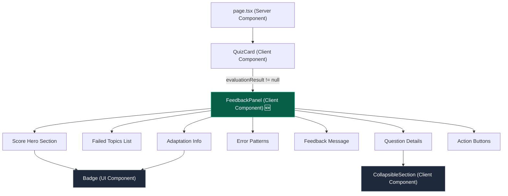
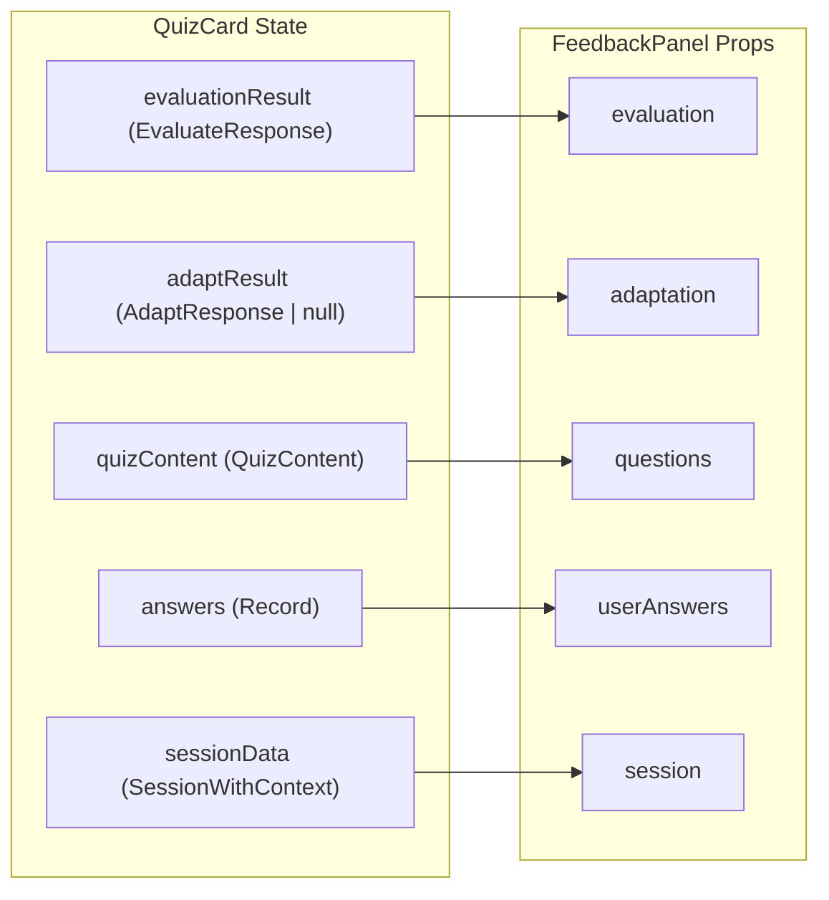

# SE-08 — UI: FeedbackPanel (score, errores, decisión, próxima sesión)

> **Bloque:** 📚 BLOQUE E — Sesión de Estudio  
> **Guía anterior:** [SE-07 — Lógica adaptativa: advance | reinforce | restructure](file:///c:/Users/jsife/OneDrive/Desktop/Repositorios/practica-testing/docs/guides/fe/SE-07.md)  
> **Siguiente guía:** DA-01 — API Route `/api/dashboard/metrics`  
> **Next.js:** **16.2.9** — `params` siempre `await`ed  
> **Fecha:** 30 junio 2026  

---

## Sección 1: 🎓 Introducción y Fundamentos Conceptuales

### ¿Dónde estamos?

Has construido todo el flujo de la sesión de estudio:

| Guía | Qué hiciste |
|---|---|
| SE-01 | API Routes de sesión + página `/session` |
| SE-02 | Generación de teoría con LLM |
| SE-03 | `TheoryPanel` — lectura de teoría con timer |
| SE-04 | Generación de quiz con LLM |
| SE-05 | `QuizCard` — preguntas A/B/C/D |
| SE-06 | Envío + evaluación determinística + análisis LLM |
| SE-07 | Lógica adaptativa: advance / reinforce / restructure |

Pero cuando el quiz termina, el usuario ve... un `alert()`. Un cuadro nativo del navegador con texto plano. Cero diseño. Cero UX.

**SE-08 reemplaza ese `alert()` por un componente visual premium: `<FeedbackPanel>`.**

### La analogía del informe médico

Imagina que te haces un chequeo médico. El laboratorio procesa tus muestras (SE-06 = la evaluación). El sistema decide si necesitas tratamiento (SE-07 = la lógica adaptativa). Pero la experiencia del paciente depende de **cómo le presentan los resultados**:

- Un PDF genérico con números → no se entiende nada.
- Un dashboard clínico con semáforos, gráficas y recomendaciones claras → el paciente entiende exactamente qué hacer.

`FeedbackPanel` es ese dashboard clínico. Toma los datos crudos de `/evaluate` y `/adapt` y los transforma en una experiencia visual que el estudiante puede entender en 5 segundos.

### Conceptos clave de esta guía

#### 1. Composición de componentes: Panel → Secciones → Átomos

El `FeedbackPanel` es un componente relativamente grande, pero NO es un monolito. Está compuesto por secciones internas bien definidas:

```
FeedbackPanel
├── ScoreHero         → Score grande + badge de decisión
├── FailedTopicsList  → Tópicos donde falló (expandible)
├── ErrorPatterns     → Patrones de error del LLM
├── FeedbackMessage   → Texto de retroalimentación
├── AdaptationInfo    → Resultado de la adaptación (sesiones creadas, nueva fecha)
└── ActionButtons     → "Ver mi progreso" + "Siguiente sesión"
```

En vez de crear 6 archivos independientes (sobre-ingeniería para un panel que solo se usa en un lugar), encapsulamos todo dentro de un solo archivo `feedback-panel.tsx` usando **secciones JSX internas** bien delimitadas por comentarios. Esto mantiene la lectura lineal y evita crear componentes prematuros que no se reutilizan.

#### 2. `'use client'` obligatorio — el panel tiene navegación e interacciones delegadas

El `FeedbackPanel` necesita:
- `useRouter` para navegar a `/dashboard` y `/session`.
- Click handlers en los botones.
- `CollapsibleSection`, que internamente usa `useState` para expandir/colapsar el detalle de preguntas.

Todo eso requiere `'use client'`.

#### 3. Consumo de datos — CERO fetches adicionales

El `FeedbackPanel` recibe **todos** sus datos como props desde `QuizCard`. No hace ningún fetch propio. Los datos ya existen en el estado del componente padre:

| Prop | Fuente | Guía donde se generó |
|---|---|---|
| `evaluationResult` | `EvaluateResponse` de `/evaluate` | SE-06 |
| `adaptResult` | `AdaptResponse` de `/adapt` | SE-07 |
| `sessionData` | `SessionWithContext` de la page | SE-01 |
| `quizContent` | `QuizContent` del fetch on mount | SE-04/05 |
| `answers` | `Record<number, AnswerOption>` del estado | SE-05 |

#### 4. Reutilización del `CollapsibleSection`

Ya tienes un componente `CollapsibleSection` (creado en SE-03) que hace exactamente lo que necesitamos para el detalle de preguntas: un header clicable con animación de chevron + contenido colapsable con transición CSS `grid-rows`. Lo reutilizaremos directamente.

---

## Sección 2: 📋 Prerequisitos y Verificación del Entorno

### Prerequisitos de guías anteriores

| Guía | Entregable requerido | Verificación |
|---|---|---|
| **SE-06** | `types/evaluate.ts` — `EvaluateResponse`, `FailedTopic`, `ErrorPattern` | `import { EvaluateResponse } from "@/types"` compila |
| **SE-07** | `types/adapt.ts` — `AdaptResponse` | `import { AdaptResponse } from "@/types"` compila |
| **SE-07** | `quiz-card.tsx` con estados `evaluationResult` y `adaptResult` | Los estados existen en líneas 115-117 |
| **SE-05** | `quiz-card.tsx` con estado `answers: Record<number, AnswerOption>` | El estado existe en línea 111 |
| **SE-04** | `types/quiz.ts` — `QuizContent`, `QuizQuestion` | `import { QuizContent } from "@/types"` compila |
| **SE-03** | `collapsible-section.tsx` — componente reutilizable | El archivo existe en `components/session/` |
| **FE-04** | Layout base con navegación (para los botones que redirigen) | Header + sidebar funcionales |

### Verificación: TypeScript limpio de SE-07

```powershell
npx tsc --noEmit --project frontend/tsconfig.json
```

**Resultado esperado:** Sin output (cero errores).

### Verificación: variables de entorno (sin imprimir valores)

```powershell
Test-Path -LiteralPath "frontend/.env.local"
Select-String -Path "frontend/.env.local" -Pattern "^NEXT_PUBLIC_SUPABASE_URL=" -Quiet
Select-String -Path "frontend/.env.local" -Pattern "^NEXT_PUBLIC_SUPABASE_ANON_KEY=" -Quiet
```

**Resultado esperado:**
```
True
True
True
```

---

## Sección 3: 📂 Estructura de Directorios del Proyecto

```
frontend/
├── app/
│   ├── (dashboard)/
│   │   └── session/
│   │       └── page.tsx               (sin cambios)
│   └── api/
│       └── sessions/
│           └── [id]/
│               ├── route.ts
│               ├── theory/route.ts
│               ├── quiz/route.ts
│               ├── evaluate/route.ts   (SE-06 — sin cambios)
│               └── adapt/route.ts      (SE-07 — sin cambios)
├── components/
│   ├── session/
│   │   ├── collapsible-section.tsx     (SE-03 — sin cambios, reutilizado)
│   │   ├── feedback-panel.tsx          ← 🆕 NUEVO en SE-08
│   │   ├── quiz-card.tsx              ← ✏️ MODIFICADO en SE-08
│   │   ├── quiz-navigation.tsx         (SE-05 — sin cambios)
│   │   ├── quiz-question-view.tsx      (SE-05 — sin cambios)
│   │   ├── quiz-summary.tsx            (SE-05 — sin cambios)
│   │   ├── session-timer.tsx           (SE-03 — sin cambios)
│   │   ├── theory-panel.tsx            (SE-03 — sin cambios)
│   │   └── theory-topic-view.tsx       (SE-03 — sin cambios)
│   └── ui/
│       └── badge.tsx                   (sin cambios, reutilizado)
├── lib/
│   └── (sin archivos nuevos en SE-08)
└── types/
    └── (sin archivos nuevos en SE-08)
```

**Resumen:**
- 🆕 **1 archivo nuevo:** `components/session/feedback-panel.tsx`
- ✏️ **1 archivo modificado:** `components/session/quiz-card.tsx`
- 📦 **0 tipos nuevos** — el `FeedbackPanel` consume los tipos existentes de SE-06 y SE-07

---

## Sección 4: 🎨 Diagrama de Arquitectura de Componentes

### Árbol de componentes de la página `/session` (fase post-quiz)



### Flujo de datos hacia el FeedbackPanel



---

## Sección 5: 🛠️ Implementación Paso a Paso

---

### Paso A: Crear el componente `FeedbackPanel` (`components/session/feedback-panel.tsx`)

**Archivo:** `frontend/components/session/feedback-panel.tsx` — 🆕 NUEVO

Este es el componente central de SE-08. Recibe las 5 fuentes de datos como props y renderiza 6 secciones internas. Cada sección está encapsulada como una función helper privada dentro del mismo archivo.

```tsx
// ============================================================
// components/session/feedback-panel.tsx
// Panel de resultados post-quiz con feedback visual completo
// ============================================================
// TIPO: Client Component (useRouter para navegar; CollapsibleSection maneja su propio estado)
//
// RESPONSABILIDADES:
//   1. Mostrar score grande y animado con badge de decisión
//   2. Listar tópicos fallidos con detalle de preguntas
//   3. Mostrar patrones de error identificados por el LLM
//   4. Mostrar mensaje de feedback personalizado
//   5. Informar sobre la adaptación del plan (si hubo)
//   6. Ofrecer botones de navegación (dashboard, siguiente sesión)
//
// PROPS:
//   - evaluation: EvaluateResponse — datos de la evaluación
//   - adaptation: AdaptResponse | null — resultado de la adaptación
//   - questions: QuizQuestion[] — preguntas del quiz (para mostrar explanations)
//   - userAnswers: Record<number, AnswerOption> — respuestas del usuario
//   - session: SessionWithContext — datos de la sesión para contexto
//
// DISEÑO:
//   El panel reemplaza el `alert()` placeholder que existía en SE-07.
//   No hace fetches propios — recibe todo como props desde QuizCard.
//   Visualmente sigue el design system dark del proyecto:
//     - Fondo slate-900/60 con bordes slate-800
//     - Acentos emerald para positivo, amber para warning, red para error
//     - Tipografía Inter/system con tamaños consistentes
// ============================================================

"use client";

import { useRouter } from "next/navigation";
import {
  Trophy,
  RefreshCw,
  CheckCircle2,
  XCircle,
  BarChart3,
  ArrowRight,
  Calendar,
  Lightbulb,
  MessageSquare,
  Target,
  BookOpen,
  Zap,
} from "lucide-react";
import { Badge } from "@/components/ui/badge";
import { CollapsibleSection } from "./collapsible-section";
import type { EvaluateResponse, FailedTopic, ErrorPattern } from "@/types/evaluate";
import type { AdaptResponse } from "@/types/adapt";
import type { QuizQuestion } from "@/types/quiz";
import type { SessionWithContext } from "@/types/sessions";
import type { AnswerOption } from "@/types/database";

// ─── Props del componente ───────────────────────────────────
interface FeedbackPanelProps {
  evaluation: EvaluateResponse;
  adaptation: AdaptResponse | null;
  questions: QuizQuestion[];
  userAnswers: Record<number, AnswerOption>;
  session: SessionWithContext;
}

// ─── Tipos auxiliares internos ──────────────────────────────
interface ActionConfig {
  label: string;
  emoji: string;
  badgeClass: string;
  ringClass: string;
  scoreColor: string;
  description: string;
}

// ─── Configuración visual por tipo de acción ────────────────
// Centralizado para evitar condicionales dispersos por todo el JSX.
const ACTION_CONFIGS: Record<string, ActionConfig> = {
  advance: {
    label: "Avanzas al siguiente tópico",
    emoji: "✅",
    badgeClass: "border-emerald-600 bg-emerald-950/60 text-emerald-300",
    ringClass: "ring-emerald-500/30",
    scoreColor: "text-emerald-400",
    description: "Has demostrado dominio sobre los conceptos evaluados.",
  },
  reinforce: {
    label: "Sesión de refuerzo agendada",
    emoji: "⚠️",
    badgeClass: "border-amber-600 bg-amber-950/60 text-amber-300",
    ringClass: "ring-amber-500/30",
    scoreColor: "text-amber-400",
    description: "Estás cerca del umbral. Una sesión corta de refuerzo te ayudará.",
  },
  restructure: {
    label: "Plan reestructurado",
    emoji: "🔄",
    badgeClass: "border-orange-600 bg-orange-950/60 text-orange-300",
    ringClass: "ring-orange-500/30",
    scoreColor: "text-orange-400",
    description: "Algunos conceptos necesitan más trabajo con un enfoque diferente.",
  },
};

// ─── Etiquetas legibles para opciones A-D ────────────────────
const OPTION_LABELS: Record<AnswerOption, string> = {
  a: "A",
  b: "B",
  c: "C",
  d: "D",
};

// ─── Formateo seguro para columnas DATE de PostgreSQL ─────────
// Evita que "2026-07-07" se muestre como día anterior por zona horaria.
function formatDateEsMx(
  isoDate: string,
  options: Intl.DateTimeFormatOptions,
): string {
  return new Date(`${isoDate}T00:00:00Z`).toLocaleDateString("es-MX", {
    ...options,
    timeZone: "UTC",
  });
}

// ─── Componente principal ───────────────────────────────────
export function FeedbackPanel({
  evaluation,
  adaptation,
  questions,
  userAnswers,
  session,
}: FeedbackPanelProps) {
  const router = useRouter();

  // Determinar la configuración visual basada en la acción
  const config = ACTION_CONFIGS[evaluation.action] || ACTION_CONFIGS.advance;

  // Preparar datos de preguntas individuales con resultados
  const questionResults = questions.map((q) => {
    const userAnswer = userAnswers[q.question_id] ?? null;
    const isCorrect = userAnswer === q.correct;
    return { ...q, userAnswer, isCorrect };
  });

  // Calcular la fecha estimada (preferir la nueva si hubo restructure)
  const estimatedEndDate =
    adaptation?.new_estimated_end_date || session.plan_context.estimated_end_date;

  return (
    <div className="flex flex-col gap-5">
      {/* ═══════════════════════════════════════════════════════════ */}
      {/* SECCIÓN 1: Score Hero — Score grande + Badge de decisión   */}
      {/* ═══════════════════════════════════════════════════════════ */}
      <section className="rounded-2xl border border-slate-800 bg-slate-900/60 p-6">
        <div className="flex flex-col items-center gap-5 text-center">
          {/* ── Score circular ─────────────────────────────────── */}
          <div
            className={`flex h-28 w-28 items-center justify-center rounded-full ring-4 ${config.ringClass} bg-slate-800/80`}
          >
            <div>
              <p className={`text-4xl font-extrabold tracking-tight ${config.scoreColor}`}>
                {evaluation.score}%
              </p>
              <p className="text-xs text-slate-400">
                {evaluation.correct_count}/{evaluation.total_questions}
              </p>
            </div>
          </div>

          {/* ── Badge de decisión ──────────────────────────────── */}
          <Badge
            variant="outline"
            className={`px-4 py-1.5 text-sm font-semibold ${config.badgeClass}`}
          >
            {config.emoji} {config.label}
          </Badge>

          {/* ── Descripción corta ──────────────────────────────── */}
          <p className="max-w-md text-sm leading-6 text-slate-400">
            {config.description}
          </p>
        </div>
      </section>

      {/* ═══════════════════════════════════════════════════════════ */}
      {/* SECCIÓN 2: Feedback del LLM                                */}
      {/* ═══════════════════════════════════════════════════════════ */}
      {evaluation.feedback_message && (
        <section className="rounded-2xl border border-slate-800 bg-slate-900/60 p-5">
          <div className="flex items-start gap-3">
            <div className="flex h-8 w-8 shrink-0 items-center justify-center rounded-lg bg-indigo-500/10">
              <MessageSquare className="h-4 w-4 text-indigo-400" />
            </div>
            <div>
              <h3 className="text-sm font-semibold text-slate-200">
                Retroalimentación del agente
              </h3>
              <p className="mt-1.5 text-sm leading-6 text-slate-400">
                {evaluation.feedback_message}
              </p>
            </div>
          </div>
        </section>
      )}

      {/* ═══════════════════════════════════════════════════════════ */}
      {/* SECCIÓN 3: Tópicos fallidos                                */}
      {/* ═══════════════════════════════════════════════════════════ */}
      {evaluation.failed_topics.length > 0 && (
        <section className="rounded-2xl border border-slate-800 bg-slate-900/60 p-5">
          <div className="flex items-center gap-2.5 mb-4">
            <div className="flex h-8 w-8 shrink-0 items-center justify-center rounded-lg bg-red-500/10">
              <Target className="h-4 w-4 text-red-400" />
            </div>
            <h3 className="text-sm font-semibold text-slate-200">
              Tópicos que necesitan atención
            </h3>
            <span className="rounded-full bg-red-950/60 px-2 py-0.5 text-xs font-medium text-red-300">
              {evaluation.failed_topics.length}
            </span>
          </div>

          <div className="flex flex-col gap-2">
            {evaluation.failed_topics.map((topic: FailedTopic) => (
              <div
                key={topic.topic_code}
                className="flex items-center justify-between rounded-lg border border-slate-800 bg-slate-800/30 px-4 py-3"
              >
                <div className="flex items-center gap-3 min-w-0">
                  <span className="shrink-0 rounded-md bg-slate-700/60 px-2 py-0.5 text-xs font-mono text-slate-300">
                    {topic.topic_code}
                  </span>
                  <span className="text-sm text-slate-300 truncate">
                    {topic.topic_name}
                  </span>
                </div>
                <span className="shrink-0 text-xs text-red-400 font-medium">
                  {topic.questions_failed}/{topic.questions_total} fallidas
                </span>
              </div>
            ))}
          </div>
        </section>
      )}

      {/* ═══════════════════════════════════════════════════════════ */}
      {/* SECCIÓN 4: Detalle de preguntas (expandible)               */}
      {/* ═══════════════════════════════════════════════════════════ */}
      <CollapsibleSection
        title="Detalle de preguntas"
        icon={BookOpen}
        badge={`${evaluation.correct_count} correctas · ${
          evaluation.total_questions - evaluation.correct_count
        } fallidas`}
      >
        <div className="flex flex-col gap-3">
          {questionResults.map((qr, idx) => (
            <div
              key={qr.question_id}
              className={`rounded-lg border px-4 py-3 ${
                qr.isCorrect
                  ? "border-emerald-800/40 bg-emerald-950/10"
                  : "border-red-800/40 bg-red-950/10"
              }`}
            >
              {/* ── Header de la pregunta ──────────────────── */}
              <div className="flex items-start gap-2.5">
                {qr.isCorrect ? (
                  <CheckCircle2 className="h-4 w-4 shrink-0 text-emerald-400 mt-0.5" />
                ) : (
                  <XCircle className="h-4 w-4 shrink-0 text-red-400 mt-0.5" />
                )}
                <div className="min-w-0 flex-1">
                  <p className="text-sm font-medium text-slate-200">
                    Pregunta {idx + 1}
                  </p>
                  <p className="mt-0.5 text-xs text-slate-400 line-clamp-2">
                    {qr.question}
                  </p>
                </div>
                <span className="shrink-0 rounded-md bg-slate-800 px-1.5 py-0.5 text-xs font-mono text-slate-500">
                  {qr.topic_code}
                </span>
              </div>

              {/* ── Respuestas: usuario vs. correcta ───────── */}
              {!qr.isCorrect && (
                <div className="mt-2.5 ml-6 flex flex-col gap-1.5">
                  <div className="flex items-center gap-2 text-xs">
                    <span className="text-red-400">Tu respuesta:</span>
                    <span className="font-medium text-red-300">
                      {qr.userAnswer
                        ? `${OPTION_LABELS[qr.userAnswer]}) ${qr.options[qr.userAnswer]}`
                        : "Sin respuesta"}
                    </span>
                  </div>
                  <div className="flex items-center gap-2 text-xs">
                    <span className="text-emerald-400">Correcta:</span>
                    <span className="font-medium text-emerald-300">
                      {OPTION_LABELS[qr.correct]}) {qr.options[qr.correct]}
                    </span>
                  </div>
                  {/* ── Explicación ──────────────────────── */}
                  {qr.explanation && (
                    <div className="mt-1.5 rounded-md bg-slate-800/50 px-3 py-2">
                      <div className="flex items-start gap-1.5">
                        <Lightbulb className="h-3.5 w-3.5 shrink-0 text-amber-400 mt-0.5" />
                        <p className="text-xs leading-5 text-slate-400">
                          {qr.explanation}
                        </p>
                      </div>
                    </div>
                  )}
                </div>
              )}

              {/* ── Preguntas correctas: solo confirmar ─────── */}
              {qr.isCorrect && (
                <div className="mt-1.5 ml-6 text-xs text-emerald-400/70">
                  {OPTION_LABELS[qr.correct]}) {qr.options[qr.correct]}
                </div>
              )}
            </div>
          ))}
        </div>
      </CollapsibleSection>

      {/* ═══════════════════════════════════════════════════════════ */}
      {/* SECCIÓN 5: Patrones de error (solo si el LLM los generó)   */}
      {/* ═══════════════════════════════════════════════════════════ */}
      {evaluation.error_patterns.length > 0 && (
        <section className="rounded-2xl border border-slate-800 bg-slate-900/60 p-5">
          <div className="flex items-center gap-2.5 mb-4">
            <div className="flex h-8 w-8 shrink-0 items-center justify-center rounded-lg bg-amber-500/10">
              <Zap className="h-4 w-4 text-amber-400" />
            </div>
            <h3 className="text-sm font-semibold text-slate-200">
              Patrones de error detectados
            </h3>
          </div>

          <div className="flex flex-col gap-3">
            {evaluation.error_patterns.map((ep: ErrorPattern, idx: number) => {
              // Determinar color de frecuencia
              const freqColor =
                ep.frequency === "alta"
                  ? "border-red-700 bg-red-950/40 text-red-300"
                  : ep.frequency === "media"
                    ? "border-amber-700 bg-amber-950/40 text-amber-300"
                    : "border-slate-700 bg-slate-800/40 text-slate-300";

              return (
                <div
                  key={idx}
                  className="rounded-lg border border-slate-800 bg-slate-800/20 px-4 py-3"
                >
                  <div className="flex items-start justify-between gap-3">
                    <p className="text-sm font-medium text-slate-200">
                      {ep.pattern}
                    </p>
                    <Badge
                      variant="outline"
                      className={`shrink-0 text-xs ${freqColor}`}
                    >
                      {ep.frequency}
                    </Badge>
                  </div>
                  <p className="mt-1.5 text-xs leading-5 text-slate-400">
                    💡 {ep.suggestion}
                  </p>
                </div>
              );
            })}
          </div>
        </section>
      )}

      {/* ═══════════════════════════════════════════════════════════ */}
      {/* SECCIÓN 6: Información de adaptación                       */}
      {/* ═══════════════════════════════════════════════════════════ */}
      {adaptation && (
        <section className="rounded-2xl border border-slate-800 bg-slate-900/60 p-5">
          <div className="flex items-start gap-3">
            <div className="flex h-8 w-8 shrink-0 items-center justify-center rounded-lg bg-violet-500/10">
              <RefreshCw className="h-4 w-4 text-violet-400" />
            </div>
            <div className="flex-1">
              <h3 className="text-sm font-semibold text-slate-200">
                Adaptación del plan
              </h3>
              <p className="mt-1.5 text-sm leading-6 text-slate-400">
                {adaptation.message}
              </p>

              {/* ── Detalle de adaptación ──────────────────────── */}
              <div className="mt-3 flex flex-wrap gap-3">
                {/* Sesiones de refuerzo creadas */}
                {adaptation.reinforcement_session_ids.length > 0 && (
                  <div className="inline-flex items-center gap-1.5 rounded-lg bg-slate-800/60 px-3 py-1.5">
                    <Trophy className="h-3.5 w-3.5 text-amber-400" />
                    <span className="text-xs text-slate-300">
                      {adaptation.reinforcement_session_ids.length} sesión
                      {adaptation.reinforcement_session_ids.length > 1 ? "es" : ""} de refuerzo
                    </span>
                  </div>
                )}

                {/* Nueva fecha estimada */}
                {adaptation.new_estimated_end_date && (
                  <div className="inline-flex items-center gap-1.5 rounded-lg bg-slate-800/60 px-3 py-1.5">
                    <Calendar className="h-3.5 w-3.5 text-orange-400" />
                    <span className="text-xs text-slate-300">
                      Nueva fecha:{" "}
                      {formatDateEsMx(adaptation.new_estimated_end_date, {
                        day: "numeric",
                        month: "short",
                        year: "numeric",
                      })}
                    </span>
                  </div>
                )}
              </div>
            </div>
          </div>
        </section>
      )}

      {/* ═══════════════════════════════════════════════════════════ */}
      {/* SECCIÓN 7: Fecha estimada de examen + Plan progress        */}
      {/* ═══════════════════════════════════════════════════════════ */}
      <section className="rounded-2xl border border-slate-800 bg-slate-900/60 p-5">
        <div className="flex flex-col gap-4 sm:flex-row sm:items-center sm:justify-between">
          {/* Fecha estimada */}
          <div className="flex items-center gap-3">
            <div className="flex h-8 w-8 shrink-0 items-center justify-center rounded-lg bg-sky-500/10">
              <Calendar className="h-4 w-4 text-sky-400" />
            </div>
            <div>
              <p className="text-xs text-slate-500 uppercase tracking-wide">
                Fecha estimada de examen
              </p>
              <p className="text-sm font-semibold text-slate-200">
                {formatDateEsMx(estimatedEndDate, {
                  weekday: "long",
                  day: "numeric",
                  month: "long",
                  year: "numeric",
                })}
              </p>
            </div>
          </div>

          {/* Progreso del plan */}
          <div className="text-right">
            <p className="text-xs text-slate-500">Progreso del plan</p>
            <p className="text-sm font-semibold text-slate-200">
              {session.plan_context.completed_sessions} de{" "}
              {session.plan_context.total_sessions} sesiones
            </p>
          </div>
        </div>
      </section>

      {/* ═══════════════════════════════════════════════════════════ */}
      {/* SECCIÓN 8: Botones de acción                               */}
      {/* ═══════════════════════════════════════════════════════════ */}
      <section className="flex flex-col gap-3 sm:flex-row sm:justify-center">
        {/* ── Ver mi progreso → Dashboard ──────────────────────── */}
        <button
          type="button"
          onClick={() => router.push("/dashboard")}
          className="inline-flex h-11 items-center justify-center gap-2 rounded-xl border border-slate-700 bg-slate-800/50 px-6 text-sm font-medium text-slate-200 transition-colors hover:bg-slate-700/50"
        >
          <BarChart3 className="h-4 w-4" />
          Ver mi progreso
        </button>

        {/* ── Siguiente sesión ─────────────────────────────────── */}
        <button
          type="button"
          onClick={() => router.push("/session")}
          className="inline-flex h-11 items-center justify-center gap-2 rounded-xl bg-emerald-500 px-6 text-sm font-semibold text-slate-950 transition-colors hover:bg-emerald-400"
        >
          Siguiente sesión
          <ArrowRight className="h-4 w-4" />
        </button>
      </section>
    </div>
  );
}
```

**Entregable:** Archivo `frontend/components/session/feedback-panel.tsx` creado.

---

### Paso B: Modificar `quiz-card.tsx` — reemplazar placeholder por `<FeedbackPanel>`

**Archivo:** `frontend/components/session/quiz-card.tsx` — ✏️ MODIFICAR

En SE-07 quedó un bloque de `alert()` como placeholder y una sección JSX con el score básico. SE-08 reemplaza ambos.

#### B.1: Agregar import del FeedbackPanel

Localiza el bloque de imports al inicio del archivo (después de `import type { AdaptRequest, AdaptResponse }...`). Agrega:

```typescript
import { FeedbackPanel } from "./feedback-panel";
```

#### B.2: Eliminar el `alert()` de `handleSubmit()`

Dentro de la función `handleSubmit()`, localiza el bloque que comienza con `let adaptMessage = "";` y termina con el cierre del `alert()`. **Elimina** todo lo relacionado con el placeholder visual:

- La variable `let adaptMessage = "";`
- La asignación `adaptMessage = ...` dentro del `if (adaptResponse.ok)`
- La constante `actionLabels`
- La llamada `alert(...)`

El `handleSubmit` ahora simplemente setea los estados y termina. El resultado visual lo muestra el JSX del `FeedbackPanel`.

El final de `handleSubmit()` dentro del `try` debe quedar así (después de la llamada a `/adapt`):

```typescript
      // ── Paso 4 termina aquí ────────────────────────────────
      // La UI del FeedbackPanel se renderiza automáticamente
      // cuando evaluationResult no es null (ver sección JSX).
```

Es decir: elimina las líneas del `actionLabels` y del `alert(...)`. Deja el `try-catch` de `/adapt` intacto.

#### B.3: Reemplazar la sección JSX del placeholder

Localiza el bloque JSX que comienza con:

```tsx
      {/* ESTADO: Evaluación completada (placeholder hasta SE-08) */}
```

...y termina con `</section>` (actualmente en las líneas ~578-631 del archivo actual). **Reemplaza** toda esa sección por:

```tsx
      {/* ═══════════════════════════════════════════════════════ */}
      {/* ESTADO: Evaluación completada — FeedbackPanel (SE-08)  */}
      {/* ═══════════════════════════════════════════════════════ */}
      {evaluationResult && quizContent && (
        <FeedbackPanel
          evaluation={evaluationResult}
          adaptation={adaptResult}
          questions={quizContent.questions}
          userAnswers={answers}
          session={sessionData}
        />
      )}
```

**Entregable:** `frontend/components/session/quiz-card.tsx` modificado:
- Import de `FeedbackPanel` agregado
- `alert()` eliminado de `handleSubmit()`
- Sección JSX del placeholder reemplazada por `<FeedbackPanel>`

---

### Paso C: Verificación de referencia — `quiz-card.tsx` completo (fragmento del `handleSubmit`)

Para que no haya ambigüedad, así debe quedar el final de `handleSubmit()` **después de los cambios**:

```typescript
  async function handleSubmit() {
    const total = quizContent?.questions.length || 0;
    const answered = Object.keys(answers).length;

    if (!quizContent || total === 0 || answered !== total || submitting) {
      return;
    }

    setSubmitting(true);
    setAdaptResult(null);

    try {
      // ── Paso 1: Construir UserAnswer[] ──────────────────────
      const userAnswers: UserAnswer[] = quizContent.questions.map((q) => {
        const selectedAnswer = answers[q.question_id];

        if (!selectedAnswer) {
          throw new Error(
            `Falta respuesta para la pregunta ${q.question_id + 1}`,
          );
        }

        return {
          question_id: q.question_id,
          user_answer: selectedAnswer,
          question_text: q.question,
          options: q.options,
          correct: q.correct,
          explanation: q.explanation,
          topic_code: q.topic_code,
          level_k: q.level_k,
        };
      });

      // ── Paso 2: POST a /api/sessions/[id]/evaluate ──────────
      const response = await fetch(`/api/sessions/${sessionData.id}/evaluate`, {
        method: "POST",
        headers: { "Content-Type": "application/json" },
        body: JSON.stringify({ answers: userAnswers }),
      });

      if (!response.ok) {
        const data = await response.json().catch(() => ({}));
        throw new Error(
          data.error || `Error ${response.status} al evaluar quiz`,
        );
      }

      const result: EvaluateResponse = await response.json();

      // ── Paso 3: Guardar resultado de evaluación ────────────
      setEvaluationResult(result);
      setTimerActive(false);
      setShowSummary(false);

      // ── Paso 4: Llamar a /adapt automáticamente ────────────
      const adaptBody: AdaptRequest = {
        next_method: result.next_method,
      };

      try {
        const adaptResponse = await fetch(
          `/api/sessions/${sessionData.id}/adapt`,
          {
            method: "POST",
            headers: { "Content-Type": "application/json" },
            body: JSON.stringify(adaptBody),
          },
        );

        if (adaptResponse.ok) {
          const adaptData: AdaptResponse = await adaptResponse.json();
          setAdaptResult(adaptData);
          console.log(
            "[quiz-card] adapt OK:",
            adaptData.action,
            adaptData.message,
          );
        } else {
          console.warn(
            "[quiz-card] /adapt retornó error no crítico:",
            adaptResponse.status,
          );
        }
      } catch (adaptErr) {
        console.error("[quiz-card] Error de red al llamar /adapt:", adaptErr);
      }

      // La UI del FeedbackPanel se renderiza automáticamente
      // cuando evaluationResult no es null (ver sección JSX).
    } catch (err) {
      alert(
        `❌ Error al evaluar: ${err instanceof Error ? err.message : "Error desconocido"}`,
      );
    } finally {
      setSubmitting(false);
    }
  }
```

Y en el JSX, la sección del placeholder queda reemplazada por el `<FeedbackPanel>` como se muestra en el Paso B.3.

---

## Sección 6: ✅ Checkpoints de Verificación

### Verificación 1: TypeScript compila sin errores

```powershell
npx tsc --noEmit --project frontend/tsconfig.json
```

**Resultado esperado:** Sin output.

### Verificación 2: El servidor inicia sin errores

```powershell
npm --prefix frontend run dev
```

**Resultado esperado:**
```
  ▲ Next.js 16.2.x
  - Local:    http://localhost:3000
  ✓ Ready in Xs
```

### Verificación 3: Build de producción

```powershell
npm --prefix frontend run build
```

**Resultado esperado:**
```
✓ Compiled successfully
Running TypeScript ...
Finished TypeScript ...
```

### Verificación 4: El FeedbackPanel existe

```powershell
Test-Path -LiteralPath "frontend/components/session/feedback-panel.tsx"
```

**Resultado esperado:** `True`

### Verificación 5: Visual — Score Hero

1. Navega a `http://localhost:3000/session?phase=quiz`
2. Responde todas las preguntas del quiz
3. Haz clic en "Ver resumen" → "Enviar respuestas"

**Deberías ver:**
- Un **círculo grande** con el porcentaje de score (ej. `70%`) y el conteo (`7/10`) debajo.
- El color del score cambia según la acción:
  - **Emerald/verde** si ≥ 70% (advance)
  - **Amber/amarillo** si 50-69% (reinforce)
  - **Orange/naranja** si < 50% (restructure)
- Un **badge** con el emoji y la etiqueta de decisión (ej. "✅ Avanzas al siguiente tópico")
- Una descripción corta debajo del badge

### Verificación 6: Visual — Tópicos fallidos

Si respondiste incorrectamente al menos una pregunta:
- Deberías ver una sección **"Tópicos que necesitan atención"** con un badge rojo indicando cuántos tópicos fallaron
- Cada tópico aparece en una fila con su código (`FL-1.1.1`), nombre, y el conteo de preguntas fallidas

### Verificación 7: Visual — Detalle de preguntas (expandible)

- Debería haber una sección **"Detalle de preguntas"** con un botón que la expande/colapsa (chevron animado)
- Al expandir:
  - Cada pregunta aparece con un ícono verde (✓) o rojo (✗)
  - Las preguntas **incorrectas** muestran:
    - Tu respuesta (en rojo)
    - La respuesta correcta (en verde)
    - La explicación del LLM (con ícono de bombilla 💡 en un fondo oscuro)
  - Las preguntas **correctas** solo muestran la respuesta correcta en verde

### Verificación 8: Visual — Patrones de error

Si el LLM generó patrones de error:
- Deberías ver una sección **"Patrones de error detectados"** con badges de frecuencia (alta → rojo, media → amber, baja → gris)
- Cada patrón muestra la descripción + sugerencia con un 💡

### Verificación 9: Visual — Adaptación e información del plan

- Si la acción fue `reinforce` o `restructure`:
  - Deberías ver una sección **"Adaptación del plan"** con el mensaje del sistema y pills informativas (número de sesiones de refuerzo, nueva fecha si aplica)
- Siempre se muestra la **fecha estimada de examen** (con el nombre del día en español) y el progreso del plan

### Verificación 10: Visual — Botones de acción

- Dos botones al final:
  - **"Ver mi progreso"** (borde gris, ícono de gráfica) → redirige a `/dashboard`
  - **"Siguiente sesión"** (fondo emerald, ícono de flecha) → redirige a `/session`
- Los botones son responsivos: en móvil se apilan verticalmente, en desktop están lado a lado

### Verificación 11: El `alert()` ya no aparece

- Después de enviar el quiz, **NO** debería aparecer ningún `alert()` nativo del navegador
- El resultado se muestra directamente en el FeedbackPanel visual

### Checklist de entregables

| # | Entregable | Verificación |
|---|---|---|
| 1 | `feedback-panel.tsx` — componente FeedbackPanel completo | `Test-Path` retorna `True` |
| 2 | `quiz-card.tsx` — import de FeedbackPanel | `tsc --noEmit` sin errores |
| 3 | `quiz-card.tsx` — `alert()` eliminado | No aparece alert nativo al evaluar |
| 4 | `quiz-card.tsx` — placeholder reemplazado por `<FeedbackPanel>` | Score, badge, tópicos visibles |
| 5 | Score Hero visible con colores por acción | Verde/Amber/Naranja según score |
| 6 | Tópicos fallidos listados | Código + nombre + conteo |
| 7 | Detalle de preguntas expandible | Chevron animado, respuestas comparadas |
| 8 | Patrones de error con frecuencia | Badges de frecuencia coloreados |
| 9 | Mensaje de feedback del LLM | Sección con ícono de mensaje |
| 10 | Adaptación del plan visible | Sesiones de refuerzo + nueva fecha |
| 11 | Botones de acción funcionales | Navegación a `/dashboard` y `/session` |

---

## Sección 7: 🚨 Troubleshooting — Problemas Comunes

| Problema | Causa Probable | Solución |
|---|---|---|
| `Error: Cannot find module './feedback-panel'` | El archivo no se creó en la ruta correcta. | Verifica que el archivo está en `frontend/components/session/feedback-panel.tsx` (no en `frontend/components/feedback-panel.tsx`). |
| `TypeError: Cannot read properties of null (reading 'questions')` | `quizContent` es `null` cuando se intenta renderizar el FeedbackPanel. | El JSX del FeedbackPanel tiene la condición `{evaluationResult && quizContent && (...)}`. Si compiló, el error es que el estado del quiz se limpió prematuramente. Verifica que `handleSubmit` NO llame a `setQuizContent(null)`. |
| El `alert()` sigue apareciendo después de enviar | No se eliminó el bloque `alert(...)` de `handleSubmit()`. | Busca `alert(` en `quiz-card.tsx`. Solo debe quedar el `alert` del `catch` de error (el de `❌ Error al evaluar:`). Elimina el otro. |
| El score se muestra pero no el FeedbackPanel completo | `evaluationResult` se setea pero `quizContent` ya es `null` cuando se renderiza. | Verifica que en `handleSubmit`, `setQuizContent(null)` NO se llama. El quiz content debe persistir para que el FeedbackPanel pueda mostrar las preguntas con sus explicaciones. |
| Los colores del badge no cambian según la acción | `ACTION_CONFIGS` no tiene la clave correcta o `evaluation.action` tiene un valor inesperado. | Abre DevTools → Console y haz `console.log(evaluation.action)` temporalmente. Debe ser exactamente `"advance"`, `"reinforce"`, o `"restructure"` (minúsculas). |
| La fecha estimada no se actualiza visualmente | `adaptation.new_estimated_end_date` es `null` porque la acción fue `advance` o `reinforce`. | Solo `restructure` actualiza la fecha. Para `advance` y `reinforce`, se muestra la fecha original del plan (`session.plan_context.estimated_end_date`). |
| `Type '...' is not assignable to type 'AnswerOption'` en la línea de `OPTION_LABELS` | TypeScript no puede inferir las claves del `Record` como tipo `AnswerOption`. | Asegúrate de importar `AnswerOption` de `@/types/database` y que el tipo del `Record` sea explícitamente `Record<AnswerOption, string>`. |
| El chevron de "Detalle de preguntas" no se anima | `CollapsibleSection` fue modificado o no se importó desde `./collapsible-section`. | Verifica que `FeedbackPanel` use `<CollapsibleSection ...>` y que `components/session/collapsible-section.tsx` conserve `transition-transform duration-200` en su `ChevronDown`. |
| Los botones de navegación redirigen pero el dashboard aún se ve básico | `/dashboard` existe, pero las métricas reales llegan en DA-01 a DA-05. | Es esperado en este punto. El botón "Ver mi progreso" navega al dashboard actual; el botón "Siguiente sesión" → `/session` debe cargar la siguiente sesión pendiente. |

---

## Sección 8: 📝 Resumen y Próximo Paso

### Lo que hiciste en SE-08

1. **Creaste** `components/session/feedback-panel.tsx` — un componente visual completo de ~350 líneas que reemplaza el `alert()` placeholder con:
   - **Score Hero**: porcentaje grande con ring de color + badge de decisión
   - **Feedback del LLM**: mensaje personalizado con ícono
   - **Tópicos fallidos**: lista con código, nombre y conteo de errores
   - **Detalle de preguntas**: sección expandible con chevron animado, comparación visual de respuesta del usuario vs. correcta, y explicación del LLM
   - **Patrones de error**: con badges de frecuencia coloreados (alta/media/baja)
   - **Información de adaptación**: sesiones de refuerzo creadas + nueva fecha estimada
   - **Fecha estimada de examen**: siempre visible, actualizada si hubo restructure
   - **Botones de acción**: "Ver mi progreso" (→ `/dashboard`) + "Siguiente sesión" (→ `/session`)

2. **Modificaste** `components/session/quiz-card.tsx`:
   - Agregaste import de `FeedbackPanel`
   - Eliminaste el `alert()` de `handleSubmit()`
   - Reemplazaste la sección JSX del placeholder por `<FeedbackPanel>` con todas las props

### Qué NO hiciste (alcance estricto)

- **No creaste tipos nuevos** — el `FeedbackPanel` consume los tipos existentes de SE-06 (`EvaluateResponse`, `FailedTopic`, `ErrorPattern`) y SE-07 (`AdaptResponse`)
- **No creaste API routes** — todo el dato ya existe en el estado del componente padre
- **No modificaste la lógica de `/evaluate` ni `/adapt`** — esos endpoints están intactos

### Validación final

- [x] `npx tsc --noEmit --project frontend/tsconfig.json` → sin errores
- [x] `npm --prefix frontend run build` → exitoso
- [x] Score Hero visible con colores correctos
- [x] Tópicos fallidos listados
- [x] Detalle de preguntas expandible con explicaciones
- [x] Patrones de error con badges
- [x] Botones de navegación funcionales
- [x] `alert()` eliminado — ya no aparece

### Próxima guía: DA-01 — API Route `/api/dashboard/metrics`

Con SE-08 **completaste el BLOQUE E completo** (Sesión de Estudio). El siguiente bloque es el **Dashboard de Progreso** (BLOQUE F):

- **DA-01:** API Route que agrega métricas del estudiante (scores, tópicos dominados, tiempo invertido)
- **DA-02:** LineChart con el score por sesión
- **DA-03:** Heatmap de tópicos por estado
- **DA-04:** BarChart de tiempo real vs. estimado
- **DA-05:** Fecha estimada de examen + contadores

> **Para validar tu progreso**, indica al agente que completaste SE-08 especificando las 11 verificaciones del checklist.
