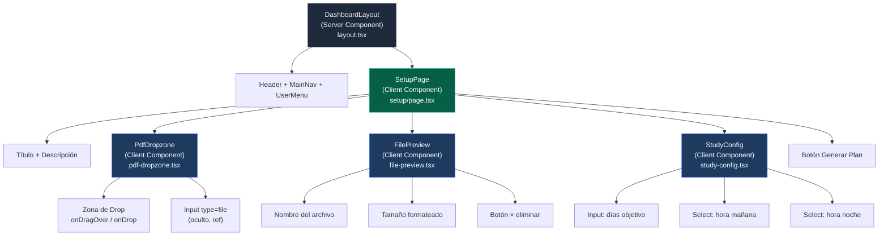
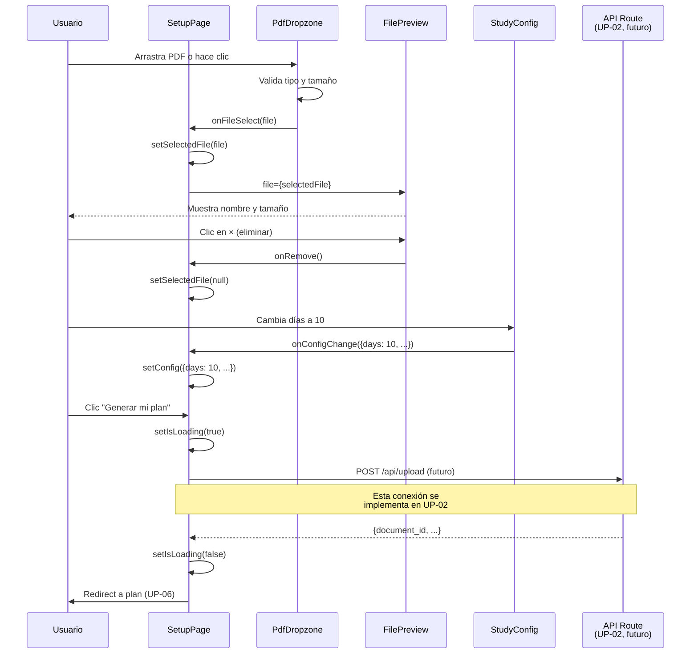

# UP-01 — UI: Página de Setup (Upload PDF + Configuración de Plan)

**Guía:** UP-01  
**Bloque:** 📤 D — Flujo de Upload y Plan  
**Objetivo:** Página completa de configuración del plan de estudio con drag & drop de PDF, inputs de configuración (días, horarios) y estados de carga.  
**Dependencias:** [FE-04](../fe/FE-04.md) (layout base + navegación), [DB-03](../db/DB-03.md) (Storage bucket — contexto), [DB-02](../db/DB-02.md) (tabla `documents` — contexto)  
**Estado:** ✅ Completado  
**Fecha:** Junio 2026

---

## Tabla de Contenidos

1. [🎓 Introducción y Fundamentos Conceptuales](#1--introducción-y-fundamentos-conceptuales)
2. [📋 Prerequisitos y Verificación del Entorno](#2--prerequisitos-y-verificación-del-entorno)
3. [📂 Estructura de Directorios del Proyecto](#3--estructura-de-directorios-del-proyecto)
4. [🎨 Diagrama de Arquitectura de Componentes](#4--diagrama-de-arquitectura-de-componentes)
5. [🛠️ Implementación Paso a Paso](#5-️-implementación-paso-a-paso)
6. [✅ Checkpoints de Verificación](#6--checkpoints-de-verificación)
7. [🚨 Troubleshooting — Problemas Comunes](#7--troubleshooting--problemas-comunes)
8. [📝 Resumen y Próximo Paso](#8--resumen-y-próximo-paso)

---

## 1. 🎓 Introducción y Fundamentos Conceptuales

### ¿Dónde estamos?

¡Completaste oficialmente el **Bloque C: Frontend Base**! 🎉 En las 4 guías anteriores construiste:

- **FE-01**: El scaffold de Next.js con TypeScript, Tailwind CSS y shadcn/ui
- **FE-02**: La conexión bidireccional con Supabase (clientes de servidor y navegador)
- **FE-03**: El sistema de autenticación completo (registro, login, logout, middleware)
- **FE-04**: El shell visual con header persistente, navegación desktop/móvil y error boundaries

Tu aplicación ya tiene paredes, puertas y seguridad. Pero el interior sigue vacío — el dashboard muestra tarjetas placeholder con datos simulados (`--%`, `0 / 40`, `Sin plan configurado`). Es hora de darle **vida** a la aplicación creando la primera funcionalidad real: la página donde el usuario configura su plan de estudio.

### ¿Qué vamos a construir?

La página `/setup` será el **punto de entrada** a toda la experiencia de estudio. Cuando un usuario entra por primera vez al dashboard, la tarjeta "Próxima Sesión" le dice: *"Sin plan configurado — Configura tu plan en 'Mi Plan'"*. Al hacer clic en "Mi Plan" en la navegación (link que ya creamos en FE-04), llegará a esta página donde podrá:

1. **Subir un PDF** del syllabus ISTQB usando drag & drop o click
2. **Ver un preview** del archivo seleccionado (nombre, tamaño, tipo)
3. **Configurar los días objetivo** para completar el estudio (default: 7 días)
4. **Seleccionar horarios preferidos** de estudio mañana y noche
5. **Generar su plan** con un botón que muestra un loading state profesional

> **Analogía de la Mudanza:** Imagina que ya construiste tu casa (FE-01 a FE-04) y ahora necesitas amuelarla para vivir en ella. La página de setup es como el **formulario de pedido de la mueblería**: primero eliges el catálogo (subes el PDF del syllabus), luego configuras las medidas y preferencias (días y horarios), y finalmente confirmas el pedido (botón "Generar mi plan"). El resultado llegará en las siguientes guías (UP-02 a UP-06), pero hoy creamos la interfaz que captura las decisiones del usuario.

### Concepto Clave 1: Controlled vs Uncontrolled Components en React

En React, los formularios se manejan de dos formas fundamentales. Entender la diferencia es crítico para esta guía porque vamos a crear múltiples inputs controlados.

#### Uncontrolled Components (NO vamos a usar esto)

```tsx
// ❌ Uncontrolled — el DOM es la fuente de verdad
function BadForm() {
  const inputRef = useRef<HTMLInputElement>(null);
  
  function handleSubmit() {
    // Para leer el valor, necesitamos acceder al DOM directamente
    const value = inputRef.current?.value;
    console.log(value);
  }
  
  return <input ref={inputRef} defaultValue="7" />;
}
```

El problema: el valor vive en el DOM, no en el estado de React. Si necesitas validar, transformar, o mostrar el valor en otro lugar, debes leer el DOM directamente. Esto genera bugs sutiles y hace el código difícil de mantener.

#### Controlled Components (ESTO vamos a usar)

```tsx
// ✅ Controlled — React es la fuente de verdad
function GoodForm() {
  const [days, setDays] = useState(7);
  
  function handleSubmit() {
    // El valor siempre está disponible en el estado
    console.log(days);
  }
  
  return (
    <input 
      type="number" 
      value={days} 
      onChange={(e) => setDays(Number(e.target.value))} 
    />
  );
}
```

El valor vive en `useState`. React controla el input y siempre sabe el valor actual. Esto permite validación en tiempo real, renderizado condicional basado en el valor, y debugging más fácil.

> [!TIP]
> **Regla general:** Si un input participa en la lógica del componente (validación, envío, cálculos), siempre hazlo **controlled** con `useState`. Si es un input trivial que no necesita lógica (como un campo de búsqueda desechable), puedes usar **uncontrolled**.

### Concepto Clave 2: Drag & Drop con la API Nativa del Navegador

HTML5 incluye una API nativa de drag & drop que todos los navegadores modernos soportan. No necesitamos librerías externas como `react-dropzone` para un caso simple como subir un archivo.

Los eventos clave son:

```
┌─────────────────────────────────────────────────────────────────┐
│                    CICLO DE DRAG & DROP                          │
│                                                                  │
│  1. onDragEnter   → el archivo ENTRA en la zona de drop          │
│                     (cambiar estilo: borde verde, fondo claro)   │
│                                                                  │
│  2. onDragOver    → el archivo ESTÁ ENCIMA de la zona            │
│                     (CRÍTICO: llamar e.preventDefault() aquí     │
│                      para indicar que aceptamos el drop)         │
│                                                                  │
│  3. onDragLeave   → el archivo SALE de la zona                   │
│                     (restaurar estilo original)                  │
│                                                                  │
│  4. onDrop        → el archivo se SUELTA                         │
│                     (leer e.dataTransfer.files[0])               │
│                                                                  │
│  ALTERNATIVA: onClick → abrir el diálogo del sistema operativo   │
│               (usando un <input type="file" hidden>)             │
└─────────────────────────────────────────────────────────────────┘
```

> [!IMPORTANT]
> **`e.preventDefault()` es obligatorio** en `onDragOver` y `onDrop`. Sin él, el navegador intentará abrir el PDF directamente en la ventana, sacando al usuario de la aplicación. Este es el error #1 que cometen los desarrolladores juniors con drag & drop.

### Concepto Clave 3: File API y Validación de Archivos

Cuando el usuario suelta o selecciona un archivo, JavaScript nos da un objeto `File` con propiedades útiles:

```tsx
// El objeto File que recibimos del drop o del input
const file: File = event.dataTransfer.files[0];

file.name;    // "ISTQB_CTFL_v4.0.pdf"
file.size;    // 2456789 (bytes)
file.type;    // "application/pdf"
file.lastModified; // timestamp de última modificación

// Convertir bytes a formato legible
function formatFileSize(bytes: number): string {
  if (bytes === 0) return '0 B';
  const k = 1024;
  const sizes = ['B', 'KB', 'MB', 'GB'];
  const i = Math.floor(Math.log(bytes) / Math.log(k));
  return `${parseFloat((bytes / Math.pow(k, i)).toFixed(1))} ${sizes[i]}`;
}

formatFileSize(2456789); // "2.3 MB"
```

Las validaciones que implementaremos:

| Validación | Cómo verificar | Error si falla |
|:---|:---|:---|
| Solo archivos PDF | `file.type === 'application/pdf'` | "Solo se aceptan archivos PDF" |
| Tamaño máximo 20MB | `file.size <= 20 * 1024 * 1024` | "El archivo excede el límite de 20MB" |
| Exactamente 1 archivo | `files.length === 1` | "Solo puedes subir un archivo a la vez" |

### Concepto Clave 4: Estados de UI en Formularios Complejos

Un formulario de setup como el nuestro tiene múltiples estados visuales que debemos gestionar explícitamente. Ignorar esto produce una UI confusa:

```
┌──────────────────────────────────────────────────────────────┐
│                  ESTADOS DE LA PÁGINA /setup                  │
│                                                               │
│  IDLE (estado inicial)                                        │
│  └─ Zona de drop vacía con icono y texto invitando a subir   │
│                                                               │
│  DRAG_OVER (arrastrando archivo encima)                       │
│  └─ Zona de drop resaltada: borde verde, fondo sutil          │
│                                                               │
│  FILE_SELECTED (archivo elegido, sin enviar)                  │
│  └─ Preview del archivo: nombre, tamaño, icono PDF, botón ×  │
│  └─ Inputs de configuración visibles y editables              │
│  └─ Botón "Generar mi plan" habilitado                        │
│                                                               │
│  UPLOADING (procesando — botón presionado)                    │
│  └─ Botón deshabilitado con spinner "Generando plan..."       │
│  └─ Inputs deshabilitados (no editar mientras procesa)        │
│                                                               │
│  ERROR (algo falló)                                           │
│  └─ Mensaje de error visible bajo el formulario               │
│  └─ Botón habilitado nuevamente para reintentar               │
│                                                               │
│  SUCCESS (plan generado — se implementa en UP-06)             │
│  └─ Redirección a la página del plan generado                 │
└──────────────────────────────────────────────────────────────┘
```

> [!NOTE]
> En esta guía (UP-01) implementaremos los estados IDLE, DRAG_OVER, FILE_SELECTED y UPLOADING. Los estados ERROR y SUCCESS se conectarán cuando implementemos la API Route real en UP-02 y UP-03.

### Concepto Clave 5: 'use client' — Cuándo y Por Qué

Esta página DEBE ser un Client Component porque:

1. **`useState`** — maneja el archivo seleccionado, días, horarios, estado de carga
2. **Eventos de interacción** — onDragOver, onDrop, onChange, onClick
3. **Refs** — `useRef` para el input type="file" oculto

Recuerda la regla de FE-04: si un componente necesita interactividad (hooks, event handlers, browser APIs), DEBE tener `'use client'` en la primera línea.

```
┌──────────────────────────────────────────────────────────────┐
│  Server Components          │  Client Components             │
│  (default en App Router)    │  (requieren 'use client')      │
│                              │                                │
│  ✅ Data fetching (await)    │  ✅ useState, useEffect         │
│  ✅ Acceso a cookies/headers │  ✅ onClick, onChange, onDrop   │
│  ✅ Queries a Supabase       │  ✅ useRef para DOM             │
│  ✅ 0 KB de JS al cliente    │  ✅ Animaciones, timers         │
│                              │                                │
│  ❌ useState, useEffect      │  ❌ cookies(), headers()        │
│  ❌ onClick, onChange         │  ❌ Acceso directo a DB segura  │
└──────────────────────────────────────────────────────────────┘
```

### Conexión con el Roadmap

Esta guía es la **primera del Bloque D** y marca la transición de "infraestructura" a "funcionalidad". El flujo completo que construiremos en el Bloque D es:

```
UP-01 (esta guía)    → UI de captura: PDF + configuración
UP-02                → API Route: subir PDF a Supabase Storage
UP-03                → Llamar a FastAPI para extraer tópicos del PDF
UP-04                → Llamar a OpenAI para generar el plan de estudio
UP-05                → Guardar plan + sesiones en Supabase
UP-06                → UI: mostrar el plan generado (calendario)
```

Hoy construimos solo la **capa de presentación** (UI). En las siguientes guías conectaremos el botón "Generar mi plan" a las APIs reales.

---

## 2. 📋 Prerequisitos y Verificación del Entorno

### 2.1 Herramientas y Runtimes

| Herramienta | Versión Mínima | Comando de Verificación |
|:---|:---|:---|
| Node.js | v18.17+ | `node --version` |
| npm | v9+ | `npm --version` |
| Next.js | 14+ | `npx next --version` |
| TypeScript | 5+ | `npx tsc --version` |
| PowerShell | 5.1+ | `$PSVersionTable.PSVersion` |

### 2.2 Verificación de Node.js y npm

Abre PowerShell en la raíz del proyecto (`frontend/`) y ejecuta:

```powershell
# Verificar Node.js
node --version
# Salida esperada: v18.x.x o superior (v20+ recomendado)

# Verificar npm
npm --version
# Salida esperada: 9.x.x o superior
```

### 2.3 Entregables de guías anteriores que DEBEN existir

Antes de empezar, verifica que TODO lo siguiente existe y funciona:

```powershell
# ─── De FE-01: Scaffold ───
Test-Path "package.json"
# Salida esperada: True

Test-Path "tsconfig.json"
# Salida esperada: True

# ─── De FE-02: Conexión Supabase ───
Test-Path "lib\supabase\client.ts"
# Salida esperada: True

Test-Path "lib\supabase\server.ts"
# Salida esperada: True

Test-Path "types\database.ts"
# Salida esperada: True

# ─── De FE-03: Auth ───
Test-Path "middleware.ts"
# Salida esperada: True

Test-Path "app\(auth)\login\page.tsx"
# Salida esperada: True

Test-Path "app\auth\callback\route.ts"
# Salida esperada: True

# ─── De FE-04: Layout + Navegación ───
Test-Path "app\(dashboard)\layout.tsx"
# Salida esperada: True

Test-Path "app\(dashboard)\_components\main-nav.tsx"
# Salida esperada: True

Test-Path "app\(dashboard)\_components\user-menu.tsx"
# Salida esperada: True

Test-Path "app\(dashboard)\_components\mobile-nav.tsx"
# Salida esperada: True

Test-Path "app\(dashboard)\dashboard\page.tsx"
# Salida esperada: True
```

> [!IMPORTANT]
> **Si algún `Test-Path` retorna `False`**, regresa a la guía correspondiente y completa el paso faltante antes de continuar. UP-01 asume que TODOS los entregables anteriores existen.

### 2.4 Verificar que el servidor de desarrollo funciona

```powershell
# Desde la carpeta frontend/
npm run dev

# Salida esperada:
#   ▲ Next.js 16.x.x
#   - Local:        http://localhost:3000
#   ✓ Starting...
#   ✓ Ready in Xs
```

Abre `http://localhost:3000/dashboard` en tu navegador. Deberías ver:
- ✅ Header con "ISTQB Agent" en verde esmeralda
- ✅ Navegación con los links "Dashboard" y "Mi Plan"
- ✅ Tu nombre/email en el avatar del lado derecho
- ✅ Tarjetas placeholder (Nivel de Conocimiento, Tópicos Estudiados, etc.)

Si ves la pantalla de login, inicia sesión primero y luego navega a `/dashboard`.

### 2.5 Componentes shadcn/ui necesarios

Para esta guía necesitamos los componentes **Card** y **Separator** de shadcn/ui que aún no hemos instalado. Los componentes existentes (Button, Input, Label) los reutilizaremos.

```powershell
# Desde la carpeta frontend/
npx shadcn@latest add card

# Salida esperada:
# ✔ Done. 1 component(s) installed.
# - card.tsx
```

```powershell
npx shadcn@latest add separator

# Salida esperada:
# ✔ Done. 1 component(s) installed.
# - separator.tsx
```

Verifica la instalación:

```powershell
Test-Path "components\ui\card.tsx"
# Salida esperada: True

Test-Path "components\ui\separator.tsx"
# Salida esperada: True
```

### 2.6 Resumen de prerequisitos

| Prerequisito | Estado | Verificación |
|:---|:---|:---|
| Node.js 18+ | ✅ Verificado | `node --version` |
| npm 9+ | ✅ Verificado | `npm --version` |
| Entregables FE-01 a FE-04 | ✅ Verificado | `Test-Path` de cada archivo |
| Servidor dev funcional | ✅ Verificado | `npm run dev` → dashboard visible |
| shadcn/ui card | ✅ Instalado | `npx shadcn@latest add card` |
| shadcn/ui separator | ✅ Instalado | `npx shadcn@latest add separator` |

---

## 3. 📂 Estructura de Directorios del Proyecto

### 3.1 Estado ANTES de esta guía

```
practica-testing/
├── backend/                          # ⚙️ BLOQUE B — No se toca en esta guía
├── supabase/                         # 🗄️ BLOQUE A — No se toca en esta guía
├── docs/
│   ├── guides/
│   │   ├── db/                       # DB-01 a DB-05 (EXISTENTE)
│   │   ├── be/                       # BE-01 a BE-06 (EXISTENTE)
│   │   └── fe/                       # FE-01 a FE-04 (EXISTENTE)
│   └── roadmap/
│       └── ISTQB_Guias_Implementacion.md  # (EXISTENTE)
│
└── frontend/
    ├── app/
    │   ├── (auth)/                   # Páginas de login/register (EXISTENTE — FE-03)
    │   │   ├── login/page.tsx
    │   │   ├── register/page.tsx
    │   │   └── layout.tsx
    │   ├── (dashboard)/              # Páginas protegidas (EXISTENTE — FE-04)
    │   │   ├── _components/
    │   │   │   ├── main-nav.tsx      # Navegación desktop
    │   │   │   ├── mobile-nav.tsx    # Navegación mobile
    │   │   │   └── user-menu.tsx     # Avatar + dropdown
    │   │   ├── dashboard/
    │   │   │   └── page.tsx          # Dashboard con tarjetas placeholder
    │   │   ├── layout.tsx            # Shell con header + nav
    │   │   ├── loading.tsx           # Spinner de carga
    │   │   └── error.tsx             # Error boundary
    │   ├── auth/callback/route.ts    # Callback de Supabase Auth (EXISTENTE — FE-03)
    │   ├── layout.tsx                # Layout raíz
    │   └── page.tsx                  # Landing page
    ├── components/
    │   ├── ui/                       # Componentes shadcn/ui
    │   │   ├── avatar.tsx
    │   │   ├── button.tsx
    │   │   ├── card.tsx              # NUEVO — instalado en prerequisitos
    │   │   ├── dropdown-menu.tsx
    │   │   ├── input.tsx
    │   │   ├── label.tsx
    │   │   ├── separator.tsx         # NUEVO — instalado en prerequisitos
    │   │   └── sheet.tsx
    │   └── shared/                   # (vacía por ahora)
    ├── lib/
    │   ├── supabase/
    │   │   ├── client.ts             # Cliente Supabase para navegador
    │   │   └── server.ts             # Cliente Supabase para servidor
    │   └── utils.ts                  # Utilidad cn() de shadcn
    ├── types/
    │   ├── database.ts               # Tipos TypeScript del schema
    │   └── index.ts                  # Re-exports
    ├── middleware.ts                  # Guardián de rutas
    ├── package.json
    └── tsconfig.json
```

### 3.2 Estado DESPUÉS de completar esta guía

```
practica-testing/
└── frontend/
    ├── app/
    │   ├── (dashboard)/
    │   │   ├── _components/
    │   │   │   ├── main-nav.tsx          # EXISTENTE
    │   │   │   ├── mobile-nav.tsx        # EXISTENTE
    │   │   │   └── user-menu.tsx         # EXISTENTE
    │   │   ├── dashboard/
    │   │   │   └── page.tsx              # EXISTENTE
    │   │   ├── setup/                    # 📁 NUEVO — ruta /setup
    │   │   │   ├── _components/          # 📁 NUEVO — componentes de setup
    │   │   │   │   ├── pdf-dropzone.tsx  # 📄 NUEVO — zona drag & drop
    │   │   │   │   ├── study-config.tsx  # 📄 NUEVO — configuración días/horarios
    │   │   │   │   └── file-preview.tsx  # 📄 NUEVO — preview del archivo
    │   │   │   └── page.tsx              # 📄 NUEVO — página principal de setup
    │   │   ├── layout.tsx                # EXISTENTE
    │   │   ├── loading.tsx               # EXISTENTE
    │   │   └── error.tsx                 # EXISTENTE
    │   └── ...
    ├── lib/
    │   ├── supabase/
    │   │   ├── client.ts                 # EXISTENTE
    │   │   └── server.ts                 # EXISTENTE
    │   ├── utils.ts                      # EXISTENTE
    │   └── format.ts                     # 📄 NUEVO — utilidades de formato
    └── ...
```

### 3.3 Resumen de cambios en esta guía

| Acción | Archivo | Descripción |
|:---|:---|:---|
| **NUEVO** | `app/(dashboard)/setup/page.tsx` | Página principal de setup (Client Component) |
| **NUEVO** | `app/(dashboard)/setup/_components/pdf-dropzone.tsx` | Componente drag & drop para PDFs |
| **NUEVO** | `app/(dashboard)/setup/_components/study-config.tsx` | Formulario de configuración (días/horarios) |
| **NUEVO** | `app/(dashboard)/setup/_components/file-preview.tsx` | Preview del archivo seleccionado |
| **NUEVO** | `lib/format.ts` | Utilidades de formato (tamaño de archivo) |

> [!NOTE]
> La carpeta `setup/` va DENTRO de `(dashboard)/` porque la página `/setup` es una ruta protegida que necesita el layout del dashboard (header, navegación, etc.). El middleware ya protege `/setup` — revisa la línea `request.nextUrl.pathname.startsWith("/setup")` en `middleware.ts`.

---

## 4. 🎨 Diagrama de Arquitectura de Componentes

### 4.1 Jerarquía de Componentes de la Página Setup



> [!NOTE]
> **¿Por qué todos los componentes son Client Components?** Porque todos necesitan interactividad: `PdfDropzone` maneja eventos drag & drop, `FilePreview` tiene un botón de eliminar, `StudyConfig` tiene inputs controlados, y `SetupPage` coordina el estado global de la página. El layout padre (`DashboardLayout`) sigue siendo Server Component porque solo obtiene datos.

### 4.2 Flujo de Datos de la Página Setup



---

## 5. 🛠️ Implementación Paso a Paso

### Paso A — Crear la utilidad de formato de archivos

**Archivo:** `frontend/lib/format.ts`  
**Tipo:** Módulo de utilidades (puro, sin React)

Antes de crear los componentes visuales, necesitamos una función que convierta bytes a un formato legible (KB, MB). Esta utilidad será reutilizable en otras partes de la aplicación.

```typescript
// ============================================================
// lib/format.ts — Utilidades de formato
// ============================================================
// Funciones puras para formatear datos para display.
// No dependen de React, ni de hooks, ni del DOM.
// Se pueden usar en Server Components y Client Components.
// ============================================================

/**
 * Convierte un tamaño en bytes a un formato legible por humanos.
 *
 * @param bytes - El tamaño del archivo en bytes
 * @returns String formateado (e.g., "2.3 MB", "456 KB")
 *
 * @example
 * ```ts
 * formatFileSize(0);          // "0 B"
 * formatFileSize(1024);       // "1 KB"
 * formatFileSize(2456789);    // "2.3 MB"
 * formatFileSize(1073741824); // "1 GB"
 * ```
 */
export function formatFileSize(bytes: number): string {
  // Caso especial: 0 bytes
  if (bytes === 0) return "0 B";

  // Factor de conversión: 1 KB = 1024 bytes
  const k = 1024;

  // Unidades ordenadas de menor a mayor
  const sizes = ["B", "KB", "MB", "GB"];

  // Calcular en qué unidad cae el valor:
  // Math.log(bytes) / Math.log(k) nos da el exponente en base 1024.
  // Math.floor() redondea hacia abajo para obtener el índice.
  // Math.min() asegura que no excedamos el array de unidades.
  const i = Math.min(
    Math.floor(Math.log(bytes) / Math.log(k)),
    sizes.length - 1
  );

  // Dividir entre k^i para obtener el valor en la unidad correcta.
  // toFixed(1) muestra un decimal (e.g., "2.3").
  // parseFloat() elimina ceros innecesarios (e.g., "1.0" → "1").
  return `${parseFloat((bytes / Math.pow(k, i)).toFixed(1))} ${sizes[i]}`;
}

/**
 * Límite máximo de tamaño de archivo en bytes (20 MB).
 * Usado para validación en PdfDropzone y en la API Route de upload.
 */
export const MAX_FILE_SIZE = 20 * 1024 * 1024; // 20 MB en bytes

/**
 * Tipos MIME aceptados para upload de PDFs.
 */
export const ACCEPTED_FILE_TYPES = ["application/pdf"];

/**
 * Extensiones de archivo aceptadas (para el atributo `accept` del input).
 */
export const ACCEPTED_EXTENSIONS = ".pdf";
```

**🎯 Entregables del Paso A:**
- [x] Archivo `lib/format.ts` creado con las funciones `formatFileSize`, `MAX_FILE_SIZE`, `ACCEPTED_FILE_TYPES` y `ACCEPTED_EXTENSIONS`

---

### Paso B — Crear el componente FilePreview

**Archivo:** `frontend/app/(dashboard)/setup/_components/file-preview.tsx`  
**Tipo:** Client Component  
**Responsabilidad:** Mostrar la información del archivo seleccionado con opción de eliminarlo

Empezamos por el componente más simple para ir construyendo de abajo hacia arriba.

```tsx
// ============================================================
// app/(dashboard)/setup/_components/file-preview.tsx
// ============================================================
// Componente que muestra el preview del archivo PDF seleccionado.
// Incluye: icono, nombre, tamaño formateado y botón para eliminar.
//
// TIPO: Client Component — necesita onClick para el botón ×
// ============================================================

"use client";

import { formatFileSize } from "@/lib/format";

// ─── Props del componente ───
// Definimos una interfaz explícita para las props.
// Esto es TypeScript puro y ayuda con el autocompletado.
interface FilePreviewProps {
  /** El objeto File del PDF seleccionado */
  file: File;
  /** Callback que se ejecuta al hacer clic en el botón × */
  onRemove: () => void;
  /** Si está en true, deshabilita el botón de eliminar (durante upload) */
  disabled?: boolean;
}

export function FilePreview({ file, onRemove, disabled = false }: FilePreviewProps) {
  return (
    // ─── Contenedor principal ───
    // Diseñado como una "tarjeta" compacta con el preview del archivo.
    // El padding, borde y fondo coinciden con el design system de FE-04.
    <div
      className="
        flex items-center justify-between
        rounded-lg
        border border-slate-700
        bg-slate-800/50
        p-4
      "
    >
      {/* ─── Lado izquierdo: Icono + Info ─── */}
      <div className="flex items-center gap-3">
        {/* ─── Icono de PDF ───
            Un cuadrado redondeado con fondo rojo sutil que contiene
            el texto "PDF". Esto da feedback visual inmediato de que
            el archivo es un PDF válido. */}
        <div
          className="
            flex h-10 w-10 items-center justify-center
            rounded-lg
            bg-red-500/10
            text-red-400
            text-xs font-bold
          "
        >
          PDF
        </div>

        {/* ─── Nombre y tamaño del archivo ─── */}
        <div className="flex flex-col">
          {/* Nombre del archivo — truncamos si es muy largo para evitar
              que rompa el layout. max-w-[200px] en mobile, más ancho en desktop. */}
          <span className="text-sm font-medium text-slate-200 truncate max-w-[200px] sm:max-w-[300px]">
            {file.name}
          </span>
          {/* Tamaño formateado — usando nuestra utilidad de lib/format.ts */}
          <span className="text-xs text-slate-500">
            {formatFileSize(file.size)}
          </span>
        </div>
      </div>

      {/* ─── Lado derecho: Botón eliminar ─── */}
      {/* Un botón pequeño con × que permite al usuario deseleccionar
          el archivo y elegir otro. Se deshabilita durante el upload. */}
      <button
        type="button"
        onClick={onRemove}
        disabled={disabled}
        className="
          flex h-8 w-8 items-center justify-center
          rounded-md
          text-slate-400
          transition-colors
          hover:bg-slate-700 hover:text-slate-200
          disabled:opacity-50 disabled:cursor-not-allowed
        "
        aria-label="Eliminar archivo seleccionado"
      >
        {/* Icono × usando un SVG inline simple.
            No necesitamos lucide-react para un simple ×. */}
        <svg
          xmlns="http://www.w3.org/2000/svg"
          width="16"
          height="16"
          viewBox="0 0 24 24"
          fill="none"
          stroke="currentColor"
          strokeWidth="2"
          strokeLinecap="round"
          strokeLinejoin="round"
        >
          <line x1="18" y1="6" x2="6" y2="18" />
          <line x1="6" y1="6" x2="18" y2="18" />
        </svg>
      </button>
    </div>
  );
}
```

**🎯 Entregables del Paso B:**
- [x] Archivo `app/(dashboard)/setup/_components/file-preview.tsx` creado
- [x] El componente exporta `FilePreview` con props tipadas (`FilePreviewProps`)
- [x] Usa la utilidad `formatFileSize` de `lib/format.ts`

---

### Paso C — Crear el componente PdfDropzone

**Archivo:** `frontend/app/(dashboard)/setup/_components/pdf-dropzone.tsx`  
**Tipo:** Client Component  
**Responsabilidad:** Zona de drag & drop para subir un archivo PDF, con validación

Este es el componente más complejo de la guía. Maneja múltiples eventos del DOM y estados visuales.

```tsx
// ============================================================
// app/(dashboard)/setup/_components/pdf-dropzone.tsx
// ============================================================
// Zona de drag & drop para seleccionar un archivo PDF.
// Soporta tanto drag & drop como click para abrir el diálogo.
//
// TIPO: Client Component — usa useState, useRef, event handlers
//
// EVENTOS CLAVE:
//   onDragEnter → resaltar la zona
//   onDragOver  → preventDefault (obligatorio para aceptar drop)
//   onDragLeave → restaurar estilo
//   onDrop      → leer archivo + validar
//   onClick     → abrir diálogo nativo del OS
// ============================================================

"use client";

import { useCallback, useRef, useState } from "react";
import { MAX_FILE_SIZE, ACCEPTED_FILE_TYPES, ACCEPTED_EXTENSIONS } from "@/lib/format";

// ─── Props del componente ───
interface PdfDropzoneProps {
  /** Callback que se ejecuta cuando el usuario selecciona un PDF válido */
  onFileSelect: (file: File) => void;
  /** Si ya hay un archivo seleccionado, ocultamos la zona de drop */
  hasFile: boolean;
  /** Si está procesando (upload en progreso), deshabilitamos la interacción */
  disabled?: boolean;
}

export function PdfDropzone({
  onFileSelect,
  hasFile,
  disabled = false,
}: PdfDropzoneProps) {
  // ─── Estado: ¿hay un archivo siendo arrastrado encima? ───
  // Controla el estilo visual de "hover" cuando el usuario
  // arrastra un archivo sobre la zona de drop.
  const [isDragOver, setIsDragOver] = useState(false);

  // ─── Estado: mensaje de error de validación ───
  const [error, setError] = useState<string | null>(null);

  // ─── Ref: input type="file" oculto ───
  // Usamos useRef para poder disparar el diálogo de selección
  // de archivos del sistema operativo programáticamente.
  // El input está hidden y lo "clickeamos" desde JavaScript.
  const fileInputRef = useRef<HTMLInputElement>(null);

  // ─── Validar un archivo ───
  // Centralizar la validación evita duplicar lógica entre
  // el handler de drop y el handler del input file.
  const validateFile = useCallback((file: File): string | null => {
    // Verificar tipo MIME
    if (!ACCEPTED_FILE_TYPES.includes(file.type)) {
      return "Solo se aceptan archivos PDF. El archivo seleccionado es de tipo: " + file.type;
    }

    // Verificar tamaño (máximo 20MB)
    if (file.size > MAX_FILE_SIZE) {
      return `El archivo excede el límite de 20 MB. Tamaño actual: ${(file.size / (1024 * 1024)).toFixed(1)} MB`;
    }

    return null; // null = sin errores
  }, []);

  // ─── Handler: procesar archivo (compartido entre drop y click) ───
  const handleFile = useCallback(
    (file: File) => {
      // Limpiar error anterior
      setError(null);

      // Validar
      const validationError = validateFile(file);
      if (validationError) {
        setError(validationError);
        return;
      }

      // Archivo válido → notificar al componente padre
      onFileSelect(file);
    },
    [onFileSelect, validateFile]
  );

  // ═══════════════════════════════════════════════════════════
  // HANDLERS DE DRAG & DROP
  // ═══════════════════════════════════════════════════════════

  // ─── onDragOver ───
  // CRÍTICO: preventDefault() es OBLIGATORIO aquí.
  // Sin él, el navegador no permite el drop y mostrará un
  // icono de "no permitido" (🚫). El navegador por defecto
  // intenta abrir el archivo directamente.
  const handleDragOver = useCallback(
    (e: React.DragEvent<HTMLDivElement>) => {
      e.preventDefault();
      e.stopPropagation();
      if (!disabled) {
        setIsDragOver(true);
      }
    },
    [disabled]
  );

  // ─── onDragEnter ───
  // Se dispara cuando el archivo ENTRA en la zona de drop.
  const handleDragEnter = useCallback(
    (e: React.DragEvent<HTMLDivElement>) => {
      e.preventDefault();
      e.stopPropagation();
      if (!disabled) {
        setIsDragOver(true);
      }
    },
    [disabled]
  );

  // ─── onDragLeave ───
  // Se dispara cuando el archivo SALE de la zona de drop.
  const handleDragLeave = useCallback(
    (e: React.DragEvent<HTMLDivElement>) => {
      e.preventDefault();
      e.stopPropagation();
      setIsDragOver(false);
    },
    []
  );

  // ─── onDrop ───
  // Se dispara cuando el archivo se SUELTA en la zona.
  const handleDrop = useCallback(
    (e: React.DragEvent<HTMLDivElement>) => {
      e.preventDefault();
      e.stopPropagation();
      setIsDragOver(false);

      if (disabled) return;

      // e.dataTransfer.files contiene los archivos soltados.
      // Es un FileList (similar a un array pero no es un array).
      const files = e.dataTransfer.files;

      if (files.length === 0) return;

      // Solo aceptamos un archivo a la vez
      if (files.length > 1) {
        setError("Solo puedes subir un archivo a la vez.");
        return;
      }

      handleFile(files[0]);
    },
    [disabled, handleFile]
  );

  // ═══════════════════════════════════════════════════════════
  // HANDLER DE CLICK (alternativa al drag & drop)
  // ═══════════════════════════════════════════════════════════

  // Al hacer clic en la zona, disparamos el input file oculto.
  const handleClick = useCallback(() => {
    if (!disabled && fileInputRef.current) {
      fileInputRef.current.click();
    }
  }, [disabled]);

  // Cuando el usuario selecciona un archivo desde el diálogo del OS.
  const handleFileInputChange = useCallback(
    (e: React.ChangeEvent<HTMLInputElement>) => {
      const files = e.target.files;
      if (files && files.length > 0) {
        handleFile(files[0]);
      }
      // Resetear el input para permitir seleccionar el mismo archivo otra vez.
      // Sin esto, si el usuario selecciona el mismo PDF, onChange no se dispara.
      e.target.value = "";
    },
    [handleFile]
  );

  // ═══════════════════════════════════════════════════════════
  // RENDER
  // ═══════════════════════════════════════════════════════════

  // Si ya hay un archivo seleccionado, no mostramos la zona de drop.
  // El componente padre (SetupPage) mostrará FilePreview en su lugar.
  if (hasFile) return null;

  return (
    <div className="flex flex-col gap-2">
      {/* ─── Zona de Drop ─── */}
      <div
        onDragOver={handleDragOver}
        onDragEnter={handleDragEnter}
        onDragLeave={handleDragLeave}
        onDrop={handleDrop}
        onClick={handleClick}
        role="button"
        tabIndex={0}
        onKeyDown={(e) => {
          // Accesibilidad: Enter o Space también abre el diálogo
          if (e.key === "Enter" || e.key === " ") {
            e.preventDefault();
            handleClick();
          }
        }}
        className={`
          flex flex-col items-center justify-center
          gap-4
          rounded-xl
          border-2 border-dashed
          p-12
          text-center
          transition-all duration-200
          cursor-pointer
          ${
            isDragOver
              ? "border-emerald-400 bg-emerald-400/5 scale-[1.01]"
              : "border-slate-700 bg-slate-900/30 hover:border-slate-500 hover:bg-slate-900/50"
          }
          ${disabled ? "opacity-50 cursor-not-allowed" : ""}
        `}
      >
        {/* ─── Icono de upload ───
            Un SVG de "upload" (flecha hacia arriba con línea base).
            Cambia de color cuando hay drag over para dar feedback visual. */}
        <div
          className={`
            flex h-16 w-16 items-center justify-center
            rounded-full
            transition-colors duration-200
            ${
              isDragOver
                ? "bg-emerald-400/10 text-emerald-400"
                : "bg-slate-800 text-slate-400"
            }
          `}
        >
          <svg
            xmlns="http://www.w3.org/2000/svg"
            width="28"
            height="28"
            viewBox="0 0 24 24"
            fill="none"
            stroke="currentColor"
            strokeWidth="1.5"
            strokeLinecap="round"
            strokeLinejoin="round"
          >
            {/* Flecha hacia arriba */}
            <path d="M21 15v4a2 2 0 0 1-2 2H5a2 2 0 0 1-2-2v-4" />
            <polyline points="17 8 12 3 7 8" />
            <line x1="12" y1="3" x2="12" y2="15" />
          </svg>
        </div>

        {/* ─── Texto principal ─── */}
        <div className="flex flex-col gap-1">
          <p className="text-sm font-medium text-slate-200">
            {isDragOver
              ? "Suelta el archivo aquí"
              : "Arrastra tu PDF aquí o haz clic para seleccionar"}
          </p>
          <p className="text-xs text-slate-500">
            Solo archivos PDF — Máximo 20 MB
          </p>
        </div>
      </div>

      {/* ─── Input file oculto ───
          Este input nunca se muestra al usuario. Lo usamos como
          puente para abrir el diálogo nativo del sistema operativo.
          La prop accept=".pdf" filtra los archivos visibles en el diálogo. */}
      <input
        ref={fileInputRef}
        type="file"
        accept={ACCEPTED_EXTENSIONS}
        onChange={handleFileInputChange}
        className="hidden"
        tabIndex={-1}
        aria-hidden="true"
      />

      {/* ─── Mensaje de error ───
          Se muestra debajo de la zona de drop cuando la validación falla.
          Usa un color rojo consistente con el design system. */}
      {error && (
        <div className="flex items-center gap-2 rounded-lg bg-red-500/10 border border-red-500/20 p-3">
          <svg
            xmlns="http://www.w3.org/2000/svg"
            width="16"
            height="16"
            viewBox="0 0 24 24"
            fill="none"
            stroke="currentColor"
            strokeWidth="2"
            strokeLinecap="round"
            strokeLinejoin="round"
            className="text-red-400 shrink-0"
          >
            <circle cx="12" cy="12" r="10" />
            <line x1="12" y1="8" x2="12" y2="12" />
            <line x1="12" y1="16" x2="12.01" y2="16" />
          </svg>
          <p className="text-sm text-red-400">{error}</p>
        </div>
      )}
    </div>
  );
}
```

**🎯 Entregables del Paso C:**
- [x] Archivo `app/(dashboard)/setup/_components/pdf-dropzone.tsx` creado
- [x] Soporta drag & drop Y click para seleccionar archivo
- [x] Valida tipo MIME (solo PDF) y tamaño (máximo 20MB)
- [x] Cambia de estilo visual cuando se arrastra un archivo encima
- [x] Muestra mensaje de error si la validación falla
- [x] Es accesible por teclado (Enter/Space)

---

### Paso D — Crear el componente StudyConfig

**Archivo:** `frontend/app/(dashboard)/setup/_components/study-config.tsx`  
**Tipo:** Client Component  
**Responsabilidad:** Formulario de configuración con inputs controlados para días objetivo y horarios de estudio

```tsx
// ============================================================
// app/(dashboard)/setup/_components/study-config.tsx
// ============================================================
// Formulario de configuración del plan de estudio.
// Contiene:
//   - Input numérico: días objetivo (default: 7, rango: 1-30)
//   - Select: hora de estudio mañana (default: 06:00)
//   - Select: hora de estudio noche (default: 22:00)
//
// TIPO: Client Component — usa useState para inputs controlados
//
// PATRÓN: Controlled Components
//   Cada input tiene su valor controlado por el estado del padre
//   (SetupPage) a través de props. Cuando el usuario cambia un
//   valor, llamamos a onConfigChange() para notificar al padre.
// ============================================================

"use client";

import { Label } from "@/components/ui/label";
import { Input } from "@/components/ui/input";

// ─── Tipo de la configuración del plan ───
// Exportamos esta interfaz para que SetupPage la use también.
export interface StudyConfigData {
  /** Número de días para completar el estudio (1-30) */
  objectiveDays: number;
  /** Hora de inicio de la sesión matutina (formato "HH:MM") */
  morningTime: string;
  /** Hora de inicio de la sesión nocturna (formato "HH:MM") */
  nightTime: string;
}

// ─── Valores por defecto ───
// Exportamos para reutilizar en SetupPage al inicializar el estado.
export const DEFAULT_CONFIG: StudyConfigData = {
  objectiveDays: 7,
  morningTime: "06:00",
  nightTime: "22:00",
};

// ─── Opciones de horarios ───
// Generamos las opciones de hora para los selects.
// Horarios de mañana: 5:00 a 12:00 (cada hora)
// Horarios de noche: 18:00 a 23:00 (cada hora)
const MORNING_HOURS = [
  { value: "05:00", label: "5:00 AM" },
  { value: "06:00", label: "6:00 AM" },
  { value: "07:00", label: "7:00 AM" },
  { value: "08:00", label: "8:00 AM" },
  { value: "09:00", label: "9:00 AM" },
  { value: "10:00", label: "10:00 AM" },
  { value: "11:00", label: "11:00 AM" },
  { value: "12:00", label: "12:00 PM" },
];

const NIGHT_HOURS = [
  { value: "18:00", label: "6:00 PM" },
  { value: "19:00", label: "7:00 PM" },
  { value: "20:00", label: "8:00 PM" },
  { value: "21:00", label: "9:00 PM" },
  { value: "22:00", label: "10:00 PM" },
  { value: "23:00", label: "11:00 PM" },
];

// ─── Props del componente ───
interface StudyConfigProps {
  /** Configuración actual */
  config: StudyConfigData;
  /** Callback cuando cambia algún valor */
  onConfigChange: (config: StudyConfigData) => void;
  /** Deshabilitar inputs durante el procesamiento */
  disabled?: boolean;
}

export function StudyConfig({
  config,
  onConfigChange,
  disabled = false,
}: StudyConfigProps) {
  // ─── Handlers de cambio ───
  // Cada handler actualiza solo el campo que cambió,
  // manteniendo los demás valores intactos con el spread.

  const handleDaysChange = (e: React.ChangeEvent<HTMLInputElement>) => {
    // Convertir el string del input a número.
    // parseInt puede retornar NaN si el input está vacío,
    // en ese caso usamos 1 como mínimo.
    const value = parseInt(e.target.value, 10);
    const days = isNaN(value) ? 1 : Math.min(Math.max(value, 1), 30);

    onConfigChange({
      ...config,          // Mantener morningTime y nightTime
      objectiveDays: days, // Actualizar solo los días
    });
  };

  const handleMorningChange = (e: React.ChangeEvent<HTMLSelectElement>) => {
    onConfigChange({
      ...config,
      morningTime: e.target.value,
    });
  };

  const handleNightChange = (e: React.ChangeEvent<HTMLSelectElement>) => {
    onConfigChange({
      ...config,
      nightTime: e.target.value,
    });
  };

  return (
    // ─── Contenedor del formulario ───
    // Usamos una Card visual pero sin el componente Card de shadcn
    // para mayor control del estilo.
    <div className="flex flex-col gap-6">
      {/* ─── Título de la sección ─── */}
      <div className="flex flex-col gap-1">
        <h3 className="text-lg font-semibold text-slate-200">
          ⚙️ Configuración del Plan
        </h3>
        <p className="text-sm text-slate-500">
          Ajusta estos parámetros según tu disponibilidad. El agente generará
          un plan personalizado basado en tus preferencias.
        </p>
      </div>

      {/* ─── Grid de inputs ───
          En mobile: una columna (los inputs se apilan)
          En desktop: tres columnas (una por cada input)
          gap-6: espacio de 24px entre inputs */}
      <div className="grid gap-6 sm:grid-cols-3">
        {/* ─── Input 1: Días objetivo ─── */}
        <div className="flex flex-col gap-2">
          <Label
            htmlFor="objective-days"
            className="text-sm font-medium text-slate-300"
          >
            📅 Días para estudiar
          </Label>
          <Input
            id="objective-days"
            type="number"
            min={1}
            max={30}
            value={config.objectiveDays}
            onChange={handleDaysChange}
            disabled={disabled}
            className="
              bg-slate-800/50 border-slate-700
              text-slate-200 placeholder:text-slate-600
              focus:border-emerald-500 focus:ring-emerald-500/20
            "
          />
          <p className="text-xs text-slate-500">
            Rango: 1-30 días. Default: 7 días (intensivo ISTQB)
          </p>
        </div>

        {/* ─── Input 2: Hora mañana ─── */}
        <div className="flex flex-col gap-2">
          <Label
            htmlFor="morning-time"
            className="text-sm font-medium text-slate-300"
          >
            🌅 Sesión mañana
          </Label>
          {/* Usamos un <select> nativo en lugar de un componente
              shadcn/ui Select porque es más simple para este caso
              y funciona mejor en dispositivos móviles (picker nativo). */}
          <select
            id="morning-time"
            value={config.morningTime}
            onChange={handleMorningChange}
            disabled={disabled}
            className="
              flex h-9 w-full rounded-md border border-slate-700
              bg-slate-800/50 px-3 py-1
              text-sm text-slate-200
              transition-colors
              focus:border-emerald-500 focus:outline-none focus:ring-1 focus:ring-emerald-500/20
              disabled:cursor-not-allowed disabled:opacity-50
            "
          >
            {MORNING_HOURS.map((hour) => (
              <option key={hour.value} value={hour.value}>
                {hour.label}
              </option>
            ))}
          </select>
          <p className="text-xs text-slate-500">
            Hora preferida para la sesión matutina
          </p>
        </div>

        {/* ─── Input 3: Hora noche ─── */}
        <div className="flex flex-col gap-2">
          <Label
            htmlFor="night-time"
            className="text-sm font-medium text-slate-300"
          >
            🌙 Sesión noche
          </Label>
          <select
            id="night-time"
            value={config.nightTime}
            onChange={handleNightChange}
            disabled={disabled}
            className="
              flex h-9 w-full rounded-md border border-slate-700
              bg-slate-800/50 px-3 py-1
              text-sm text-slate-200
              transition-colors
              focus:border-emerald-500 focus:outline-none focus:ring-1 focus:ring-emerald-500/20
              disabled:cursor-not-allowed disabled:opacity-50
            "
          >
            {NIGHT_HOURS.map((hour) => (
              <option key={hour.value} value={hour.value}>
                {hour.label}
              </option>
            ))}
          </select>
          <p className="text-xs text-slate-500">
            Hora preferida para la sesión nocturna
          </p>
        </div>
      </div>

      {/* ─── Resumen del plan ───
          Muestra un cálculo rápido de lo que el usuario obtendrá.
          Esto da feedback inmediato y reduce la ansiedad de "¿qué pasará?". */}
      <div className="rounded-lg border border-slate-700/50 bg-slate-800/30 p-4">
        <p className="text-sm text-slate-400">
          📊 <span className="text-slate-200 font-medium">Resumen estimado:</span>{" "}
          {config.objectiveDays} días × 2 sesiones = {" "}
          <span className="text-emerald-400 font-semibold">
            {config.objectiveDays * 2} sesiones
          </span>{" "}
          de ~90 minutos cada una ({config.morningTime.replace(":00", "")}h y{" "}
          {config.nightTime.replace(":00", "")}h)
        </p>
      </div>
    </div>
  );
}
```

> [!TIP]
> **¿Por qué usamos `<select>` nativo en lugar del componente `Select` de shadcn/ui?** Porque el `<select>` nativo usa el picker del sistema operativo en dispositivos móviles (un spinner wheel en iOS, un dropdown del OS en Android), lo cual es más familiar y usable para el usuario. El `Select` de shadcn/ui usa un dropdown custom que puede funcionar mal en pantallas pequeñas.

**🎯 Entregables del Paso D:**
- [x] Archivo `app/(dashboard)/setup/_components/study-config.tsx` creado
- [x] Exporta `StudyConfig`, `StudyConfigData` (interfaz) y `DEFAULT_CONFIG`
- [x] Input de días con validación min=1, max=30
- [x] Selects de horarios con opciones predefinidas
- [x] Resumen calculado que se actualiza en tiempo real

---

### Paso E — Crear la página principal SetupPage

**Archivo:** `frontend/app/(dashboard)/setup/page.tsx`  
**Tipo:** Client Component (coordina el estado de todos los componentes hijos)  
**Responsabilidad:** Orquestar la página de setup completa, mantener el estado global del formulario

```tsx
// ============================================================
// app/(dashboard)/setup/page.tsx — Página de Setup del Plan
// ============================================================
// RUTA: /setup
//
// TIPO: Client Component — orquesta el estado de los componentes
//       hijos (PdfDropzone, FilePreview, StudyConfig).
//
// RESPONSABILIDADES:
//   1. Mantener el estado del archivo seleccionado (File | null)
//   2. Mantener la configuración del plan (días, horarios)
//   3. Coordinar el estado de loading durante el procesamiento
//   4. Enviar los datos a la API Route (se conecta en UP-02)
//
// LAYOUT PADRE:
//   Esta página se renderiza DENTRO de app/(dashboard)/layout.tsx.
//   El header y la navegación ya están presentes. Este componente
//   solo define el contenido del área principal.
//
// PROTECCIÓN:
//   El middleware (FE-03) ya protege /setup. Si un usuario no
//   autenticado intenta acceder, será redirigido a /login.
// ============================================================

"use client";

import { useState } from "react";
import { PdfDropzone } from "./_components/pdf-dropzone";
import { FilePreview } from "./_components/file-preview";
import {
  StudyConfig,
  DEFAULT_CONFIG,
  type StudyConfigData,
} from "./_components/study-config";
import { Separator } from "@/components/ui/separator";

export default function SetupPage() {
  // ═══════════════════════════════════════════════════════════
  // ESTADO GLOBAL DE LA PÁGINA
  // ═══════════════════════════════════════════════════════════

  // ─── Archivo PDF seleccionado ───
  // null = no se ha seleccionado ningún archivo
  // File = el usuario seleccionó o arrastró un PDF válido
  const [selectedFile, setSelectedFile] = useState<File | null>(null);

  // ─── Configuración del plan ───
  // Inicializado con los valores por defecto exportados de StudyConfig
  const [config, setConfig] = useState<StudyConfigData>(DEFAULT_CONFIG);

  // ─── Estado de carga ───
  // true = el formulario se está enviando (deshabilitamos todo)
  const [isLoading, setIsLoading] = useState(false);

  // ─── Mensaje de error global ───
  // Para errores de la API Route (se conecta en UP-02)
  const [submitError, setSubmitError] = useState<string | null>(null);

  // ═══════════════════════════════════════════════════════════
  // HANDLERS
  // ═══════════════════════════════════════════════════════════

  // ─── Cuando el usuario selecciona un PDF válido ───
  const handleFileSelect = (file: File) => {
    setSelectedFile(file);
    setSubmitError(null); // Limpiar errores anteriores
  };

  // ─── Cuando el usuario elimina el archivo seleccionado ───
  const handleFileRemove = () => {
    setSelectedFile(null);
  };

  // ─── Cuando el usuario cambia la configuración ───
  const handleConfigChange = (newConfig: StudyConfigData) => {
    setConfig(newConfig);
  };

  // ─── Cuando el usuario hace clic en "Generar mi plan" ───
  const handleSubmit = async () => {
    // Validación de seguridad — el botón ya estará deshabilitado,
    // pero siempre es buena práctica validar en el handler también.
    if (!selectedFile) return;

    setIsLoading(true);
    setSubmitError(null);

    try {
      // ═══════════════════════════════════════════════════════
      // AQUÍ SE CONECTARÁ LA API ROUTE EN UP-02
      // ═══════════════════════════════════════════════════════
      // En UP-02, reemplazaremos este bloque con:
      //
      // const formData = new FormData();
      // formData.append("file", selectedFile);
      // formData.append("objective_days", config.objectiveDays.toString());
      // formData.append("morning_time", config.morningTime);
      // formData.append("night_time", config.nightTime);
      //
      // const response = await fetch("/api/upload", {
      //   method: "POST",
      //   body: formData,
      // });
      //
      // if (!response.ok) throw new Error("Error al subir el PDF");
      //
      // const { document_id } = await response.json();
      // router.push(`/plan/${document_id}`);

      // SIMULACIÓN TEMPORAL: esperamos 2 segundos para ver el loading state
      await new Promise((resolve) => setTimeout(resolve, 2000));

      // PLACEHOLDER: mostrar mensaje temporal de éxito
      // En UP-02 esto será un redirect real.
      alert(
        `✅ Simulación exitosa!\n\n` +
        `Archivo: ${selectedFile.name}\n` +
        `Días: ${config.objectiveDays}\n` +
        `Mañana: ${config.morningTime}\n` +
        `Noche: ${config.nightTime}\n\n` +
        `En UP-02 esto se conectará a la API Route real.`
      );
    } catch (error) {
      // En UP-02, capturaremos errores reales de la API.
      setSubmitError(
        error instanceof Error
          ? error.message
          : "Ocurrió un error inesperado. Por favor intenta de nuevo."
      );
    } finally {
      setIsLoading(false);
    }
  };

  // ═══════════════════════════════════════════════════════════
  // RENDER
  // ═══════════════════════════════════════════════════════════

  return (
    <div className="flex flex-col gap-8 max-w-2xl">
      {/* ─── Encabezado de la página ─── */}
      <div className="flex flex-col gap-2">
        <h1 className="text-3xl font-bold tracking-tight text-white">
          Configurar Plan de Estudio
        </h1>
        <p className="text-slate-400">
          Sube el PDF del syllabus ISTQB y configura tus preferencias de estudio.
          El agente creará un plan personalizado para ti.
        </p>
      </div>

      {/* ─── Sección 1: Subir PDF ─── */}
      <div className="flex flex-col gap-4">
        <div className="flex flex-col gap-1">
          <h2 className="text-lg font-semibold text-slate-200">
            📄 Syllabus PDF
          </h2>
          <p className="text-sm text-slate-500">
            Sube el documento oficial del ISTQB Foundation Level v4.0
          </p>
        </div>

        {/* Zona de drag & drop O preview del archivo seleccionado.
            Solo uno de los dos se muestra a la vez. */}
        <PdfDropzone
          onFileSelect={handleFileSelect}
          hasFile={selectedFile !== null}
          disabled={isLoading}
        />

        {/* Preview del archivo seleccionado */}
        {selectedFile && (
          <FilePreview
            file={selectedFile}
            onRemove={handleFileRemove}
            disabled={isLoading}
          />
        )}
      </div>

      {/* ─── Separador visual ─── */}
      <Separator className="bg-slate-800" />

      {/* ─── Sección 2: Configuración del Plan ─── */}
      <StudyConfig
        config={config}
        onConfigChange={handleConfigChange}
        disabled={isLoading}
      />

      {/* ─── Error global del submit ─── */}
      {submitError && (
        <div className="flex items-center gap-2 rounded-lg bg-red-500/10 border border-red-500/20 p-4">
          <svg
            xmlns="http://www.w3.org/2000/svg"
            width="18"
            height="18"
            viewBox="0 0 24 24"
            fill="none"
            stroke="currentColor"
            strokeWidth="2"
            strokeLinecap="round"
            strokeLinejoin="round"
            className="text-red-400 shrink-0"
          >
            <circle cx="12" cy="12" r="10" />
            <line x1="12" y1="8" x2="12" y2="12" />
            <line x1="12" y1="16" x2="12.01" y2="16" />
          </svg>
          <p className="text-sm text-red-400">{submitError}</p>
        </div>
      )}

      {/* ─── Botón de envío ─── */}
      <button
        onClick={handleSubmit}
        disabled={!selectedFile || isLoading}
        className="
          relative
          flex items-center justify-center
          h-12
          rounded-lg
          bg-emerald-600
          px-8
          text-base font-semibold text-white
          transition-all duration-200
          hover:bg-emerald-500
          active:scale-[0.98]
          disabled:bg-slate-700 disabled:text-slate-500 disabled:cursor-not-allowed
          disabled:active:scale-100
        "
      >
        {isLoading ? (
          <>
            {/* ─── Spinner de carga ───
                Un spinner CSS puro (rotación de un borde circular).
                Mucho más liviano que importar una librería de iconos. */}
            <svg
              className="animate-spin -ml-1 mr-3 h-5 w-5 text-white"
              xmlns="http://www.w3.org/2000/svg"
              fill="none"
              viewBox="0 0 24 24"
            >
              <circle
                className="opacity-25"
                cx="12"
                cy="12"
                r="10"
                stroke="currentColor"
                strokeWidth="4"
              />
              <path
                className="opacity-75"
                fill="currentColor"
                d="M4 12a8 8 0 018-8V0C5.373 0 0 5.373 0 12h4zm2 5.291A7.962 7.962 0 014 12H0c0 3.042 1.135 5.824 3 7.938l3-2.647z"
              />
            </svg>
            Generando plan...
          </>
        ) : (
          <>🚀 Generar mi plan de estudio</>
        )}
      </button>

      {/* ─── Nota informativa ─── */}
      {!selectedFile && (
        <p className="text-center text-xs text-slate-600">
          Selecciona un PDF del syllabus ISTQB para habilitar el botón
        </p>
      )}
    </div>
  );
}
```

> [!IMPORTANT]
> **El `handleSubmit` es un placeholder.** Actualmente usa `setTimeout` para simular un proceso de 2 segundos y luego muestra un `alert()`. En **UP-02**, reemplazaremos este bloque con la llamada real a `fetch("/api/upload", ...)` que subirá el PDF a Supabase Storage.

> [!TIP]
> **¿Por qué `max-w-2xl`?** El formulario tiene un ancho máximo de 672px (`max-w-2xl` en Tailwind) para evitar que se estire demasiado en pantallas grandes. Los formularios se leen mejor en anchos estrechos porque el ojo no tiene que recorrer distancias largas. Es una convención de UX establecida.

**🎯 Entregables del Paso E:**
- [x] Archivo `app/(dashboard)/setup/page.tsx` creado
- [x] Renderiza `PdfDropzone`, `FilePreview`, `StudyConfig` y el botón de submit
- [x] El estado global del formulario se maneja con `useState`
- [x] El botón se habilita solo cuando hay un archivo seleccionado
- [x] El loading state muestra spinner y desahabilita todos los inputs
- [x] El placeholder `handleSubmit` funciona (alert con los datos)

---

### Paso F — Verificar la navegación desde el Dashboard

Verifica que el link "Mi Plan" en la navegación del dashboard (creado en FE-04) apunta correctamente a `/setup`.

Abre el archivo `app/(dashboard)/_components/main-nav.tsx` y verifica que contiene un link a `/setup`:

```tsx
// Busca algo como esto en main-nav.tsx:
const links = [
  { href: "/dashboard", label: "Dashboard" },
  { href: "/setup", label: "Mi Plan" },     // ← Este link debe existir
  // ...
];
```

Si el link no existe o apunta a otra ruta, actualiza el array de links para incluir `/setup`.

Del mismo modo, verifica `app/(dashboard)/_components/mobile-nav.tsx` para el menú hamburguesa.

> [!NOTE]
> Si los links de navegación ya incluyen `/setup` (es probable porque FE-04 anticipó las rutas futuras), no necesitas cambiar nada. Solo verifica.

**🎯 Entregables del Paso F:**
- [x] Verificado que `main-nav.tsx` tiene un link a `/setup`
- [x] Verificado que `mobile-nav.tsx` tiene un link a `/setup`

---

### Paso G — Verificar la compilación de TypeScript

Ejecuta el verificador de tipos para asegurarte de que no hay errores de compilación:

```powershell
# Desde la carpeta frontend/
npx tsc --noEmit

# Salida esperada: (vacía — sin errores)
# Si hay errores, revisa las líneas indicadas y corrige.
```

Si TypeScript no reporta errores, estás listo.

**🎯 Entregables del Paso G:**
- [x] `npx tsc --noEmit` ejecutado sin errores

---

## 6. ✅ Checkpoints de Verificación

### 6.1 Verificación de archivos creados

```powershell
# Desde la carpeta frontend/

# Archivo de utilidades
Test-Path "lib\format.ts"
# Salida esperada: True

# Página de setup
Test-Path "app\(dashboard)\setup\page.tsx"
# Salida esperada: True

# Componentes de setup
Test-Path "app\(dashboard)\setup\_components\pdf-dropzone.tsx"
# Salida esperada: True

Test-Path "app\(dashboard)\setup\_components\study-config.tsx"
# Salida esperada: True

Test-Path "app\(dashboard)\setup\_components\file-preview.tsx"
# Salida esperada: True

# Componentes shadcn/ui instalados
Test-Path "components\ui\card.tsx"
# Salida esperada: True

Test-Path "components\ui\separator.tsx"
# Salida esperada: True
```

### 6.2 Verificación de TypeScript

```powershell
npx tsc --noEmit
# Salida esperada: sin errores (vacía)
```

### 6.3 Verificación visual en el navegador

Inicia el servidor de desarrollo y verifica cada estado:

```powershell
npm run dev
# Navega a http://localhost:3000/setup
```

#### Test 1: Estado inicial (IDLE)
- ✅ La página muestra el título "Configurar Plan de Estudio"
- ✅ Hay una zona de drop con borde punteado y un icono de upload
- ✅ El texto dice "Arrastra tu PDF aquí o haz clic para seleccionar"
- ✅ La sección de configuración muestra los inputs con valores default (7 días, 6:00 AM, 10:00 PM)
- ✅ El resumen muestra "7 días × 2 sesiones = 14 sesiones"
- ✅ El botón "Generar mi plan de estudio" está deshabilitado (gris)

#### Test 2: Drag & Drop (DRAG_OVER)
- ✅ Al arrastrar cualquier archivo sobre la zona, el borde cambia a verde esmeralda
- ✅ El texto cambia a "Suelta el archivo aquí"
- ✅ El fondo de la zona se ilumina sutilmente
- ✅ Al sacar el archivo de la zona, el estilo vuelve a la normalidad

#### Test 3: Archivo seleccionado (FILE_SELECTED)
- ✅ Al soltar un PDF válido, la zona de drop desaparece
- ✅ Aparece el preview del archivo con: icono "PDF" rojo, nombre del archivo, tamaño en MB/KB
- ✅ Hay un botón × para eliminar el archivo
- ✅ El botón "Generar mi plan de estudio" ahora está habilitado (verde esmeralda)

#### Test 4: Eliminar archivo
- ✅ Al hacer clic en × del preview, el archivo se elimina
- ✅ La zona de drop reaparece
- ✅ El botón de generar vuelve a estar deshabilitado

#### Test 5: Validación de archivo incorrecto
- ✅ Arrastrar un archivo .jpg o .png muestra un error: "Solo se aceptan archivos PDF"
- ✅ El error aparece debajo de la zona de drop con fondo rojo sutil

#### Test 6: Configuración
- ✅ Cambiar los días a "10" actualiza el resumen a "10 días × 2 sesiones = 20 sesiones"
- ✅ Los selects de horario muestran las opciones correctas
- ✅ Los valores se mantienen al cambiar entre tests

#### Test 7: Loading state (UPLOADING)
- ✅ Al hacer clic en "Generar mi plan" con un PDF seleccionado:
  - El botón muestra un spinner y el texto "Generando plan..."
  - Todos los inputs se deshabilitan
  - El botón × del preview se deshabilita
  - Después de ~2 segundos, aparece un alert con los datos
- ✅ Al cerrar el alert, todo vuelve a la normalidad

### 6.4 Verificación responsive (375px)

En Chrome DevTools → Device Toolbar → iPhone SE (375px):

- ✅ La página se ve correctamente sin overflow horizontal
- ✅ Los inputs de configuración se apilan verticalmente (una columna)
- ✅ La zona de drop ocupa el ancho completo
- ✅ El botón de generar ocupa el ancho completo
- ✅ El nombre del archivo se trunca si es muy largo

### 6.5 Checklist de entregables

- [x] `lib/format.ts` — utilidad `formatFileSize()` + constantes
- [x] `app/(dashboard)/setup/page.tsx` — página principal de setup
- [x] `app/(dashboard)/setup/_components/pdf-dropzone.tsx` — zona drag & drop
- [x] `app/(dashboard)/setup/_components/study-config.tsx` — formulario configuración
- [x] `app/(dashboard)/setup/_components/file-preview.tsx` — preview del archivo
- [x] `components/ui/card.tsx` — componente shadcn/ui instalado
- [x] `components/ui/separator.tsx` — componente shadcn/ui instalado
- [x] `npx tsc --noEmit` — sin errores de TypeScript
- [x] Zona de drop funciona con drag & drop Y click
- [x] Validación rechaza archivos no-PDF y archivos >20MB
- [x] Cambiar configuración actualiza el resumen en tiempo real
- [x] Loading state funciona correctamente (spinner + disabled)
- [x] Responsive a 375px — todo visible y usable

---

## 7. 🚨 Troubleshooting — Problemas Comunes

| # | Problema | Causa Probable | Solución |
|:---|:---|:---|:---|
| 1 | **Error `Module not found: Can't resolve '@/lib/format'`** | TypeScript no reconoce la ruta de alias `@/`. | Verifica que `tsconfig.json` tiene configurado `"paths": { "@/*": ["./*"] }` en `compilerOptions`. Reinicia el servidor de desarrollo (`Ctrl+C` → `npm run dev`). |
| 2 | **El drag & drop no funciona — el navegador abre el PDF** | Falta `e.preventDefault()` en `onDragOver` y/o `onDrop`. | Verifica que los handlers `handleDragOver` y `handleDrop` llaman a `e.preventDefault()` como primera instrucción. Sin esto, el navegador usa el comportamiento default: abrir el archivo. |
| 3 | **La zona de drop no cambia de estilo al arrastrar** | El `isDragOver` state no se actualiza porque los eventos no llegan. | Verifica que `onDragEnter`, `onDragOver` y `onDragLeave` están asignados al div correcto. Usa `e.stopPropagation()` para evitar que los eventos burbujeen a otros elementos. |
| 4 | **Error: `Cannot read properties of null (reading 'click')`** | `fileInputRef.current` es null porque el `<input>` no está renderizado. | Verifica que el `<input type="file" ref={fileInputRef}>` existe en el JSX del componente `PdfDropzone` y no está condicionalmente excluido. |
| 5 | **El mismo archivo no se puede seleccionar dos veces** | El input file recuerda el último archivo seleccionado y `onChange` no se dispara si es el mismo. | En `handleFileInputChange`, agrega `e.target.value = ""` después de procesar el archivo. Esto resetea el input y permite reseleccionar el mismo archivo. |
| 6 | **`file.type` está vacío en algunos navegadores** | Algunos navegadores no reportan el MIME type correctamente para todos los archivos. | Agrega una validación alternativa por extensión: `file.name.toLowerCase().endsWith('.pdf')`. Usa esto como fallback si `file.type` está vacío. |
| 7 | **Los inputs de configuración no muestran los valores default** | El estado `config` no se inicializa con `DEFAULT_CONFIG`. | Verifica que `useState<StudyConfigData>(DEFAULT_CONFIG)` usa la constante importada y no un objeto vacío. |
| 8 | **El botón "Generar mi plan" nunca se habilita** | `selectedFile` sigue siendo `null` porque `onFileSelect` no se está llamando correctamente. | Verifica el flujo: `PdfDropzone` debe llamar `onFileSelect(file)` → `SetupPage.handleFileSelect(file)` → `setSelectedFile(file)`. Usa `console.log` en cada paso para depurar. |
| 9 | **Error de hidratación al usar `Date.now()` o `Math.random()`** | Si usas valores dinámicos en el render de un Server Component, el HTML del servidor no coincide con el del cliente. | Pero en UP-01 la página es un Client Component, así que no deberías tener este problema. Si lo tienes, verifica que `page.tsx` tiene `"use client"` en la primera línea. |
| 10 | **El spinner del botón no se ve** — solo cambia el texto | La clase `animate-spin` de Tailwind no está activa o el SVG tiene dimensiones incorrectas. | Verifica que el SVG del spinner tiene `className="animate-spin"` y dimensiones `h-5 w-5`. Verifica que Tailwind procesa la clase `animate-spin` (debe existir en tu configuración). |

---

## 8. 📝 Resumen y Próximo Paso

### Lo que lograste en esta guía

1. **Creaste la utilidad `format.ts`** — funciones puras reutilizables para formatear tamaños de archivo y constantes de validación.

2. **Implementaste el componente `PdfDropzone`** — una zona de drag & drop accesible que soporta tanto arrastrar y soltar como hacer clic para seleccionar, con validación de tipo y tamaño.

3. **Implementaste el componente `FilePreview`** — muestra la información del archivo seleccionado (nombre, tamaño, icono PDF) con un botón para eliminarlo.

4. **Implementaste el componente `StudyConfig`** — un formulario de configuración con inputs controlados para días objetivo y horarios de estudio, con resumen calculado en tiempo real.

5. **Orquestaste todo en `SetupPage`** — una página Client Component que coordina el estado global del formulario, maneja la transición entre estados de UI y gestiona el flujo de envío.

6. **Verificaste la experiencia responsive** — confirmando que la página funciona correctamente tanto en desktop como en dispositivos móviles a 375px.

7. **Aplicaste buenas prácticas de UX** — estados de carga, feedback visual en drag & drop, validación inmediata, mensajes de error informativos y un resumen que se actualiza en tiempo real.

### Conceptos clave que aprendiste

- **Controlled Components en React**: cómo usar `useState` para controlar el valor de cada input, manteniendo React como la fuente de verdad.

- **Drag & Drop nativo de HTML5**: los eventos `onDragEnter`, `onDragOver`, `onDragLeave` y `onDrop`, y por qué `preventDefault()` es obligatorio.

- **File API del navegador**: cómo acceder a las propiedades de un archivo (`name`, `size`, `type`) y validarlas antes de enviarlo.

- **Gestión de estados de UI**: cómo manejar múltiples estados visuales (IDLE, DRAG_OVER, FILE_SELECTED, UPLOADING) en una sola página de forma limpia.

- **Composición de componentes**: cómo dividir una página compleja en componentes pequeños y enfocados que se comunican vía props y callbacks.

- **Accesibilidad (a11y)**: cómo hacer que un dropzone sea accesible por teclado (`tabIndex`, `onKeyDown`, `role="button"`, `aria-label`).

### Validar tu progreso

Puedes validar que completaste correctamente esta guía usando el step validator:

> 💡 **Solicita al agente:** "Valida mi progreso de la guía UP-01 en su sección 6"

### Próximo paso: UP-02 — API Route `/api/upload` → Supabase Storage

En **UP-02**, conectaremos el botón "Generar mi plan" a una **API Route** real que:

1. Recibirá el PDF como `multipart/form-data`
2. Lo subirá a **Supabase Storage** en el bucket `pdfs/{user_id}/`
3. Creará un registro en la tabla `documents` con la URL del archivo
4. Retornará el `document_id` al frontend

También reemplazaremos el `handleSubmit` placeholder con `fetch("/api/upload", ...)` y manejaremos los errores reales de la API.

> [!IMPORTANT]
> **Dependencia:** UP-02 depende de **DB-03** (Storage bucket para PDFs) y **FE-02** (cliente Supabase de servidor). Ambos ya están completados, así que podrás continuar inmediatamente.

Cuando estés listo, solicita generar la guía **UP-02**.

---

*Guía UP-01 — ISTQB Study Agent — Junio 2026*  
*Usar junto con: [ISTQB_Guias_Implementacion.md](file:///c:/Users/jsife/OneDrive/Desktop/Repositorios/practica-testing/docs/roadmap/ISTQB_Guias_Implementacion.md)*
