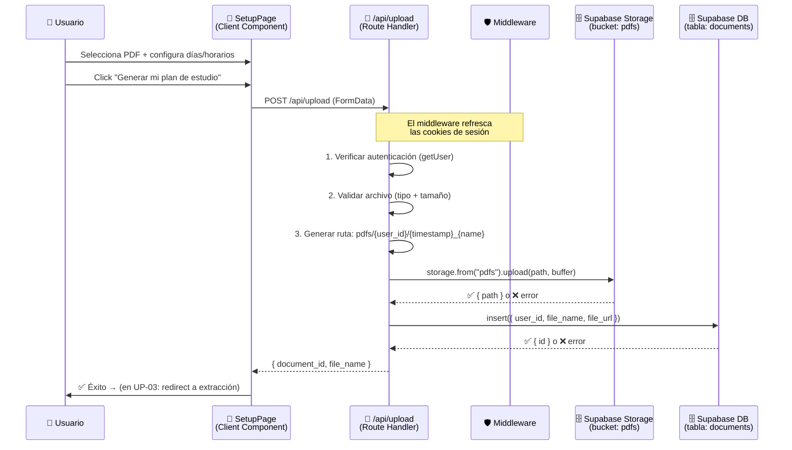
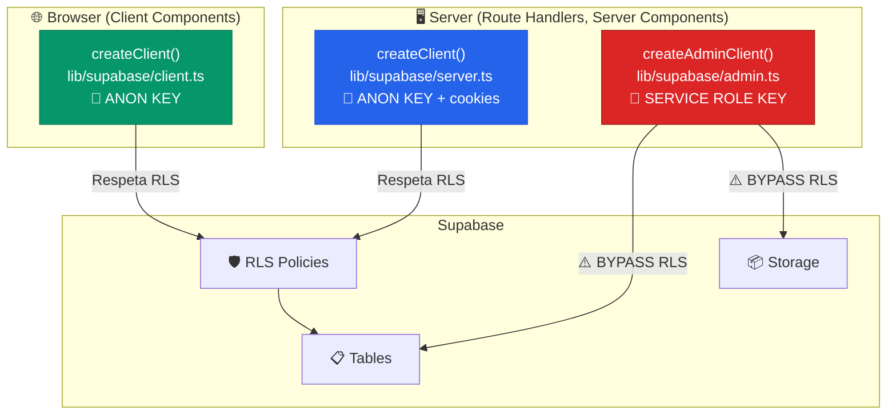

# UP-02 — API Route `/api/upload` → Supabase Storage

**Bloque:** 📤 FLUJO DE UPLOAD Y PLAN  
**Guía anterior:** [UP-01 — UI: página de setup](file:///c:/Users/jsife/OneDrive/Desktop/Repositorios/practica-testing/docs/guides/fe/UP-01.md)  
**Guía siguiente:** UP-03 — Llamada Next.js → FastAPI `/extract-pdf`  
**Estado:** ✅ Completado  
**Fecha:** Junio 2026

---

## Sección 1: 🎓 Introducción y Fundamentos Conceptuales

### Recap: ¿Dónde quedamos?

En **UP-01** construimos toda la interfaz de usuario para la página `/setup`: un **dropzone** con drag & drop para seleccionar PDFs, un formulario de configuración de horarios y días, y un botón "Generar mi plan de estudio" que *simulaba* el envío con un `setTimeout`. La función `handleSubmit` incluso tenía código comentado mostrando exactamente cómo se conectaría con la API:

```typescript
// SIMULACIÓN TEMPORAL en UP-01:
await new Promise((resolve) => setTimeout(resolve, 2000));
alert(`✅ Simulación exitosa!`);
```

**Hoy vamos a reemplazar esa simulación por conexión real.** El PDF que el usuario selecciona viajará desde su navegador → a nuestra API Route en Next.js → al bucket `pdfs` de Supabase Storage → y quedará registrado en la tabla `documents`.

### ¿Qué es un Route Handler en Next.js?

Imagina que un **Route Handler** es como un empleado que trabaja en la *trastienda* de tu aplicación. El usuario nunca lo ve directamente, pero cuando el botón de la UI hace un `fetch("/api/upload")`, ese empleado recibe el paquete, lo procesa, y devuelve una respuesta.

En Next.js App Router, un Route Handler se crea colocando un archivo `route.ts` dentro de la carpeta `app/api/`. La convención es:

```
app/api/upload/route.ts  →  POST /api/upload
app/api/health/route.ts  →  GET  /api/health
```

Cada archivo exporta funciones nombradas según el método HTTP:

```typescript
// app/api/upload/route.ts
export async function POST(request: Request) {
  // Este código corre en el SERVIDOR de Next.js
  // Tiene acceso a variables de entorno privadas (sin NEXT_PUBLIC_)
  // Puede usar service_role keys de forma segura
  return Response.json({ message: "ok" });
}
```

### ¿Por qué necesitamos `service_role` aquí?

Hasta ahora, nuestros clientes de Supabase usaban la **anon key** — una llave pública que respeta las políticas de Row Level Security (RLS). Esto es perfecto para leer datos del usuario autenticado, pero para **subir archivos al Storage**, necesitamos un cliente con permisos elevados:

| Concepto | Anon Key | Service Role Key |
|----------|----------|-----------------|
| **Nivel de acceso** | Limitado por RLS | **Bypass total** de RLS |
| **Dónde usarla** | Cliente + Servidor | **Solo servidor** |
| **Prefijo en `.env`** | `NEXT_PUBLIC_` ✅ | Sin prefijo ❌ |
| **Riesgo si se expone** | Bajo (RLS protege) | **CRÍTICO** — acceso total a la DB |

> [!CAUTION]
> **NUNCA** importes `SUPABASE_SERVICE_ROLE_KEY` en un Client Component ni en un archivo con `'use client'`. Esta clave da acceso completo a toda tu base de datos sin restricciones RLS. Solo debe existir en el servidor (Route Handlers, Server Actions, Server Components).

### El flujo completo que construiremos hoy

```
┌─────────────┐     FormData      ┌──────────────────┐    upload()     ┌────────────────┐
│  SetupPage  │ ──────────────── │  /api/upload     │ ──────────────  │  Supabase      │
│  (Browser)  │    POST fetch     │  (Route Handler) │    service_role │  Storage       │
│             │                   │                  │                 │  bucket: pdfs  │
│  file +     │  ◄────────────── │  1. Auth check   │  ◄──────────── │                │
│  config     │   { document_id } │  2. Validate     │   { path, id } │                │
│             │                   │  3. Upload file  │                 │                │
│             │                   │  4. Insert doc   │ ──────────────  ├────────────────┤
│             │                   │  5. Return ID    │    insert()     │  Supabase DB   │
│             │                   │                  │    service_role │  documents     │
└─────────────┘                   └──────────────────┘                 └────────────────┘
```

---

## Sección 2: 📋 Prerequisitos y Verificación del Entorno

Antes de escribir una sola línea de código, verifica que **todo** lo siguiente está en su lugar.

### Herramientas y versiones

| Herramienta | Comando de verificación | Versión esperada |
|-------------|------------------------|------------------|
| Node.js | `node --version` | v18+ |
| npm | `npm --version` | v9+ |
| Next.js | `npx next --version` | 16.x |
| TypeScript | `npx tsc --version` | 5.x |

### Variables de entorno

Abre `frontend/.env.local` y verifica que existan estas variables:

```powershell
# Desde la raíz del proyecto:
Select-String -Pattern "SUPABASE_SERVICE_ROLE_KEY" -Path frontend/.env.local
```

**Resultado esperado:** Una línea con `SUPABASE_SERVICE_ROLE_KEY=eyJ...` (un JWT largo).

Si **NO** aparece, vuelve a la guía **DB-01, Paso B** y copia la `service_role key` desde el dashboard de Supabase → Settings → API.

### Dependencias de guías anteriores

| Guía | Entregable requerido | Cómo verificar |
|------|---------------------|----------------|
| **DB-01** | Proyecto Supabase creado + credenciales | `NEXT_PUBLIC_SUPABASE_URL` existe en `.env.local` |
| **DB-02** | Tabla `documents` creada | Visible en Supabase Table Editor |
| **DB-03** | Bucket `pdfs` creado y privado | Visible en Supabase Storage dashboard |
| **DB-04** | RLS policies en `documents` | Policies visibles en Auth Policies |
| **FE-01** | Scaffold Next.js funcionando | `npm run dev` sin errores |
| **FE-02** | Clientes Supabase creados | `lib/supabase/client.ts` y `server.ts` existen |
| **FE-03** | Auth funcional | Login y logout funcionan |
| **UP-01** | Página `/setup` con dropzone | La página renderiza en `localhost:3000/setup` |

### Verificación rápida del bucket

1. Ve a [Supabase Dashboard](https://supabase.com/dashboard) → tu proyecto → **Storage**
2. Confirma que el bucket `pdfs` aparece como **Private** (🔒)
3. Si no existe, vuelve a la guía **DB-03**

---

## Sección 3: 📂 Estructura de Directorios del Proyecto

Así queda el proyecto **después** de completar esta guía. Los archivos marcados con `← NUEVO` son los que crearás:

```
practica-testing/
├── .env.example
├── .env.local
├── .gitignore
│
├── backend/                          # (BE-01 a BE-06 — completado)
│   └── ...
│
├── docs/
│   ├── roadmap/
│   │   └── ISTQB_Guias_Implementacion.md
│   └── guides/
│       ├── db/   (DB-01 a DB-05)
│       ├── be/   (BE-01 a BE-06)
│       └── fe/
│           ├── FE-01.md
│           ├── FE-02.md
│           ├── FE-03.md
│           ├── FE-04.md
│           ├── UP-01.md
│           └── UP-02.md              ← ESTA GUÍA
│
├── frontend/
│   ├── .env.example
│   ├── .env.local
│   ├── middleware.ts
│   ├── package.json
│   ├── next.config.ts
│   ├── tsconfig.json
│   │
│   ├── app/
│   │   ├── layout.tsx
│   │   ├── page.tsx                  # Landing page
│   │   ├── globals.css
│   │   │
│   │   ├── api/                      ← NUEVO directorio
│   │   │   └── upload/               ← NUEVO directorio
│   │   │       └── route.ts          ← NUEVO — Route Handler principal
│   │   │
│   │   ├── (auth)/
│   │   │   ├── layout.tsx
│   │   │   ├── login/page.tsx
│   │   │   └── register/page.tsx
│   │   │
│   │   ├── (dashboard)/
│   │   │   ├── layout.tsx
│   │   │   ├── loading.tsx
│   │   │   ├── error.tsx
│   │   │   ├── _components/
│   │   │   │   ├── main-nav.tsx
│   │   │   │   ├── mobile-nav.tsx
│   │   │   │   └── user-menu.tsx
│   │   │   ├── dashboard/page.tsx
│   │   │   └── setup/
│   │   │       ├── page.tsx          ← MODIFICADO — handleSubmit real
│   │   │       └── _components/
│   │   │           ├── pdf-dropzone.tsx
│   │   │           ├── file-preview.tsx
│   │   │           └── study-config.tsx
│   │   │
│   │   └── auth/
│   │       └── callback/route.ts
│   │
│   ├── lib/
│   │   ├── format.ts
│   │   ├── utils.ts
│   │   └── supabase/
│   │       ├── client.ts
│   │       ├── server.ts
│   │       └── admin.ts              ← NUEVO — Cliente con service_role
│   │
│   ├── types/
│   │   ├── database.ts
│   │   └── index.ts
│   │
│   └── components/
│       ├── ui/ (shadcn/ui)
│       └── shared/
│
└── supabase/
    └── migrations/
```

---

## Sección 4: 🎨 Diagrama de Arquitectura de Componentes

### Flujo de datos del upload



### Arquitectura de clientes Supabase



---

## Sección 5: 🛠️ Implementación Paso a Paso

---

### Paso A: Crear el cliente admin de Supabase

**Archivo:** `frontend/lib/supabase/admin.ts` — **NUEVO**

Este archivo crea un cliente de Supabase que usa la `service_role key` para operaciones que necesitan **bypass de RLS** (como subir archivos al Storage desde el servidor).

```typescript
// ─────────────────────────────────────────────────────────────────
// lib/supabase/admin.ts
// Cliente de Supabase con service_role key (permisos elevados).
//
// ⚠️  REGLA DE ORO: Este archivo SOLO puede importarse desde
//     código que corre en el SERVIDOR:
//       - Route Handlers (app/api/**/route.ts)
//       - Server Actions
//       - Server Components
//
// 🚫  NUNCA importar desde archivos con 'use client'.
// ─────────────────────────────────────────────────────────────────

import { createClient } from "@supabase/supabase-js";
import type { Database } from "@/types";

// ─────────────────────────────────────────────────────────────────
// ¿Por qué NO usamos createServerClient de @supabase/ssr aquí?
//
// createServerClient necesita cookies para manejar la sesión del
// usuario. Pero el admin client NO representa a ningún usuario;
// representa al SERVIDOR MISMO con acceso total.
//
// Por eso usamos createClient directamente de @supabase/supabase-js,
// sin cookies, sin SSR — es un cliente "desnudo" con superpoderes.
// ─────────────────────────────────────────────────────────────────

/**
 * Crea un cliente de Supabase con permisos de service_role.
 *
 * Este cliente IGNORA todas las políticas de Row Level Security (RLS).
 * Úsalo solo cuando el Route Handler ya haya verificado la identidad
 * del usuario con `getUser()` y necesites hacer una operación privilegiada
 * como subir archivos al Storage o insertar registros con un user_id
 * que el anon client no permitiría.
 *
 * @example
 * ```typescript
 * const adminClient = createAdminClient();
 * const { data, error } = await adminClient.storage
 *   .from("pdfs")
 *   .upload(path, file);
 * ```
 */
export function createAdminClient() {
  // ─── Validación defensiva ─────────────────────────────────
  // Si las variables no existen, fallamos ruidosamente en lugar
  // de crear un cliente inválido que falle silenciosamente después.
  const supabaseUrl = process.env.NEXT_PUBLIC_SUPABASE_URL;
  const serviceRoleKey = process.env.SUPABASE_SERVICE_ROLE_KEY;

  if (!supabaseUrl) {
    throw new Error(
      "[Admin Client] NEXT_PUBLIC_SUPABASE_URL no está definida. " +
        "Revisa tu archivo .env.local"
    );
  }

  if (!serviceRoleKey) {
    throw new Error(
      "[Admin Client] SUPABASE_SERVICE_ROLE_KEY no está definida. " +
        "Revisa tu archivo .env.local (esta variable NO lleva prefijo NEXT_PUBLIC_)"
    );
  }

  return createClient<Database>(supabaseUrl, serviceRoleKey, {
    auth: {
      // ─── Desactivar la persistencia de sesión ───────────────
      // El admin client no necesita manejar sesiones de usuario.
      // autoRefreshToken y persistSession son para clientes del
      // navegador que necesitan mantener al usuario logueado.
      autoRefreshToken: false,
      persistSession: false,
    },
  });
}
```

> [!IMPORTANT]
> **¿Por qué `createClient` de `@supabase/supabase-js` y no `createServerClient` de `@supabase/ssr`?**
>
> `createServerClient` está diseñado para representar al **usuario actual** (lee sus cookies, respeta RLS con su JWT). Pero el admin client representa al **servidor** — no tiene usuario, no tiene cookies, y necesita bypass total de RLS. Son dos conceptos completamente diferentes.

**Entregable del Paso A:**
- [x] Archivo `frontend/lib/supabase/admin.ts` creado

---

### Paso B: Crear el Route Handler `/api/upload`

**Archivo:** `frontend/app/api/upload/route.ts` — **NUEVO**

Este es el corazón de esta guía. Vamos a desglosarlo en secciones para que entiendas cada decisión.

```typescript
// ─────────────────────────────────────────────────────────────────
// app/api/upload/route.ts
// Route Handler: recibe un PDF del usuario, lo sube a Supabase
// Storage, crea un registro en la tabla `documents`, y retorna
// el document_id al frontend.
//
// Método: POST
// Content-Type: multipart/form-data
// Body:
//   - file: File (PDF, máx 20MB)
//   - objective_days: string (número de días, "1"-"30")
//   - morning_time: string (ej: "6:00 AM")
//   - night_time: string (ej: "10:00 PM")
//
// Response (200):
//   { document_id: string, file_name: string }
//
// Response (401): { error: "No autenticado" }
// Response (400): { error: "Descripción del problema" }
// Response (500): { error: "Error interno del servidor" }
// ─────────────────────────────────────────────────────────────────

import { NextResponse } from "next/server";
import { createClient } from "@/lib/supabase/server";
import { createAdminClient } from "@/lib/supabase/admin";
import { MAX_FILE_SIZE, ACCEPTED_FILE_TYPES } from "@/lib/format";
import type { DocumentInsert } from "@/types";

// ─────────────────────────────────────────────────────────────────
// ¿Por qué exportamos una función llamada POST?
//
// Next.js App Router usa la convención de funciones nombradas
// para mapear métodos HTTP. Si alguien hace un GET a /api/upload,
// Next.js retornará 405 Method Not Allowed automáticamente.
//
// Métodos soportados: GET, POST, PUT, PATCH, DELETE, HEAD, OPTIONS
// ─────────────────────────────────────────────────────────────────

export async function POST(request: Request) {
  try {
    // ═══════════════════════════════════════════════════════════
    // FASE 1: AUTENTICACIÓN
    // Verificar que el usuario está logueado ANTES de cualquier
    // otra operación. Esto es defensa en profundidad: aunque el
    // middleware ya refresca las cookies, aquí comprobamos que
    // existe un usuario válido.
    // ═══════════════════════════════════════════════════════════

    const supabase = await createClient();

    // ─── ¿Por qué getUser() y no getSession()? ─────────────
    // getSession() lee el JWT del cookie sin verificarlo contra
    // Supabase Auth. Un JWT expirado o manipulado pasaría.
    // getUser() hace una llamada al servidor de auth de Supabase
    // para confirmar que el token es válido y el usuario existe.
    // Es más lento, pero más seguro. Para operaciones sensibles
    // como subir archivos, SIEMPRE usa getUser().
    const {
      data: { user },
      error: authError,
    } = await supabase.auth.getUser();

    if (authError || !user) {
      return NextResponse.json(
        { error: "No autenticado. Por favor inicia sesión." },
        { status: 401 }
      );
    }

    // ═══════════════════════════════════════════════════════════
    // FASE 2: PARSING DEL FORMDATA
    // El frontend envía multipart/form-data con el archivo PDF
    // y los campos de configuración del plan de estudio.
    // ═══════════════════════════════════════════════════════════

    // ─── ¿Qué es FormData? ──────────────────────────────────
    // FormData es la forma estándar de enviar archivos por HTTP.
    // A diferencia de JSON (que solo puede contener texto/números),
    // FormData puede contener archivos binarios como PDFs.
    //
    // El browser serializa el FormData como multipart/form-data,
    // y request.formData() lo deserializa de vuelta en el servidor.
    const formData = await request.formData();

    // ─── Extraer campos ─────────────────────────────────────
    // formData.get() retorna FormDataEntryValue | null
    // Para archivos: retorna un objeto File
    // Para strings: retorna un string
    const file = formData.get("file") as File | null;
    const objectiveDays = formData.get("objective_days") as string | null;
    const morningTime = formData.get("morning_time") as string | null;
    const nightTime = formData.get("night_time") as string | null;

    // ═══════════════════════════════════════════════════════════
    // FASE 3: VALIDACIÓN
    // NUNCA confíes en la validación del frontend. Un atacante
    // puede enviar requests directamente con curl o Postman,
    // saltándose toda la validación de la UI.
    // ═══════════════════════════════════════════════════════════

    // ─── 3a. ¿Existe el archivo? ────────────────────────────
    if (!file) {
      return NextResponse.json(
        { error: "No se recibió ningún archivo. Selecciona un PDF." },
        { status: 400 }
      );
    }

    // ─── 3b. ¿Es un PDF? ───────────────────────────────────
    // Reutilizamos la constante ACCEPTED_FILE_TYPES de lib/format.ts
    // para mantener consistencia entre la validación del frontend
    // (PdfDropzone) y la del backend (este Route Handler).
    if (!ACCEPTED_FILE_TYPES.includes(file.type)) {
      return NextResponse.json(
        {
          error: `Tipo de archivo no válido: "${file.type}". Solo se aceptan archivos PDF.`,
        },
        { status: 400 }
      );
    }

    // ─── 3c. ¿Tamaño dentro del límite? ─────────────────────
    // file.size está en bytes. MAX_FILE_SIZE = 20 * 1024 * 1024 (20MB)
    if (file.size > MAX_FILE_SIZE) {
      const maxMB = MAX_FILE_SIZE / (1024 * 1024);
      const fileMB = (file.size / (1024 * 1024)).toFixed(1);
      return NextResponse.json(
        {
          error: `El archivo pesa ${fileMB}MB. El máximo permitido es ${maxMB}MB.`,
        },
        { status: 400 }
      );
    }

    // ─── 3d. ¿Tiene nombre? ─────────────────────────────────
    if (!file.name || file.name.trim() === "") {
      return NextResponse.json(
        { error: "El archivo no tiene nombre válido." },
        { status: 400 }
      );
    }

    // ─── 3e. Validar campos de configuración ────────────────
    if (!objectiveDays || !morningTime || !nightTime) {
      return NextResponse.json(
        {
          error:
            "Faltan campos de configuración: objective_days, morning_time y night_time son obligatorios.",
        },
        { status: 400 }
      );
    }

    const days = parseInt(objectiveDays, 10);
    if (isNaN(days) || days < 1 || days > 30) {
      return NextResponse.json(
        { error: "objective_days debe ser un número entre 1 y 30." },
        { status: 400 }
      );
    }

    // ═══════════════════════════════════════════════════════════
    // FASE 4: SUBIR ARCHIVO A SUPABASE STORAGE
    // Usamos el admin client porque el bucket es privado y las
    // políticas de Storage requieren service_role para upload
    // desde el servidor.
    // ═══════════════════════════════════════════════════════════

    const adminClient = createAdminClient();

    // ─── Generar ruta única en el bucket ─────────────────────
    // Patrón: pdfs/{user_id}/{timestamp}_{filename}
    //
    // ¿Por qué incluir el user_id en la ruta?
    // → Organización: cada usuario tiene su propia "carpeta"
    // → Las RLS policies de Storage verifican que el path
    //   empiece con el user_id del usuario autenticado
    //
    // ¿Por qué incluir un timestamp?
    // → Para evitar colisiones si el usuario sube el mismo
    //   archivo dos veces. Supabase Storage sobreescribe si
    //   la ruta ya existe (a menos que uses upsert: false).
    //
    // sanitizeFileName remueve caracteres problemáticos del
    // nombre del archivo para evitar errores en la URL.
    const timestamp = Date.now();
    const sanitizedName = file.name
      .replace(/[^a-zA-Z0-9._-]/g, "_") // Reemplazar caracteres especiales
      .replace(/_{2,}/g, "_"); // Evitar múltiples guiones bajos seguidos

    const storagePath = `${user.id}/${timestamp}_${sanitizedName}`;

    // ─── Convertir File a Buffer ─────────────────────────────
    // Supabase Storage acepta Buffer, Blob, File, o ArrayBuffer.
    // Convertimos a Buffer para máxima compatibilidad con el
    // runtime de Node.js en el servidor de Next.js.
    const fileBuffer = Buffer.from(await file.arrayBuffer());

    // ─── Subir al bucket ─────────────────────────────────────
    const { data: uploadData, error: uploadError } = await adminClient.storage
      .from("pdfs") // Nombre del bucket (creado en DB-03)
      .upload(storagePath, fileBuffer, {
        contentType: file.type, // "application/pdf"
        // ── upsert: false ────────────────────────────────────
        // Si la ruta ya existe, lanza error en lugar de
        // sobreescribir silenciosamente. Con el timestamp en el
        // nombre, esto nunca debería pasar — pero es una red
        // de seguridad contra bugs.
        upsert: false,
      });

    if (uploadError) {
      console.error("[Upload] Error al subir a Storage:", uploadError);
      return NextResponse.json(
        {
          error:
            "Error al subir el archivo al almacenamiento. Por favor intenta de nuevo.",
        },
        { status: 500 }
      );
    }

    // ─── uploadData.path ─────────────────────────────────────
    // Supabase retorna la ruta relativa dentro del bucket:
    // "abc123/1719518400000_syllabus_istqb.pdf"
    //
    // Esta es la ruta que guardaremos en la tabla documents.
    // NO es una URL pública — el bucket es privado. Cuando
    // necesitemos acceder al archivo, generaremos una
    // "signed URL" temporal (se hará en UP-03).

    // ═══════════════════════════════════════════════════════════
    // FASE 5: INSERTAR REGISTRO EN LA TABLA documents
    // Guardamos los metadatos del archivo en la base de datos
    // para que el resto del flujo pueda encontrarlo.
    // ═══════════════════════════════════════════════════════════

    // ─── Construir el objeto de inserción ─────────────────────
    // Usamos el tipo DocumentInsert de types/database.ts para
    // tener autocompletado y validación de TypeScript.
    const documentRecord: DocumentInsert = {
      user_id: user.id,
      file_name: file.name, // Nombre original (para mostrar en la UI)
      file_url: uploadData.path, // Ruta en Storage (relativa al bucket)
      // extracted_text y topics_json se llenarán en UP-03
      // cuando FastAPI procese el PDF.
    };

    const { data: insertData, error: insertError } = await adminClient
      .from("documents")
      .insert(documentRecord)
      .select("id") // Solo necesitamos el ID generado por PostgreSQL
      .single(); // Esperamos exactamente 1 registro

    if (insertError) {
      console.error("[Upload] Error al insertar en documents:", insertError);

      // ─── Limpieza: eliminar el archivo huérfano ────────────
      // Si la inserción en la DB falla, el archivo ya está en
      // Storage pero sin registro. Intentamos eliminarlo para
      // no dejar archivos huérfanos. Si esta limpieza también
      // falla, no es crítico — solo quedaría un archivo sin
      // referencia en la DB.
      await adminClient.storage.from("pdfs").remove([storagePath]);

      return NextResponse.json(
        {
          error:
            "Error al registrar el documento. El archivo fue eliminado. Intenta de nuevo.",
        },
        { status: 500 }
      );
    }

    // ═══════════════════════════════════════════════════════════
    // FASE 6: RESPUESTA EXITOSA
    // Retornamos el document_id para que el frontend pueda
    // usarlo en el siguiente paso (UP-03: extracción de tópicos).
    // ═══════════════════════════════════════════════════════════

    console.log(
      `[Upload] ✅ Documento creado: ${insertData.id} para usuario: ${user.id}`
    );

    return NextResponse.json(
      {
        document_id: insertData.id,
        file_name: file.name,
      },
      { status: 200 }
    );
  } catch (error) {
    // ─── Error no controlado ──────────────────────────────────
    // Cualquier excepción no capturada llega aquí. Logueamos
    // el error completo en el servidor (para debugging) pero
    // retornamos un mensaje genérico al cliente (para seguridad).
    console.error("[Upload] Error no controlado:", error);

    return NextResponse.json(
      { error: "Error interno del servidor. Por favor intenta de nuevo." },
      { status: 500 }
    );
  }
}
```

> [!NOTE]
> **¿Por qué separamos las fases en secciones tan claras?**
>
> En un Route Handler, cada fase puede fallar de forma diferente. Separar las fases permite:
> 1. **Mensajes de error específicos** — el usuario sabe *qué* falló
> 2. **Limpieza condicional** — si la DB falla, limpiamos Storage
> 3. **Logging preciso** — cada `console.error` tiene un prefijo `[Upload]` con contexto
> 4. **Testabilidad** — puedes probar cada fase por separado

**Entregable del Paso B:**
- [x] Archivo `frontend/app/api/upload/route.ts` creado
- [x] El archivo tiene las 6 fases: Auth → Parse → Validate → Upload → Insert → Response

---

### Paso C: Conectar el frontend — Modificar `setup/page.tsx`

**Archivo:** `frontend/app/(dashboard)/setup/page.tsx` — **MODIFICAR**

Ahora vamos a reemplazar la simulación temporal por el `fetch` real a nuestra API Route. Los cambios son mínimos gracias a que UP-01 ya dejó el código comentado como guía.

**Cambios a realizar:**

1. Agregar `import { useRouter } from "next/navigation"` al inicio
2. Crear la instancia del router: `const router = useRouter()`
3. Reemplazar **toda** la función `handleSubmit` con la versión real

Busca la función `handleSubmit` actual (que tiene el `setTimeout` y el `alert`) y reemplázala completamente por esta:

```typescript
// ─── Importación adicional (agregar al inicio del archivo) ──
import { useRouter } from "next/navigation";

// ─── Dentro del componente SetupPage, después de los useState ──
const router = useRouter();
```

```typescript
// ─── Reemplazar TODA la función handleSubmit existente ──────

const handleSubmit = async () => {
  // ─── Guard clause ──────────────────────────────────────────
  // Si no hay archivo seleccionado, no hacemos nada.
  // El botón ya está disabled en la UI, pero esto es defensa
  // en profundidad por si alguien llama a handleSubmit
  // programáticamente.
  if (!selectedFile) return;

  setIsLoading(true);
  setSubmitError(null);

  try {
    // ─── Construir FormData ────────────────────────────────
    // FormData es la forma estándar de enviar archivos por HTTP.
    // No necesitamos setear Content-Type manualmente — el browser
    // lo hace automáticamente como "multipart/form-data" con el
    // boundary correcto cuando detecta un objeto FormData.
    //
    // ⚠️ Si pusieras Content-Type manualmente, ROMPERÍAS el
    //    upload porque el browser necesita calcular el boundary.
    const formData = new FormData();
    formData.append("file", selectedFile);
    formData.append("objective_days", config.objectiveDays.toString());
    formData.append("morning_time", config.morningTime);
    formData.append("night_time", config.nightTime);

    // ─── Enviar al Route Handler ───────────────────────────
    const response = await fetch("/api/upload", {
      method: "POST",
      body: formData,
      // ⚠️ NO agregar headers: { "Content-Type": "..." }
      // El browser lo maneja automáticamente para FormData
    });

    // ─── Parsear respuesta ─────────────────────────────────
    // Siempre parseamos el JSON primero, incluso en error,
    // porque nuestro Route Handler retorna { error: "..." }
    // con mensajes descriptivos.
    const data = await response.json();

    if (!response.ok) {
      // El servidor retornó un error con mensaje descriptivo
      throw new Error(data.error || "Error al subir el archivo.");
    }

    // ═══════════════════════════════════════════════════════
    // ✅ ÉXITO: El PDF está en Storage y registrado en la DB
    // ═══════════════════════════════════════════════════════
    // En UP-03, aquí redirigiremos a la página de extracción:
    // router.push(`/plan/generate/${data.document_id}`);
    //
    // Por ahora, mostramos un mensaje de éxito y redirigimos
    // al dashboard como confirmación visual.
    console.log(
      `[Setup] ✅ Documento subido: ${data.document_id} (${data.file_name})`
    );

    // Redirigir al dashboard temporalmente
    // En UP-03 esto cambiará para iniciar la extracción
    router.push("/dashboard");
  } catch (error) {
    // ─── Manejo de errores ─────────────────────────────────
    // Capturamos tanto errores de red (fetch falla) como
    // errores del servidor (response.ok === false).
    setSubmitError(
      error instanceof Error
        ? error.message
        : "Ocurrió un error inesperado. Por favor intenta de nuevo."
    );
  } finally {
    // ─── Siempre restaurar el estado de loading ────────────
    // `finally` se ejecuta tanto si el try tuvo éxito como si
    // el catch capturó un error. Esto garantiza que el botón
    // se reactiva y el spinner desaparece.
    setIsLoading(false);
  }
};
```

> [!WARNING]
> **No agregues el header `Content-Type`** cuando envíes FormData con `fetch`. Si lo haces, el browser no incluirá el `boundary` necesario para separar los campos del formulario y el servidor no podrá parsear el archivo. Deja que `fetch` lo maneje automáticamente.

**Entregable del Paso C:**
- [x] `setup/page.tsx` importa `useRouter` de `next/navigation`
- [x] La constante `router` está declarada dentro del componente
- [x] `handleSubmit` usa `fetch("/api/upload", ...)` con FormData real
- [x] El `setTimeout` y `alert` de la simulación han sido eliminados

---

### Paso D: Verificar la configuración del Middleware

**Archivo:** `frontend/middleware.ts` — **VERIFICAR (no modificar)**

Nuestro middleware actual protege rutas como `/dashboard` y `/setup`, pero necesitamos asegurar que las API Routes funcionen correctamente con la autenticación.

Abre `middleware.ts` y verifica que el `matcher` incluya las rutas API:

```typescript
// Busca la sección config.matcher al final del archivo
export const config = {
  matcher: [
    /*
     * Match all request paths except:
     * - _next/static (static files)
     * - _next/image (image optimization files)
     * - favicon.ico (favicon file)
     * - images (public image files)
     */
    "/((?!_next/static|_next/image|favicon.ico|.*\\.(?:svg|png|jpg|jpeg|gif|webp)$).*)",
  ],
};
```

Esta configuración coincide con **todas las rutas** excepto archivos estáticos, lo que incluye `/api/upload`. Esto significa que el middleware **refrescará las cookies de sesión** antes de que el Route Handler se ejecute — exactamente lo que necesitamos.

> [!NOTE]
> **El middleware NO bloquea las API Routes.** Solo refresca los tokens de autenticación en los cookies. La verificación real de autenticación (`getUser()`) la hace el Route Handler en la Fase 1. Esto es **defensa en profundidad**: el middleware mantiene los tokens frescos, y el Route Handler verifica que el usuario existe.

**Entregable del Paso D:**
- [x] Verificaste que el middleware procesa las rutas `/api/*`
- [x] Entendiste que el middleware solo refresca cookies, no bloquea

---

### Paso E: Verificar `.env.local` y `.env.example`

**Archivos:** `frontend/.env.local` y `frontend/.env.example` — **VERIFICAR**

Las variables de entorno ya deberían estar configuradas desde guías anteriores. Verifiquemos:

```powershell
# Desde la carpeta frontend/
# Verificar que SUPABASE_SERVICE_ROLE_KEY existe (sin mostrar el valor)
Select-String -Pattern "SUPABASE_SERVICE_ROLE_KEY" -Path .env.local
```

**Resultado esperado:**
```
.env.local:4:SUPABASE_SERVICE_ROLE_KEY=eyJhbGciOiJIUzI1NiIsInR5cCI6IkpXVCJ9...
```

Si la variable NO existe, agrégala:

```bash
# .env.local (agregar si falta)
SUPABASE_SERVICE_ROLE_KEY=tu_service_role_key_aquí
```

> [!CAUTION]
> **Obtén la `service_role key` desde Supabase Dashboard → Settings → API → Project API keys → `service_role` (secret)**. No la confundas con la `anon` key. Y NUNCA la commitees a Git — `.env.local` ya está en el `.gitignore`.

Ahora verifica que `.env.example` documenta la variable (sin el valor real):

```powershell
Select-String -Pattern "SUPABASE_SERVICE_ROLE_KEY" -Path .env.example
```

**Resultado esperado:**
```
.env.example:4:SUPABASE_SERVICE_ROLE_KEY=your-service-role-key-here
```

**Entregable del Paso E:**
- [x] `SUPABASE_SERVICE_ROLE_KEY` existe en `.env.local` con la clave real
- [x] `SUPABASE_SERVICE_ROLE_KEY` existe en `.env.example` con un placeholder

---

## Sección 6: ✅ Checkpoints de Verificación

### Checkpoint 1: Compilación TypeScript

```powershell
cd frontend
npx tsc --noEmit
```

**Resultado esperado:** Sin errores. Si ves errores de tipos, revisa que:
- `DocumentInsert` está exportado correctamente en `types/database.ts`
- Los imports en `route.ts` usan `@/` (alias configurado en `tsconfig.json`)

### Checkpoint 2: Servidor de desarrollo

```powershell
npm run dev
```

**Resultado esperado:**
```
  ▲ Next.js 16.x.x
  - Local:        http://localhost:3000
  - Environments: .env.local

 ✓ Ready in Xs
```

### Checkpoint 3: Prueba del flujo completo en el navegador

1. **Abre** `http://localhost:3000/login` e inicia sesión
2. **Navega** a `http://localhost:3000/setup`
3. **Arrastra** un archivo PDF (o haz click para seleccionar uno)
4. **Configura** los días y horarios
5. **Click** en **"🚀 Generar mi plan de estudio"**

**Lo que deberías ver:**
- El botón cambia a "Generando plan..." con un spinner
- Después de 1-3 segundos, se redirige a `/dashboard`
- **No** aparece el `alert()` de la simulación anterior

### Checkpoint 4: Verificar en Supabase Dashboard

#### 4a. Storage

1. Ve a **Supabase Dashboard** → **Storage** → **pdfs**
2. Deberías ver una carpeta con tu `user_id` (un UUID como `abc123-def456-...`)
3. Dentro de esa carpeta, el archivo con formato: `{timestamp}_{nombre_archivo}.pdf`
4. Click en el archivo → verifica que puedes previsualizarlo

**Ejemplo visual:**
```
📦 pdfs/
  └── 📁 a1b2c3d4-e5f6-7890-abcd-ef1234567890/
      └── 📄 1719518400000_ISTQB_CTFL_Syllabus_v4.0.pdf
```

#### 4b. Tabla documents

1. Ve a **Table Editor** → **documents**
2. Deberías ver un nuevo registro con:
   - `user_id`: tu UUID de usuario
   - `file_name`: nombre original del PDF
   - `file_url`: ruta en Storage (ej: `a1b2c3d4.../1719518400000_archivo.pdf`)
   - `extracted_text`: `null` (se llenará en UP-03)
   - `topics_json`: `null` (se llenará en UP-03)

### Checkpoint 5: Probar validaciones de error

#### 5a. Archivo no PDF

1. Intenta subir un archivo `.txt` o `.jpg` desde la UI
2. **Resultado:** El dropzone debe rechazarlo con un mensaje de error (validación del frontend)

#### 5b. Probar API directamente (sin frontend)

Abre una nueva terminal y prueba con PowerShell:

```powershell
# Probar sin autenticación (debe fallar con 401)
Invoke-RestMethod -Uri "http://localhost:3000/api/upload" -Method POST
```

**Resultado esperado:** Error 401 — "No autenticado. Por favor inicia sesión."

> [!TIP]
> Si quieres probar el API con un archivo real, necesitarías enviar las cookies de sesión. La forma más fácil es usar la UI del navegador, que maneja las cookies automáticamente.

### Checkpoint 6: Verificar que no hay archivos huérfanos

Si alguna prueba falló a medio camino (ej: el archivo se subió a Storage pero la inserción en la DB falló), verifica:

1. **Storage**: No debería haber archivos sin registro correspondiente en la tabla
2. **Table**: No debería haber registros sin archivo en Storage

El Route Handler tiene lógica de limpieza que elimina el archivo de Storage si la inserción en la DB falla, pero verifica manualmente por si acaso.

### 📋 Checklist final de entregables

| # | Entregable | Estado |
|---|-----------|--------|
| 1 | `lib/supabase/admin.ts` creado con `createAdminClient()` | ✅ |
| 2 | `app/api/upload/route.ts` creado con función `POST` | ✅ |
| 3 | `setup/page.tsx` modificado con `handleSubmit` real (sin simulación) | ✅ |
| 4 | `setup/page.tsx` importa `useRouter` de `next/navigation` | ✅ |
| 5 | `npx tsc --noEmit` compila sin errores | ✅ |
| 6 | Subir PDF desde la UI → aparece en Supabase Storage | ✅ |
| 7 | Registro creado en tabla `documents` con `file_url` correcto | ✅ |
| 8 | Error claro si el archivo no es PDF o supera 20MB | ✅ |
| 9 | Un usuario no autenticado no puede subir PDFs (401) | ✅ |
| 10 | `.env.local` tiene `SUPABASE_SERVICE_ROLE_KEY` | ✅ |

---

## Sección 7: 🚨 Troubleshooting — Problemas Comunes

| Problema | Causa Probable | Solución |
|----------|---------------|----------|
| `Error: No autenticado` al subir PDF desde la UI | La sesión del usuario expiró o las cookies no se están enviando | Cierra sesión, vuelve a iniciar sesión y reintenta. Verifica que el middleware está refrescando los tokens correctamente. |
| `Error: SUPABASE_SERVICE_ROLE_KEY no está definida` | La variable no existe en `.env.local` o tiene un typo en el nombre | Abre `frontend/.env.local` y verifica que la variable existe exactamente como `SUPABASE_SERVICE_ROLE_KEY` (sin `NEXT_PUBLIC_`). Reinicia el servidor de desarrollo después de cambiar `.env.local`. |
| `StorageApiError: The resource already exists` | Se intentó subir un archivo con la misma ruta que ya existe en el bucket | Esto no debería pasar gracias al timestamp en el nombre. Si pasa, verifica que `Date.now()` está generando valores únicos. |
| `TypeError: Failed to fetch` en el browser console | El servidor de Next.js no está corriendo o hay un error de CORS | Verifica que `npm run dev` está corriendo sin errores. Las API Routes en el mismo dominio no tienen problemas de CORS. |
| El archivo se sube a Storage pero NO aparece en la tabla `documents` | Error en la inserción (ej: constraint violation, RLS blocking) | Revisa los logs de la terminal de Next.js. El Route Handler logea el error con `console.error("[Upload]")`. Verifica que el admin client usa `service_role key` (bypass RLS). |
| `413 Payload Too Large` antes de llegar al Route Handler | Next.js o el proxy (si hay) tiene un límite de body size | Next.js App Router no tiene límite de body por defecto, pero si usas un reverse proxy (nginx, Vercel), configura `client_max_body_size`. Para Vercel, el límite es 4.5MB en el plan free. |
| Después de subir, la UI se queda en "Generando plan..." y no redirige | El `router.push("/dashboard")` no se ejecuta, posiblemente por un error no capturado | Abre las DevTools del browser (F12) → Console y busca errores en rojo. También revisa la pestaña Network para ver la respuesta del POST a `/api/upload`. |
| `Module not found: Can't resolve '@/lib/supabase/admin'` | El archivo `admin.ts` no se creó en la ruta correcta | Verifica que existe `frontend/lib/supabase/admin.ts` (no `frontend/app/lib/...` ni `frontend/src/lib/...`). |
| El PDF se sube pero con tamaño 0 bytes en Storage | El `Buffer.from(await file.arrayBuffer())` falló silenciosamente | Agrega un `console.log("File size:", file.size, "Buffer size:", fileBuffer.length)` antes del upload para verificar que el buffer tiene contenido. |
| `RLS policy violation` al insertar en `documents` | Estás usando el server client (anon key) en lugar del admin client | Verifica que la inserción usa `adminClient` (de `createAdminClient()`) y no `supabase` (de `createClient()`). |
| `TS2345: Argument of type 'DocumentInsert' is not assignable to parameter of type 'never[]'` | El tipo `Database` en `types/database.ts` no cumple con el constraint `GenericSchema` de `@supabase/supabase-js` v2.108+ | Ver la **Sección 7.1** más abajo — fix crítico de tipos. |
| `TS2339: Property 'id' does not exist on type 'never'` (después de `.insert().select().single()`) | Consecuencia del mismo problema de tipos anterior. `Schema['Tables']['documents']` se resuelve a `never` | Ver la **Sección 7.1** más abajo — fix crítico de tipos. |

---

### 7.1 🔧 Fix Crítico: Tipos de `Database` para `@supabase/supabase-js` v2.108+

> [!CAUTION]
> **Si estás usando `@supabase/supabase-js` v2.108.2 o superior**, el tipo `Database` definido en `types/database.ts` (creado en **FE-02**) necesita **dos ajustes obligatorios** para que el `from().insert()` y `.select().single()` funcionen correctamente. Sin estos ajustes, TypeScript compila con errores `never[]` y `never` aunque el código runtime sea correcto.

#### ¿Por qué falla?

A partir de la v2.108, los tipos internos de Supabase (`GenericTable` en `@supabase/postgrest-js`) requieren que `Row`, `Insert` y `Update` sean asignables a `Record<string, unknown>`:

```typescript
// node_modules/@supabase/postgrest-js/dist/index.d.mts
type GenericTable = {
  Row: Record<string, unknown>;
  Insert: Record<string, unknown>;
  Update: Record<string, unknown>;
  Relationships: GenericRelationship[];
};
```

Las `interface` de TypeScript **no son asignables a `Record<string, unknown>`** porque no tienen index signatures implícitas. Esto hace que `Database['public']` no extienda `GenericSchema`, y todo se resuelva a `never` propagándose por `from()`, `insert()` y la respuesta.

#### Fix 1: Agregar `Relationships: []` a cada tabla

En `frontend/types/database.ts`, dentro de la interface `Database`, agrega el campo `Relationships: []` a las 6 tablas:

```typescript
export interface Database {
  public: {
    Tables: {
      user_profiles: {
        Row: UserProfileRow;
        Insert: UserProfileInsert;
        Update: UserProfileUpdate;
        Relationships: [];  // ← AGREGAR
      };
      documents: {
        Row: DocumentRow;
        Insert: DocumentInsert;
        Update: DocumentUpdate;
        Relationships: [];  // ← AGREGAR
      };
      study_plans: {
        Row: StudyPlanRow;
        Insert: StudyPlanInsert;
        Update: StudyPlanUpdate;
        Relationships: [];  // ← AGREGAR
      };
      sessions: {
        Row: SessionRow;
        Insert: SessionInsert;
        Update: SessionUpdate;
        Relationships: [];  // ← AGREGAR
      };
      answers: {
        Row: AnswerRow;
        Insert: AnswerInsert;
        Update: AnswerUpdate;
        Relationships: [];  // ← AGREGAR
      };
      topic_progress: {
        Row: TopicProgressRow;
        Insert: TopicProgressInsert;
        Update: TopicProgressUpdate;
        Relationships: [];  // ← AGREGAR
      };
    };
    // ... Views, Functions, Enums, CompositeTypes sin cambios
  };
}
```

#### Fix 2: Agregar index signature `[key: string]: unknown` a cada `interface` Row/Insert/Update

En el mismo archivo, agrega `[key: string]: unknown;` como **última línea** dentro de cada una de las 18 interfaces de tabla (`XxxRow`, `XxxInsert`, `XxxUpdate`):

```typescript
// ANTES (no compatible con GenericTable):
export interface DocumentRow {
  id: string;
  user_id: string;
  file_name: string;
  file_url: string;
  extracted_text: string | null;
  topics_json: TopicsJson | null;
  created_at: string;
}

// DESPUÉS (compatible con GenericTable):
export interface DocumentRow {
  id: string;
  user_id: string;
  file_name: string;
  file_url: string;
  extracted_text: string | null;
  topics_json: TopicsJson | null;
  created_at: string;
  [key: string]: unknown;  // ← AGREGAR — index signature
}
```

Repetir para las 18 interfaces: `UserProfileRow/Insert/Update`, `DocumentRow/Insert/Update`, `StudyPlanRow/Insert/Update`, `SessionRow/Insert/Update`, `AnswerRow/Insert/Update`, `TopicProgressRow/Insert/Update`.

#### Verificación del fix

Después de aplicar ambos fixes, ejecuta:

```powershell
cd frontend
npx tsc --noEmit
```

**Resultado esperado:** Sin errores. Si los 3 errores originales (`never[]`, `never.id`) desaparecieron, el fix está correcto.

#### ¿Por qué no se documentó en FE-02?

FE-02 fue creada cuando `@supabase/supabase-js` estaba en versiones anteriores que no requerían `Relationships` ni el index signature. Este cambio fue retroactivo en la v2.108+. Si encuentras este error en otra guía del Bloque D o E, el fix es siempre el mismo: `types/database.ts`.

---

## Sección 8: 📝 Resumen y Próximo Paso

### Lo que hiciste en esta guía

1. **Creaste `lib/supabase/admin.ts`** — un cliente de Supabase con `service_role key` que bypasea RLS, exclusivo para uso en el servidor
2. **Creaste `app/api/upload/route.ts`** — tu primer Route Handler con 6 fases: autenticación → parsing → validación → upload a Storage → inserción en DB → respuesta
3. **Modificaste `setup/page.tsx`** — reemplazaste la simulación temporal por un `fetch` real a `/api/upload` con FormData
4. **Verificaste el middleware** — confirmaste que refresca cookies de sesión en las rutas API
5. **Verificaste las variables de entorno** — `SUPABASE_SERVICE_ROLE_KEY` está en `.env.local`
6. **Probaste el flujo completo** — PDF sube a Storage, registro aparece en `documents`, errores dan mensajes descriptivos

### Conceptos clave aprendidos

| Concepto | Descripción |
|----------|------------|
| **Route Handlers** | Archivos `route.ts` en `app/api/` que exportan funciones HTTP (`GET`, `POST`, etc.) |
| **FormData** | Formato estándar para enviar archivos binarios por HTTP (no usar JSON para esto) |
| **Admin Client** | Cliente con `service_role key` para operaciones privilegiadas (bypass RLS) |
| **Defensa en profundidad** | Validar en el frontend Y en el backend; verificar auth en el middleware Y en el handler |
| **Limpieza de errores** | Si una operación falla a mitad del flujo, limpiar lo que ya se creó (ej: borrar archivo huérfano) |
| **`getUser()` vs `getSession()`** | `getUser()` verifica contra Supabase Auth; `getSession()` solo lee el JWT local |

### Valida tu progreso

Antes de avanzar a la siguiente guía, ejecuta el validador de pasos:

> Usa el skill `istqb-step-validator` para verificar que todos los entregables de **UP-02** están correctamente implementados.

### 🔜 Próxima guía: UP-03 — Llamada Next.js → FastAPI `/extract-pdf`

En la siguiente guía, tomaremos el PDF que acabamos de subir a Supabase Storage y lo enviaremos al backend FastAPI (que ya está corriendo en DigitalOcean desde **BE-06**) para extraer los tópicos del syllabus ISTQB. El flujo será:

1. Descargar el PDF de Supabase Storage usando una **signed URL** temporal
2. Enviar el PDF a FastAPI `POST /extract-pdf`
3. Recibir el JSON con los 40 tópicos estructurados
4. Guardar `extracted_text` y `topics_json` en la tabla `documents`

Esto cerrará el círculo: **UI → Storage → FastAPI → DB** 🎯

---

*UP-02 — Guía generada para el proyecto ISTQB Study Agent*  
*Junio 2026*
