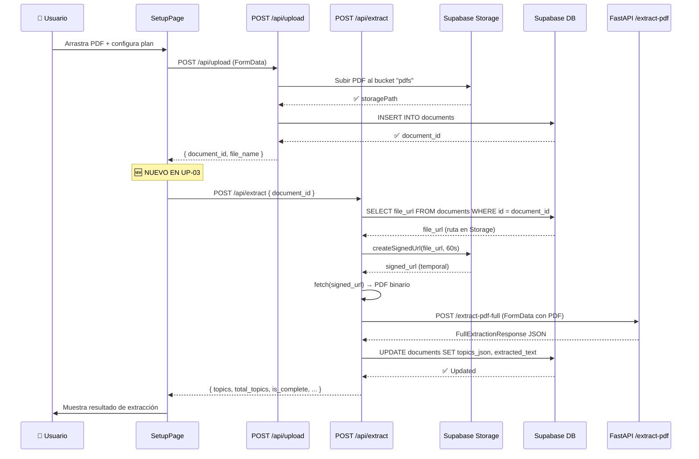
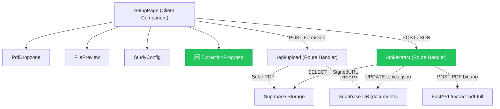

# UP-03 — Llamada Next.js → FastAPI `/extract-pdf-full`

> **Bloque:** 📤 Upload y Plan  
> **Guía anterior:** [UP-02 — API Route `/api/upload` → Supabase Storage](file:///c:/Users/jsife/OneDrive/Desktop/Repositorios/practica-testing/docs/guides/fe/UP-02.md)  
> **Guía siguiente:** UP-04 — Prompt de generación de plan + API Route `/api/plan/generate`  
> **Fecha:** Junio 2026

---

## Sección 1: 🎓 Introducción y Fundamentos Conceptuales

### ¿Dónde estamos en el flujo?

Recapitulemos lo que hemos construido hasta ahora:

1. **UP-01:** El usuario arrastra un PDF a la zona de drop y configura sus preferencias (días, horarios).
2. **UP-02:** Al hacer clic en "Generar mi plan", el PDF sube a Supabase Storage y se crea un registro en la tabla `documents` con `file_url` (la ruta en el bucket) y `file_name`.

Pero el registro en `documents` aún tiene **dos campos vacíos**: `extracted_text` y `topics_json`. El PDF está guardado como archivo binario — todavía no sabemos qué contiene ni cuántos tópicos ISTQB tiene.

### ¿Qué construiremos en UP-03?

En esta guía completaremos el **puente entre Next.js y FastAPI**. El flujo será:

```
📱 Frontend (Setup Page)
  │
  ▼ POST /api/upload (ya existe - UP-02)
  │
  ▼ 🆕 POST /api/extract (nuevo Route Handler)
  │   ├── 1. Descargar el PDF de Supabase Storage
  │   ├── 2. Enviar el PDF a FastAPI POST /extract-pdf-full
  │   ├── 3. Recibir JSON con tópicos estructurados
  │   ├── 4. Actualizar documents con extracted_text + topics_json
  │   └── 5. Retornar resultado al frontend
  │
  ▼ UI muestra progreso de extracción
```

### Analogía profesional: El servicio de traducción

Imagina que tienes un documento legal en un idioma que no entiendes. Lo que haces es:

1. **Guardas el original** en tu archivero (eso ya lo hicimos en UP-02 con Supabase Storage).
2. **Lo envías al traductor especializado** (FastAPI con pdfplumber).
3. **Recibes la traducción estructurada** (JSON con tópicos FL-x.x.x).
4. **Guardas la traducción junto al original** (actualizas `documents` con el JSON).

Next.js actúa como el **coordinador**: guarda el original, lo envía al especialista, recibe la traducción, y la archiva. Nunca intenta traducir él mismo — eso sería violar el principio de **responsabilidad única**.

### Conceptos clave: Comunicación Server-to-Server

#### ¿Por qué Next.js llama a FastAPI desde el servidor y no desde el browser?

```
❌ INCORRECTO: Browser → FastAPI directamente
   • El browser tendría que conocer la URL de FastAPI (exponer infraestructura interna)
   • No hay control de autenticación en FastAPI (cualquiera podría llamarlo)
   • El PDF tendría que descargarse al browser y reenviarse (doble transferencia)

✅ CORRECTO: Browser → Next.js Route Handler → FastAPI
   • FastAPI es un servicio INTERNO que solo el servidor conoce
   • Next.js verifica autenticación antes de llamar a FastAPI
   • El PDF se descarga directamente de Storage al servidor (server-to-server)
   • El browser solo recibe el resultado final procesado
```

#### ¿Qué es una Signed URL?

En UP-02 guardamos la ruta del PDF en Storage como una **ruta relativa** (ej: `abc123/1719518400000_syllabus.pdf`). Pero el bucket `pdfs` es **privado** — no puedes acceder al archivo con una URL pública.

Para descargar el PDF desde el servidor, necesitamos generar una **Signed URL** (URL firmada):

- Es una URL temporal con un **token de acceso** incluido como query parameter.
- Expira después de un tiempo configurable (usaremos 60 segundos — solo necesitamos descargar una vez).
- Supabase la genera criptográficamente usando la `service_role_key`.
- Una vez expirada, el enlace deja de funcionar.

```
Ruta en Storage:  abc123/1719518400000_syllabus.pdf
                         ↓
Signed URL:       https://xxx.supabase.co/storage/v1/object/sign/pdfs/abc123/...?token=eyJ...
                         ↓
                  Solo funciona por 60 segundos
```

#### Timeout y resiliencia

FastAPI puede tardar entre **3 y 15 segundos** en procesar un PDF de 135 páginas (el syllabus ISTQB). Necesitamos manejar:

1. **Timeout**: Si FastAPI no responde en 30 segundos, abortamos la petición.
2. **Error de red**: Si FastAPI está caído o no es alcanzable.
3. **Error de procesamiento**: Si el PDF es corrupto o no contiene tópicos válidos.
4. **Extracción incompleta**: Si se detectan menos tópicos de los esperados.

Usaremos `AbortController` para implementar timeout — una API nativa del browser y de Node.js.

### ⚠️ Concepto crítico: ¿Qué endpoint de FastAPI usar?

> [!CAUTION]
> **FastAPI expone DOS endpoints de extracción.** Usar el incorrecto provocará 502 silencioso sin error claro. Esta es la causa #1 de fallos en UP-03.

| Endpoint | Retorna | Cuándo usar |
|---|---|---|
| `POST /extract-pdf` | `{ filename, total_pages, extraction_method, full_text, pages, text_length }` | Cuando solo necesitas el texto crudo (no usado en UP-03) |
| `POST /extract-pdf-full` | `{ filename, total_pages, topics, total_topics, level_distribution, estimated_study_hours, is_complete, warnings }` | **ESTE es el que usa UP-03** porque necesitamos `topics` para llenar `topics_json` |

**Síntoma de usar el endpoint incorrecto:**
- HTTP 502 desde `/api/extract`
- En logs: el JSON de FastAPI contiene `text_length: NNN` (sin campo `topics`)
- El validador `extractionData.topics` falla con 502

**Cómo verificar rápido:**
```powershell
# Endpoint CORRECTO (debe retornar topics):
curl -X POST "$FASTAPI_URL/extract-pdf-full" -F "file=@syllabus.pdf"
# → JSON con campo "topics": { "FL-1.1.1": {...}, ... }

# Endpoint INCORRECTO (solo texto):
curl -X POST "$FASTAPI_URL/extract-pdf" -F "file=@syllabus.pdf"
# → JSON con campo "full_text" y "text_length" (SIN topics)
```

### Nota sobre `topics[*].text`

El campo `topics[*].text` **no se controla en UP-03**. Su ciclo real es:

| Capa | Responsabilidad |
|---|---|
| **BE-04** | Genera el texto por tópico internamente para detectar y deduplicar tópicos. |
| **BE-05** | Expone ese texto dentro de `FullExtractionResponse`. Este es el contrato API que decide si `text` viaja o no. |
| **UP-03** | Consume lo que retorna FastAPI y lo guarda en `documents.topics_json`. |

Por lo tanto, si más adelante se decide reducir payload, evitar guardar texto completo en DB o evitar que el syllabus aparezca en consola, el cambio correcto debe documentarse/aplicarse en **BE-05** o en el contrato `FullExtractionResponse`, no en una guía nueva que no está definida en el roadmap.

---

## Sección 2: 📋 Prerequisitos y Verificación del Entorno

Antes de empezar, verifica que tienes TODO lo siguiente:

### Herramientas y runtime

| Prerequisito | Comando de verificación | Versión esperada |
|---|---|---|
| Node.js | `node --version` | v18+ |
| npm | `npm --version` | v9+ |
| Next.js corriendo | `npm run dev` en `frontend/` | Sin errores en http://localhost:3000 |

### Entregables de guías anteriores

| Guía | Entregable requerido | Cómo verificar |
|---|---|---|
| **DB-01** | Variables de Supabase en `.env.local` | Abrir `frontend/.env.local` → verificar `NEXT_PUBLIC_SUPABASE_URL` y `SUPABASE_SERVICE_ROLE_KEY` |
| **DB-03** | Bucket `pdfs` creado y privado | Supabase Dashboard → Storage → verificar bucket `pdfs` |
| **FE-02** | `lib/supabase/server.ts` y `lib/supabase/admin.ts` | Verificar que ambos archivos existen |
| **UP-02** | `app/api/upload/route.ts` funcionando | Subir un PDF desde `/setup` → registro creado en tabla `documents` |
| **BE-06** | FastAPI deployado en DigitalOcean | `GET https://squid-app-y364m.ondigitalocean.app/health` → `{ "status": "ok" }` |

### Variable de entorno de FastAPI

Verifica que la URL de FastAPI está configurada en `frontend/.env.example`:

```powershell
# Verificar que la variable existe
Select-String "FASTAPI" frontend\.env.example
```

Salida esperada:
```
NEXT_PUBLIC_FASTAPI_URL=http://localhost:8000
```

> ⚠️ **IMPORTANTE**: Aunque en `.env.example` la URL apunta a localhost, en tu `.env.local` debes tener la URL de producción de DigitalOcean:
>
> ```
> NEXT_PUBLIC_FASTAPI_URL=https://squid-app-y364m.ondigitalocean.app
> ```
>
> Si vas a probar localmente con FastAPI corriendo en tu máquina, usa `http://localhost:8000`. Si quieres probar contra producción directamente, usa la URL de DigitalOcean.

> 🔎 **Nota sobre la variable `NEXT_PUBLIC_FASTAPI_URL`:** Esta variable usa el prefijo `NEXT_PUBLIC_` porque fue definida así en `.env.example`. Sin embargo, como la usaremos **exclusivamente en un Route Handler** (código del servidor), técnicamente no necesita el prefijo `NEXT_PUBLIC_`. Lo mantenemos por consistencia con la configuración existente. En una refactorización futura, podrías renombrarla a `FASTAPI_URL` para mayor seguridad semántica.

---

## Sección 3: 📂 Estructura de Directorios del Proyecto

```
practica-testing/
├── backend/                          # ← FastAPI (BE-01 a BE-06) ✅
│   ├── app/
│   │   ├── main.py
│   │   ├── routers/
│   │   │   └── pdf.py                # POST /extract-pdf
│   │   ├── services/
│   │   │   ├── extractor.py          # Pipeline de extracción completa
│   │   │   └── topic_detector.py     # Detector de tópicos FL-x.x.x
│   │   └── models/
│   │       └── schemas.py            # FullExtractionResponse (el JSON que consumimos)
│   ├── Dockerfile
│   └── requirements.txt
│
├── frontend/
│   ├── app/
│   │   ├── (auth)/                   # Login/Register (FE-03) ✅
│   │   ├── (dashboard)/
│   │   │   ├── layout.tsx            # Layout con header/nav (FE-04) ✅
│   │   │   ├── dashboard/
│   │   │   │   └── page.tsx          # Dashboard placeholder (FE-04) ✅
│   │   │   └── setup/
│   │   │       ├── page.tsx          # Página de setup (UP-01) ✅ → SE MODIFICA EN ESTA GUÍA
│   │   │       └── _components/
│   │   │           ├── pdf-dropzone.tsx   # (UP-01) ✅
│   │   │           ├── file-preview.tsx   # (UP-01) ✅
│   │   │           └── study-config.tsx   # (UP-01) ✅
│   │   ├── api/
│   │   │   ├── upload/
│   │   │   │   └── route.ts         # POST /api/upload (UP-02) ✅
│   │   │   └── extract/             # 🆕 NUEVO EN ESTA GUÍA
│   │   │       └── route.ts         # 🆕 POST /api/extract
│   │   ├── globals.css
│   │   ├── layout.tsx
│   │   └── page.tsx
│   ├── components/
│   │   ├── shared/
│   │   └── ui/                       # shadcn/ui (FE-01) ✅
│   ├── lib/
│   │   ├── supabase/
│   │   │   ├── client.ts            # (FE-02) ✅
│   │   │   ├── server.ts            # (FE-02) ✅
│   │   │   └── admin.ts             # (UP-02) ✅
│   │   ├── format.ts                # (UP-01) ✅
│   │   └── utils.ts                 # (FE-01) ✅
│   ├── types/
│   │   ├── database.ts              # Tipos DB (FE-02) ✅
│   │   └── index.ts                 # Re-exports (FE-02) ✅
│   ├── middleware.ts                 # Auth middleware (FE-03) ✅
│   ├── .env.local                   # Variables de entorno ✅
│   └── package.json
│
├── docs/
│   └── guides/
│       ├── db/                       # DB-01 a DB-05 ✅
│       ├── be/                       # BE-01 a BE-06 ✅
│       └── fe/
│           ├── FE-01.md ✅
│           ├── FE-02.md ✅
│           ├── FE-03.md ✅
│           ├── FE-04.md ✅
│           ├── UP-01.md ✅
│           ├── UP-02.md ✅
│           └── UP-03.md              # 🆕 ESTA GUÍA
│
└── supabase/                         # Migrations (DB-01 a DB-05) ✅
```

**Archivos nuevos en esta guía:**
- `frontend/app/api/extract/route.ts` — Route Handler para extracción de tópicos

**Archivos modificados en esta guía:**
- `frontend/app/(dashboard)/setup/page.tsx` — Integración del flujo completo upload → extract

---

## Sección 4: 🎨 Diagrama de Arquitectura de Componentes

### Flujo de datos: Upload → Extract → Almacenamiento



### Arquitectura de componentes



---

## Sección 5: 🛠️ Implementación Paso a Paso

---

### Paso A — Crear el Route Handler `POST /api/extract`

Este es el corazón de esta guía. Este Route Handler coordina 5 operaciones:

1. Verificar autenticación del usuario.
2. Obtener la ruta del PDF desde la tabla `documents`.
3. Descargar el PDF de Supabase Storage usando una signed URL.
4. Enviar el PDF a FastAPI para extracción.
5. Guardar el resultado en la tabla `documents`.

#### Archivo: `frontend/app/api/extract/route.ts`

```typescript
// ─────────────────────────────────────────────────────────────────
// app/api/extract/route.ts
// Route Handler: descarga el PDF de Supabase Storage, lo envía a
// FastAPI /extract-pdf-full, recibe los tópicos estructurados, y los
// guarda en la tabla documents.
//
// Método: POST
// Content-Type: application/json
// Body:
//   { document_id: string }
//
// Response (200):
//   {
//     topics: { "FL-1.1.1": { level_k, name, text, chapter, section }, ... },
//     total_topics: number,
//     level_distribution: { K1: number, K2: number, K3: number },
//     estimated_study_hours: number,
//     is_complete: boolean,
//     warnings: string[]
//   }
//
// Response (401): { error: "No autenticado" }
// Response (400): { error: "Descripción del problema" }
// Response (404): { error: "Documento no encontrado" }
// Response (502): { error: "Error al comunicar con el servicio de extracción" }
// Response (500): { error: "Error interno del servidor" }
// ─────────────────────────────────────────────────────────────────

import { NextResponse } from "next/server";
import { createClient } from "@/lib/supabase/server";
import { createAdminClient } from "@/lib/supabase/admin";

// ─────────────────────────────────────────────────────────────────
// CONFIGURACIÓN
// ─────────────────────────────────────────────────────────────────

// ─── URL del backend FastAPI ──────────────────────────────────
// Definida en .env.local como NEXT_PUBLIC_FASTAPI_URL.
// En desarrollo: http://localhost:8000
// En producción: https://squid-app-y364m.ondigitalocean.app
const FASTAPI_URL = process.env.NEXT_PUBLIC_FASTAPI_URL;

// ─── Timeout para la petición a FastAPI ───────────────────────
// El syllabus ISTQB (~135 páginas) tarda entre 3-15 segundos
// en procesarse. Damos 30 segundos como margen generoso.
const FASTAPI_TIMEOUT_MS = 30_000; // 30 segundos

// ─── Duración de la Signed URL ────────────────────────────────
// Solo necesitamos la URL para descargar el PDF una vez.
// 60 segundos es más que suficiente.
const SIGNED_URL_EXPIRY_SECONDS = 60;

// ─────────────────────────────────────────────────────────────────
// TIPOS
// ─────────────────────────────────────────────────────────────────

// ─── Tipo del JSON que FastAPI retorna ────────────────────────
// Este tipo refleja FullExtractionResponse del backend
// (backend/app/models/schemas.py). Lo definimos aquí para tener
// type-safety sin crear una dependencia directa entre proyectos.
interface TopicInfo {
  level_k: string;
  name: string;
  text: string;
  chapter: number;
  section: string;
}

interface KLevelDistribution {
  K1: number;
  K2: number;
  K3: number;
}

interface FastApiExtractionResponse {
  filename: string;
  total_pages: number;
  extraction_method: string;
  topics: Record<string, TopicInfo>;
  total_topics: number;
  level_distribution: KLevelDistribution;
  estimated_study_hours: number;
  warnings: string[];
  is_complete: boolean;
}

// ─────────────────────────────────────────────────────────────────
// ROUTE HANDLER
// ─────────────────────────────────────────────────────────────────

export async function POST(request: Request) {
  try {
    // ═══════════════════════════════════════════════════════════
    // FASE 1: VALIDACIÓN DE CONFIGURACIÓN
    // Verificar que la URL de FastAPI está configurada antes de
    // hacer cualquier otra cosa.
    // ═══════════════════════════════════════════════════════════

    if (!FASTAPI_URL) {
      console.error(
        "[Extract] NEXT_PUBLIC_FASTAPI_URL no está definida en .env.local"
      );
      return NextResponse.json(
        {
          error:
            "Error de configuración del servidor. Contacta al administrador.",
        },
        { status: 500 }
      );
    }

    // ═══════════════════════════════════════════════════════════
    // FASE 2: AUTENTICACIÓN
    // Verificamos que el usuario está logueado con getUser()
    // (verificación contra Supabase Auth, no solo JWT local).
    // ═══════════════════════════════════════════════════════════

    const supabase = await createClient();

    const {
      data: { user },
      error: authError,
    } = await supabase.auth.getUser();

    if (authError || !user) {
      return NextResponse.json(
        { error: "No autenticado. Por favor inicia sesión." },
        { status: 401 }
      );
    }

    // ═══════════════════════════════════════════════════════════
    // FASE 3: PARSING DEL BODY
    // Esperamos un JSON con { document_id: string }
    // ═══════════════════════════════════════════════════════════

    // ─── ¿Por qué JSON y no FormData? ─────────────────────────
    // A diferencia de /api/upload que recibe un archivo binario,
    // este endpoint solo recibe un ID. JSON es más apropiado
    // para datos estructurados sin archivos binarios.
    const body = await request.json();
    const { document_id } = body;

    if (!document_id || typeof document_id !== "string") {
      return NextResponse.json(
        { error: "document_id es requerido y debe ser un string." },
        { status: 400 }
      );
    }

    // ═══════════════════════════════════════════════════════════
    // FASE 4: OBTENER EL DOCUMENTO DE LA BASE DE DATOS
    // Verificamos que el documento existe Y pertenece al usuario
    // autenticado (ownership check).
    // ═══════════════════════════════════════════════════════════

    const adminClient = createAdminClient();

    // ─── ¿Por qué adminClient y no supabase (anon)? ────────────
    // Usamos adminClient porque necesitamos acceso a Storage con
    // service_role para generar Signed URLs de un bucket privado.
    // Pero ANTES verificamos ownership manualmente.
    const { data: document, error: docError } = await adminClient
      .from("documents")
      .select("id, user_id, file_url, file_name, topics_json")
      .eq("id", document_id)
      .single();

    if (docError || !document) {
      console.error("[Extract] Documento no encontrado:", docError);
      return NextResponse.json(
        { error: "Documento no encontrado." },
        { status: 404 }
      );
    }

    // ─── Ownership check ──────────────────────────────────────
    // Aunque las RLS policies de DB-04 protegen los datos,
    // nosotros estamos usando adminClient (que bypasea RLS).
    // Por eso DEBEMOS verificar manualmente que el usuario
    // autenticado es el dueño del documento.
    if (document.user_id !== user.id) {
      console.warn(
        `[Extract] ⚠️ Usuario ${user.id} intentó extraer documento de ${document.user_id}`
      );
      return NextResponse.json(
        { error: "No tienes permisos para acceder a este documento." },
        { status: 403 }
      );
    }

    // ─── ¿Ya se extrajeron los tópicos? ────────────────────────
    // Si topics_json ya tiene datos, no necesitamos re-extraer.
    // Retornamos los datos existentes directamente.
    // Esto evita llamadas innecesarias a FastAPI y acelera la UX.
    if (document.topics_json && Object.keys(document.topics_json).length > 0) {
      console.log(
        `[Extract] Documento ${document_id} ya tiene tópicos. Retornando datos existentes.`
      );
      return NextResponse.json({
        topics: document.topics_json,
        total_topics: Object.keys(document.topics_json).length,
        is_complete: true,
        already_extracted: true,
      });
    }

    // ═══════════════════════════════════════════════════════════
    // FASE 5: DESCARGAR EL PDF DE SUPABASE STORAGE
    // Generamos una Signed URL temporal y descargamos el archivo.
    // ═══════════════════════════════════════════════════════════

    // ─── Generar Signed URL ───────────────────────────────────
    // createSignedUrl genera una URL temporal con un token de
    // acceso incluido como query parameter. Solo funciona por
    // SIGNED_URL_EXPIRY_SECONDS (60 segundos).
    const { data: signedUrlData, error: signedUrlError } =
      await adminClient.storage
        .from("pdfs")
        .createSignedUrl(document.file_url, SIGNED_URL_EXPIRY_SECONDS);

    if (signedUrlError || !signedUrlData?.signedUrl) {
      console.error("[Extract] Error al generar Signed URL:", signedUrlError);
      return NextResponse.json(
        { error: "Error al acceder al archivo PDF en el almacenamiento." },
        { status: 500 }
      );
    }

    // ─── Descargar el PDF ─────────────────────────────────────
    // Usamos fetch() para descargar el PDF como un Buffer.
    // Esta es una petición server-to-server (Next.js → Supabase),
    // no pasa por el browser del usuario.
    const pdfResponse = await fetch(signedUrlData.signedUrl);

    if (!pdfResponse.ok) {
      console.error(
        `[Extract] Error al descargar PDF: ${pdfResponse.status} ${pdfResponse.statusText}`
      );
      return NextResponse.json(
        { error: "Error al descargar el archivo PDF del almacenamiento." },
        { status: 500 }
      );
    }

    // ─── Convertir a Buffer ───────────────────────────────────
    // arrayBuffer() retorna un ArrayBuffer con los bytes del PDF.
    // Lo convertimos a Buffer de Node.js para enviarlo como
    // multipart/form-data a FastAPI.
    const pdfArrayBuffer = await pdfResponse.arrayBuffer();
    const pdfBuffer = Buffer.from(pdfArrayBuffer);

    // ═══════════════════════════════════════════════════════════
    // FASE 6: ENVIAR EL PDF A FASTAPI
    // Creamos un FormData con el PDF y lo enviamos al endpoint
    // POST /extract-pdf-full de FastAPI.
    //
    // ⚠️ IMPORTANTE: Hay dos endpoints en FastAPI:
    //   • /extract-pdf       → BE-03 → solo retorna texto crudo (full_text, pages, text_length)
    //   • /extract-pdf-full  → BE-05 → retorna JSON con tópicos, level_distribution, etc.
    //
    // UP-03 NECESITA /extract-pdf-full porque espera topics_json.
    // Usar /extract-pdf provoca 502 con error "topics field missing".
    // ═══════════════════════════════════════════════════════════

    // ─── Construir FormData para FastAPI ────────────────────────
    // FastAPI espera multipart/form-data con un campo "file"
    // de tipo UploadFile (configurado en BE-03).
    //
    // ¿Por qué usamos Blob en lugar de File?
    // En Node.js server-side, la clase File no está disponible
    // en todas las versiones. Blob + nombre en FormData.append()
    // funciona universalmente.
    const fastApiFormData = new FormData();
    const pdfBlob = new Blob([pdfBuffer], { type: "application/pdf" });
    fastApiFormData.append("file", pdfBlob, document.file_name);

    // ─── AbortController para timeout ──────────────────────────
    // AbortController es la forma estándar de cancelar fetch()
    // después de un tiempo determinado. Si FastAPI no responde
    // en 30 segundos, abortamos la petición.
    //
    // ¿Por qué no usar un simple setTimeout?
    // setTimeout solo ejecuta código después del delay, pero no
    // cancela la petición HTTP en curso. AbortController sí
    // cancela la conexión TCP, liberando recursos del servidor.
    const controller = new AbortController();
    const timeoutId = setTimeout(() => controller.abort(), FASTAPI_TIMEOUT_MS);

    let fastApiResponse: Response;

    try {
      fastApiResponse = await fetch(`${FASTAPI_URL}/extract-pdf-full`, {
        method: "POST",
        body: fastApiFormData,
        signal: controller.signal,
        // ─── No setear Content-Type manualmente ───────────────
        // Al igual que en el browser, fetch() calcula el
        // Content-Type con el boundary correcto automáticamente
        // cuando el body es FormData.
      });
    } catch (fetchError) {
      // ─── Manejar timeout y errores de red ───────────────────
      // Si AbortController abortó la petición, el error tiene
      // la propiedad name === "AbortError".
      // Otros errores (red caída, DNS, etc.) también caen aquí.
      clearTimeout(timeoutId);

      if (fetchError instanceof Error && fetchError.name === "AbortError") {
        console.error(
          `[Extract] ⏰ Timeout: FastAPI no respondió en ${FASTAPI_TIMEOUT_MS / 1000}s`
        );
        return NextResponse.json(
          {
            error: `El servicio de extracción no respondió en ${FASTAPI_TIMEOUT_MS / 1000} segundos. El PDF podría ser demasiado grande. Por favor intenta de nuevo.`,
          },
          { status: 504 }
        );
      }

      console.error("[Extract] Error de red al contactar FastAPI:", fetchError);
      return NextResponse.json(
        {
          error:
            "No se pudo conectar con el servicio de extracción. Verifica que el backend está disponible.",
        },
        { status: 502 }
      );
    } finally {
      // ─── Siempre limpiar el timeout ──────────────────────────
      // Si la petición completó antes del timeout, cancelamos
      // el setTimeout para evitar un abort innecesario.
      clearTimeout(timeoutId);
    }

    // ═══════════════════════════════════════════════════════════
    // FASE 7: PROCESAR LA RESPUESTA DE FASTAPI
    // Verificar que la respuesta es válida y tiene el formato
    // esperado (FullExtractionResponse).
    // ═══════════════════════════════════════════════════════════

    if (!fastApiResponse.ok) {
      // ─── FastAPI retornó un error ───────────────────────────
      // Intentamos parsear el error para dar un mensaje útil.
      let errorDetail = "Error desconocido en el servicio de extracción.";

      try {
        const errorBody = await fastApiResponse.json();
        // FastAPI usa { detail: string } para errores (ErrorResponse)
        errorDetail = errorBody.detail || errorBody.error || errorDetail;
      } catch {
        // Si no se puede parsear el body, usamos el status text
        errorDetail = `FastAPI respondió con error ${fastApiResponse.status}: ${fastApiResponse.statusText}`;
      }

      console.error(
        `[Extract] FastAPI error ${fastApiResponse.status}:`,
        errorDetail
      );
      return NextResponse.json(
        { error: `Error en la extracción: ${errorDetail}` },
        { status: 502 }
      );
    }

    // ─── Parsear el JSON de respuesta ──────────────────────────
    const extractionData: FastApiExtractionResponse =
      await fastApiResponse.json();

    // ─── Validación básica del response ─────────────────────────
    // Verificamos que los campos críticos existen y tienen el
    // formato esperado. Esto nos protege contra cambios
    // inesperados en la API de FastAPI.
    if (!extractionData.topics || typeof extractionData.topics !== "object") {
      console.error(
        "[Extract] Respuesta de FastAPI sin campo 'topics' válido:",
        extractionData
      );
      return NextResponse.json(
        {
          error:
            "La respuesta del servicio de extracción no tiene el formato esperado.",
        },
        { status: 502 }
      );
    }

    if (extractionData.total_topics === 0) {
      console.warn("[Extract] ⚠️ FastAPI no detectó ningún tópico en el PDF");
      return NextResponse.json(
        {
          error:
            "No se detectaron tópicos ISTQB en el PDF. Verifica que es el syllabus correcto (CTFL v4.0 o v4.0.1).",
        },
        { status: 400 }
      );
    }

    // ═══════════════════════════════════════════════════════════
    // FASE 8: GUARDAR RESULTADOS EN SUPABASE
    // Actualizamos el registro en documents con los tópicos
    // extraídos. Esto completa los campos que UP-02 dejó vacíos.
    // ═══════════════════════════════════════════════════════════

    // ─── Construir topics_json para la DB ──────────────────────
    // El formato de topics_json en la DB (definido en FE-02,
    // types/database.ts) es:
    //   Record<string, { text: string, level_k: LevelK, name?: string }>
    //
    // FastAPI retorna un formato ligeramente más rico (con chapter
    // y section). Guardamos TODO el JSON de FastAPI para no perder
    // información. Los campos extra simplemente se ignoran al
    // tipar como TopicsJson, pero se preservan en el JSONB.
    const topicsJsonForDb = extractionData.topics;

    // ─── Construir extracted_text (resumen del texto) ──────────
    // No guardamos el full_text completo (~200KB) en la DB porque:
    // 1. Ya tenemos el texto por tópico en topics_json.
    // 2. El texto completo está disponible re-extrayendo el PDF.
    // 3. Guardamos un resumen con metadatos útiles.
    const extractedTextSummary = JSON.stringify({
      filename: extractionData.filename,
      total_pages: extractionData.total_pages,
      extraction_method: extractionData.extraction_method,
      total_topics: extractionData.total_topics,
      level_distribution: extractionData.level_distribution,
      estimated_study_hours: extractionData.estimated_study_hours,
      is_complete: extractionData.is_complete,
      warnings: extractionData.warnings,
      extracted_at: new Date().toISOString(),
    });

    const { error: updateError } = await adminClient
      .from("documents")
      .update({
        topics_json: topicsJsonForDb,
        extracted_text: extractedTextSummary,
      })
      .eq("id", document_id)
      .eq("user_id", user.id); // Doble verificación de ownership

    if (updateError) {
      console.error(
        "[Extract] Error al actualizar documents:",
        updateError
      );
      // ─── No retornamos 500 aquí ──────────────────────────────
      // La extracción fue exitosa, solo falló el guardado.
      // Retornamos los datos al frontend (que puede reintentar
      // el guardado) con un warning.
      return NextResponse.json(
        {
          topics: extractionData.topics,
          total_topics: extractionData.total_topics,
          level_distribution: extractionData.level_distribution,
          estimated_study_hours: extractionData.estimated_study_hours,
          is_complete: extractionData.is_complete,
          warnings: [
            ...extractionData.warnings,
            "⚠️ La extracción fue exitosa pero no se pudieron guardar los resultados en la base de datos. Intenta de nuevo.",
          ],
          save_error: true,
        },
        { status: 200 }
      );
    }

    // ═══════════════════════════════════════════════════════════
    // FASE 9: RESPUESTA EXITOSA
    // Retornamos los datos de extracción al frontend.
    // ═══════════════════════════════════════════════════════════

    console.log(
      `[Extract] ✅ Extracción completada para documento ${document_id}: ` +
        `${extractionData.total_topics} tópicos detectados ` +
        `(K1:${extractionData.level_distribution.K1}, ` +
        `K2:${extractionData.level_distribution.K2}, ` +
        `K3:${extractionData.level_distribution.K3})`
    );

    return NextResponse.json({
      topics: extractionData.topics,
      total_topics: extractionData.total_topics,
      level_distribution: extractionData.level_distribution,
      estimated_study_hours: extractionData.estimated_study_hours,
      is_complete: extractionData.is_complete,
      warnings: extractionData.warnings,
    });
  } catch (error) {
    // ─── Error no controlado ──────────────────────────────────
    console.error("[Extract] Error no controlado:", error);

    return NextResponse.json(
      { error: "Error interno del servidor. Por favor intenta de nuevo." },
      { status: 500 }
    );
  }
}
```

#### 📦 Entregable del Paso A

- Archivo creado: `frontend/app/api/extract/route.ts`

---

### Paso B — Modificar la página de Setup para integrar el flujo completo

Actualmente, `setup/page.tsx` sube el PDF a Storage (UP-02) y luego redirige al dashboard. Ahora vamos a extender el flujo para que **después del upload**, automáticamente llame a `/api/extract` y muestre el progreso.

El nuevo flujo del `handleSubmit` será:

```
1. Upload:  POST /api/upload → { document_id }  (ya existe)
2. Extract: POST /api/extract → { topics, ... }  (🆕 nuevo)
3. Navegar: router.push("/dashboard")             (temporal, UP-04 lo cambiará)
```

#### Archivo: `frontend/app/(dashboard)/setup/page.tsx`

Reemplaza **todo** el contenido de `page.tsx` con lo siguiente:

```typescript
// ============================================================
// app/(dashboard)/setup/page.tsx — Página de Setup del Plan
// ============================================================
// RUTA: /setup
//
// TIPO: Client Component — orquesta el estado de los componentes
//       hijos (PdfDropzone, FilePreview, StudyConfig).
//
// RESPONSABILIDADES:
//   1. Mantener el estado del archivo seleccionado (File | null)
//   2. Mantener la configuración del plan (días, horarios)
//   3. Coordinar el estado de loading durante el procesamiento
//   4. Enviar los datos a la API Route /api/upload (UP-02)
//   5. 🆕 Llamar a /api/extract para obtener tópicos (UP-03)
//   6. Mostrar progreso de extracción al usuario
//
// LAYOUT PADRE:
//   Esta página se renderiza DENTRO de app/(dashboard)/layout.tsx.
//   El header y la navegación ya están presentes. Este componente
//   solo define el contenido del área principal.
//
// PROTECCIÓN:
//   El middleware (FE-03) ya protege /setup. Si un usuario no
//   autenticado intenta acceder, será redirigido a /login.
// ============================================================

"use client";

import { useRouter } from "next/navigation";
import { useState } from "react";
import { PdfDropzone } from "./_components/pdf-dropzone";
import { FilePreview } from "./_components/file-preview";
import {
  StudyConfig,
  DEFAULT_CONFIG,
  type StudyConfigData,
} from "./_components/study-config";
import { Separator } from "@/components/ui/separator";

// ─── Etapas del proceso ─────────────────────────────────────────
// Definimos las etapas como un tipo para tener type-safety en el
// estado de progreso. Cada etapa tiene un mensaje descriptivo.
type ProcessStage =
  | "idle"        // Sin actividad
  | "uploading"   // Subiendo PDF a Storage
  | "extracting"  // Enviando a FastAPI para extracción
  | "saving"      // Guardando resultados en DB (ya lo hace el backend)
  | "complete"    // Proceso completado exitosamente
  | "error";      // Error en alguna etapa

// ─── Mensajes de progreso para cada etapa ────────────────────────
const STAGE_MESSAGES: Record<ProcessStage, string> = {
  idle: "",
  uploading: "Subiendo PDF al almacenamiento seguro...",
  extracting: "Analizando el syllabus con IA... Esto puede tomar 10-15 segundos.",
  saving: "Guardando resultados...",
  complete: "¡Extracción completada! Redirigiendo...",
  error: "Ocurrió un error. Revisa el mensaje abajo.",
};

export default function SetupPage() {
  // ═══════════════════════════════════════════════════════════
  // ESTADO GLOBAL DE LA PÁGINA
  // ═══════════════════════════════════════════════════════════

  // ─── Archivo PDF seleccionado ───
  const [selectedFile, setSelectedFile] = useState<File | null>(null);

  // ─── Configuración del plan ───
  const [config, setConfig] = useState<StudyConfigData>(DEFAULT_CONFIG);

  // ─── Estado de carga ───
  const [isLoading, setIsLoading] = useState(false);

  // ─── 🆕 Etapa actual del proceso ───
  // Permite mostrar mensajes de progreso diferentes según
  // la etapa (uploading → extracting → complete).
  const [stage, setStage] = useState<ProcessStage>("idle");

  // ─── Mensaje de error global ───
  const [submitError, setSubmitError] = useState<string | null>(null);

  // ─── 🆕 Resultado de la extracción ───
  // Guardamos los datos para mostrar un resumen antes de navegar.
  const [extractionResult, setExtractionResult] = useState<{
    total_topics: number;
    is_complete: boolean;
    warnings: string[];
  } | null>(null);

  // ═══════════════════════════════════════════════════════════
  // HANDLERS
  // ═══════════════════════════════════════════════════════════

  const router = useRouter();

  const handleFileSelect = (file: File) => {
    setSelectedFile(file);
    setSubmitError(null);
    setExtractionResult(null); // Limpiar resultado anterior
    setStage("idle");
  };

  const handleFileRemove = () => {
    setSelectedFile(null);
    setExtractionResult(null);
    setStage("idle");
  };

  const handleConfigChange = (newConfig: StudyConfigData) => {
    setConfig(newConfig);
  };

  // ─── 🆕 Handler principal: Upload + Extract ────────────────
  const handleSubmit = async () => {
    if (!selectedFile) return;

    setIsLoading(true);
    setSubmitError(null);
    setExtractionResult(null);

    try {
      // ─── ETAPA 1: Upload ────────────────────────────────────
      // Enviar el PDF a /api/upload (código de UP-02, sin cambios).
      setStage("uploading");

      const formData = new FormData();
      formData.append("file", selectedFile);
      formData.append("objective_days", config.objectiveDays.toString());
      formData.append("morning_time", config.morningTime);
      formData.append("night_time", config.nightTime);

      const uploadResponse = await fetch("/api/upload", {
        method: "POST",
        body: formData,
      });

      const uploadData = await uploadResponse.json();

      if (!uploadResponse.ok) {
        throw new Error(uploadData.error || "Error al subir el archivo.");
      }

      console.log(
        `[Setup] ✅ Upload completado: ${uploadData.document_id} (${uploadData.file_name})`
      );

      // ─── ETAPA 2: Extracción ────────────────────────────────
      // 🆕 Enviar el document_id a /api/extract para que
      // Next.js descargue el PDF y lo envíe a FastAPI.
      setStage("extracting");

      const extractResponse = await fetch("/api/extract", {
        method: "POST",
        headers: {
          "Content-Type": "application/json",
        },
        body: JSON.stringify({
          document_id: uploadData.document_id,
        }),
      });

      const extractData = await extractResponse.json();

      if (!extractResponse.ok) {
        throw new Error(
          extractData.error || "Error al extraer los tópicos del PDF."
        );
      }

      console.log(
        `[Setup] ✅ Extracción completada: ${extractData.total_topics} tópicos`
      );

      // ─── Verificar completitud ──────────────────────────────
      // Si la extracción detectó menos tópicos de los esperados,
      // mostramos un warning pero NO bloqueamos al usuario.
      // La decisión de continuar o no queda en sus manos.
      setExtractionResult({
        total_topics: extractData.total_topics,
        is_complete: extractData.is_complete,
        warnings: extractData.warnings || [],
      });

      // ─── ETAPA 3: Completado ────────────────────────────────
      setStage("complete");

      // ─── Navegar al dashboard después de 2 segundos ─────────
      // Damos tiempo al usuario para ver el resultado antes de
      // redirigir. En UP-04, esto cambiará para navegar a la
      // página de generación de plan.
      setTimeout(() => {
        router.push("/dashboard");
      }, 2000);
    } catch (error) {
      setStage("error");
      setSubmitError(
        error instanceof Error
          ? error.message
          : "Ocurrió un error inesperado. Por favor intenta de nuevo."
      );
    } finally {
      // ─── Restaurar loading solo si hubo error ────────────────
      // Si fue exitoso, dejamos isLoading=true hasta que la
      // navegación se complete (evita que el usuario haga doble click).
      if (stage === "error") {
        setIsLoading(false);
      }
    }
  };

  // ═══════════════════════════════════════════════════════════
  // RENDER
  // ═══════════════════════════════════════════════════════════

  return (
    <div className="flex flex-col gap-8 max-w-2xl">
      {/* ─── Encabezado de la página ─── */}
      <div className="flex flex-col gap-2">
        <h1 className="text-3xl font-bold tracking-tight text-white">
          Configurar Plan de Estudio
        </h1>
        <p className="text-slate-400">
          Sube el PDF del syllabus ISTQB y configura tus preferencias de
          estudio. El agente creará un plan personalizado para ti.
        </p>
      </div>

      {/* ─── Sección 1: Subir PDF ─── */}
      <div className="flex flex-col gap-4">
        <div className="flex flex-col gap-1">
          <h2 className="text-lg font-semibold text-slate-200">
            📄 Syllabus PDF
          </h2>
          <p className="text-sm text-slate-500">
            Sube el documento oficial del ISTQB Foundation Level v4.0
          </p>
        </div>

        <PdfDropzone
          onFileSelect={handleFileSelect}
          hasFile={selectedFile !== null}
          disabled={isLoading}
        />

        {selectedFile && (
          <FilePreview
            file={selectedFile}
            onRemove={handleFileRemove}
            disabled={isLoading}
          />
        )}
      </div>

      {/* ─── Separador visual ─── */}
      <Separator className="bg-slate-800" />

      {/* ─── Sección 2: Configuración del Plan ─── */}
      <StudyConfig
        config={config}
        onConfigChange={handleConfigChange}
        disabled={isLoading}
      />

      {/* ─── 🆕 Progreso de extracción ─── */}
      {stage !== "idle" && stage !== "error" && (
        <div className="flex flex-col gap-3 rounded-lg bg-slate-800/50 border border-slate-700/50 p-5">
          {/* Indicador de progreso con animación */}
          <div className="flex items-center gap-3">
            {stage !== "complete" ? (
              // ─── Spinner animado ───
              <svg
                className="animate-spin h-5 w-5 text-emerald-400"
                xmlns="http://www.w3.org/2000/svg"
                fill="none"
                viewBox="0 0 24 24"
              >
                <circle
                  className="opacity-25"
                  cx="12"
                  cy="12"
                  r="10"
                  stroke="currentColor"
                  strokeWidth="4"
                />
                <path
                  className="opacity-75"
                  fill="currentColor"
                  d="M4 12a8 8 0 018-8V0C5.373 0 0 5.373 0 12h4zm2 5.291A7.962 7.962 0 014 12H0c0 3.042 1.135 5.824 3 7.938l3-2.647z"
                />
              </svg>
            ) : (
              // ─── Checkmark ───
              <svg
                className="h-5 w-5 text-emerald-400"
                xmlns="http://www.w3.org/2000/svg"
                fill="none"
                viewBox="0 0 24 24"
                stroke="currentColor"
                strokeWidth="2"
              >
                <path
                  strokeLinecap="round"
                  strokeLinejoin="round"
                  d="M5 13l4 4L19 7"
                />
              </svg>
            )}
            <p className="text-sm text-slate-300 font-medium">
              {STAGE_MESSAGES[stage]}
            </p>
          </div>

          {/* Barra de progreso visual */}
          <div className="w-full bg-slate-700 rounded-full h-1.5">
            <div
              className="bg-emerald-500 h-1.5 rounded-full transition-all duration-500 ease-out"
              style={{
                width:
                  stage === "uploading"
                    ? "33%"
                    : stage === "extracting"
                      ? "66%"
                      : stage === "saving"
                        ? "85%"
                        : stage === "complete"
                          ? "100%"
                          : "0%",
              }}
            />
          </div>

          {/* 🆕 Resultado de extracción */}
          {extractionResult && (
            <div className="flex flex-col gap-2 mt-2">
              <div className="flex items-center gap-2">
                <span className="text-emerald-400 font-semibold text-sm">
                  📊 {extractionResult.total_topics} tópicos detectados
                </span>
                {extractionResult.is_complete ? (
                  <span className="text-xs text-emerald-500 bg-emerald-500/10 px-2 py-0.5 rounded-full">
                    ✅ Extracción completa
                  </span>
                ) : (
                  <span className="text-xs text-amber-400 bg-amber-500/10 px-2 py-0.5 rounded-full">
                    ⚠️ Extracción parcial
                  </span>
                )}
              </div>

              {/* Warnings si los hay */}
              {extractionResult.warnings.length > 0 && (
                <div className="text-xs text-amber-400/80 bg-amber-500/5 rounded p-2 border border-amber-500/10">
                  <p className="font-medium mb-1">Advertencias:</p>
                  <ul className="list-disc list-inside space-y-0.5">
                    {extractionResult.warnings.map((w, i) => (
                      <li key={i}>{w}</li>
                    ))}
                  </ul>
                </div>
              )}
            </div>
          )}
        </div>
      )}

      {/* ─── Error global del submit ─── */}
      {submitError && (
        <div className="flex items-center gap-2 rounded-lg bg-red-500/10 border border-red-500/20 p-4">
          <svg
            xmlns="http://www.w3.org/2000/svg"
            width="18"
            height="18"
            viewBox="0 0 24 24"
            fill="none"
            stroke="currentColor"
            strokeWidth="2"
            strokeLinecap="round"
            strokeLinejoin="round"
            className="text-red-400 shrink-0"
          >
            <circle cx="12" cy="12" r="10" />
            <line x1="12" y1="8" x2="12" y2="12" />
            <line x1="12" y1="16" x2="12.01" y2="16" />
          </svg>
          <p className="text-sm text-red-400">{submitError}</p>
        </div>
      )}

      {/* ─── Botón de envío ─── */}
      <button
        onClick={handleSubmit}
        disabled={!selectedFile || isLoading}
        className="
          relative
          flex items-center justify-center
          h-12
          rounded-lg
          bg-emerald-600
          px-8
          text-base font-semibold text-white
          transition-all duration-200
          hover:bg-emerald-500
          active:scale-[0.98]
          disabled:bg-slate-700 disabled:text-slate-500 disabled:cursor-not-allowed
          disabled:active:scale-100
        "
      >
        {isLoading ? (
          <>
            <svg
              className="animate-spin -ml-1 mr-3 h-5 w-5 text-white"
              xmlns="http://www.w3.org/2000/svg"
              fill="none"
              viewBox="0 0 24 24"
            >
              <circle
                className="opacity-25"
                cx="12"
                cy="12"
                r="10"
                stroke="currentColor"
                strokeWidth="4"
              />
              <path
                className="opacity-75"
                fill="currentColor"
                d="M4 12a8 8 0 018-8V0C5.373 0 0 5.373 0 12h4zm2 5.291A7.962 7.962 0 014 12H0c0 3.042 1.135 5.824 3 7.938l3-2.647z"
              />
            </svg>
            Procesando...
          </>
        ) : (
          <>🚀 Generar mi plan de estudio</>
        )}
      </button>

      {/* ─── Nota informativa ─── */}
      {!selectedFile && (
        <p className="text-center text-xs text-slate-600">
          Selecciona un PDF del syllabus ISTQB para habilitar el botón
        </p>
      )}
    </div>
  );
}
```

#### 📦 Entregables del Paso B

- Archivo modificado: `frontend/app/(dashboard)/setup/page.tsx`
  - Nuevos estados: `stage`, `extractionResult`
  - Nuevo tipo: `ProcessStage`
  - `handleSubmit` ahora ejecuta upload + extract en secuencia
  - UI de progreso con barra animada y resultado de extracción

---

### Paso C — Verificar la variable de entorno `NEXT_PUBLIC_FASTAPI_URL`

Antes de probar, asegúrate de que la variable de entorno está configurada.

#### 1. Verificar `.env.local`

Abre `frontend/.env.local` y confirma que tiene esta línea:

```
NEXT_PUBLIC_FASTAPI_URL=https://squid-app-y364m.ondigitalocean.app
```

> Si vas a probar con FastAPI corriendo localmente, usa:
> ```
> NEXT_PUBLIC_FASTAPI_URL=http://localhost:8000
> ```

#### 2. Verificar que FastAPI responde

```powershell
# Verificar con la URL de producción
Invoke-RestMethod -Uri "https://squid-app-y364m.ondigitalocean.app/health" -Method Get
```

Salida esperada:
```
status  version
------  -------
ok      0.1.0
```

Si usas localhost:
```powershell
# Verificar con FastAPI local
Invoke-RestMethod -Uri "http://localhost:8000/health" -Method Get
```

#### 3. Reiniciar el servidor de desarrollo

Después de modificar `.env.local`, **DEBES** reiniciar el servidor de desarrollo para que Next.js lea las nuevas variables:

```powershell
# Detener el servidor actual (Ctrl+C) y reiniciar
cd c:\Users\jsife\OneDrive\Desktop\Repositorios\practica-testing\frontend
npm run dev
```

Salida esperada:
```
  ▲ Next.js 16.x.x
  - Local:        http://localhost:3000
  - Environments: .env.local

 ✓ Starting...
 ✓ Ready in Xs
```

#### 📦 Entregables del Paso C

- `frontend/.env.local` tiene `NEXT_PUBLIC_FASTAPI_URL` configurada
- FastAPI responde al health check
- Servidor de Next.js reiniciado

---

## Sección 6: ✅ Checkpoints de Verificación

### Test 1: Probar la API Route directamente (sin UI)

Puedes probar `/api/extract` directamente con PowerShell si ya tienes un `document_id` de un upload previo.

**Primero**, obtén un document_id de la tabla `documents` en Supabase Dashboard (o del log de un upload anterior).

```powershell
# Nota: Este comando no funcionará directamente porque necesita
# cookies de autenticación. Usa el navegador para probar la UI.
# Este es solo un ejemplo conceptual.
```

### Test 2: Probar el flujo completo desde la UI

1. Abre http://localhost:3000/setup en el navegador (debes estar logueado).
2. Arrastra el PDF del syllabus ISTQB a la zona de drop.
3. Configura los días y horarios (puedes dejar los valores por defecto).
4. Haz clic en **"🚀 Generar mi plan de estudio"**.

#### Lo que deberías ver:

1. **Fase de upload (2-3 segundos):**
   - La barra de progreso avanza al 33%
   - Mensaje: "Subiendo PDF al almacenamiento seguro..."

2. **Fase de extracción (5-15 segundos):**
   - La barra de progreso avanza al 66%
   - Mensaje: "Analizando el syllabus con IA... Esto puede tomar 10-15 segundos."

3. **Fase de completado:**
   - La barra de progreso llega al 100%
   - Checkmark verde ✅
   - Mensaje: "¡Extracción completada! Redirigiendo..."
   - Badge: "📊 X tópicos detectados"
   - Badge: "✅ Extracción completa" (si detectó >= 90% de los tópicos)

4. **Redirección al dashboard (después de 2 segundos)**

### Test 3: Verificar en Supabase Dashboard

1. Abre Supabase Dashboard → Table Editor → `documents`.
2. Busca el registro más reciente.
3. Verifica:
   - `topics_json` tiene datos (no es `null`).
   - `extracted_text` tiene un JSON con metadatos de la extracción.
   - `file_url` apunta a la ruta correcta en Storage.

### Evidencia de verificación local

Verificación realizada contra el backend desplegado en DigitalOcean y el PDF `ISTQB_CTFL_Syllabus-v4.0_ES_.pdf`:

| Prueba | Resultado |
|---|---|
| `GET /health` en FastAPI | `{"status":"ok","version":"0.1.0"}` |
| `POST /extract-pdf-full` directo | HTTP 200, 79 páginas, 63 tópicos, distribución K1=14/K2=41/K3=8, `is_complete=true` |
| Warning esperado | `FL-3.2.4` no detectado dentro del set esperado |
| Flujo UI `/setup` | Upload + extracción completan; se muestran 63 tópicos y badge de extracción completa |
| Redirección | La UI redirige correctamente al dashboard placeholder |
| TypeScript | `npx tsc --noEmit` sin errores |

### Test 4: Verificar manejo de errores

#### Error: FastAPI no disponible
1. Cambia `NEXT_PUBLIC_FASTAPI_URL` a una URL inexistente (ej: `http://localhost:9999`).
2. Reinicia el servidor de Next.js.
3. Intenta subir un PDF.
4. Deberías ver el error: "No se pudo conectar con el servicio de extracción."
5. **Restaura** la URL correcta cuando termines de probar.

#### Error: Archivo no es PDF válido
1. Renombra un archivo `.txt` a `.pdf`.
2. Intenta subirlo.
3. FastAPI debería retornar un error que se muestra al usuario.

### Checklist final de entregables

| # | Entregable | Estado |
|---|---|---|
| 1 | `frontend/app/api/extract/route.ts` creado | ✅ |
| 2 | `frontend/app/(dashboard)/setup/page.tsx` modificado con flujo upload + extract | ✅ |
| 3 | `.env.local` tiene `NEXT_PUBLIC_FASTAPI_URL` configurada | ✅ |
| 4 | Subir PDF del ISTQB → `topics_json` guardado en tabla `documents` | ✅ |
| 5 | El JSON tiene tópicos con nivel K (K1/K2/K3) | ✅ |
| 6 | Si FastAPI falla → error descriptivo en la UI | ✅ |
| 7 | Barra de progreso funciona con las etapas correctas | ✅ |
| 8 | Resultado de extracción muestra número de tópicos | ✅ |

---

## Sección 7: 🚨 Troubleshooting — Problemas Comunes

| Problema | Causa Probable | Solución |
|---|---|---|
| `Error: NEXT_PUBLIC_FASTAPI_URL no está definida` | Variable no configurada en `.env.local` | Agregar `NEXT_PUBLIC_FASTAPI_URL=https://...` a `frontend/.env.local` y reiniciar el servidor |
| `Error 502: No se pudo conectar con el servicio de extracción` | FastAPI está caído o la URL es incorrecta | Verificar con `Invoke-RestMethod -Uri "$FASTAPI_URL/health"`. Si es localhost, verificar que `uvicorn` está corriendo |
| `Error 502` con log `text_length: NNN` en la respuesta de FastAPI | **Estás usando `/extract-pdf` (BE-03) en lugar de `/extract-pdf-full` (BE-05)**. El primero retorna solo texto crudo, no `topics`. | Cambiar el `fetch()` en `frontend/app/api/extract/route.ts` línea ~592:<br>`fetch(\`${FASTAPI_URL}/extract-pdf-full\`, { ... })` ← **CON `-full` al final**<br>Verificar también el `.env.local`: `NEXT_PUBLIC_FASTAPI_URL` debe apuntar al backend correcto |
| `Error 504: El servicio de extracción no respondió en 30 segundos` | PDF muy grande o FastAPI sobrecargado | Aumentar `FASTAPI_TIMEOUT_MS` a 60000 (60s). Si el problema persiste, revisar logs de FastAPI en DigitalOcean |
| `Error 403: No tienes permisos para acceder a este documento` | El ownership check falló — el document_id pertenece a otro usuario | Verificar que estás usando el document_id correcto. Revisar la tabla `documents` en Supabase |
| `Error 400: No se detectaron tópicos ISTQB en el PDF` | El PDF no es el syllabus ISTQB o está corrupto | Verificar que es el syllabus CTFL v4.0 o v4.0.1 oficial. Probar con un PDF diferente |
| La barra de progreso no avanza | El componente no se re-renderiza al cambiar `stage` | Verificar que `setStage()` se llama correctamente dentro del `handleSubmit` |
| `TypeError: Cannot read properties of null (reading 'signedUrl')` | Error al generar la Signed URL de Storage | Verificar que `SUPABASE_SERVICE_ROLE_KEY` es correcta y el bucket `pdfs` existe |
| `Error: fetch failed` con `[cause]: AggregateError { code: 'ECONNREFUSED' }` | `NEXT_PUBLIC_FASTAPI_URL` apunta a `http://localhost:8000` pero **no hay FastAPI corriendo localmente** | Tienes dos opciones:<br>**A) Usar la API desplegada en DigitalOcean** (recomendado para dev rápido):<br>`NEXT_PUBLIC_FASTAPI_URL=https://squid-app-y364m.ondigitalocean.app`<br>**B) Levantar FastAPI localmente:**<br>`cd backend && uvicorn app.main:app --reload --host 0.0.0.0 --port 8000`<br>Después reinicia `npm run dev`. |
| El `topics_json` en la DB tiene formato diferente al esperado | La versión de FastAPI cambió el formato de respuesta | Comparar `FullExtractionResponse` en `backend/app/models/schemas.py` con el tipo `FastApiExtractionResponse` en `route.ts` |
| `already_extracted: true` en la respuesta | El documento ya fue procesado anteriormente | Esto es el comportamiento esperado — el Route Handler detecta que ya existe `topics_json` y retorna los datos existentes sin re-procesar |

---

## Sección 8: 📝 Resumen y Próximo Paso

### Lo que hiciste en esta guía

1. **Creaste** `app/api/extract/route.ts` — un Route Handler que:
   - Verifica autenticación y ownership del documento.
   - Descarga el PDF de Supabase Storage usando Signed URLs.
   - Envía el PDF a FastAPI `/extract-pdf-full` con timeout de 30s.
   - Guarda `topics_json` y `extracted_text` en la tabla `documents`.
   - Maneja errores de red, timeout, y extracción incompleta.

2. **Modificaste** `setup/page.tsx` para:
   - Ejecutar upload + extracción en secuencia.
   - Mostrar una barra de progreso con etapas (uploading → extracting → complete).
   - Mostrar el resultado de extracción (tópicos detectados, completitud).
   - Manejar errores con mensajes descriptivos.

3. **Verificaste** que la variable `NEXT_PUBLIC_FASTAPI_URL` apunta al backend correcto.

### Conceptos que aprendiste

- **Server-to-Server communication**: Next.js como intermediario entre el browser y FastAPI.
- **Signed URLs**: acceso temporal a archivos privados en Supabase Storage.
- **AbortController**: cancelación de peticiones HTTP con timeout.
- **Progressive UI**: barra de progreso con etapas para operaciones largas.
- **Ownership verification**: verificar que el usuario es dueño del recurso cuando se usa adminClient.

### Validar tu progreso

Usa el validador de pasos para confirmar que todo está correcto:

> **Comando:** `/istqb-step-validator` con guía `UP-03`

### Próxima guía: UP-04 — Prompt de generación de plan + API Route `/api/plan/generate`

En la siguiente guía:

- Configurarás el **cliente de OpenAI** (`lib/openai.ts`).
- Diseñarás el **prompt de generación de plan**: dado los tópicos extraídos + la configuración del usuario (días, horarios), OpenAI generará un plan de 14 sesiones.
- Crearás la API Route **`/api/plan/generate`** que recibe el `document_id`, lee los tópicos de la DB, y usa OpenAI para generar el plan.
- El plan incluirá: 7 días, 2 sesiones diarias (morning + night), 90 min por sesión, tópicos ordenados por nivel K (K1 primero, K3 al final).
