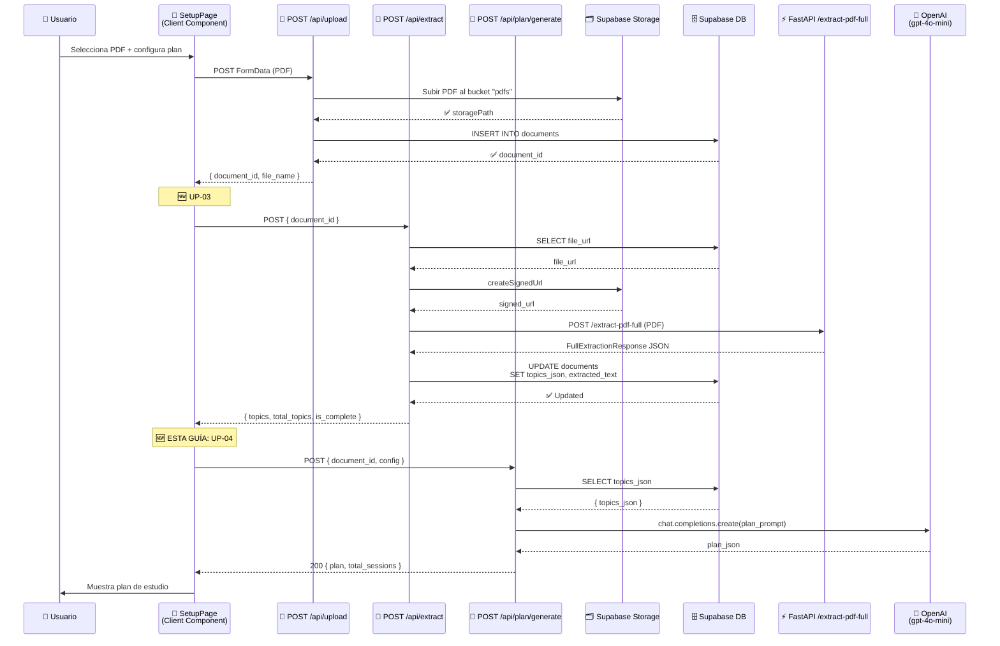
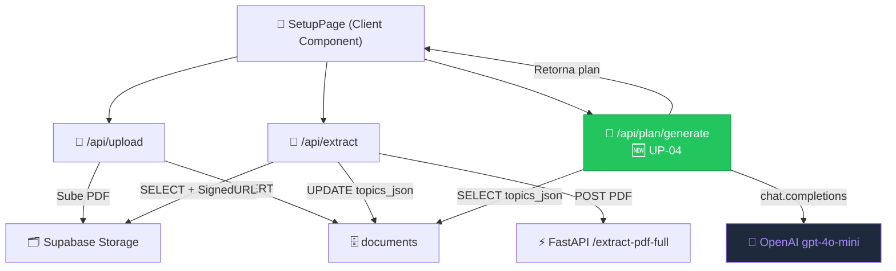
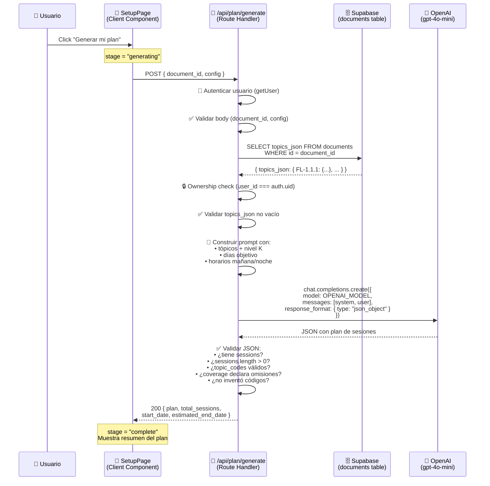
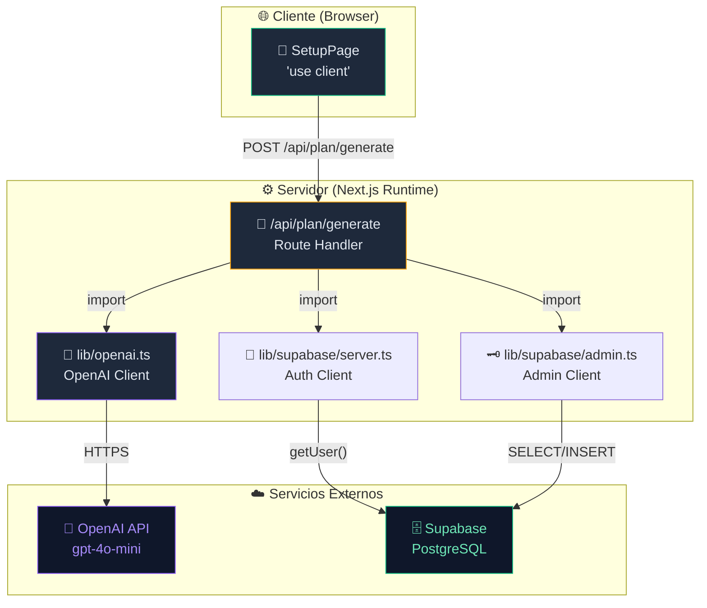
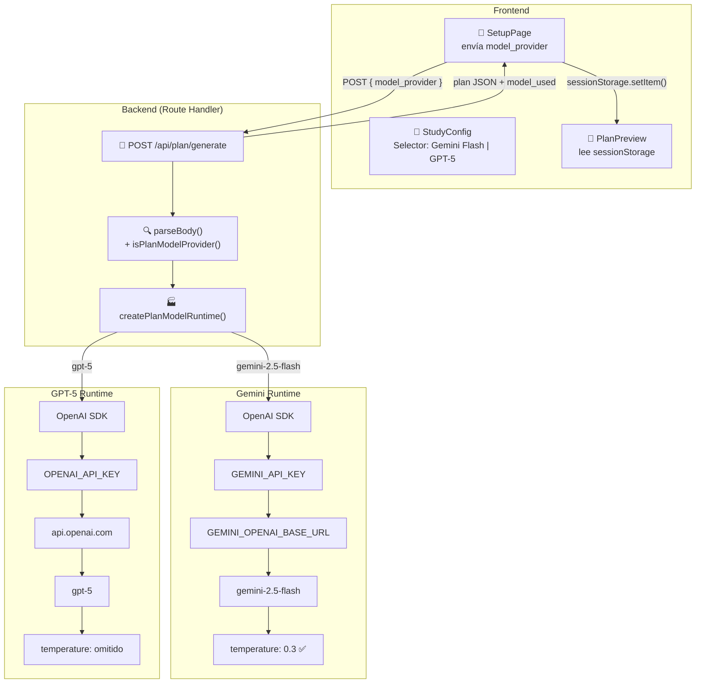

# UP-04 — Prompt de Generación de Plan + API Route `/api/plan/generate` + Selector Multi-Modelo

> **Bloque:** 📤 Upload y Plan  
> **Guía anterior:** [UP-03 — Llamada Next.js → FastAPI /extract-pdf-full](file:///c:/Users/jsife/OneDrive/Desktop/Repositorios/practica-testing/docs/guides/fe/UP-03.md)  
> **Guía siguiente:** UP-05 — Guardar plan en Supabase (study_plans + sessions)  
> **Fecha:** Junio 2026  
> **Extensión:** Julio 2026 — Soporte multi-proveedor (Gemini 2.5 Flash + GPT-5), página /plan temporal, comparación Flash vs Pro
> **Estado actual:** Implementado y verificado el 19/07/2026. Checklist
> correctivo 4/4; Demo pasa para 7, 15 y 30 días.
> **Cierre correctivo 20/07/2026:** `test:plan` pasa 9/9. Cada sesión admite
> como máximo 12 tópicos para que el quiz cubra todos; una configuración con
> densidad imposible se rechaza antes de reservar o llamar al proveedor.
>
> **Aviso de vigencia:** las secciones originales que enseñan
> `frontend/lib/openai.ts`, `OPENAI_MODEL`, selector de modelo en el body o
> fallback entre proveedores son históricas y no deben copiarse. El contrato
> vigente está en el addendum final y en AI-05: Settings elige proveedor/modelo,
> el runtime es server-only y el body no puede sobrescribirlos.

---

## Sección 1: 🎓 Introducción y Fundamentos Conceptuales

### ¿Dónde estamos?

En UP-03 completamos el pipeline de extracción: el usuario sube un PDF → se almacena en Supabase Storage → se envía a FastAPI → los tópicos estructurados (`topics_json`) quedan guardados en la tabla `documents`. Ahora tenemos **~63 tópicos ISTQB** con su nivel K (K1/K2/K3) y su texto extraído, listos para ser consumidos.

**El siguiente paso lógico** es usar esos tópicos para generar un **plan de estudio personalizado**. Aquí es donde OpenAI entra en escena: le daremos los tópicos, las preferencias del usuario (días, horarios) y un prompt cuidadosamente diseñado para que GPT genere un plan estructurado de sesiones.

### ¿Por qué es tan importante el diseño del prompt?

Piensa en el prompt como el **contrato** entre tu aplicación y la IA. Un prompt mal diseñado produce respuestas impredecibles, formatos inconsistentes y errores difíciles de depurar. Un prompt bien diseñado es como una **API specification**: define exactamente qué formato esperas, qué reglas debe seguir la IA, y qué restricciones aplican.

En esta guía aprenderás tres conceptos fundamentales:

1. **Structured Output via Prompt Engineering**: Cómo hacer que GPT retorne JSON con una estructura exacta y predecible, sin necesidad de fine-tuning ni function calling. Usaremos instrucciones explícitas en el prompt para definir el schema.

2. **Server-Side API Patterns en Next.js**: Cómo los Route Handlers de Next.js actúan como un **Backend-for-Frontend (BFF)**: el cliente nunca habla directamente con OpenAI; pasa por nuestro Route Handler que valida, autentica, y controla los costos.

3. **Defensive API Design**: Cómo validar la respuesta de un modelo de lenguaje que puede fallar en formato, generar datos incompletos, o inventar tópicos que no existen.

### Frontera crítica: Client Component vs Route Handler vs módulo server-only

Antes de escribir el código, fija esta frontera mental. Es la regla que evita filtrar secrets y mezcla de responsabilidades:

| Capa | Puede usar secrets | Puede usar estado React / eventos UI | Archivo en esta guía |
|---|---:|---:|---|
| **Client Component** | ❌ No | ✅ Sí | `app/(dashboard)/setup/page.tsx` |
| **Route Handler** | ✅ Sí | ❌ No | `app/api/plan/generate/route.ts` |
| **Server-only module** | ✅ Sí | ❌ No | `lib/openai.ts`, `lib/supabase/admin.ts` |

Por eso el navegador **no llama directamente a OpenAI**. El Client Component manda `document_id` + configuración; el Route Handler autentica, valida ownership, lee `topics_json`, llama a OpenAI con `OPENAI_API_KEY` y retorna un JSON seguro.

### Analogía: El Chef y la Receta

Imagina que OpenAI es un **chef extraordinario** que puede cocinar cualquier platillo. Pero necesita una receta precisa. Si le dices "hazme algo rico", obtendrás resultados impredecibles. Si le das una receta detallada con ingredientes exactos, cantidades, tiempos y presentación final, obtendrás exactamente lo que necesitas.

Nuestro prompt es la receta. Los ingredientes son los tópicos. La configuración del usuario (días, horarios) son las restricciones del chef. Y el JSON de salida es la foto del platillo terminado.

### ¿Por qué OPENAI_MODEL como variable de entorno?

Declarar el modelo como una variable de entorno (`OPENAI_MODEL`) en lugar de hardcodearlo tiene ventajas operacionales enormes:

| Ventaja | Explicación |
|---|---|
| **Cambio sin deploy** | Cambiar de `gpt-4o-mini` a `gpt-4o` solo requiere cambiar la variable en Vercel/`.env.local` |
| **Control de costos** | `gpt-4o-mini` es ~20x más barato que `gpt-4o`. En desarrollo usas mini, en producción decides |
| **A/B testing** | Puedes probar diferentes modelos sin tocar código |
| **Resiliencia** | Si un modelo tiene problemas, cambias al alternativo en segundos |

### Recap: Flujo Completo Hasta Ahora

#### Flujo de datos: Upload → Extract → Almacenamiento → Plan



#### Arquitectura de componentes



---

## Sección 2: 📋 Prerequisitos y Verificación del Entorno

### Herramientas y Runtime

Antes de comenzar, verifica que tienes todo lo necesario:

| Prerequisito | Comando de Verificación | Versión Esperada |
|---|---|---|
| Node.js | `node --version` | v18+ |
| npm | `npm --version` | 9+ |
| Next.js (local) | `npm run dev` sin errores | 16.x |
| Paquete `openai` | `npm list openai` | ^6.44.0 |

```powershell
# Verificar Node.js
node --version
# Esperado: v22.x.x o v18.x.x

# Verificar npm
npm --version
# Esperado: 10.x.x o 9.x.x

# Verificar que el paquete openai está instalado
cd c:\Users\jsife\OneDrive\Desktop\Repositorios\practica-testing\frontend
npm list openai
# Esperado: openai@6.44.0 (o superior)
```

> **✅ El paquete `openai` ya está instalado desde FE-01.** No necesitas ejecutar `npm install` adicional.

### Variables de Entorno — referencia histórica segura

Este bloque pertenece al diseño OpenAI-only original. No define el contrato
actual. Si necesitas comprobar nombres en `.env.local`, usa `-Quiet`; nunca
imprimas líneas ni valores:

```powershell
Test-Path -LiteralPath "frontend\.env.local"
Select-String -LiteralPath "frontend\.env.local" -Pattern '^OPENAI_API_KEY=' -Quiet
```

| Variable | Origen | ¿Dónde se usa? |
|---|---|---|
| `OPENAI_API_KEY` | Tu cuenta de OpenAI | `lib/openai.ts` (servidor) |
| `OPENAI_MODEL` | Retirada | No restaurar como fallback global. |
| `NEXT_PUBLIC_SUPABASE_URL` | DB-01 | `lib/supabase/*` |
| `NEXT_PUBLIC_SUPABASE_ANON_KEY` | DB-01 | `lib/supabase/*` |
| `SUPABASE_SERVICE_ROLE_KEY` | DB-01 | `lib/supabase/admin.ts` |

> **⚠️ IMPORTANTE:** `OPENAI_API_KEY` **NO lleva prefijo `NEXT_PUBLIC_`**. Esta variable solo debe ser accesible desde el servidor (Route Handlers). Si la expones al cliente, cualquiera podría usar tu clave de OpenAI y generarte costos.

### Entregables de Guías Anteriores Requeridos

Antes de iniciar UP-04, estos archivos **deben existir** y estar funcionales:

| Guía | Archivo | Propósito |
|---|---|---|
| FE-01 | `frontend/package.json` con `openai` | Paquete OpenAI instalado |
| FE-02 | `frontend/lib/supabase/server.ts` | Cliente Supabase autenticado |
| FE-02 | `frontend/lib/supabase/admin.ts` | Cliente Supabase con service_role |
| FE-02 | `frontend/types/database.ts` | Tipos TypeScript del schema |
| UP-02 | `frontend/app/api/upload/route.ts` | Upload de PDF funcional |
| UP-03 | `frontend/app/api/extract/route.ts` | Extracción de tópicos funcional |
| UP-03 | `frontend/app/(dashboard)/setup/page.tsx` | Setup page con upload + extract |

```powershell
# Verificar que los archivos existen
cd c:\Users\jsife\OneDrive\Desktop\Repositorios\practica-testing\frontend
Test-Path lib/supabase/admin.ts
# Esperado: True

Test-Path app/api/extract/route.ts
# Esperado: True

Test-Path types/database.ts
# Esperado: True
```

### Créditos de OpenAI

Verifica que tu cuenta de OpenAI tiene créditos disponibles:

1. Ve a [platform.openai.com/usage](https://platform.openai.com/usage)
2. Confirma que tienes saldo disponible
3. El modelo `gpt-4o-mini` cuesta aproximadamente **$0.15 por 1M tokens de input** y **$0.60 por 1M tokens de output** (precios de junio 2026)
4. Una generación de plan consume ~2,000-4,000 tokens → **menos de $0.01 por plan**

---

## Sección 3: 📂 Estructura de Directorios del Proyecto

```
practica-testing/
├── .env.example
├── .env.local
├── .gitignore
│
├── backend/                          # ← FastAPI (BE-01 a BE-06) ✅
│   └── ...
│
├── supabase/                         # ← Migraciones (DB-01 a DB-05) ✅
│   └── migrations/
│
├── docs/
│   ├── roadmap/
│   │   └── ISTQB_Guias_Implementacion.md
│   └── guides/
│       ├── db/                       # ← DB-01 a DB-05 ✅
│       ├── be/                       # ← BE-01 a BE-06 ✅
│       └── fe/
│           ├── FE-01.md  ✅
│           ├── FE-02.md  ✅
│           ├── FE-03.md  ✅
│           ├── FE-04.md  ✅
│           ├── UP-01.md  ✅
│           ├── UP-02.md  ✅
│           ├── UP-03.md  ✅
│           └── UP-04.md  ← 🆕 ESTA GUÍA
│
└── frontend/
    ├── .env.local                    # ✅ Con OPENAI_API_KEY + OPENAI_MODEL
    ├── .env.example                  # ✅ Con placeholders
    ├── package.json                  # ✅ Con openai@^6.44.0
    ├── middleware.ts                  # ✅ FE-03
    ├── next.config.ts
    ├── tsconfig.json
    │
    ├── types/
    │   ├── database.ts               # ✅ StudyPlanInsert, SessionInsert, etc.
    │   └── index.ts                  # ✅ Barrel exports
    │
    ├── lib/
    │   ├── utils.ts                  # ✅ cn() utility
    │   ├── format.ts                 # ✅ Formatters + constantes
    │   ├── openai.ts                 # ← 🆕 PASO A: Cliente OpenAI configurado
    │   └── supabase/
    │       ├── client.ts             # ✅ FE-02 — Browser client
    │       ├── server.ts             # ✅ FE-02 — Server client con cookies
    │       └── admin.ts              # ✅ UP-02 — Admin client con service_role
    │
    ├── components/
    │   ├── ui/                       # ✅ shadcn/ui components
    │   │   ├── avatar.tsx
    │   │   ├── button.tsx
    │   │   ├── card.tsx
    │   │   ├── dropdown-menu.tsx
    │   │   ├── input.tsx
    │   │   ├── label.tsx
    │   │   ├── separator.tsx
    │   │   └── sheet.tsx
    │   └── shared/
    │       └── .gitkeep
    │
    └── app/
        ├── layout.tsx                # ✅ Root layout
        ├── page.tsx                  # ✅ Landing page
        ├── globals.css               # ✅ Estilos globales
        │
        ├── (auth)/
        │   ├── layout.tsx            # ✅ FE-03
        │   ├── login/page.tsx        # ✅ FE-03
        │   └── register/page.tsx     # ✅ FE-03
        │
        ├── auth/
        │   └── callback/route.ts     # ✅ FE-03
        │
        ├── (dashboard)/
        │   ├── layout.tsx            # ✅ FE-04
        │   ├── error.tsx             # ✅ FE-04
        │   ├── loading.tsx           # ✅ FE-04
        │   ├── _components/
        │   │   ├── main-nav.tsx      # ✅ FE-04
        │   │   ├── mobile-nav.tsx    # ✅ FE-04
        │   │   └── user-menu.tsx     # ✅ FE-04
        │   │
        │   ├── dashboard/
        │   │   └── page.tsx          # ✅ FE-04
        │   │
        │   └── setup/
        │       ├── page.tsx          # ← 🔄 PASO D: Modificar para llamar /api/plan/generate
        │       └── _components/
        │           ├── pdf-dropzone.tsx  # ✅ UP-01
        │           ├── file-preview.tsx  # ✅ UP-01
        │           └── study-config.tsx  # ✅ UP-01
        │
        └── api/
            ├── upload/
            │   └── route.ts          # ✅ UP-02
            ├── extract/
            │   └── route.ts          # ✅ UP-03
            └── plan/
                └── generate/
                    └── route.ts      # ← 🆕 PASO C: API Route para generar plan
```

---

## Sección 4: 🎨 Diagrama de Arquitectura de Componentes

### Flujo de Datos: Generación de Plan



### Arquitectura de Módulos



---

## Sección 5: 🛠️ Registro Histórico de Implementación — No Ejecutar

> [!CAUTION]
> Toda esta sección (Pasos A-D y sus bloques de código) conserva únicamente la
> evolución original de UP-04. Fue sustituida por AI-02/AI-05 y por los addenda
> correctivos al final de esta guía. No crees `frontend/lib/openai.ts`, no uses
> `OPENAI_MODEL`, no habilites selección por body, no configures retries del SDK
> y no copies estos snippets al runtime vigente.

---

### Registro histórico A — `lib/openai.ts` (sustituido y eliminado)

**Archivo:** `frontend/lib/openai.ts`  
**Tipo:** Módulo del servidor (NO es un componente React)

Este módulo formó parte del diseño OpenAI-only original. AI-05 lo sustituyó por
el runtime server-only central y eliminó el archivo para impedir bypasses de
Settings, cuota y auditoría.

#### ¿Por qué un archivo dedicado?

| Sin `lib/openai.ts` | Con `lib/openai.ts` |
|---|---|
| Cada Route Handler crea su propio `new OpenAI()` | Un solo lugar para configurar OpenAI |
| Si cambias la config, tocas N archivos | Cambias un archivo y se aplica a todos |
| Duplicación de validación de env vars | Validación centralizada |
| Difícil de mockear en tests | Un import = un mock |

#### Código histórico sustituido

El bloque siguiente se conserva como evidencia histórica. No lo copies ni
vuelvas a crear `frontend/lib/openai.ts`:

```typescript
// ─────────────────────────────────────────────────────────────────
// lib/openai.ts
// Cliente de OpenAI centralizado para toda la aplicación.
//
// ⚠️  REGLA DE ORO: Este archivo SOLO puede importarse desde
//     código que corre en el SERVIDOR:
//       - Route Handlers (app/api/**/route.ts)
//       - Server Actions
//       - Server Components
//
// 🚫  NUNCA importar desde archivos con 'use client'.
//     OPENAI_API_KEY no debe exponerse al navegador.
// ─────────────────────────────────────────────────────────────────

import OpenAI from "openai";

// ─────────────────────────────────────────────────────────────────
// CONFIGURACIÓN
// ─────────────────────────────────────────────────────────────────

// ─── Modelo por defecto ──────────────────────────────────────────
// OPENAI_MODEL se lee de las variables de entorno para permitir
// cambiar el modelo sin modificar código ni hacer redeploy.
//
// Modelos recomendados (junio 2026):
//   - gpt-4o-mini : Rápido, barato (~$0.15/1M input tokens). Ideal
//                   para desarrollo y pruebas. Suficiente para
//                   generar planes de estudio.
//   - gpt-4o      : Más capaz, más caro (~$2.50/1M input tokens).
//                   Usar en producción si la calidad del plan lo
//                   justifica.
//
// ¿Por qué DEFAULT_MODEL como fallback?
// Si alguien borra accidentalmente OPENAI_MODEL del .env.local,
// la app no debería romperse. El fallback garantiza que siempre
// haya un modelo válido.
const DEFAULT_MODEL = "gpt-4o-mini";

/**
 * Modelo de OpenAI configurado para la aplicación.
 * Se lee de la variable de entorno OPENAI_MODEL.
 * Fallback: "gpt-4o-mini".
 *
 * @example
 * ```typescript
 * import { OPENAI_MODEL } from "@/lib/openai";
 * console.log(`Usando modelo: ${OPENAI_MODEL}`);
 * ```
 */
export const OPENAI_MODEL = process.env.OPENAI_MODEL || DEFAULT_MODEL;

// ─────────────────────────────────────────────────────────────────
// CLIENTE OPENAI
// ─────────────────────────────────────────────────────────────────

// ─── ¿Por qué validamos OPENAI_API_KEY aquí? ────────────────────
// A diferencia de OPENAI_MODEL (que tiene fallback), la API key
// NO tiene un valor por defecto seguro. Si no existe, fallamos
// ruidosamente con un mensaje claro para que el desarrollador
// sepa exactamente qué configurar.
//
// ─── ¿Por qué creamos la instancia a nivel de módulo? ────────────
// En Node.js (y Next.js Runtime), los módulos se evalúan UNA sola
// vez. Esto significa que openai se crea como singleton: todas las
// importaciones de este archivo comparten la misma instancia.
//
// Beneficios del singleton:
//   1. No se crea un nuevo cliente HTTP por cada petición
//   2. El cliente reutiliza conexiones (HTTP keep-alive)
//   3. Menos overhead de inicialización

/**
 * Crea el cliente de OpenAI como singleton.
 *
 * Esta función se ejecuta UNA sola vez cuando el módulo se importa
 * por primera vez. Todas las importaciones posteriores reciben
 * la misma instancia.
 *
 * @throws {Error} Si OPENAI_API_KEY no está definida
 */
function createOpenAIClient(): OpenAI {
  const apiKey = process.env.OPENAI_API_KEY;

  if (!apiKey) {
    throw new Error(
      "[OpenAI] OPENAI_API_KEY no está definida en las variables de entorno. " +
        "Revisa tu archivo .env.local y asegúrate de que contiene: " +
        "OPENAI_API_KEY=sk-proj-tu-clave-aqui\n" +
        "⚠️  Esta variable NO debe llevar prefijo NEXT_PUBLIC_"
    );
  }

  return new OpenAI({
    apiKey,
    // ─── Timeout por defecto ──────────────────────────────────
    // Si OpenAI no responde en 60 segundos, cancelamos.
    // La generación de un plan toma típicamente 5-15 segundos.
    timeout: 60_000, // 60 segundos
    // ─── Reintentos automáticos ───────────────────────────────
    // El SDK de OpenAI v4+ tiene reintentos integrados.
    // Por defecto reintenta 2 veces con backoff exponencial
    // en errores 429 (rate limit) y 5xx (errores del servidor).
    maxRetries: 2,
  });
}

/**
 * Cliente de OpenAI preconfigurado para toda la aplicación.
 *
 * Importar y usar directamente:
 * ```typescript
 * import { openai, OPENAI_MODEL } from "@/lib/openai";
 *
 * const completion = await openai.chat.completions.create({
 *   model: OPENAI_MODEL,
 *   messages: [...],
 * });
 * ```
 */
export const openai = createOpenAIClient();
```

#### ¿Qué hace cada configuración?

| Propiedad | Valor | Por qué |
|---|---|---|
| `apiKey` | `process.env.OPENAI_API_KEY` | Autenticación con la API de OpenAI |
| `timeout` | `60_000` (60s) | Evitar que una petición cuelgue indefinidamente |
| `maxRetries` | `2` | Reintentar automáticamente en errores transitorios (429, 5xx) |

#### Evidencia histórica del Paso A (no vigente)

> Estas casillas describen el cierre original sustituido; no cuentan para el
> checklist correctivo vigente 4/4.

- [x] Archivo `frontend/lib/openai.ts` creado
- [x] Exporta `openai` (instancia del cliente) y `OPENAI_MODEL` (string del modelo)

---

### Registro histórico B — Diseño inicial del prompt (sustituido)

Antes de escribir código, necesitamos diseñar el **prompt** que le enviaremos a OpenAI. Este es el corazón de UP-04: la calidad del plan depende directamente de la calidad del prompt.

#### Anatomía de un Prompt para JSON Estructurado

Un prompt bien diseñado para producir JSON tiene tres partes:

```
┌──────────────────────────────────────┐
│  SYSTEM MESSAGE (system role)        │
│  ─────────────────────────────────   │
│  • Quién eres (rol del asistente)    │
│  • Qué formato debe tener la salida  │
│  • Reglas y restricciones            │
│  • Schema JSON esperado              │
│  • Ejemplos de output                │
└──────────────────────────────────────┘
┌──────────────────────────────────────┐
│  USER MESSAGE (user role)            │
│  ─────────────────────────────────   │
│  • Datos concretos: tópicos + config │
│  • La "pregunta" que inicia la gen.  │
└──────────────────────────────────────┘
```

#### El System Prompt

El system prompt define el comportamiento del modelo. Nuestro system prompt incluirá:

1. **Rol**: "Eres un planificador de estudio para certificación ISTQB"
2. **Reglas del plan**:
   - Cada día tiene exactamente 2 sesiones: morning + night
   - Cada sesión dura 90 minutos (45 min teoría + 45 min quiz)
   - Tópicos ordenados por nivel K: K1 primero, K2 después, K3 al final
   - Agrupación temática: tópicos del mismo capítulo juntos
   - Nunca mezclar FL-1.x con FL-5.x en la misma sesión
3. **Schema JSON**: Definición exacta del formato de salida
4. **Restricciones**: Solo usar topic_codes que se proporcionan, no inventar

#### El User Prompt

El user prompt contiene los datos específicos:

1. Lista de tópicos con su código, nombre y nivel K
2. Número de días objetivo
3. Horarios de sesiones (mañana y noche)

> **💡 Tip de Prompt Engineering:** Separar system y user messages le permite al modelo distinguir entre "instrucciones permanentes" (system) y "datos de esta petición" (user). Esto mejora la consistencia del output.

#### Schema JSON de Salida Esperado

El plan generado por OpenAI debe tener esta estructura exacta:

```json
{
  "sessions": [
    {
      "day_number": 1,
      "session_type": "morning",
      "topic_codes": ["FL-1.1.1", "FL-1.2.1", "FL-1.2.2"],
      "method": "theory",
      "estimated_duration_minutes": 90,
      "difficulty": "easy",
      "title": "Fundamentos del Testing — ¿Qué es el testing?"
    },
    {
      "day_number": 1,
      "session_type": "night",
      "topic_codes": ["FL-1.2.3", "FL-1.3.1", "FL-1.4.1"],
      "method": "theory",
      "estimated_duration_minutes": 90,
      "difficulty": "easy",
      "title": "Fundamentos del Testing — Principios y Proceso"
    }
  ],
  "total_sessions": 14,
  "total_days": 7,
  "topics_per_level": {
    "K1": 12,
    "K2": 20,
    "K3": 8
  },
  "plan_summary": "Plan intensivo de 7 días con 14 sesiones...",
  "coverage": {
    "total_topics": 40,
    "covered_topic_codes": ["FL-1.1.1", "FL-1.2.1"],
    "omitted_topic_codes": []
  }
}
```

> **🧠 Por qué agregamos `coverage.omitted_topic_codes`:** obliga al modelo a declarar explícitamente si dejó tópicos fuera del plan. Esto reduce la posibilidad de que "esconda" omisiones y nos permite validar que cada tópico está en una sesión o aparece en `omitted_topic_codes`.

#### Evidencia histórica del Paso B (no vigente)

> Estas casillas describen el diseño original sustituido; no cuentan para el
> checklist correctivo vigente 4/4.

- [x] Entiendes la estructura system/user del prompt
- [x] Entiendes el schema JSON que OpenAI debe retornar
- [x] El prompt está documentado (no es código aún, se implementa en el Paso C)

---

### Registro histórico C — Primera versión de `/api/plan/generate` (sustituida)

**Archivo:** `frontend/app/api/plan/generate/route.ts`  
**Tipo:** Route Handler (servidor, sin "use client")

Este bloque documenta la primera versión de la ruta. El archivo real evolucionó
con AI-05 y su contrato vigente no se reconstruye desde este registro.

#### Código histórico sustituido

No copies este bloque sobre `frontend/app/api/plan/generate/route.ts`; consulta
el archivo real y los addenda vigentes:

```typescript
// ─────────────────────────────────────────────────────────────────
// app/api/plan/generate/route.ts
// Route Handler: lee los tópicos extraídos de un documento, envía
// un prompt a OpenAI para generar un plan de estudio personalizado,
// y retorna el plan al frontend.
//
// Método: POST
// Content-Type: application/json
// Body:
//   {
//     document_id: string,
//     config: {
//       objective_days: number,    // 1-30
//       morning_time: string,      // "HH:MM"
//       night_time: string         // "HH:MM"
//     }
//   }
//
// Response (200):
//   {
//     plan: { sessions: [...], total_sessions, ... },
//     document_id: string,
//     total_sessions: number,
//     start_date: string,          // ISO date
//     estimated_end_date: string   // ISO date
//   }
//
// Response (401): { error: "No autenticado" }
// Response (400): { error: "Descripción del problema" }
// Response (403): { error: "No tienes permisos" }
// Response (404): { error: "Documento no encontrado" }
// Response (422): { error: "El documento no tiene tópicos extraídos" }
// Response (502): { error: "Error en la generación del plan" }
// Response (500): { error: "Error interno del servidor" }
// ─────────────────────────────────────────────────────────────────

import { NextResponse } from "next/server";
import { createClient } from "@/lib/supabase/server";
import { createAdminClient } from "@/lib/supabase/admin";
import { openai, OPENAI_MODEL } from "@/lib/openai";
import type { TopicsJson, TopicEntry } from "@/types";

// El SDK de OpenAI y las variables server-only deben ejecutarse en Node.js.
// Declararlo evita sorpresas si el hosting intenta usar Edge Runtime.
export const runtime = "nodejs";

// ─────────────────────────────────────────────────────────────────
// CONSTANTES Y TIPOS
// ─────────────────────────────────────────────────────────────────

// ─── Timeout para OpenAI ─────────────────────────────────────────
// La generación de un plan típicamente toma 5-15 segundos.
// Damos 45 segundos como margen generoso.
const OPENAI_TIMEOUT_MS = 45_000;

// ─── Control de tamaño del prompt ────────────────────────────────
// El syllabus puede crecer entre versiones. Enviamos una vista compacta
// de cada tópico para controlar tokens/costo sin perder contexto útil.
const MAX_TOPICS_IN_PROMPT = 90;
const TOPIC_TEXT_PREVIEW_CHARS = 420;
const DEFAULT_SESSION_MINUTES = 90;

// ─── Validación de configuración ─────────────────────────────────
const MIN_DAYS = 1;
const MAX_DAYS = 30;

// ─── Tipo del body de la petición ────────────────────────────────
interface GeneratePlanBody {
  document_id: string;
  config: {
    objective_days: number;
    morning_time: string;
    night_time: string;
  };
}

// ─── Tipo de una sesión en el plan generado por OpenAI ────────────
interface PlanSession {
  day_number: number;
  session_type: "morning" | "night";
  topic_codes: string[];
  method: "theory" | "examples" | "analogies";
  estimated_duration_minutes: number;
  difficulty: "easy" | "medium" | "hard";
  title: string;
}

// ─── Tipo completo del plan generado por OpenAI ──────────────────
interface GeneratedPlan {
  sessions: PlanSession[];
  total_sessions: number;
  total_days: number;
  topics_per_level: {
    K1: number;
    K2: number;
    K3: number;
  };
  plan_summary: string;
  coverage: {
    total_topics: number;
    covered_topic_codes: string[];
    omitted_topic_codes: string[];
  };
}

// ─── Type guard simple para validar objetos desconocidos ─────────
function isRecord(value: unknown): value is Record<string, unknown> {
  return typeof value === "object" && value !== null && !Array.isArray(value);
}

// ─── Parser dedicado del body ────────────────────────────────────
// Mantener esta lógica separada evita un Route Handler lleno de ifs
// inline y hace más fácil testear la validación en el futuro.
function parseBody(value: unknown): GeneratePlanBody | null {
  if (!isRecord(value)) return null;

  const { document_id, config } = value;
  if (typeof document_id !== "string" || document_id.length === 0) return null;
  if (!isRecord(config)) return null;

  const { objective_days, morning_time, night_time } = config;

  if (
    typeof objective_days !== "number" ||
    objective_days < MIN_DAYS ||
    objective_days > MAX_DAYS
  ) {
    return null;
  }

  if (typeof morning_time !== "string" || !/^\d{2}:\d{2}$/.test(morning_time)) {
    return null;
  }

  if (typeof night_time !== "string" || !/^\d{2}:\d{2}$/.test(night_time)) {
    return null;
  }

  return {
    document_id,
    config: {
      objective_days,
      morning_time,
      night_time,
    },
  };
}

// ─────────────────────────────────────────────────────────────────
// PROMPT BUILDER
// ─────────────────────────────────────────────────────────────────

/**
 * Construye el system prompt para la generación del plan.
 *
 * El system prompt define:
 *   1. Rol del asistente (planificador ISTQB)
 *   2. Reglas del plan (orden K, agrupación, duración)
 *   3. Schema JSON exacto de la salida esperada
 *   4. Restricciones (no inventar tópicos, no mezclar capítulos)
 */
function buildSystemPrompt(): string {
  return `Eres un planificador de estudio especializado en la certificación ISTQB Foundation Level (CTFL v4.0).

Tu tarea es generar un plan de estudio intensivo y personalizado basado en los tópicos del syllabus ISTQB que se te proporcionarán.

## REGLAS DEL PLAN

1. **Sesiones diarias**: Cada día tiene exactamente 2 sesiones: una "morning" y una "night".
2. **Duración**: Cada sesión dura ${DEFAULT_SESSION_MINUTES} minutos (45 min de teoría + 45 min de quiz).
3. **Orden por nivel K dentro de cada capítulo**: Los tópicos deben ordenarse así:
   - Primero: tópicos K1 (recordar) → son los más fáciles
   - Después: tópicos K2 (entender/explicar) → dificultad media
   - Al final: tópicos K3 (aplicar) → los más difíciles
4. **Agrupación temática**: Los tópicos del mismo capítulo deben estar juntos.
   - Los tópicos FL-1.x.x van juntos (Chapter 1: Fundamentals of Testing)
   - Los tópicos FL-2.x.x van juntos (Chapter 2: Testing Throughout SDLC)
   - Y así sucesivamente hasta FL-6.x.x
   - NUNCA mezclar tópicos de capítulos no contiguos (ej: FL-1.x con FL-5.x en la misma sesión)
5. **Método inicial**: Todas las sesiones del plan inicial usan método "theory".
   El sistema adaptativo cambiará el método si el usuario necesita refuerzo.
6. **Dificultad**: Asignar dificultad a cada sesión basada en los niveles K de sus tópicos:
   - "easy": solo K1 o mayoría K1
   - "medium": mayoría K2 o mezcla K1+K2
   - "hard": contiene K3 o mayoría K3
7. **Distribución equilibrada**: Distribuir los tópicos uniformemente entre las sesiones.
   Usa la densidad indicada en el prompt del usuario. Si hay casi tantas sesiones como tópicos,
   es correcto que muchas sesiones tengan 1 tópico. Nunca dupliques topic_codes para rellenar.
8. **Título descriptivo**: Cada sesión debe tener un título descriptivo en español
   que resuma los tópicos cubiertos (máximo 80 caracteres).

## RESTRICCIONES CRÍTICAS

- SOLO usa topic_codes que se proporcionan en la lista de tópicos. NO inventes códigos.
- Cada topic_code debe aparecer en EXACTAMENTE una sesión o en coverage.omitted_topic_codes. No duplicar.
- Si no puedes cubrir un tópico sin saturar sesiones, decláralo explícitamente en coverage.omitted_topic_codes.
- El número de días debe coincidir exactamente con el parámetro objective_days.
- El total de sesiones = objective_days × 2 (morning + night).

## FORMATO DE SALIDA

Responde ÚNICAMENTE con un objeto JSON válido con esta estructura exacta:

{
  "sessions": [
    {
      "day_number": <número del día, empezando en 1>,
      "session_type": "morning" | "night",
      "topic_codes": ["FL-x.x.x", ...],
      "method": "theory",
      "estimated_duration_minutes": ${DEFAULT_SESSION_MINUTES},
      "difficulty": "easy" | "medium" | "hard",
      "title": "<título descriptivo en español>"
    }
  ],
  "total_sessions": <número total de sesiones>,
  "total_days": <número total de días>,
  "topics_per_level": {
    "K1": <cantidad de tópicos K1>,
    "K2": <cantidad de tópicos K2>,
    "K3": <cantidad de tópicos K3>
  },
  "plan_summary": "<resumen del plan en español, 2-3 oraciones>",
  "coverage": {
    "total_topics": <número total de tópicos recibidos>,
    "covered_topic_codes": ["FL-x.x.x", ...],
    "omitted_topic_codes": ["FL-x.x.x", ...]
  }
}

NO incluyas texto antes ni después del JSON. NO uses bloques de código markdown.
Responde SOLO con el JSON puro.`;
}

/**
 * Convierte topics_json en una versión compacta para el prompt.
 *
 * Enviar el texto completo de cada tópico puede disparar el costo de
 * tokens. Para planificar, el modelo necesita código, nivel K, nombre y
 * un preview corto del texto. El texto completo se usará después, en SE-02.
 */
function buildTopicsForPrompt(topics: TopicsJson) {
  return Object.entries(topics)
    .sort(([codeA], [codeB]) => codeA.localeCompare(codeB))
    .slice(0, MAX_TOPICS_IN_PROMPT)
    .map(([code, entry]: [string, TopicEntry]) => ({
      code,
      level_k: entry.level_k,
      name: entry.name || "Sin nombre",
      text_preview: entry.text.slice(0, TOPIC_TEXT_PREVIEW_CHARS),
    }));
}

/**
 * Construye el user prompt con los datos específicos de esta petición.
 *
 * @param topics      - Tópicos extraídos del PDF
 * @param days        - Número de días objetivo del usuario
 * @param morningTime - Hora de la sesión matutina (HH:MM)
 * @param nightTime   - Hora de la sesión nocturna (HH:MM)
 */
function buildUserPrompt(
  topics: TopicsJson,
  days: number,
  morningTime: string,
  nightTime: string
): string {
  // ─── Construir versión compacta de tópicos ──────────────────
  // Incluimos text_preview para dar contexto pedagógico sin enviar
  // el texto completo del syllabus en cada llamada a OpenAI.
  const promptTopics = buildTopicsForPrompt(topics);
  const availableTopicCodes = Object.keys(topics).sort();

  // ─── Contar tópicos por nivel K ─────────────────────────────
  const levelCounts = { K1: 0, K2: 0, K3: 0 };
  Object.values(topics).forEach((entry: TopicEntry) => {
    const level = entry.level_k as keyof typeof levelCounts;
    if (level in levelCounts) {
      levelCounts[level]++;
    }
  });

  const totalTopics = Object.keys(topics).length;
  const totalSessions = days * 2;
  const minTopicsPerSession = Math.max(
    1,
    Math.floor(totalTopics / totalSessions),
  );
  const maxTopicsPerSession = Math.max(
    minTopicsPerSession,
    Math.ceil(totalTopics / totalSessions),
  );

  return `## DATOS DEL ESTUDIANTE

- **Días disponibles:** ${days} días
- **Sesiones totales:** ${totalSessions} (${days} días × 2 sesiones/día)
- **Horario sesión mañana:** ${morningTime}
- **Horario sesión noche:** ${nightTime}
- **Total de tópicos:** ${totalTopics}
- **Distribución:** K1=${levelCounts.K1}, K2=${levelCounts.K2}, K3=${levelCounts.K3}
- **Límite técnico del prompt:** máximo ${MAX_TOPICS_IN_PROMPT} tópicos con detalle; todos los códigos válidos están listados abajo.

## TOPIC_CODES VÁLIDOS

${availableTopicCodes.join(", ")}

## TÓPICOS CON CONTEXTO PEDAGÓGICO (${promptTopics.length} de ${totalTopics})

${JSON.stringify(promptTopics, null, 2)}

## INSTRUCCIÓN

Genera el plan de estudio con ${totalSessions} sesiones distribuidas en ${days} días.
Agrupa los tópicos por capítulo y, dentro de cada capítulo, ordénalos por nivel K (K1 primero, K3 al final).
Cada sesión debe tener entre ${minTopicsPerSession} y ${maxTopicsPerSession} tópico(s).
No dupliques topic_codes para llenar sesiones.
Si no puedes cubrir todos los tópicos sin saturar sesiones, lista los topic_codes omitidos en coverage.omitted_topic_codes.
Responde SOLO con el JSON.`;
}

// ─────────────────────────────────────────────────────────────────
// VALIDACIÓN DEL PLAN GENERADO
// ─────────────────────────────────────────────────────────────────

/**
 * Valida que el plan generado por OpenAI cumple con los requisitos.
 *
 * Verificaciones:
 *   1. Tiene el campo 'sessions' como array no vacío
 *   2. Cada sesión tiene los campos requeridos
 *   3. Todos los topic_codes existen en los tópicos originales
 *   4. No hay topic_codes duplicados
 *   5. Los tópicos omitidos están declarados en coverage.omitted_topic_codes
 *
 * @returns Array de errores. Si está vacío, el plan es válido.
 */
function validateGeneratedPlan(
  plan: GeneratedPlan,
  originalTopics: TopicsJson,
  expectedDays: number
): string[] {
  const errors: string[] = [];
  const originalCodes = new Set(Object.keys(originalTopics));
  const expectedSessions = expectedDays * 2;

  // ─── 1. Verificar que sessions existe y es un array ─────────
  if (!plan.sessions || !Array.isArray(plan.sessions)) {
    errors.push("El plan no contiene un array 'sessions' válido.");
    return errors; // No tiene sentido validar más
  }

  if (plan.sessions.length === 0) {
    errors.push("El plan no contiene ninguna sesión.");
    return errors;
  }

  if (plan.sessions.length !== expectedSessions) {
    errors.push(
      `El plan contiene ${plan.sessions.length} sesiones, pero se esperaban ${expectedSessions}.`
    );
  }

  if (plan.total_sessions !== expectedSessions) {
    errors.push(
      `total_sessions debe ser ${expectedSessions}, pero llegó ${plan.total_sessions}.`
    );
  }

  // ─── 2. Verificar coverage explícito ────────────────────────
  if (!plan.coverage || typeof plan.coverage !== "object") {
    errors.push("El plan no contiene coverage válido.");
    return errors;
  }

  if (plan.coverage.total_topics !== originalCodes.size) {
    errors.push(
      `coverage.total_topics debe ser ${originalCodes.size}, pero llegó ${plan.coverage.total_topics}.`
    );
  }

  if (!Array.isArray(plan.coverage.covered_topic_codes)) {
    errors.push("coverage.covered_topic_codes debe ser un array.");
  }

  if (!Array.isArray(plan.coverage.omitted_topic_codes)) {
    errors.push("coverage.omitted_topic_codes debe ser un array.");
  }

  // ─── 3. Verificar campos de cada sesión ─────────────────────
  const allTopicCodes: string[] = [];

  for (let i = 0; i < plan.sessions.length; i++) {
    const session = plan.sessions[i];

    if (typeof session.day_number !== "number" || session.day_number < 1) {
      errors.push(`Sesión ${i + 1}: falta day_number válido (debe ser un número >= 1).`);
    }

    if (!["morning", "night"].includes(session.session_type)) {
      errors.push(
        `Sesión ${i + 1}: session_type inválido: "${session.session_type}".`
      );
    }

    if (
      !session.topic_codes ||
      !Array.isArray(session.topic_codes) ||
      session.topic_codes.length === 0
    ) {
      errors.push(`Sesión ${i + 1}: topic_codes vacío o no es array.`);
      continue;
    }

    // ─── 3. Verificar que cada topic_code es válido ───────────
    for (const code of session.topic_codes) {
      if (!originalCodes.has(code)) {
        errors.push(
          `Sesión ${i + 1}: topic_code "${code}" no existe en los tópicos originales.`
        );
      }
      allTopicCodes.push(code);
    }
  }

  // ─── 4. Verificar duplicados en sesiones ────────────────────
  const codeSet = new Set<string>();
  const duplicates: string[] = [];

  for (const code of allTopicCodes) {
    if (codeSet.has(code)) {
      duplicates.push(code);
    }
    codeSet.add(code);
  }

  if (duplicates.length > 0) {
    errors.push(
      `Tópicos duplicados en el plan: ${duplicates.join(", ")}`
    );
  }

  // ─── 5. Verificar omisiones declaradas explícitamente ───────
  const omittedTopicCodes = Array.isArray(plan.coverage.omitted_topic_codes)
    ? plan.coverage.omitted_topic_codes
    : [];
  const coveredTopicCodes = Array.isArray(plan.coverage.covered_topic_codes)
    ? plan.coverage.covered_topic_codes
    : [];

  const omittedCodes = new Set(omittedTopicCodes);
  const coveredCodes = new Set(coveredTopicCodes);

  for (const code of omittedCodes) {
    if (!originalCodes.has(code)) {
      errors.push(`coverage.omitted_topic_codes contiene código inexistente: ${code}.`);
    }

    if (codeSet.has(code)) {
      errors.push(
        `coverage.omitted_topic_codes incluye "${code}", pero ese tópico también aparece en una sesión.`
      );
    }
  }

  for (const code of coveredCodes) {
    if (!originalCodes.has(code)) {
      errors.push(`coverage.covered_topic_codes contiene código inexistente: ${code}.`);
    }
  }

  const missingTopics = Array.from(originalCodes).filter(
    (code) => !codeSet.has(code) && !omittedCodes.has(code)
  );

  if (missingTopics.length > 0) {
    errors.push(
      `Tópicos omitidos sin declararse en coverage.omitted_topic_codes: ${missingTopics.join(", ")}`
    );
  }

  const usedButNotCovered = Array.from(codeSet).filter(
    (code) => !coveredCodes.has(code)
  );

  if (usedButNotCovered.length > 0) {
    errors.push(
      `Tópicos usados en sesiones pero ausentes en coverage.covered_topic_codes: ${usedButNotCovered.join(", ")}`
    );
  }

  // ─── 6. Verificar número de días ────────────────────────────
  const maxDayInPlan = Math.max(
    ...plan.sessions.map((s) => s.day_number)
  );

  if (maxDayInPlan > expectedDays) {
    errors.push(
      `El plan tiene sesiones hasta el día ${maxDayInPlan}, pero el objetivo es ${expectedDays} días.`
    );
  }

  return errors;
}

// ─────────────────────────────────────────────────────────────────
// ROUTE HANDLER
// ─────────────────────────────────────────────────────────────────

export async function POST(request: Request) {
  try {
    // ═══════════════════════════════════════════════════════════
    // FASE 1: AUTENTICACIÓN
    // Verificamos que el usuario está logueado.
    // ═══════════════════════════════════════════════════════════

    const supabase = await createClient();

    const {
      data: { user },
      error: authError,
    } = await supabase.auth.getUser();

    if (authError || !user) {
      return NextResponse.json(
        { error: "No autenticado. Por favor inicia sesión." },
        { status: 401 }
      );
    }

    // ═══════════════════════════════════════════════════════════
    // FASE 2: PARSING Y VALIDACIÓN DEL BODY
    // ═══════════════════════════════════════════════════════════

    let rawBody: unknown;

    try {
      rawBody = await request.json();
    } catch {
      return NextResponse.json(
        { error: "Body inválido. Se espera JSON." },
        { status: 400 }
      );
    }

    const body = parseBody(rawBody);

    if (!body) {
      return NextResponse.json(
        {
          error:
            "Body inválido. Esperado: { document_id, config: { objective_days, morning_time, night_time } }.",
        },
        { status: 400 }
      );
    }

    const { document_id, config } = body;
    const { objective_days, morning_time, night_time } = config;

    // ═══════════════════════════════════════════════════════════
    // FASE 3: OBTENER EL DOCUMENTO CON TÓPICOS
    // ═══════════════════════════════════════════════════════════

    const adminClient = createAdminClient();

    const { data: document, error: docError } = await adminClient
      .from("documents")
      .select("id, user_id, topics_json, file_name")
      .eq("id", document_id)
      .single();

    if (docError || !document) {
      console.error("[Plan] Documento no encontrado:", docError);
      return NextResponse.json(
        { error: "Documento no encontrado." },
        { status: 404 }
      );
    }

    // ─── Ownership check ──────────────────────────────────────
    if (document.user_id !== user.id) {
      console.warn(
        `[Plan] ⚠️ Usuario ${user.id} intentó generar plan para documento de ${document.user_id}`
      );
      return NextResponse.json(
        { error: "No tienes permisos para acceder a este documento." },
        { status: 403 }
      );
    }

    // ─── Verificar que topics_json existe ─────────────────────
    // Si el documento no tiene tópicos extraídos, no podemos
    // generar un plan. Esto significa que UP-03 no se completó.
    const topicsJson = document.topics_json as TopicsJson | null;

    if (!topicsJson || Object.keys(topicsJson).length === 0) {
      return NextResponse.json(
        {
          error:
            "El documento no tiene tópicos extraídos. " +
            "Primero debes completar la extracción (UP-03).",
        },
        { status: 422 }
      );
    }

    const totalTopics = Object.keys(topicsJson).length;
    console.log(
      `[Plan] Generando plan para ${totalTopics} tópicos, ` +
        `${objective_days} días, horarios ${morning_time}/${night_time}`
    );

    // ═══════════════════════════════════════════════════════════
    // FASE 4: LLAMAR A OPENAI PARA GENERAR EL PLAN
    // ═══════════════════════════════════════════════════════════

    // ─── Construir los mensajes del prompt ─────────────────────
    const systemPrompt = buildSystemPrompt();
    const userPrompt = buildUserPrompt(
      topicsJson,
      objective_days,
      morning_time,
      night_time
    );

    // ─── AbortController para timeout ──────────────────────────
    // Mismo patrón que en extract/route.ts (UP-03).
    const controller = new AbortController();
    const timeoutId = setTimeout(
      () => controller.abort(),
      OPENAI_TIMEOUT_MS
    );

    let completion;

    try {
      completion = await openai.chat.completions.create(
        {
          model: OPENAI_MODEL,
          messages: [
            { role: "system", content: systemPrompt },
            { role: "user", content: userPrompt },
          ],
          // ─── response_format: JSON mode ──────────────────────
          // Esta opción le dice a OpenAI que DEBE responder con
          // JSON válido. Si el modelo intenta responder con texto
          // libre, la API fuerza un JSON válido.
          //
          // ⚠️ IMPORTANTE: Aunque usemos response_format, DEBEMOS
          // incluir "JSON" en el system prompt. OpenAI requiere
          // que el prompt mencione JSON explícitamente cuando
          // se usa este modo.
          response_format: { type: "json_object" },
          // ─── Temperature ─────────────────────────────────────
          // 0.3 para balancear entre consistencia y creatividad.
          // - 0.0: Demasiado determinístico, puede generar planes
          //        idénticos incluso con tópicos diferentes.
          // - 1.0: Demasiado creativo, puede ignorar reglas.
          // - 0.3: Suficiente variación para títulos descriptivos
          //        pero consistente en estructura.
          temperature: 0.3,
        },
        {
          // ─── Pasar el signal al SDK de OpenAI ────────────────
          // El SDK v4+ acepta un signal de AbortController para
          // cancelar la petición si el timeout se alcanza.
          signal: controller.signal,
        }
      );
    } catch (openaiError) {
      // ─── Timeout ────────────────────────────────────────────
      if (
        openaiError instanceof Error &&
        openaiError.name === "AbortError"
      ) {
        console.error(
          `[Plan] ⏰ Timeout: OpenAI no respondió en ${OPENAI_TIMEOUT_MS / 1000}s`
        );
        return NextResponse.json(
          {
            error: `OpenAI no respondió en ${OPENAI_TIMEOUT_MS / 1000} segundos. Por favor intenta de nuevo.`,
          },
          { status: 504 }
        );
      }

      // ─── Rate limit ─────────────────────────────────────────
      if (
        openaiError instanceof Error &&
        "status" in openaiError &&
        (openaiError as { status: number }).status === 429
      ) {
        console.error("[Plan] Rate limit alcanzado en OpenAI");
        return NextResponse.json(
          {
            error:
              "Se alcanzó el límite de peticiones a OpenAI. Por favor espera unos minutos e intenta de nuevo.",
          },
          { status: 429 }
        );
      }

      // ─── Otros errores de OpenAI ────────────────────────────
      console.error("[Plan] Error al llamar OpenAI:", openaiError);
      return NextResponse.json(
        {
          error:
            "Error al comunicarse con el servicio de inteligencia artificial. Por favor intenta de nuevo.",
        },
        { status: 502 }
      );
    } finally {
      clearTimeout(timeoutId);
    }

    // ═══════════════════════════════════════════════════════════
    // FASE 5: PROCESAR Y VALIDAR LA RESPUESTA DE OPENAI
    // ═══════════════════════════════════════════════════════════

    // ─── Extraer el contenido del mensaje ──────────────────────
    const content = completion.choices[0]?.message?.content;

    if (!content) {
      console.error("[Plan] OpenAI retornó una respuesta vacía");
      return NextResponse.json(
        {
          error:
            "OpenAI no generó un plan. Por favor intenta de nuevo.",
        },
        { status: 502 }
      );
    }

    // ─── Parsear el JSON ──────────────────────────────────────
    let plan: GeneratedPlan;

    try {
      plan = JSON.parse(content) as GeneratedPlan;
    } catch (parseError) {
      console.error(
        "[Plan] Error al parsear JSON de OpenAI:",
        parseError,
        "\nContenido recibido:",
        content.substring(0, 500)
      );
      return NextResponse.json(
        {
          error:
            "OpenAI generó una respuesta con formato inválido. " +
            "Por favor intenta de nuevo.",
        },
        { status: 502 }
      );
    }

    // ─── Validar la estructura del plan ────────────────────────
    const validationErrors = validateGeneratedPlan(
      plan,
      topicsJson,
      objective_days
    );

    if (validationErrors.length > 0) {
      console.error(
        "[Plan] Plan generado con errores de validación:",
        validationErrors
      );
      return NextResponse.json(
        {
          error:
            "El plan generado no cumple con los requisitos. " +
            "Errores: " +
            validationErrors.join("; ") +
            ". Por favor intenta de nuevo.",
        },
        { status: 502 }
      );
    }

    // ═══════════════════════════════════════════════════════════
    // FASE 6: CALCULAR FECHAS Y PREPARAR RESPUESTA
    // ═══════════════════════════════════════════════════════════

    // ─── Calcular fechas ──────────────────────────────────────
    // start_date: hoy (el plan empieza inmediatamente)
    // estimated_end_date: hoy + (objective_days - 1)
    // Si empiezas hoy y estudias 7 días, el día 7 es hoy + 6.
    const today = new Date();
    const startDate = today.toISOString().split("T")[0]; // "YYYY-MM-DD"

    const endDate = new Date(today);
    endDate.setDate(endDate.getDate() + objective_days - 1);
    const estimatedEndDate = endDate.toISOString().split("T")[0];

    // ─── Log de éxito ─────────────────────────────────────────
    console.log(
      `[Plan] ✅ Plan generado exitosamente: ` +
        `${plan.sessions.length} sesiones, ` +
        `${plan.total_days} días, ` +
        `modelo: ${OPENAI_MODEL}, ` +
        `tokens: ${completion.usage?.total_tokens || "N/A"}`
    );

    // ═══════════════════════════════════════════════════════════
    // FASE 7: RESPUESTA EXITOSA
    // ═══════════════════════════════════════════════════════════

    return NextResponse.json({
      plan,
      document_id,
      total_sessions: plan.sessions.length,
      start_date: startDate,
      estimated_end_date: estimatedEndDate,
      model_used: OPENAI_MODEL,
      tokens_used: completion.usage?.total_tokens || null,
    });
  } catch (error) {
    // ─── Error no controlado ──────────────────────────────────
    console.error("[Plan] Error no controlado:", error);

    return NextResponse.json(
      {
        error:
          "Error interno del servidor. Por favor intenta de nuevo.",
      },
      { status: 500 }
    );
  }
}
```

#### Análisis de Decisiones de Diseño

| Decisión | Razón |
|---|---|
| `response_format: { type: "json_object" }` | Fuerza a OpenAI a retornar JSON válido siempre |
| `export const runtime = "nodejs"` | Evita problemas del SDK de OpenAI si el hosting intenta ejecutar la ruta en Edge Runtime |
| `temperature: 0.3` | Balance entre consistencia (estructura) y creatividad (títulos) |
| `parseBody()` dedicado | Centraliza la validación del body y reduce riesgo de olvidar un campo |
| `MAX_TOPICS_IN_PROMPT` + `text_preview` | Controla tokens/costo sin perder contexto pedagógico |
| `coverage.omitted_topic_codes` | Obliga a declarar tópicos no cubiertos en lugar de esconder omisiones |
| `AbortController` con 45s | Evita peticiones infinitas si OpenAI cuelga |
| Validación con `validateGeneratedPlan()` | Los LLMs pueden inventar datos; verificamos contra la verdad |
| Ownership check manual | Usamos adminClient que bypasea RLS |
| No guardamos el plan aquí | UP-05 se encargará de persistir en study_plans + sessions + topic_progress |

#### Evidencia histórica del Paso C (no vigente)

> Estas casillas describen la ruta original sustituida; no cuentan para el
> checklist correctivo vigente 4/4.

- [x] Directorio `frontend/app/api/plan/generate/` creado
- [x] Archivo `frontend/app/api/plan/generate/route.ts` creado
- [x] Declara `export const runtime = "nodejs"` para el SDK de OpenAI
- [x] La ruta acepta POST con `{ document_id, config }`
- [x] Usa `parseBody()` para validar el body en una función dedicada
- [x] Valida autenticación, ownership, existencia de tópicos
- [x] Construye prompt con system + user messages
- [x] Limita el prompt con `MAX_TOPICS_IN_PROMPT` y `text_preview`
- [x] Llama a OpenAI con JSON mode activado
- [x] Valida la respuesta: estructura, topic_codes, duplicados y `coverage.omitted_topic_codes`
- [x] Retorna el plan con fechas calculadas

---

### Registro histórico D — Primera integración de `setup/page.tsx` (sustituida)

**Archivo:** `frontend/app/(dashboard)/setup/page.tsx`  
**Tipo:** Client Component (ya existente, modificación)

Este registro explica cómo se integró inicialmente una tercera etapa después de
la extracción. El flujo actual y la persistencia posterior se verifican contra
el código real, no aplicando nuevamente este delta.

#### Cambios documentados históricamente

1. **Agregar nueva etapa** `"generating"` al tipo `ProcessStage`
2. **Agregar nuevo estado** para almacenar el resultado del plan
3. **Modificar `handleSubmit`** para llamar a `/api/plan/generate` después de extract
4. **Actualizar la barra de progreso** para reflejar las 3 etapas
5. **Mostrar resumen del plan** generado antes de navegar

#### Código histórico sustituido

No apliques este bloque sobre
`frontend/app/(dashboard)/setup/page.tsx`; se conserva solo como trazabilidad:

```typescript
// ============================================================
// app/(dashboard)/setup/page.tsx — Página de Setup del Plan
// ============================================================
// RUTA: /setup
//
// TIPO: Client Component — orquesta el estado de los componentes
//       hijos (PdfDropzone, FilePreview, StudyConfig).
//
// RESPONSABILIDADES:
//   1. Mantener el estado del archivo seleccionado (File | null)
//   2. Mantener la configuración del plan (días, horarios)
//   3. Coordinar el estado de loading durante el procesamiento
//   4. Enviar los datos a la API Route /api/upload (UP-02)
//   5. Llamar a /api/extract para obtener tópicos (UP-03)
//   6. 🆕 Llamar a /api/plan/generate para generar el plan (UP-04)
//   7. Mostrar progreso de cada etapa al usuario
//
// LAYOUT PADRE:
//   Esta página se renderiza DENTRO de app/(dashboard)/layout.tsx.
//   El header y la navegación ya están presentes. Este componente
//   solo define el contenido del área principal.
//
// PROTECCIÓN:
//   El middleware (FE-03) ya protege /setup. Si un usuario no
//   autenticado intenta acceder, será redirigido a /login.
// ============================================================

"use client";

import { useRouter } from "next/navigation";
import { useState } from "react";
import { PdfDropzone } from "./_components/pdf-dropzone";
import { FilePreview } from "./_components/file-preview";
import {
  StudyConfig,
  DEFAULT_CONFIG,
  type StudyConfigData,
} from "./_components/study-config";
import { Separator } from "@/components/ui/separator";

// ─── Etapas del proceso ─────────────────────────────────────────
// 🆕 Agregamos "generating" como nueva etapa entre extracting y complete.
type ProcessStage =
  | "idle"        // Sin actividad
  | "uploading"   // Subiendo PDF a Storage
  | "extracting"  // Enviando a FastAPI para extracción
  | "generating"  // 🆕 Generando plan con OpenAI
  | "saving"      // Guardando resultados en DB
  | "complete"    // Proceso completado exitosamente
  | "error";      // Error en alguna etapa

// ─── Mensajes de progreso para cada etapa ────────────────────────
const STAGE_MESSAGES: Record<ProcessStage, string> = {
  idle: "",
  uploading: "Subiendo PDF al almacenamiento seguro...",
  extracting:
    "Analizando el syllabus con IA... Esto puede tomar 10-15 segundos.",
  generating:
    "Generando tu plan de estudio personalizado con IA... Esto puede tomar 10-20 segundos.",
  saving: "Guardando resultados...",
  complete: "¡Plan generado exitosamente! Redirigiendo...",
  error: "Ocurrió un error. Revisa el mensaje abajo.",
};

// ─── 🆕 Tipo del resultado de la generación del plan ────────────
interface PlanResult {
  total_sessions: number;
  start_date: string;
  estimated_end_date: string;
  model_used: string;
}

export default function SetupPage() {
  // ═══════════════════════════════════════════════════════════
  // ESTADO GLOBAL DE LA PÁGINA
  // ═══════════════════════════════════════════════════════════

  // ─── Archivo PDF seleccionado ───
  const [selectedFile, setSelectedFile] = useState<File | null>(null);

  // ─── Configuración del plan ───
  const [config, setConfig] = useState<StudyConfigData>(DEFAULT_CONFIG);

  // ─── Estado de carga ───
  const [isLoading, setIsLoading] = useState(false);

  // ─── Etapa actual del proceso ───
  const [stage, setStage] = useState<ProcessStage>("idle");

  // ─── Mensaje de error global ───
  const [submitError, setSubmitError] = useState<string | null>(null);

  // ─── Resultado de la extracción ───
  const [extractionResult, setExtractionResult] = useState<{
    total_topics: number;
    is_complete: boolean;
    warnings: string[];
  } | null>(null);

  // ─── 🆕 Resultado de la generación del plan ───
  const [planResult, setPlanResult] = useState<PlanResult | null>(null);

  // ═══════════════════════════════════════════════════════════
  // HANDLERS
  // ═══════════════════════════════════════════════════════════

  const router = useRouter();

  const handleFileSelect = (file: File) => {
    setSelectedFile(file);
    setSubmitError(null);
    setExtractionResult(null);
    setPlanResult(null);
    setStage("idle");
  };

  const handleFileRemove = () => {
    setSelectedFile(null);
    setExtractionResult(null);
    setPlanResult(null);
    setStage("idle");
  };

  const handleConfigChange = (newConfig: StudyConfigData) => {
    setConfig(newConfig);
  };

  // ─── Handler principal: Upload + Extract + Generate Plan ────
  const handleSubmit = async () => {
    if (!selectedFile) return;

    setIsLoading(true);
    setSubmitError(null);
    setExtractionResult(null);
    setPlanResult(null);

    try {
      // ─── ETAPA 1: Upload ────────────────────────────────────
      setStage("uploading");

      const formData = new FormData();
      formData.append("file", selectedFile);
      formData.append("objective_days", config.objectiveDays.toString());
      formData.append("morning_time", config.morningTime);
      formData.append("night_time", config.nightTime);

      const uploadResponse = await fetch("/api/upload", {
        method: "POST",
        body: formData,
      });

      const uploadData = await uploadResponse.json();

      if (!uploadResponse.ok) {
        throw new Error(uploadData.error || "Error al subir el archivo.");
      }

      console.log(
        `[Setup] ✅ Upload completado: ${uploadData.document_id} (${uploadData.file_name})`,
      );

      // ─── ETAPA 2: Extracción ────────────────────────────────
      setStage("extracting");

      const extractResponse = await fetch("/api/extract", {
        method: "POST",
        headers: {
          "Content-Type": "application/json",
        },
        body: JSON.stringify({
          document_id: uploadData.document_id,
        }),
      });

      const extractData = await extractResponse.json();

      if (!extractResponse.ok) {
        throw new Error(
          extractData.error || "Error al extraer los tópicos del PDF.",
        );
      }

      console.log(
        `[Setup] ✅ Extracción completada: ${extractData.total_topics} tópicos`,
      );

      setExtractionResult({
        total_topics: extractData.total_topics,
        is_complete: extractData.is_complete,
        warnings: extractData.warnings || [],
      });

      // ─── ETAPA 3: 🆕 Generación del Plan ───────────────────
      // Llamamos a /api/plan/generate con el document_id y la
      // configuración del usuario (días, horarios).
      setStage("generating");

      const planResponse = await fetch("/api/plan/generate", {
        method: "POST",
        headers: {
          "Content-Type": "application/json",
        },
        body: JSON.stringify({
          document_id: uploadData.document_id,
          config: {
            objective_days: config.objectiveDays,
            morning_time: config.morningTime,
            night_time: config.nightTime,
          },
        }),
      });

      const planData = await planResponse.json();

      if (!planResponse.ok) {
        throw new Error(
          planData.error || "Error al generar el plan de estudio.",
        );
      }

      console.log(
        `[Setup] ✅ Plan generado: ${planData.total_sessions} sesiones, ` +
          `${planData.start_date} → ${planData.estimated_end_date}, ` +
          `modelo: ${planData.model_used}`,
      );

      // ─── Guardar resultado del plan ─────────────────────────
      setPlanResult({
        total_sessions: planData.total_sessions,
        start_date: planData.start_date,
        estimated_end_date: planData.estimated_end_date,
        model_used: planData.model_used,
      });

      // ─── ETAPA 4: Completado ────────────────────────────────
      setStage("complete");

      // ─── Navegar a la vista del plan después de 3 segundos ───
      // Mantenemos isLoading=true hasta la navegación para evitar
      // que el usuario haga doble click mientras el setTimeout corre.
      // UP-05 persistirá el plan y UP-06 construirá la UI completa.
      setTimeout(() => {
        router.push(`/plan?document_id=${uploadData.document_id}`);
      }, 3000);
    } catch (error) {
      setStage("error");
      setSubmitError(
        error instanceof Error
          ? error.message
          : "Ocurrió un error inesperado. Por favor intenta de nuevo.",
      );
      // 🆕 Restaurar loading en error para permitir reintentar
      setIsLoading(false);
    }
  };

  // ─── Helper: calcular porcentaje de progreso ────────────────
  // 🆕 Actualizado para incluir la etapa "generating"
  const getProgressPercent = (): string => {
    switch (stage) {
      case "uploading":
        return "20%";
      case "extracting":
        return "45%";
      case "generating":
        return "75%";
      case "saving":
        return "90%";
      case "complete":
        return "100%";
      default:
        return "0%";
    }
  };

  // ═══════════════════════════════════════════════════════════
  // RENDER
  // ═══════════════════════════════════════════════════════════

  return (
    <div className="flex flex-col gap-8 max-w-2xl">
      {/* ─── Encabezado de la página ─── */}
      <div className="flex flex-col gap-2">
        <h1 className="text-3xl font-bold tracking-tight text-white">
          Configurar Plan de Estudio
        </h1>
        <p className="text-slate-400">
          Sube el PDF del syllabus ISTQB y configura tus preferencias de
          estudio. El agente creará un plan personalizado para ti.
        </p>
      </div>

      {/* ─── Sección 1: Subir PDF ─── */}
      <div className="flex flex-col gap-4">
        <div className="flex flex-col gap-1">
          <h2 className="text-lg font-semibold text-slate-200">
            📄 Syllabus PDF
          </h2>
          <p className="text-sm text-slate-500">
            Sube el documento oficial del ISTQB Foundation Level v4.0
          </p>
        </div>

        <PdfDropzone
          onFileSelect={handleFileSelect}
          hasFile={selectedFile !== null}
          disabled={isLoading}
        />

        {selectedFile && (
          <FilePreview
            file={selectedFile}
            onRemove={handleFileRemove}
            disabled={isLoading}
          />
        )}
      </div>

      {/* ─── Separador visual ─── */}
      <Separator className="bg-slate-800" />

      {/* ─── Sección 2: Configuración del Plan ─── */}
      <StudyConfig
        config={config}
        onConfigChange={handleConfigChange}
        disabled={isLoading}
      />

      {/* ─── Progreso del proceso ─── */}
      {stage !== "idle" && stage !== "error" && (
        <div className="flex flex-col gap-3 rounded-lg bg-slate-800/50 border border-slate-700/50 p-5">
          {/* Indicador de progreso con animación */}
          <div className="flex items-center gap-3">
            {stage !== "complete" ? (
              // ─── Spinner animado ───
              <svg
                className="animate-spin h-5 w-5 text-emerald-400"
                xmlns="http://www.w3.org/2000/svg"
                fill="none"
                viewBox="0 0 24 24"
              >
                <circle
                  className="opacity-25"
                  cx="12"
                  cy="12"
                  r="10"
                  stroke="currentColor"
                  strokeWidth="4"
                />
                <path
                  className="opacity-75"
                  fill="currentColor"
                  d="M4 12a8 8 0 018-8V0C5.373 0 0 5.373 0 12h4zm2 5.291A7.962 7.962 0 014 12H0c0 3.042 1.135 5.824 3 7.938l3-2.647z"
                />
              </svg>
            ) : (
              // ─── Checkmark ───
              <svg
                className="h-5 w-5 text-emerald-400"
                xmlns="http://www.w3.org/2000/svg"
                fill="none"
                viewBox="0 0 24 24"
                stroke="currentColor"
                strokeWidth="2"
              >
                <path
                  strokeLinecap="round"
                  strokeLinejoin="round"
                  d="M5 13l4 4L19 7"
                />
              </svg>
            )}
            <p className="text-sm text-slate-300 font-medium">
              {STAGE_MESSAGES[stage]}
            </p>
          </div>

          {/* 🆕 Barra de progreso visual — actualizada con getProgressPercent */}
          <div className="w-full bg-slate-700 rounded-full h-1.5">
            <div
              className="bg-emerald-500 h-1.5 rounded-full transition-all duration-500 ease-out"
              style={{ width: getProgressPercent() }}
            />
          </div>

          {/* Resultado de extracción */}
          {extractionResult && (
            <div className="flex flex-col gap-2 mt-2">
              <div className="flex items-center gap-2">
                <span className="text-emerald-400 font-semibold text-sm">
                  📊 {extractionResult.total_topics} tópicos detectados
                </span>
                {extractionResult.is_complete ? (
                  <span className="text-xs text-emerald-500 bg-emerald-500/10 px-2 py-0.5 rounded-full">
                    ✅ Extracción completa
                  </span>
                ) : (
                  <span className="text-xs text-amber-400 bg-amber-500/10 px-2 py-0.5 rounded-full">
                    ⚠️ Extracción parcial
                  </span>
                )}
              </div>

              {/* Warnings si los hay */}
              {extractionResult.warnings.length > 0 && (
                <div className="text-xs text-amber-400/80 bg-amber-500/5 rounded p-2 border border-amber-500/10">
                  <p className="font-medium mb-1">Advertencias:</p>
                  <ul className="list-disc list-inside space-y-0.5">
                    {extractionResult.warnings.map((w, i) => (
                      <li key={i}>{w}</li>
                    ))}
                  </ul>
                </div>
              )}
            </div>
          )}

          {/* 🆕 Resultado de la generación del plan */}
          {planResult && (
            <div className="flex flex-col gap-2 mt-2 pt-2 border-t border-slate-700/50">
              <div className="flex items-center gap-2">
                <span className="text-emerald-400 font-semibold text-sm">
                  📅 Plan generado: {planResult.total_sessions} sesiones
                </span>
              </div>
              <div className="text-xs text-slate-400 space-y-1">
                <p>
                  📆 Inicio:{" "}
                  <span className="text-slate-300">
                    {new Date(planResult.start_date + "T00:00:00").toLocaleDateString(
                      "es-MX",
                      {
                        weekday: "long",
                        year: "numeric",
                        month: "long",
                        day: "numeric",
                      }
                    )}
                  </span>
                </p>
                <p>
                  🎯 Fin estimado:{" "}
                  <span className="text-slate-300">
                    {new Date(
                      planResult.estimated_end_date + "T00:00:00"
                    ).toLocaleDateString("es-MX", {
                      weekday: "long",
                      year: "numeric",
                      month: "long",
                      day: "numeric",
                    })}
                  </span>
                </p>
                <p>
                  🤖 Modelo:{" "}
                  <span className="text-slate-500">
                    {planResult.model_used}
                  </span>
                </p>
              </div>
            </div>
          )}
        </div>
      )}

      {/* ─── Error global del submit ─── */}
      {submitError && (
        <div className="flex items-center gap-2 rounded-lg bg-red-500/10 border border-red-500/20 p-4">
          <svg
            xmlns="http://www.w3.org/2000/svg"
            width="18"
            height="18"
            viewBox="0 0 24 24"
            fill="none"
            stroke="currentColor"
            strokeWidth="2"
            strokeLinecap="round"
            strokeLinejoin="round"
            className="text-red-400 shrink-0"
          >
            <circle cx="12" cy="12" r="10" />
            <line x1="12" y1="8" x2="12" y2="12" />
            <line x1="12" y1="16" x2="12.01" y2="16" />
          </svg>
          <p className="text-sm text-red-400">{submitError}</p>
        </div>
      )}

      {/* ─── Botón de envío ─── */}
      <button
        onClick={handleSubmit}
        disabled={!selectedFile || isLoading}
        className="
          relative
          flex items-center justify-center
          h-12
          rounded-lg
          bg-emerald-600
          px-8
          text-base font-semibold text-white
          transition-all duration-200
          hover:bg-emerald-500
          active:scale-[0.98]
          disabled:bg-slate-700 disabled:text-slate-500 disabled:cursor-not-allowed
          disabled:active:scale-100
        "
      >
        {isLoading ? (
          <>
            <svg
              className="animate-spin -ml-1 mr-3 h-5 w-5 text-white"
              xmlns="http://www.w3.org/2000/svg"
              fill="none"
              viewBox="0 0 24 24"
            >
              <circle
                className="opacity-25"
                cx="12"
                cy="12"
                r="10"
                stroke="currentColor"
                strokeWidth="4"
              />
              <path
                className="opacity-75"
                fill="currentColor"
                d="M4 12a8 8 0 018-8V0C5.373 0 0 5.373 0 12h4zm2 5.291A7.962 7.962 0 014 12H0c0 3.042 1.135 5.824 3 7.938l3-2.647z"
              />
            </svg>
            Procesando...
          </>
        ) : (
          <>🚀 Generar mi plan de estudio</>
        )}
      </button>

      {/* ─── Nota informativa ─── */}
      {!selectedFile && (
        <p className="text-center text-xs text-slate-600">
          Selecciona un PDF del syllabus ISTQB para habilitar el botón
        </p>
      )}
    </div>
  );
}
```

#### Resumen de Cambios en `setup/page.tsx`

| Cambio | Líneas Afectadas | Descripción |
|---|---|---|
| Nueva etapa `"generating"` | `ProcessStage` type | Permite mostrar el mensaje de "generando plan" |
| Nuevo mensaje de stage | `STAGE_MESSAGES` | Texto descriptivo para la etapa de generación |
| Nuevo tipo `PlanResult` | Interface nueva | Estructura del resultado del plan |
| Nuevo estado `planResult` | `useState` | Almacena el resultado para mostrarlo en la UI |
| Limpiar `planResult` | `handleFileSelect`, `handleFileRemove` | Reset al cambiar archivo |
| Etapa 3: Generación | Dentro de `handleSubmit` | Llamada a `/api/plan/generate` |
| Fix de error handling | Bloque `catch` | Ahora hace `setIsLoading(false)` directamente |
| Loading en éxito | Después de `complete` | Se mantiene `isLoading=true` hasta navegar para evitar doble click |
| Redirect final | `router.push` | Navega a `/plan?document_id=...` para continuar el flujo |
| Barra de progreso | Función `getProgressPercent()` | Reemplaza el switch inline con 4 etapas |
| UI del resultado del plan | JSX nuevo | Muestra sesiones, fechas y modelo usado |

#### Evidencia histórica del Paso D (no vigente)

> Estas casillas describen la integración original sustituida; no cuentan para
> el checklist correctivo vigente 4/4.

- [x] `ProcessStage` incluye `"generating"`
- [x] `STAGE_MESSAGES` tiene mensaje para `"generating"`
- [x] Nuevo estado `planResult` con tipo `PlanResult`
- [x] `handleSubmit` tiene 3 etapas: upload → extract → generate
- [x] La barra de progreso muestra 4 niveles (20% → 45% → 75% → 100%)
- [x] El resultado del plan muestra sesiones, fechas y modelo
- [x] El error handling restaura `isLoading` a `false` solo en `catch`
- [x] En éxito, navega a `/plan?document_id=...` y no reactiva el botón antes de navegar

---

## Sección 6: ✅ Checkpoints de Verificación Vigentes

La verificación OpenAI-only original fue retirada: no borres keys, no introduzcas
modelos inválidos en `.env.local` y no restaures `OPENAI_MODEL`. Settings y el
runtime server-only son la única autoridad de proveedor y modelo.

Desde la raíz, los checks estructurales siguen siendo:

```powershell
npx tsc --noEmit --project frontend/tsconfig.json
npm --prefix frontend run build
```

TypeScript y build pasan. La matriz obligatoria usa el mismo Route Handler y
parser runtime:

| Caso | Resultado exigido |
|---|---|
| Demo, 7 días | `200`, 14 sesiones y todas las invariantes válidas. |
| Demo, 15 días | `200`, 30 sesiones y todas las invariantes válidas. |
| Demo, 30 días | `200`, 60 sesiones y densidad válida de 1-2 tópicos. |
| Override por body | Rechazado; no sustituye Settings. |

### Checklist correctivo

- [x] El prompt usa densidad compatible con el número de sesiones.
- [x] Cada sesión conserva al menos un tópico.
- [x] No se duplican tópicos para rellenar sesiones.
- [x] Demo 7/15/30 pasa `parseGeneratedPlan()` con método, duración, título,
      dificultad, orden y cobertura válidos.

**Cierre verificado (19/07/2026): 4/4.** `npm --prefix frontend run test:plan`
pasa 9/9: prueba el parser y `POST /api/plan/generate` real en Demo para 7, 15
y 30 días, sin transporte externo. También pasan TypeScript, lint dirigido y
build Next.js 16.2.9 sin warnings observados.

---

## Sección 7: 🚨 Troubleshooting — Problemas Comunes

| Problema | Causa probable | Solución |
|---|---|---|
| Regresa `AI_DEMO_FIXTURE_INVALID` en 7/15/30 | El fixture y el parser volvieron a divergir. | No relajes el parser; ejecuta `npm --prefix frontend run test:plan`. |
| Una sesión queda sin tópicos | Hay más slots que la distribución construida o el reparto no preserva cobertura. | Usa `floor(total/slots)` y `ceil(total/slots)` y valida cada slot. |
| Orden K correcto pero falla por capítulo | El orden global se confundió con el orden dentro de cada capítulo. | Declara y valida el mismo ámbito: capítulo ascendente y K1 → K2 → K3 dentro de cada capítulo. |
| Aparecen códigos duplicados u omitidos | El generador rellenó sesiones o perdió cobertura durante el reparto. | Compara sesiones y `coverage` contra el conjunto original; no reintentes silenciosamente una respuesta inválida. |
| El body cambia proveedor o modelo | Regresó la autoridad legacy de `model_provider`. | Rechaza el override y conserva Settings + allowlist server-only como única autoridad. |

---

## Sección 8: 📝 Resumen y Próximo Paso

1. UP-04 introdujo la generación estructurada de planes y sus invariantes de
   sesiones, tópicos, cobertura y orden.
2. AI-02 y AI-05 sustituyeron el cliente OpenAI-only, `OPENAI_MODEL`, los
   overrides por body y los retries invisibles por un runtime server-only.
3. La densidad variable y todas las invariantes pasan el parser compartido y el
   Route Handler en Demo para 7, 15 y 30 días.
4. UP-04 quedó cerrada en 4/4 con 9 pruebas no facturables.
5. UP-05 ya implementó la persistencia; no es el siguiente trabajo vigente.

Para revalidar este checkpoint:

```text
Valida mi progreso en UP-04
```

El siguiente gate vigente es revalidar `/api/plan/save` con este mismo contrato
estricto antes de iniciar el módulo QA integral.

---

## Sección 9: 🔄 Extensión Realizada — Soporte Multi-Proveedor

> **Sección histórica, no ejecutar ni copiar.** El selector por body, la factory
> local, `sessionStorage` y el fallback entre keys/proveedores fueron retirados.
> El contrato vigente está en el addendum final y AI-05. Los diagramas, snippets
> y resultados siguientes solo explican la evolución del proyecto.
>
> **Esta sección documenta los descubrimientos, ajustes y extensiones aplicados después de la implementación inicial de UP-04. La guía original describía un enfoque OpenAI-céntrico con un solo modelo (`OPENAI_MODEL`). La implementación real evolucionó hacia un sistema multi-proveedor con selector de modelo en la UI, factory de clientes en el backend, y página `/plan` temporal como puente antes de UP-05.**

#### ¿Por qué fue necesaria esta extensión?

1. **OpenAI no tenía cuota disponible.** La cuenta de OpenAI devolvía `429 insufficient_quota` incluso con una API key válida. Esto bloqueó completamente la generación de planes con GPT.

2. **Gemini 2.5 Flash estaba disponible y funcional.** Google ofrece un endpoint OpenAI-compatible (`https://generativelanguage.googleapis.com/v1beta/openai`) que permite usar el SDK de OpenAI sin cambios de código, solo cambiando `baseURL` y `apiKey`.

3. **El proyecto Drivin usa `gemini-2.5-pro` exitosamente.** Revisamos `D:\Drivin\drivin-repo\qa-release-5\hibrito-gimini-pro` y confirmamos que Gemini Pro funciona en producción, aunque usa el SDK nativo `@google/generative-ai`. Nosotros optamos por el endpoint OpenAI-compatible para no reescribir el Route Handler.

#### Arquitectura Multi-Proveedor



#### Variables de Entorno Multi-Proveedor — histórico

```env
# .env.local — Configuración multi-proveedor

# === OpenAI / GPT-5 ===
OPENAI_API_KEY=<server-only>

# === Google Gemini ===
GEMINI_API_KEY=<server-only>
GEMINI_OPENAI_BASE_URL=https://generativelanguage.googleapis.com/v1beta/openai
```

| Variable | ¿Para qué modelo? | ¿Obligatoria? |
|---|---|---|
| `OPENAI_API_KEY` | GPT-5 | Solo si usas GPT-5 |
| `GEMINI_API_KEY` | Gemini 2.5 Flash | Solo si usas Gemini |
| `GEMINI_OPENAI_BASE_URL` | Gemini | Solo si usas Gemini |

> **Contrato vigente:** no existe `OPENAI_MODEL` global y la UI no elige ni
> envía `model_provider`. Settings y el runtime server-only resuelven una
> selección allowlisted; el handler rechaza overrides por body.

#### Factory histórica `createPlanModelRuntime()` — snippet retirado

El snippet se retiró porque permitía usar `OPENAI_API_KEY` contra el endpoint
Gemini, aplicaba reintentos internos y aceptaba autoridad del body. Ninguno de
esos patrones es compatible con el runtime vigente. Consulta AI-05 y
`frontend/lib/ai/model-cascade.ts`; no reconstruyas la factory desde el historial.

**Decisiones de diseño importantes:**

| Decisión | Justificación |
|---|---|
| **Fallback de key entre proveedores** | Retirado: cada proveedor exige su propia key. |
| **Selección por body** | Retirada: Settings y la allowlist server-only son la autoridad. |
| **Reintentos internos del SDK** | Retirados: `maxRetries: 0`; el ejecutor audita cada candidato explícitamente. |
| **Límites de salida** | Deben venir del contrato de cada feature y de costos; no asumir salida ilimitada. |

#### Puente Temporal: `sessionStorage` → `/plan`

Antes de UP-05 (persistencia real en Supabase), necesitábamos mostrar el plan generado. La solución:

1. **`setup/page.tsx` guarda en `sessionStorage`:**
```typescript
sessionStorage.setItem(
  `istqb-plan:${uploadData.document_id}`,
  JSON.stringify({ ...planData, saved_at: new Date().toISOString() }),
);
```

2. **`/plan?document_id=...` lee de `sessionStorage`:**
```typescript
// PlanPreview usa useSyncExternalStore para leer sessionStorage reactivamente
const rawPlan = useSyncExternalStore(
  subscribeToStorage,
  () => getStoredPlanSnapshot(documentId),
  () => null,
);
```

3. **Limitaciones de este puente:**
   - Solo funciona en la misma pestaña (cada pestaña tiene su propio `sessionStorage`)
   - Si el usuario recarga la página o abre `/plan` en otra pestaña, el plan se pierde
   - UP-05 eliminará esta dependencia al persistir en `study_plans` + `sessions`

#### Comparación Real: Flash vs Pro

Ejecutamos `test-compare-gemini-models.mjs` con el documento real de 63 tópicos (`6d5f2dd9-62ad-4ccc-a622-9f60ded283e1`), usando el mismo prompt idéntico al del Route Handler:

| Métrica | `gemini-2.5-flash` | `gemini-2.5-pro` |
|---|---:|---:|
| JSON válido | ✅ | ✅ |
| Errores de validación | 0 | 0 |
| Sesiones generadas | 14 de 14 | 14 de 14 |
| Cobertura | 63/63 (100%) | 63/63 (100%) |
| Omitidos | 0 | 0 |
| Códigos inventados | 0 | 0 |
| Tiempo total | 46.4s | 43.5s |
| Tokens totales | 18,646 | 14,154 |
| Tokens de prompt | 6,679 | 6,679 |
| Tokens de completion | 2,935 | 2,799 |

**Conclusión:** Ambos modelos son funcionalmente equivalentes para generar planes ISTQB. `gemini-2.5-flash` se eligió como default porque:
- Tiene rate limits más generosos (Pro dio 429 en pruebas repetidas)
- Es más barato
- Produce la misma calidad de plan validado

#### Lecciones Aprendidas

1. **No hardcodear el proveedor LLM.** Lo que empezó como "OpenAI con `OPENAI_MODEL`" evolucionó a un factory multi-proveedor en menos de una sesión. Diseñar para cambio de proveedor desde el inicio ahorra refactors.

2. **`max_tokens` bajo trunca JSON.** Un límite de `4000` tokens cortaba respuestas de Gemini a la mitad. La solución correcta es no poner límite y verificar `finish_reason: "stop"`.

3. **`temperature` no es universal.** GPT-5 rechaza `temperature` con `response_format: json_object`. La solución fue condicionar el parámetro por proveedor.

4. **Rate limits varían drásticamente entre modelos.** `gemini-2.5-pro` dio `429` inmediatamente mientras `gemini-2.5-flash` nunca falló. Siempre probar con el modelo real antes de recomendarlo.

5. **El endpoint OpenAI-compatible de Gemini es una capa de abstracción poderosa.** Permitió usar el SDK de OpenAI sin cambios, simplificando el factory. No fue necesario migrar a `@google/generative-ai`.

6. **`sessionStorage` es un puente válido pero frágil.** Funciona para prototipado rápido, pero UP-05 debe reemplazarlo con persistencia real para que el plan sobreviva recargas, cambio de pestaña y cierre de sesión.

#### Archivos Creados en la Extensión

| Archivo | Propósito |
|---|---|
| `frontend/app/(dashboard)/plan/page.tsx` | Página Server Component que renderiza PlanPreview |
| `frontend/app/(dashboard)/plan/_components/plan-preview.tsx` | Client Component que lee sessionStorage con useSyncExternalStore |
| `frontend/test-gemini-up04.ts` | Test offline de Gemini con prompt real (5 tópicos) |
| `frontend/test-compare-gemini-models.mjs` | Comparación Flash vs Pro con documento real (63 tópicos) |

| Archivo Modificado | Cambio |
|---|---|
| `frontend/app/api/plan/generate/route.ts` | Factory multi-proveedor, eliminado `OPENAI_MODEL` estático, agregado `model_provider` al body y response |
| `frontend/app/(dashboard)/setup/_components/study-config.tsx` | Selector de modelo (Gemini Flash / GPT-5) + tipo `StudyModel` |
| `frontend/app/(dashboard)/setup/page.tsx` | Envío de `model_provider` al backend + sessionStorage.setItem() |
| `frontend/.env.example` | Documenta `GEMINI_API_KEY` y `GEMINI_OPENAI_BASE_URL` |
| `frontend/.env.local` | Keys separadas: `OPENAI_API_KEY` + `GEMINI_API_KEY` + `GEMINI_OPENAI_BASE_URL` |

---

*Guía UP-04 — Junio 2026 (original) + Julio 2026 (extensión multi-proveedor)*  
*Parte del proyecto ISTQB Study Agent*  
*Usar junto con: [ISTQB_Guias_Implementacion.md](file:///c:/Users/jsife/OneDrive/Desktop/Repositorios/practica-testing/docs/roadmap/ISTQB_Guias_Implementacion.md)*

---

## Addendum Correctivo Vigente: Autoridad de Settings y Cascada Server-Only

`/api/plan/generate` rechaza `config.model_provider`. El runtime resuelve modo,
proveedor y modelo desde Settings, y obtiene candidatos descendentes de la
allowlist del mismo proveedor. Cada proveedor usa exclusivamente su propia key.

Cada candidato debe superar la llamada al proveedor y después
`validateGeneratedPlan()`. Errores de disponibilidad como `404`, `429`, timeout
o `5xx` pueden activar el siguiente modelo del mismo proveedor. JSON o plan
inválido termina como `AI_INVALID_RESPONSE`: no se factura automáticamente otro
modelo por una salida que ya consumió tokens.

## Addendum Correctivo: Densidad Variable de Tópicos

La auditoría de AI-05 detectó una contradicción latente en los snippets de esta
guía. El system prompt exige `3-5` tópicos por sesión y el user prompt exige un
mínimo de `2`, pero el contrato permite hasta 30 días y crea dos sesiones por
día. Con 63 tópicos y 30 días existen 60 sesiones: la única distribución sin
duplicados ni sesiones vacías es de 1 o 2 tópicos por sesión.

Este defecto no depende de Settings ni del proveedor. Los casos históricos de
7 días funcionaban porque 63 tópicos entre 14 sesiones sí admiten 3-5 tópicos.
Al aumentar los días, el prompt pasó a contradecir las invariantes que luego
valida `validateGeneratedPlan()`.

La implementación vigente debe calcular la densidad antes de construir el
prompt:

```typescript
const minTopicsPerSession = Math.max(
  1,
  Math.floor(totalTopics / totalSessions),
);
const maxTopicsPerSession = Math.max(
  minTopicsPerSession,
  Math.ceil(totalTopics / totalSessions),
);
```

El system prompt no debe fijar `3-5`. Debe aceptar la densidad calculada y
prohibir duplicar códigos para rellenar sesiones. El user prompt debe indicar
el rango exacto `${minTopicsPerSession}-${maxTopicsPerSession}`.

| Caso | Tópicos | Días | Sesiones | Densidad válida |
|---|---:|---:|---:|---:|
| Histórico | 63 | 7 | 14 | 4-5 |
| Objetivo medio | 63 | 15 | 30 | 2-3 |
| Máximo permitido | 63 | 30 | 60 | 1-2 |

Checklist correctivo:

- [x] El prompt no contiene mínimos fijos incompatibles con `objective_days`.
- [x] Cada sesión conserva al menos un tópico.
- [x] Ningún tópico se duplica para satisfacer una densidad artificial.
- [x] Los casos de 7, 15 y 30 días pasan el mismo parser runtime y cumplen
      densidad, método `theory`, duración 90, título máximo 80, dificultad
      coherente, cobertura y ausencia de duplicados/omisiones innecesarias.

**Estado del checklist (20/07/2026): 4/4.** La suite `test:plan` pasa 9/9 y
demuestra parser + Route Handler Demo para 7, 15 y 30 días. Mantener este gate
antes de cualquier cambio en prompt, fixture o `parseGeneratedPlan()`.
