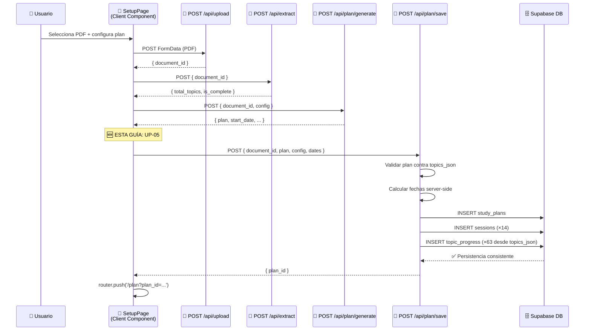
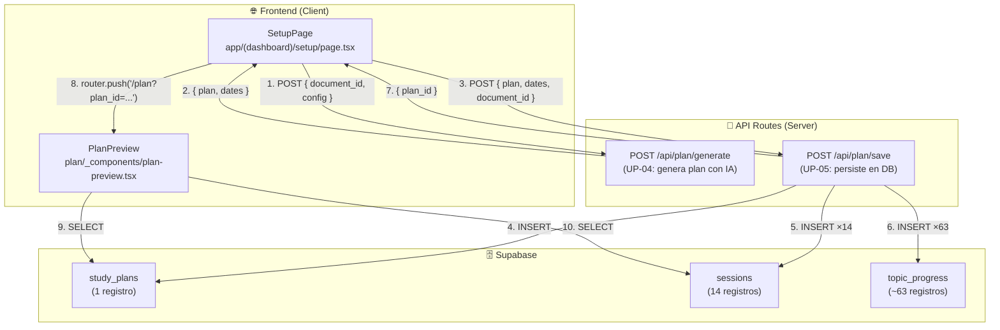
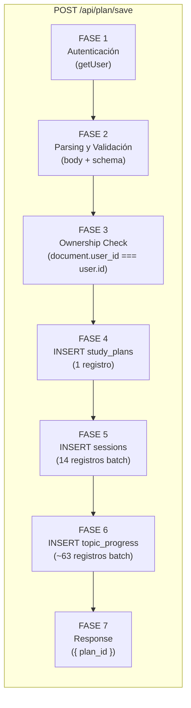

# UP-05 — Guardar Plan en Supabase (`study_plans` + `sessions` + `topic_progress`)

> **Bloque:** 📤 Upload y Plan  
> **Guía anterior:** [UP-04 — Prompt de generación de plan + API Route](file:///c:/Users/jsife/OneDrive/Desktop/Repositorios/practica-testing/docs/guides/fe/UP-04.md)  
> **Guía siguiente:** UP-06 — UI: Visualización del plan generado (calendario)  
> **Fecha:** Junio 2026

---

## Sección 1: 🎓 Introducción y Fundamentos Conceptuales

### ¿Dónde estamos?

En UP-04 logramos algo extraordinario: el usuario sube un PDF del syllabus ISTQB, nuestro backend extrae los ~63 tópicos, y un modelo de IA (Gemini 2.5 Flash o GPT-5) genera un **plan de estudio personalizado de 14 sesiones** distribuidas en 7 días. Sin embargo, hay un problema crítico: **el plan generado solo existe en la memoria del navegador** (`sessionStorage`). Si el usuario cierra la pestaña, recarga la página, o abre la URL en otra pestaña, **el plan desaparece por completo**.

**UP-05 resuelve este problema** persistiendo el plan en Supabase de forma consistente. Después de esta guía, el plan quedará almacenado de forma permanente en tres tablas:

| Tabla | Registros creados | Propósito |
|---|---|---|
| `study_plans` | 1 | El plan maestro con su JSON completo, fechas y estado |
| `sessions` | 14 (7 días × 2) | Una fila por sesión con tópicos, tipo, método y estado |
| `topic_progress` | ~63 | Una fila por tópico ISTQB con estado `'pending'` |

### ¿Por qué es crucial la persistencia consistente?

Imagina que estamos insertando las 14 sesiones y la conexión se interrumpe después de insertar la sesión 8. Sin una estrategia de consistencia y rollback, tendríamos:
- ✅ 8 sesiones insertadas
- ❌ 6 sesiones perdidas
- ❌ 0 registros de `topic_progress`
- ❌ Un plan inconsistente que el sistema adaptativo no puede procesar

En bases de datos relacionales, lo ideal es resolver esto con **transacciones ACID** (Atomicity, Consistency, Isolation, Durability). En Supabase hay dos caminos posibles:

| Enfoque | Ventaja | Cuándo usarlo |
|---|---|---|
| **RPC SQL transaccional** | ACID real con `BEGIN/COMMIT/ROLLBACK` dentro de PostgreSQL | Recomendado para producción cuando quieras máxima atomicidad |
| **Rollback compensatorio en Route Handler** | Más simple para aprender e implementar desde Next.js | Usaremos este enfoque en UP-05, con validación fuerte y limpieza manual si falla un paso |

Por eso esta guía hablará de **persistencia consistente con rollback manual**, no de una transacción ACID perfecta. La versión RPC puede ser una mejora posterior si quieres endurecer producción.

Las propiedades ACID ideales son:

| Propiedad | Significado | En nuestro caso |
|---|---|---|
| **Atomicidad** | Todo o nada | O se insertan las 3 tablas completas, o no se inserta nada |
| **Consistencia** | Los datos siempre cumplen las reglas | Los CHECK constraints de DB-02 se validan |
| **Aislamiento** | Las operaciones no interfieren entre sí | Dos usuarios generando planes simultáneamente no se afectan |
| **Durabilidad** | Una vez confirmado, no se pierde | Después del commit, el plan sobrevive reinicios del servidor |

### Analogía: La Mudanza Coordinada

Piensa en persistir el plan como una **mudanza coordinada**. No puedes mover solo el sofá y los platos, pero dejar la cama y la ropa. La mudanza solo se considera "exitosa" cuando TODO está en la nueva casa. Si el camión se descompone a medio camino, prefieres que todo vuelva a la casa original (rollback) en lugar de tener tus cosas repartidas entre dos lugares.

Nuestro "camión" es el flujo controlado del Route Handler. Las "cajas" son los INSERT en cada tabla. Si una caja falla, hacemos rollback compensatorio eliminando el `study_plan`, lo que también borra `sessions` por `ON DELETE CASCADE`.

### ¿Por qué Supabase Admin Client y no el SSR Client?

En UP-02 introdujimos `createAdminClient()` con la `SUPABASE_SERVICE_ROLE_KEY`. Para UP-05, necesitamos el admin client por estas razones:

1. **Bypass de RLS**: Las políticas RLS (DB-04) verifican `auth.uid()`. En un Route Handler, el admin client puede insertar registros con cualquier `user_id` **después de que nosotros verificamos manualmente la autenticación**. Esto evita problemas de cookies/tokens durante inserciones masivas.

2. **Inserción en múltiples tablas**: El admin client nos permite hacer INSERT en `study_plans`, `sessions` y `topic_progress` en una secuencia controlada, sin que RLS interfiera en las operaciones intermedias.

3. **Seguridad mantenida**: Aunque usamos admin client, **siempre verificamos la identidad del usuario con `getUser()` antes de cualquier operación**. El patrón es:
   ```
   1. supabase SSR → getUser() → ¿quién eres?
   2. admin client → INSERT con user_id verificado → operación privilegiada
   ```

### Patron de diseño: Separation of Concerns en el Route Handler

En esta guía mejoraremos la arquitectura del pipeline de creación del plan. Actualmente, `/api/plan/generate` hace todo el trabajo: genera el plan con IA y lo retorna. Ahora agregaremos un **nuevo Route Handler** `/api/plan/save` que se encarga exclusivamente de la persistencia:

| Responsabilidad | Route Handler | Principio |
|---|---|---|
| Generar el plan con IA | `POST /api/plan/generate` (UP-04) | Single Responsibility |
| Persistir el plan en DB | `POST /api/plan/save` (UP-05) | Single Responsibility |

Este diseño permite **reutilizar cada endpoint independientemente**: puedes regenerar un plan sin guardarlo, o guardar un plan previamente generado sin volver a llamar a la IA.

### Recap: Flujo Completo Actualizado



---

## Sección 2: 📋 Prerequisitos y Verificación del Entorno

### Herramientas y versiones requeridas

Antes de comenzar, verifica que tienes todo listo ejecutando estos comandos en **PowerShell**:

| Herramienta | Comando de verificación | Versión mínima |
|---|---|---|
| Node.js | `node --version` | v18.0.0+ |
| npm | `npm --version` | v9.0.0+ |
| Next.js (en `frontend/`) | `npx next --version` | 14.0.0+ |
| Supabase CLI | `supabase --version` | 1.100.0+ |

```powershell
# Verificar todo de una vez
node --version; npm --version; npx next --version
```

Salida esperada (versiones pueden variar):
```
v20.11.0
10.2.4
Next.js v15.3.3
```

### Entregables de guías anteriores que DEBEN existir

| Requisito | Guía | Verificación |
|---|---|---|
| Tablas `study_plans`, `sessions`, `topic_progress` | **DB-02** | Verificar en Supabase Table Editor |
| RLS policies en las 3 tablas | **DB-04** | `supabase db push` sin errores |
| `lib/supabase/admin.ts` | **FE-02 / UP-02** | Archivo existe en `frontend/lib/supabase/admin.ts` |
| `lib/supabase/server.ts` | **FE-02** | Archivo existe en `frontend/lib/supabase/server.ts` |
| Tipos TypeScript completos | **FE-02** | `frontend/types/database.ts` tiene `StudyPlanInsert`, `SessionInsert`, `TopicProgressInsert` |
| Route Handler `/api/plan/generate` | **UP-04** | `frontend/app/api/plan/generate/route.ts` funcional |
| Setup page con etapa "generating" | **UP-04** | `/setup` genera plan y redirige a `/plan` |
| Variables de entorno | **DB-01** | `.env.local` contiene `SUPABASE_SERVICE_ROLE_KEY` |

### Variables de entorno necesarias

Verifica que tu archivo `frontend/.env.local` contiene estas variables (creadas en **DB-01**, Paso B):

```powershell
# Desde la raíz del proyecto:
Get-Content frontend/.env.local | Select-String "SUPABASE"
```

Salida esperada (con valores reales, no estos de ejemplo):
```
NEXT_PUBLIC_SUPABASE_URL=https://xxxxx.supabase.co
NEXT_PUBLIC_SUPABASE_ANON_KEY=eyJhbGciOiJI...
SUPABASE_SERVICE_ROLE_KEY=eyJhbGciOiJI...
```

> ⚠️ **IMPORTANTE**: `SUPABASE_SERVICE_ROLE_KEY` NO debe llevar prefijo `NEXT_PUBLIC_`. Si lo tiene, tu service key se expondría al navegador.

---

## Sección 3: 📂 Estructura de Directorios del Proyecto

```
practica-testing/
├── backend/                          # FastAPI (BE-01 a BE-06)
├── docs/
│   ├── guides/
│   │   ├── be/                       # Guías del backend
│   │   ├── db/                       # Guías de la base de datos
│   │   └── fe/
│   │       ├── FE-01.md
│   │       ├── FE-02.md
│   │       ├── FE-03.md
│   │       ├── FE-04.md
│   │       ├── UP-01.md
│   │       ├── UP-02.md
│   │       ├── UP-03.md
│   │       ├── UP-04.md
│   │       └── UP-05.md              # ← 🆕 ESTA GUÍA
│   └── roadmap/
│       └── ISTQB_Guias_Implementacion.md
├── frontend/
│   ├── app/
│   │   ├── (auth)/
│   │   │   ├── login/page.tsx
│   │   │   └── register/page.tsx
│   │   ├── (dashboard)/
│   │   │   ├── _components/
│   │   │   │   ├── main-nav.tsx
│   │   │   │   ├── mobile-nav.tsx
│   │   │   │   └── user-menu.tsx
│   │   │   ├── dashboard/page.tsx
│   │   │   ├── plan/
│   │   │   │   ├── _components/
│   │   │   │   │   └── plan-preview.tsx    # Modificado en UP-05
│   │   │   │   └── page.tsx                # Modificado en UP-05
│   │   │   ├── setup/
│   │   │   │   ├── _components/
│   │   │   │   │   ├── file-preview.tsx
│   │   │   │   │   ├── pdf-dropzone.tsx
│   │   │   │   │   └── study-config.tsx
│   │   │   │   └── page.tsx                # Modificado en UP-05
│   │   │   ├── error.tsx
│   │   │   ├── layout.tsx
│   │   │   └── loading.tsx
│   │   ├── api/
│   │   │   ├── extract/route.ts
│   │   │   ├── plan/
│   │   │   │   ├── generate/route.ts
│   │   │   │   └── save/                   # ← 🆕 NUEVO
│   │   │   │       └── route.ts            # ← 🆕 NUEVO
│   │   │   └── upload/route.ts
│   │   ├── auth/
│   │   │   └── callback/route.ts
│   │   ├── globals.css
│   │   ├── layout.tsx
│   │   └── page.tsx
│   ├── components/
│   │   ├── shared/
│   │   └── ui/
│   ├── lib/
│   │   ├── supabase/
│   │   │   ├── admin.ts
│   │   │   ├── client.ts
│   │   │   └── server.ts
│   │   ├── format.ts
│   │   ├── openai.ts
│   │   └── utils.ts
│   ├── types/
│   │   ├── database.ts
│   │   └── index.ts
│   ├── middleware.ts
│   ├── package.json
│   └── tsconfig.json
└── supabase/
    └── migrations/
        ├── 20260522183543_remote_schema.sql
        ├── 20260531183745_create_schema.sql
        ├── 20260531221544_create_storage_bucket.sql
        ├── 20260601015125_create_rls_policies.sql
        └── 20260621224042_create_auth_trigger.sql
```

### Archivos nuevos y modificados en esta guía

| Acción | Archivo | Descripción |
|---|---|---|
| 🆕 **NUEVO** | `app/api/plan/save/route.ts` | Route Handler para persistir el plan en Supabase |
| ✏️ **MODIFICAR** | `app/(dashboard)/setup/page.tsx` | Agregar etapa "saving" que llama a `/api/plan/save` |
| ✏️ **MODIFICAR** | `app/(dashboard)/plan/page.tsx` | Aceptar `plan_id` como query param y auto-detectar plan activo |
| ✏️ **MODIFICAR** | `app/(dashboard)/plan/_components/plan-preview.tsx` | Leer el plan desde Supabase en lugar de `sessionStorage` |
| ✏️ **MODIFICAR** | `app/(dashboard)/_components/main-nav.tsx` | "Mi Plan" ahora apunta a `/plan` en lugar de `/setup` |
| ✏️ **MODIFICAR** | `app/(dashboard)/_components/mobile-nav.tsx` | "Mi Plan" ahora apunta a `/plan` en lugar de `/setup` |

---

## Sección 4: 🎨 Diagrama de Arquitectura de Componentes

### Flujo de datos: De la generación a la persistencia



### Capas del Route Handler `/api/plan/save`



---

## Sección 5: 🛠️ Implementación Paso a Paso

### Paso A: Crear el Route Handler `POST /api/plan/save`

**Archivo:** `frontend/app/api/plan/save/route.ts`  
**Tipo:** Route Handler (server-only)  
**Función:** Recibe el plan generado por UP-04 y lo persiste en 3 tablas de Supabase.

Este es el corazón de UP-05. El Route Handler sigue 7 fases, igual que los anteriores:

```typescript
// ─────────────────────────────────────────────────────────────────
// app/api/plan/save/route.ts
// Route Handler: persiste el plan generado por /api/plan/generate
// en las tablas study_plans, sessions y topic_progress de Supabase.
//
// Método: POST
// Content-Type: application/json
// Body:
//   {
//     document_id: string,
//     plan: GeneratedPlan,       // El plan completo retornado por UP-04
//     config: {
//       objective_days: number,
//       morning_time: string,    // "HH:MM"
//       night_time: string       // "HH:MM"
//     }
//   }
//
// Response (201): { plan_id: string, sessions_created: number, topics_created: number, start_date, estimated_end_date }
// Response (401): { error: "No autenticado" }
// Response (400): { error: "Body inválido" }
// Response (403): { error: "No tienes permisos" }
// Response (404): { error: "Documento no encontrado" }
// Response (409): { error: "Ya existe un plan activo para este documento" }
// Response (500): { error: "Error interno del servidor" }
// ─────────────────────────────────────────────────────────────────

import { NextResponse } from "next/server";
import { createClient } from "@/lib/supabase/server";
import { createAdminClient } from "@/lib/supabase/admin";
import type {
  TopicsJson,
  TopicEntry,
  StudyPlanInsert,
  SessionInsert,
  TopicProgressInsert,
  SessionType,
  MethodUsed,
} from "@/types";

// ─── Forzar Node.js runtime ──────────────────────────────────────
// Las operaciones de base de datos requieren Node.js, no Edge.
export const runtime = "nodejs";

// ─────────────────────────────────────────────────────────────────
// TIPOS INTERNOS
// ─────────────────────────────────────────────────────────────────

// ─── Tipo de sesión en el plan generado por la IA (UP-04) ────────
// Coincide con el tipo PlanSession de /api/plan/generate/route.ts.
interface PlanSession {
  day_number: number;
  session_type: "morning" | "night";
  topic_codes: string[];
  method: "theory" | "examples" | "analogies";
  estimated_duration_minutes: number;
  difficulty: "easy" | "medium" | "hard";
  title: string;
}

// ─── Tipo del plan generado completo ─────────────────────────────
interface GeneratedPlan {
  sessions: PlanSession[];
  total_sessions: number;
  total_days: number;
  topics_per_level: {
    K1: number;
    K2: number;
    K3: number;
  };
  plan_summary: string;
  coverage: {
    total_topics: number;
    covered_topic_codes: string[];
    omitted_topic_codes: string[];
  };
}

// ─── Tipo del body esperado ──────────────────────────────────────
interface SavePlanBody {
  document_id: string;
  plan: GeneratedPlan;
  config: {
    objective_days: number;
    morning_time: string;
    night_time: string;
  };
}

// ─── Constantes de validación ────────────────────────────────────
const MIN_DAYS = 1;
const MAX_DAYS = 30;

// ─── Type guard para validar objetos ─────────────────────────────
function isRecord(value: unknown): value is Record<string, unknown> {
  return typeof value === "object" && value !== null && !Array.isArray(value);
}

// ─── Parser y validador del body ─────────────────────────────────
// Separamos la validación en una función pura para mantener el
// Route Handler limpio y facilitar testing futuro.
function parseBody(value: unknown): SavePlanBody | null {
  if (!isRecord(value)) return null;

  const { document_id, plan, config } = value;

  // ── Validar document_id ─────────────────────────────────────
  if (typeof document_id !== "string" || document_id.length === 0) return null;

  // ── Validar plan ────────────────────────────────────────────
  if (!isRecord(plan)) return null;
  const planObj = plan as unknown as GeneratedPlan;

  if (!Array.isArray(planObj.sessions) || planObj.sessions.length === 0) {
    return null;
  }

  // Verificar que cada sesión tiene los campos mínimos
  for (const session of planObj.sessions) {
    if (typeof session.day_number !== "number") return null;
    if (!["morning", "night"].includes(session.session_type)) return null;
    if (!Array.isArray(session.topic_codes)) return null;
  }

  // ── Validar config ──────────────────────────────────────────
  if (!isRecord(config)) return null;

  const { objective_days, morning_time, night_time } = config;

  if (
    typeof objective_days !== "number" ||
    objective_days < MIN_DAYS ||
    objective_days > MAX_DAYS
  ) {
    return null;
  }

  if (typeof morning_time !== "string" || !/^\d{2}:\d{2}$/.test(morning_time)) {
    return null;
  }

  if (typeof night_time !== "string" || !/^\d{2}:\d{2}$/.test(night_time)) {
    return null;
  }

  return {
    document_id,
    plan: planObj,
    config: {
      objective_days: objective_days as number,
      morning_time: morning_time as string,
      night_time: night_time as string,
    },
  };
}

// ─────────────────────────────────────────────────────────────────
// HELPERS DE TRANSFORMACIÓN
// ─────────────────────────────────────────────────────────────────

/**
 * Calcula fechas del plan en el servidor.
 *
 * No confiamos en start_date / estimated_end_date enviados desde el
 * navegador porque son datos derivables y podrían ser manipulados.
 */
function calculatePlanDates(objectiveDays: number) {
  const today = new Date();
  const startDate = today.toISOString().split("T")[0];

  const endDate = new Date(today);
  endDate.setDate(endDate.getDate() + objectiveDays - 1);

  return {
    start_date: startDate,
    estimated_end_date: endDate.toISOString().split("T")[0],
  };
}

/**
 * Revalida el plan generado contra los tópicos reales del documento.
 *
 * Aunque /api/plan/generate ya validó el plan en UP-04, /api/plan/save
 * recibe datos desde el navegador. Por seguridad, aquí repetimos las
 * reglas críticas antes de persistir en Supabase.
 */
function validatePlanAgainstTopics(
  plan: GeneratedPlan,
  topicsJson: TopicsJson,
  expectedDays: number,
): string[] {
  const errors: string[] = [];
  const originalCodes = new Set(Object.keys(topicsJson));
  const expectedSessions = expectedDays * 2;

  if (!Array.isArray(plan.sessions)) {
    return ["El plan no contiene sessions válido."];
  }

  if (plan.sessions.length !== expectedSessions) {
    errors.push(
      `El plan contiene ${plan.sessions.length} sesiones, pero se esperaban ${expectedSessions}.`,
    );
  }

  if (plan.total_sessions !== expectedSessions) {
    errors.push(
      `total_sessions debe ser ${expectedSessions}, pero llegó ${plan.total_sessions}.`,
    );
  }

  if (plan.total_days !== expectedDays) {
    errors.push(
      `total_days debe ser ${expectedDays}, pero llegó ${plan.total_days}.`,
    );
  }

  if (!plan.coverage || typeof plan.coverage !== "object") {
    errors.push("El plan no contiene coverage válido.");
    return errors;
  }

  if (plan.coverage.total_topics !== originalCodes.size) {
    errors.push(
      `coverage.total_topics debe ser ${originalCodes.size}, pero llegó ${plan.coverage.total_topics}.`,
    );
  }

  const allTopicCodes: string[] = [];

  for (let index = 0; index < plan.sessions.length; index++) {
    const session = plan.sessions[index];

    if (typeof session.day_number !== "number" || session.day_number < 1) {
      errors.push(`Sesión ${index + 1}: day_number inválido.`);
    }

    if (!["morning", "night"].includes(session.session_type)) {
      errors.push(`Sesión ${index + 1}: session_type inválido.`);
    }

    if (!Array.isArray(session.topic_codes) || session.topic_codes.length === 0) {
      errors.push(`Sesión ${index + 1}: topic_codes vacío o inválido.`);
      continue;
    }

    for (const code of session.topic_codes) {
      allTopicCodes.push(code);
      if (!originalCodes.has(code)) {
        errors.push(`Sesión ${index + 1}: topic_code inexistente: ${code}.`);
      }
    }
  }

  const codeSet = new Set<string>();
  const duplicates = new Set<string>();

  for (const code of allTopicCodes) {
    if (codeSet.has(code)) duplicates.add(code);
    codeSet.add(code);
  }

  if (duplicates.size > 0) {
    errors.push(`Tópicos duplicados: ${Array.from(duplicates).join(", ")}.`);
  }

  const omittedCodes = new Set(plan.coverage.omitted_topic_codes || []);
  const coveredCodes = new Set(plan.coverage.covered_topic_codes || []);

  const missingTopics = Array.from(originalCodes).filter(
    (code) => !codeSet.has(code) && !omittedCodes.has(code),
  );

  if (missingTopics.length > 0) {
    errors.push(
      `Tópicos omitidos sin declarar: ${missingTopics.join(", ")}.`,
    );
  }

  const usedButNotCovered = Array.from(codeSet).filter(
    (code) => !coveredCodes.has(code),
  );

  if (usedButNotCovered.length > 0) {
    errors.push(
      `Tópicos usados pero ausentes en coverage.covered_topic_codes: ${usedButNotCovered.join(", ")}.`,
    );
  }

  const maxDayInPlan = Math.max(...plan.sessions.map((session) => session.day_number));
  if (maxDayInPlan > expectedDays) {
    errors.push(
      `El plan tiene sesiones hasta el día ${maxDayInPlan}, pero el objetivo es ${expectedDays}.`,
    );
  }

  return errors;
}

/**
 * Calcula la hora programada (scheduled_at) de una sesión.
 *
 * Combina la fecha del día (start_date + day_number - 1) con la
 * hora de la sesión (morning_time o night_time).
 *
 * @param startDate    - Fecha de inicio del plan ("YYYY-MM-DD")
 * @param dayNumber    - Número del día dentro del plan (1-based)
 * @param sessionType  - "morning" o "night"
 * @param morningTime  - Hora de la sesión matutina ("HH:MM")
 * @param nightTime    - Hora de la sesión nocturna ("HH:MM")
 * @returns ISO string con fecha y hora (e.g., "2026-06-28T06:00:00")
 */
function calculateScheduledAt(
  startDate: string,
  dayNumber: number,
  sessionType: "morning" | "night",
  morningTime: string,
  nightTime: string,
): string {
  // Crear la fecha del día correspondiente
  const date = new Date(startDate + "T00:00:00");
  date.setDate(date.getDate() + dayNumber - 1);

  // Elegir la hora según el tipo de sesión
  const time = sessionType === "morning" ? morningTime : nightTime;
  const [hours, minutes] = time.split(":").map(Number);

  date.setHours(hours, minutes, 0, 0);

  return date.toISOString();
}

/**
 * Transforma las sesiones del plan generado por la IA en objetos
 * listos para INSERT en la tabla `sessions` de Supabase.
 *
 * Cada sesión del plan de la IA se mapea a un SessionInsert con:
 * - study_plan_id: el ID del plan recién creado
 * - user_id: el ID del usuario autenticado
 * - topic_codes: array de códigos de tópicos
 * - session_type: "morning" o "night" (cast a SessionType)
 * - day_number: número del día
 * - scheduled_at: fecha+hora calculada
 * - duration_minutes: duración estimada (default 90)
 * - method_used: "theory" (cast a MethodUsed)
 * - status: "pending"
 */
function buildSessionInserts(
  planSessions: PlanSession[],
  planId: string,
  userId: string,
  startDate: string,
  morningTime: string,
  nightTime: string,
): SessionInsert[] {
  return planSessions.map((session) => ({
    study_plan_id: planId,
    user_id: userId,
    topic_codes: session.topic_codes,
    session_type: session.session_type as SessionType,
    day_number: session.day_number,
    scheduled_at: calculateScheduledAt(
      startDate,
      session.day_number,
      session.session_type,
      morningTime,
      nightTime,
    ),
    duration_minutes: session.estimated_duration_minutes || 90,
    method_used: (session.method || "theory") as MethodUsed,
    status: "pending" as const,
    attempt_number: 1,
  }));
}

/**
 * Construye los registros de topic_progress para TODOS los tópicos reales
 * del documento.
 *
 * Cada tópico ISTQB (ej. FL-1.1.1) obtiene un registro con:
 * - status: 'pending' (aún no estudiado)
 * - attempts: 0
 * - best_score: 0
 * - last_score: 0
 * - level_k y topic_name extraídos de topics_json
 *
 * No usamos coverage.covered_topic_codes como fuente de verdad porque
 * viene del plan generado y podría estar incompleto o manipulado.
 * La fuente canónica es documents.topics_json.
 */
function buildTopicProgressInserts(
  topicsJson: TopicsJson,
  planId: string,
  userId: string,
): TopicProgressInsert[] {
  return Object.keys(topicsJson)
    .sort()
    .map((code) => {
      const topic: TopicEntry = topicsJson[code];

      return {
        user_id: userId,
        study_plan_id: planId,
        topic_code: code,
        topic_name: topic.name || null,
        level_k: topic.level_k || null,
        attempts: 0,
        best_score: 0,
        last_score: 0,
        status: "pending" as const,
      };
    });
}

// ─────────────────────────────────────────────────────────────────
// ROUTE HANDLER
// ─────────────────────────────────────────────────────────────────

export async function POST(request: Request) {
  try {
    // ═══════════════════════════════════════════════════════════
    // FASE 1: AUTENTICACIÓN
    // ═══════════════════════════════════════════════════════════

    const supabase = await createClient();

    const {
      data: { user },
      error: authError,
    } = await supabase.auth.getUser();

    if (authError || !user) {
      return NextResponse.json(
        { error: "No autenticado. Por favor inicia sesión." },
        { status: 401 },
      );
    }

    // ═══════════════════════════════════════════════════════════
    // FASE 2: PARSING Y VALIDACIÓN DEL BODY
    // ═══════════════════════════════════════════════════════════

    let rawBody: unknown;

    try {
      rawBody = await request.json();
    } catch {
      return NextResponse.json(
        { error: "Body inválido. Se espera JSON." },
        { status: 400 },
      );
    }

    const body = parseBody(rawBody);

    if (!body) {
      return NextResponse.json(
        {
          error:
            "Body inválido. Esperado: { document_id, plan, config }.",
        },
        { status: 400 },
      );
    }

    const { document_id, plan, config } = body;

    console.log(
      `[Plan/Save] Guardando plan para documento ${document_id}: ` +
        `${plan.sessions.length} sesiones, ` +
        `${plan.coverage.total_topics} tópicos, ` +
        `${config.objective_days} días`,
    );

    // ═══════════════════════════════════════════════════════════
    // FASE 3: OWNERSHIP CHECK
    // Verificar que el documento pertenece al usuario autenticado.
    // ═══════════════════════════════════════════════════════════

    const adminClient = createAdminClient();

    const { data: document, error: docError } = await adminClient
      .from("documents")
      .select("id, user_id, topics_json")
      .eq("id", document_id)
      .single();

    if (docError || !document) {
      console.error("[Plan/Save] Documento no encontrado:", docError);
      return NextResponse.json(
        { error: "Documento no encontrado." },
        { status: 404 },
      );
    }

    if (document.user_id !== user.id) {
      console.warn(
        `[Plan/Save] ⚠️ Usuario ${user.id} intentó guardar plan para documento de ${document.user_id}`,
      );
      return NextResponse.json(
        { error: "No tienes permisos para acceder a este documento." },
        { status: 403 },
      );
    }

    // ── Verificar topics_json para construir topic_progress ────
    const topicsJson = document.topics_json as TopicsJson | null;

    if (!topicsJson || Object.keys(topicsJson).length === 0) {
      return NextResponse.json(
        {
          error:
            "El documento no tiene tópicos extraídos. " +
            "Primero completa la extracción (UP-03).",
        },
        { status: 400 },
      );
    }

    // ── Revalidar el plan contra los tópicos reales ───────────
    const validationErrors = validatePlanAgainstTopics(
      plan,
      topicsJson,
      config.objective_days,
    );

    if (validationErrors.length > 0) {
      console.error("[Plan/Save] Plan inválido:", validationErrors);
      return NextResponse.json(
        {
          error:
            "El plan recibido no cumple con los requisitos: " +
            validationErrors.join("; "),
        },
        { status: 400 },
      );
    }

    // ── Calcular fechas en servidor ───────────────────────────
    const { start_date, estimated_end_date } = calculatePlanDates(
      config.objective_days,
    );

    // ═══════════════════════════════════════════════════════════
    // FASE 3.5: VERIFICAR DUPLICADOS
    // Evitar crear múltiples planes activos para el mismo documento.
    // ═══════════════════════════════════════════════════════════

    const { data: existingPlan } = await adminClient
      .from("study_plans")
      .select("id")
      .eq("user_id", user.id)
      .eq("document_id", document_id)
      .eq("status", "active")
      .maybeSingle();

    if (existingPlan) {
      console.warn(
        `[Plan/Save] Ya existe un plan activo (${existingPlan.id}) para documento ${document_id}`,
      );
      return NextResponse.json(
        {
          error:
            "Ya existe un plan de estudio activo para este documento. " +
            "Complétalo o abandónalo antes de crear uno nuevo.",
          existing_plan_id: existingPlan.id,
        },
        { status: 409 },
      );
    }

    // ═══════════════════════════════════════════════════════════
    // FASE 4: INSERT study_plans
    // Crear el registro maestro del plan de estudio.
    // ═══════════════════════════════════════════════════════════

    const studyPlanInsert: StudyPlanInsert = {
      user_id: user.id,
      document_id,
      objective_days: config.objective_days,
      start_date,
      estimated_end_date,
      plan_json: plan as unknown as Record<string, unknown>,
      status: "active",
    };

    const { data: createdPlan, error: planError } = await adminClient
      .from("study_plans")
      .insert(studyPlanInsert)
      .select("id")
      .single();

    if (planError || !createdPlan) {
      console.error("[Plan/Save] Error al insertar study_plan:", planError);
      return NextResponse.json(
        {
          error:
            "Error al guardar el plan de estudio. " +
            (planError?.message || "Error desconocido."),
        },
        { status: 500 },
      );
    }

    const planId = createdPlan.id;
    console.log(`[Plan/Save] ✅ study_plans insertado: ${planId}`);

    // ═══════════════════════════════════════════════════════════
    // FASE 5: INSERT sessions (batch)
    // Crear las 14 sesiones del plan.
    // ═══════════════════════════════════════════════════════════

    const sessionInserts = buildSessionInserts(
      plan.sessions,
      planId,
      user.id,
      start_date,
      config.morning_time,
      config.night_time,
    );

    const { data: createdSessions, error: sessionsError } = await adminClient
      .from("sessions")
      .insert(sessionInserts)
      .select("id");

    if (sessionsError) {
      console.error("[Plan/Save] Error al insertar sessions:", sessionsError);

      // ── Rollback manual: eliminar el plan que ya se insertó ──
      // Supabase no tiene transacciones nativas en el SDK,
      // así que hacemos rollback manual eliminando el plan.
      // ON DELETE CASCADE en sessions borrará las sesiones parciales.
      await adminClient.from("study_plans").delete().eq("id", planId);

      console.log(`[Plan/Save] 🔄 Rollback: plan ${planId} eliminado`);

      return NextResponse.json(
        {
          error:
            "Error al guardar las sesiones del plan. " +
            "La operación se revirtió. " +
            (sessionsError.message || "Error desconocido."),
        },
        { status: 500 },
      );
    }

    const sessionsCreated = createdSessions?.length || 0;
    console.log(`[Plan/Save] ✅ sessions insertadas: ${sessionsCreated}`);

    // ═══════════════════════════════════════════════════════════
    // FASE 6: INSERT topic_progress (batch)
    // Crear un registro de progreso por cada tópico.
    // ═══════════════════════════════════════════════════════════

    const topicProgressInserts = buildTopicProgressInserts(
      topicsJson,
      planId,
      user.id,
    );

    const { data: createdTopics, error: topicsError } = await adminClient
      .from("topic_progress")
      .insert(topicProgressInserts)
      .select("id");

    if (topicsError) {
      console.error(
        "[Plan/Save] Error al insertar topic_progress:",
        topicsError,
      );

      // ── Rollback manual: eliminar plan + sessions ──────────
      // ON DELETE CASCADE se encarga de eliminar sessions también.
      await adminClient.from("study_plans").delete().eq("id", planId);

      console.log(
        `[Plan/Save] 🔄 Rollback: plan ${planId} + sessions eliminados`,
      );

      return NextResponse.json(
        {
          error:
            "Error al guardar el progreso de tópicos. " +
            "La operación se revirtió. " +
            (topicsError.message || "Error desconocido."),
        },
        { status: 500 },
      );
    }

    const topicsCreated = createdTopics?.length || 0;
    console.log(`[Plan/Save] ✅ topic_progress insertados: ${topicsCreated}`);

    // ═══════════════════════════════════════════════════════════
    // FASE 7: RESPUESTA EXITOSA
    // ═══════════════════════════════════════════════════════════

    console.log(
      `[Plan/Save] ✅ Plan persistido exitosamente: ` +
        `plan_id=${planId}, ` +
        `${sessionsCreated} sesiones, ` +
        `${topicsCreated} tópicos`,
    );

    return NextResponse.json(
      {
        plan_id: planId,
        sessions_created: sessionsCreated,
        topics_created: topicsCreated,
        start_date,
        estimated_end_date,
      },
      { status: 201 },
    );
  } catch (error) {
    // ─── Error no controlado ──────────────────────────────────
    console.error("[Plan/Save] Error no controlado:", error);

    return NextResponse.json(
      {
        error: "Error interno del servidor. Por favor intenta de nuevo.",
      },
      { status: 500 },
    );
  }
}
```

**Entregable del Paso A:**
- ✅ Archivo creado: `frontend/app/api/plan/save/route.ts`
- ✅ El endpoint revalida el plan contra `documents.topics_json` antes de insertar
- ✅ Las fechas `start_date` y `estimated_end_date` se calculan en servidor
- ✅ `topic_progress` se construye desde `topics_json`, no desde `coverage` del plan
- ✅ Si falla `sessions` o `topic_progress`, se aplica rollback compensatorio eliminando `study_plans`

---

### Paso B: Modificar SetupPage para agregar la etapa de guardado

**Archivo:** `frontend/app/(dashboard)/setup/page.tsx`  
**Cambios:** Agregar la etapa "saving" entre "generating" y "complete", que llama a `/api/plan/save`.

En UP-04, después de generar el plan, la página guardaba el plan temporalmente en `sessionStorage` y redirigía a `/plan?document_id=...`. Ahora, **entre la generación y la navegación**, insertamos una nueva etapa que persiste el plan en Supabase.

#### Cambios específicos a realizar

**1. El tipo `PlanResult` necesita incluir `plan_id`:**

Buscar en `setup/page.tsx`:
```typescript
interface PlanResult {
  total_sessions: number;
  start_date: string;
  estimated_end_date: string;
  model_used: string;
}
```

Reemplazar con:
```typescript
// ─── Tipo del resultado de la generación + persistencia ─────────
interface PlanResult {
  total_sessions: number;
  start_date: string;
  estimated_end_date: string;
  model_used: string;
  plan_id: string | null;  // 🆕 null si solo se generó, string si se persistió
}
```

**2. Agregar la etapa "saving" al `handleSubmit`:**

Localizar el bloque que actualmente dice:

```typescript
      // UP-04 aun no persiste el plan en Supabase. Lo guardamos de forma
      // temporal en la pestana actual para que /plan pueda mostrarlo.
      try {
        sessionStorage.setItem(
          `istqb-plan:${uploadData.document_id}`,
          JSON.stringify({
            ...planData,
            saved_at: new Date().toISOString(),
          }),
        );
      } catch (storageError) {
        console.warn(
          "[Setup] No se pudo guardar el plan temporal:",
          storageError,
        );
      }

      // ─── ETAPA 4: Completado ────────────────────────────────
      setStage("complete");
```

Reemplazar con:

```typescript
      // ─── ETAPA 4: 🆕 Guardar plan en Supabase (UP-05) ──────
      setStage("saving");

      const saveResponse = await fetch("/api/plan/save", {
        method: "POST",
        headers: {
          "Content-Type": "application/json",
        },
        body: JSON.stringify({
          document_id: uploadData.document_id,
          plan: planData.plan,
          config: {
            objective_days: config.objectiveDays,
            morning_time: config.morningTime,
            night_time: config.nightTime,
          },
        }),
      });

      const saveData = await saveResponse.json();

      if (!saveResponse.ok) {
        throw new Error(
          saveData.error || "Error al guardar el plan en la base de datos.",
        );
      }

      console.log(
        `[Setup] ✅ Plan persistido: plan_id=${saveData.plan_id}, ` +
          `${saveData.sessions_created} sesiones, ` +
          `${saveData.topics_created} tópicos`,
      );

      // ─── Guardar resultado del plan ─────────────────────────
      setPlanResult({
        total_sessions: planData.total_sessions,
        start_date: saveData.start_date,
        estimated_end_date: saveData.estimated_end_date,
        model_used: planData.model_used,
        plan_id: saveData.plan_id,
      });

      // ─── ETAPA 5: Completado ────────────────────────────────
      setStage("complete");
```

**3. Actualizar el `setPlanResult` anterior (el de la etapa de generación):**

Buscar el bloque que está justo ANTES del bloque que acabamos de reemplazar y **agregar `plan_id: null`** (el valor real se asigna en la etapa "saving"):
```typescript
      // ─── Guardar resultado del plan ─────────────────────────
      setPlanResult({
        total_sessions: planData.total_sessions,
        start_date: planData.start_date,
        estimated_end_date: planData.estimated_end_date,
        model_used: planData.model_used,
        plan_id: null, // Aún no persistido; se llena en etapa "saving"
      });
```

**4. Actualizar la navegación para usar `plan_id`:**

Buscar:
```typescript
      setTimeout(() => {
        router.push(`/plan?document_id=${uploadData.document_id}`);
      }, 3000);
```

Reemplazar con:
```typescript
      // ─── Navegar a la vista del plan ────────────────────────
      // UP-05: ahora usamos plan_id en lugar de document_id.
      // El plan se carga desde Supabase, no desde sessionStorage.
      setTimeout(() => {
        router.push(`/plan?plan_id=${saveData.plan_id}`);
      }, 3000);
```

**5. Actualizar el `getProgressPercent` para reflejar 5 etapas:**

Buscar:
```typescript
  const getProgressPercent = (): string => {
    switch (stage) {
      case "uploading":
        return "20%";
      case "extracting":
        return "45%";
      case "generating":
        return "75%";
      case "saving":
        return "90%";
      case "complete":
        return "100%";
      default:
        return "0%";
    }
  };
```

Este ya está correcto — no requiere cambios. La etapa "saving" ya tenía un 90% asignado desde UP-04 de forma anticipada. ✅

**6. Actualizar el mensaje de `STAGE_MESSAGES` para "saving":**

Buscar la línea:
```typescript
  saving: "Guardando resultados...",
```

Reemplazar con un mensaje más descriptivo:
```typescript
  saving: "Guardando plan en la base de datos... Creando sesiones y progreso de tópicos.",
```

**7. Mostrar `plan_id` en el resultado del plan:**

En la sección del JSX que muestra `planResult`, agregar un indicador del plan guardado. Buscar el bloque que contiene `{/* 🆕 Resultado de la generación del plan */}` y después de la línea del modelo, agregar:

```tsx
                {planResult.plan_id && (
                  <p>
                    💾 Plan ID:{" "}
                    <span className="text-emerald-400 font-mono text-[10px]">
                      {planResult.plan_id}
                    </span>
                  </p>
                )}
```

**Entregable del Paso B:**
- ✅ Archivo modificado: `frontend/app/(dashboard)/setup/page.tsx`
- ✅ La etapa "saving" llama a `/api/plan/save` con los datos del plan
- ✅ La navegación usa `plan_id` en lugar de `document_id`
- ✅ El `sessionStorage` temporal de UP-04 ya no se usa

---

### Paso C: Modificar la página `/plan` para aceptar `plan_id`

**Archivo:** `frontend/app/(dashboard)/plan/page.tsx`  
**Cambios:** Aceptar `plan_id` como query parameter y **auto-detectar** el plan activo cuando no hay params (navegación desde "Mi Plan").

```typescript
import { PlanPreview } from "./_components/plan-preview";
import { createClient } from "@/lib/supabase/server";

type PlanPageProps = {
  searchParams: Promise<{
    plan_id?: string | string[];
    document_id?: string | string[]; // Mantener para backward compat
  }>;
};

export default async function PlanPage({ searchParams }: PlanPageProps) {
  const params = await searchParams;

  // 🆕 UP-05: Priorizar plan_id sobre document_id
  const rawPlanId = params.plan_id;
  let planId: string | null = Array.isArray(rawPlanId)
    ? rawPlanId[0]
    : rawPlanId || null;

  // Backward compat: si solo llega document_id (planes viejos de UP-04)
  const rawDocumentId = params.document_id;
  const documentId = Array.isArray(rawDocumentId)
    ? rawDocumentId[0]
    : rawDocumentId || null;

  // ── Auto-detección de plan activo ──────────────────────────
  // Cuando el usuario navega a /plan sin query params (ej. desde
  // el nav "Mi Plan"), buscamos su plan activo en Supabase.
  if (!planId && !documentId) {
    const supabase = await createClient();
    const { data: { user } } = await supabase.auth.getUser();

    if (user) {
      const { data: activePlan } = await supabase
        .from("study_plans")
        .select("id")
        .eq("user_id", user.id)
        .eq("status", "active")
        .order("created_at", { ascending: false })
        .limit(1)
        .maybeSingle();

      if (activePlan) planId = activePlan.id;
    }
  }

  return <PlanPreview planId={planId} documentId={documentId} />;
}
```

**Entregable del Paso C:**
- ✅ Archivo modificado: `frontend/app/(dashboard)/plan/page.tsx`
- ✅ Acepta `plan_id` como query parameter principal
- ✅ Mantiene backward compatibility con `document_id`
- ✅ 🆕 Auto-detecta plan activo al visitar `/plan` sin params (navegación desde "Mi Plan")

---

### Paso D: Reescribir `PlanPreview` para leer desde Supabase

**Archivo:** `frontend/app/(dashboard)/plan/_components/plan-preview.tsx`  
**Cambios:** En lugar de leer de `sessionStorage`, carga el plan persistido desde Supabase como **Server Component**.

Este es el componente más significativo de la guía. Pasa de ser un visor de datos temporales a un **componente que lee datos reales de la base de datos**. Lo hacemos como Server Component para evitar el patrón `useEffect + setState`, que en este proyecto dispara la regla ESLint `react-hooks/set-state-in-effect`.

```tsx
import Link from "next/link";
import { createClient } from "@/lib/supabase/server";

// ─── Tipos ────────────────────────────────────────────────────────

type PlanSession = {
  id: string;
  day_number: number;
  session_type: string;
  topic_codes: string[];
  method_used: string;
  duration_minutes: number;
  status: string;
  scheduled_at: string | null;
  score_percent: number | null;
};

type StudyPlan = {
  id: string;
  document_id: string;
  objective_days: number;
  start_date: string;
  estimated_end_date: string;
  status: string;
  plan_json: {
    plan_summary?: string;
    coverage?: {
      total_topics?: number;
      covered_topic_codes?: string[];
      omitted_topic_codes?: string[];
    };
    sessions?: Array<{
      day_number?: number;
      session_type?: string;
      difficulty?: string;
      title?: string;
    }>;
  };
  created_at: string;
};

type PlanPreviewProps = {
  planId: string | null;
  documentId: string | null; // backward compat
};

// ─── Helpers ──────────────────────────────────────────────────────

function getSessionLabel(sessionType: string) {
  if (sessionType === "morning") return "Mañana";
  if (sessionType === "night") return "Noche";
  if (sessionType === "reinforcement") return "Refuerzo";
  if (sessionType === "mock_exam") return "Simulacro";
  return sessionType;
}

function getSessionOrder(sessionType: string) {
  if (sessionType === "morning") return 1;
  if (sessionType === "night") return 2;
  if (sessionType === "reinforcement") return 3;
  return 4;
}

function getDifficultyBadge(difficulty?: string) {
  switch (difficulty) {
    case "easy":
      return { label: "Fácil", className: "bg-emerald-500/20 text-emerald-300 border-emerald-500/30" };
    case "medium":
      return { label: "Medio", className: "bg-amber-500/20 text-amber-300 border-amber-500/30" };
    case "hard":
      return { label: "Difícil", className: "bg-red-500/20 text-red-300 border-red-500/30" };
    default:
      return null;
  }
}

function findPlanJsonSession(
  planJsonSessions: StudyPlan["plan_json"]["sessions"],
  persistedSession: PlanSession,
) {
  return planJsonSessions?.find(
    (jsonSession) =>
      jsonSession.day_number === persistedSession.day_number &&
      jsonSession.session_type === persistedSession.session_type,
  );
}

// ─── Componente principal ─────────────────────────────────────────

export async function PlanPreview({ planId, documentId }: PlanPreviewProps) {
  if (!planId && !documentId) {
    return (
      <EmptyState
        title="Plan no encontrado"
        message="La URL no incluye plan_id ni document_id. Vuelve a generar el plan desde Mi Plan."
      />
    );
  }

  const supabase = await createClient();

  // Priorizar plan_id (UP-05+) sobre document_id (UP-04 legacy).
  let planQuery = supabase.from("study_plans").select("*");

  if (planId) {
    planQuery = planQuery.eq("id", planId);
  } else if (documentId) {
    planQuery = planQuery
      .eq("document_id", documentId)
      .eq("status", "active")
      .order("created_at", { ascending: false })
      .limit(1);
  }

  const { data: planData, error: planError } = await planQuery.maybeSingle();

  if (planError) {
    console.error("[PlanPreview] Error al cargar plan:", planError);
    return (
      <EmptyState
        title="Error al cargar el plan"
        message={`Error al cargar el plan desde Supabase: ${planError.message}`}
      />
    );
  }

  if (!planData) {
    return (
      <EmptyState
        title="Plan no encontrado"
        message="No se encontró un plan con ese identificador. Puede haber sido eliminado o no haberse guardado."
      />
    );
  }

  const { data: sessionsData, error: sessionsError } = await supabase
    .from("sessions")
    .select(
      "id, day_number, session_type, topic_codes, method_used, duration_minutes, status, scheduled_at, score_percent",
    )
    .eq("study_plan_id", planData.id)
    .order("day_number", { ascending: true });

  if (sessionsError) {
    console.error("[PlanPreview] Error al cargar sesiones:", sessionsError);
    return (
      <EmptyState
        title="Error al cargar sesiones"
        message={`Error al cargar las sesiones del plan: ${sessionsError.message}`}
      />
    );
  }

  const plan = planData as unknown as StudyPlan;
  const sessions = ((sessionsData || []) as PlanSession[]).sort((a, b) => {
    const dayDiff = a.day_number - b.day_number;
    if (dayDiff !== 0) return dayDiff;
    return getSessionOrder(a.session_type) - getSessionOrder(b.session_type);
  });

  // ── Cálculos derivados ──────────────────────────────────────────

  const totalSessions = sessions.length;
  const totalDays = plan.objective_days;
  const totalTopics = plan.plan_json?.coverage?.total_topics ?? 0;
  const coveredTopics =
    plan.plan_json?.coverage?.covered_topic_codes?.length ?? 0;
  const omittedTopics =
    plan.plan_json?.coverage?.omitted_topic_codes?.length ?? 0;

  // Mapear las sesiones del plan_json para obtener metadata adicional
  // (difficulty, title) que no se guarda en la tabla sessions.
  // La relación se hace por day_number + session_type, no por índice.
  const planJsonSessions = plan.plan_json?.sessions || [];

  return (
    <div className="flex flex-col gap-6">
      {/* ── Header ──────────────────────────────────────────────── */}
      <div className="flex flex-col gap-4 rounded-xl border border-emerald-900/60 bg-emerald-950/20 p-6 md:flex-row md:items-start md:justify-between">
        <div className="flex flex-col gap-2">
          <div className="flex items-center gap-2">
            <p className="text-sm font-medium uppercase tracking-wide text-emerald-400">
              Plan de estudio
            </p>
            <span className="rounded-full bg-emerald-500/20 px-2.5 py-0.5 text-xs font-medium text-emerald-300 border border-emerald-500/30">
              {plan.status === "active" ? "Activo" : plan.status}
            </span>
          </div>
          <h1 className="text-3xl font-bold tracking-tight text-white">
            Tu plan ISTQB está listo
          </h1>
          <p className="text-xs text-slate-500 font-mono">
            Plan ID: {plan.id}
          </p>
        </div>

        <Link
          href="/setup"
          className="inline-flex h-10 items-center justify-center rounded-lg border border-slate-700 px-4 text-sm font-medium text-slate-200 transition-colors hover:bg-slate-800"
        >
          Generar otro plan
        </Link>
      </div>

      {/* ── Métricas ────────────────────────────────────────────── */}
      <div className="grid gap-4 md:grid-cols-2 lg:grid-cols-4">
        <MetricCard
          label="Sesiones"
          value={String(totalSessions)}
          detail={`${totalDays} días`}
        />
        <MetricCard
          label="Inicio"
          value={formatDate(plan.start_date)}
          detail={`Fin: ${formatDate(plan.estimated_end_date)}`}
        />
        <MetricCard
          label="Cobertura"
          value={`${coveredTopics}/${totalTopics}`}
          detail={`${omittedTopics} omitidos`}
        />
        <MetricCard
          label="Estado"
          value={plan.status === "active" ? "Activo" : plan.status}
          detail={`Creado ${formatDate(plan.created_at.split("T")[0])}`}
        />
      </div>

      {/* ── Resumen del plan ─────────────────────────────────── */}
      {plan.plan_json?.plan_summary ? (
        <section className="rounded-xl border border-slate-800 bg-slate-900/50 p-6">
          <h2 className="text-lg font-semibold text-white">Resumen</h2>
          <p className="mt-2 text-sm leading-6 text-slate-400">
            {plan.plan_json.plan_summary}
          </p>
        </section>
      ) : null}

      {/* ── Sesiones ──────────────────────────────────────────── */}
      <section className="flex flex-col gap-4">
        <div className="flex items-center justify-between gap-4">
          <h2 className="text-xl font-semibold text-white">Sesiones</h2>
          <p className="text-sm text-slate-500">
            {totalSessions} sesiones · {totalDays} días
          </p>
        </div>

        <div className="grid gap-4 md:grid-cols-2">
          {sessions.map((session, index) => {
            // Buscar metadata adicional del plan_json por identidad lógica.
            const jsonSession = findPlanJsonSession(planJsonSessions, session);
            const difficulty = getDifficultyBadge(jsonSession?.difficulty);
            const title = jsonSession?.title || `Sesión ${index + 1}`;

            return (
              <article
                key={session.id}
                className="rounded-xl border border-slate-800 bg-slate-900/50 p-5 transition-colors hover:border-slate-700"
              >
                <div className="flex items-start justify-between gap-4">
                  <div>
                    <p className="text-xs font-medium uppercase tracking-wide text-slate-500">
                      Día {session.day_number} ·{" "}
                      {getSessionLabel(session.session_type)}
                    </p>
                    <h3 className="mt-1 text-base font-semibold text-white">
                      {title}
                    </h3>
                  </div>
                  <div className="flex items-center gap-2">
                    {difficulty && (
                      <span
                        className={`rounded-full border px-2.5 py-1 text-xs font-medium ${difficulty.className}`}
                      >
                        {difficulty.label}
                      </span>
                    )}
                    <span className="rounded-full bg-slate-800 px-3 py-1 text-xs text-slate-300">
                      {session.duration_minutes} min
                    </span>
                  </div>
                </div>

                <div className="mt-4 flex flex-wrap gap-2">
                  {session.topic_codes.map((code) => (
                    <span
                      key={code}
                      className="rounded-full border border-emerald-900/60 bg-emerald-950/40 px-2.5 py-1 text-xs font-medium text-emerald-300"
                    >
                      {code}
                    </span>
                  ))}
                </div>

                <div className="mt-4 flex items-center justify-between text-xs text-slate-400">
                  <span>Método: {session.method_used}</span>
                  <span className={
                    session.status === "completed"
                      ? "text-emerald-400"
                      : session.status === "active"
                        ? "text-amber-400"
                        : "text-slate-500"
                  }>
                    {session.status === "pending" && "⏳ Pendiente"}
                    {session.status === "active" && "▶️ En progreso"}
                    {session.status === "completed" &&
                      `✅ Completada${session.score_percent !== null ? ` (${session.score_percent}%)` : ""}`}
                    {session.status === "skipped" && "⏭️ Saltada"}
                  </span>
                </div>
              </article>
            );
          })}
        </div>
      </section>
    </div>
  );
}

// ─── Componentes auxiliares ────────────────────────────────────────

function MetricCard({
  label,
  value,
  detail,
}: {
  label: string;
  value: string;
  detail: string;
}) {
  return (
    <div className="rounded-xl border border-slate-800 bg-slate-900/50 p-5">
      <p className="text-sm font-medium text-slate-400">{label}</p>
      <p className="mt-2 text-2xl font-bold text-white">{value}</p>
      <p className="mt-1 text-xs text-slate-500">{detail}</p>
    </div>
  );
}

function EmptyState({ title, message }: { title: string; message: string }) {
  return (
    <div className="rounded-xl border border-slate-800 bg-slate-900/50 p-6">
      <h1 className="text-2xl font-bold tracking-tight text-white">{title}</h1>
      <p className="mt-3 max-w-3xl text-sm leading-6 text-slate-400">
        {message}
      </p>
      <Link
        href="/setup"
        className="mt-6 inline-flex h-10 items-center justify-center rounded-lg bg-emerald-500 px-4 text-sm font-medium text-slate-950 transition-colors hover:bg-emerald-400"
      >
        Volver a Mi Plan
      </Link>
    </div>
  );
}

function formatDate(dateStr: string): string {
  try {
    return new Date(dateStr + "T00:00:00").toLocaleDateString("es-MX", {
      weekday: "short",
      day: "numeric",
      month: "short",
    });
  } catch {
    return dateStr;
  }
}
```

**Entregable del Paso D:**
- ✅ Archivo reescrito: `frontend/app/(dashboard)/plan/_components/plan-preview.tsx`
- ✅ Lee datos reales de Supabase con `createClient()` server-side
- ✅ Evita `useEffect + setState`, por lo que no rompe ESLint
- ✅ Muestra estados de error y not-found con render server-side
- ✅ Renderiza sesiones con status, score y metadata del plan_json
- ✅ Backward compatible con `document_id` de UP-04

---

## Sección 6: ✅ Checkpoints de Verificación

### Verificación Local

1. **Iniciar el servidor de desarrollo:**

```powershell
cd frontend
npm run dev
```

Salida esperada:
```
▲ Next.js 16.2.9
- Local:        http://localhost:3000
- Environments: .env.local

✓ Starting...
✓ Ready in 2.3s
```

2. **Probar el flujo completo:**

   a. Navega a `http://localhost:3000/setup`  
   b. Sube el PDF del syllabus ISTQB  
   c. Configura días y horarios  
   d. Haz click en "🚀 Generar mi plan de estudio"  
   e. Observa las etapas de progreso:
      - **20%**: Subiendo PDF...
      - **45%**: Analizando el syllabus...
      - **75%**: Generando plan con IA...
      - **90%**: 🆕 Guardando plan en la base de datos...
      - **100%**: ¡Plan generado exitosamente!

3. **Verificar la redirección:**
   - Después de 3 segundos, la URL debe cambiar a `/plan?plan_id=XXXXX-XXXX-...`
   - Ya NO debe usar `document_id` en la URL

4. **Verificar que el plan se carga desde Supabase:**
   - Refresca la página (`F5` o `Ctrl+R`)
   - El plan **DEBE seguir visible** (ya no depende de `sessionStorage`)
   - Abre la misma URL en otra pestaña — el plan aparece

5. **Verificar en la consola del navegador (`F12`):**

```
[Setup] ✅ Upload completado: abc-123 (ISTQB_CTFL_v4.0.pdf)
[Setup] ✅ Extracción completada: 63 tópicos
[Setup] ✅ Plan generado: 14 sesiones, ...
[Setup] ✅ Plan persistido: plan_id=def-456, 14 sesiones, 63 tópicos
```

### Verificación en Supabase Table Editor

6. **Verificar tabla `study_plans`:**
   - Navega a tu proyecto en `supabase.com` → Table Editor → `study_plans`
   - Debes ver **1 registro** con:
     - `status`: `'active'`
     - `objective_days`: el número que configuraste (ej. 7)
     - `plan_json`: JSON completo con las sesiones
     - `start_date`: fecha de hoy
     - `estimated_end_date`: hoy + (días - 1)

7. **Verificar tabla `sessions`:**
   - Navega a Table Editor → `sessions`
   - Debes ver **14 registros** (si configuraste 7 días):
     - 7 con `session_type = 'morning'`
     - 7 con `session_type = 'night'`
     - Todos con `status = 'pending'`
     - Todos con `method_used = 'theory'`
     - `scheduled_at` con fechas y horas correctas
     - `topic_codes` como arrays de strings

8. **Verificar tabla `topic_progress`:**
   - Navega a Table Editor → `topic_progress`
   - Debes ver **~63 registros** con:
     - Todos con `status = 'pending'`
     - `attempts = 0`, `best_score = 0`, `last_score = 0`
     - `level_k` correcto para cada tópico (K1/K2/K3)
     - `topic_name` con el nombre del tópico (puede ser `null`)

### Checklist de entregables

| # | Entregable | Verificación |
|---|---|---|
| 1 | `app/api/plan/save/route.ts` existe | ✅ Archivo creado |
| 2 | POST `/api/plan/save` retorna 201 | ✅ `{ plan_id, sessions_created, topics_created }` |
| 3 | `study_plans` tiene 1 registro | ✅ Verificar en Table Editor |
| 4 | `sessions` tiene 14 registros | ✅ Verificar en Table Editor |
| 5 | `topic_progress` tiene ~63 registros en status `'pending'` | ✅ Verificar en Table Editor |
| 6 | SetupPage tiene etapa "saving" | ✅ Barra de progreso muestra 90% |
| 7 | `/plan?plan_id=...` carga desde Supabase | ✅ Sobrevive refresh |
| 8 | `/api/plan/save` revalida topic_codes contra `topics_json` | ✅ Plan manipulado retorna 400 |
| 9 | No se pueden crear planes duplicados | ✅ Error 409 |
| 10 | Ownership check impide guardar planes ajenos | ✅ Error 403 |
| 11 | Fechas se calculan en servidor | ✅ Response incluye `start_date` y `estimated_end_date` |
| 12 | `PlanPreview` no usa `useEffect + setState` | ✅ ESLint no reporta `react-hooks/set-state-in-effect` |

---

## Sección 7: 🚨 Troubleshooting — Problemas Comunes

| Problema | Causa Probable | Solución |
|---|---|---|
| `Error: SUPABASE_SERVICE_ROLE_KEY no está definida` | Falta la variable en `.env.local` | Agregar `SUPABASE_SERVICE_ROLE_KEY=eyJ...` en `frontend/.env.local` (sin prefijo `NEXT_PUBLIC_`). Reiniciar `npm run dev`. |
| `Error 409: Ya existe un plan activo para este documento` | Intentaste crear un segundo plan para el mismo PDF | Ve a Supabase Table Editor → `study_plans` → cambia el status del plan existente a `'abandoned'`, o elimínalo. |
| `Error: violates check constraint "sessions_session_type_chk"` | El plan generado tiene un `session_type` inválido (ej. `"afternoon"`) | Este es un bug en el prompt de UP-04. Verifica que el prompt solo permite `"morning"` y `"night"`. Regenera el plan. |
| `Error: violates check constraint "study_plans_objective_days_chk"` | `objective_days` está fuera del rango 1-30 | Verifica la validación en `parseBody()` del Route Handler. El campo debe ser un número entre 1 y 30. |
| `Error: violates foreign key constraint` referencing `documents` | El `document_id` enviado no existe en la tabla `documents` | Verifica que el documento fue creado exitosamente en UP-02 y que la extracción de UP-03 completó. |
| El plan se guarda pero `/plan` muestra "Plan no encontrado" | La URL usa `document_id` en lugar de `plan_id` | Verifica que `setup/page.tsx` redirige con `plan_id` (`router.push('/plan?plan_id=...')`). |
| `Error: duplicate key value violates unique constraint` en `topic_progress` | Se intentó insertar el mismo tópico dos veces para el mismo plan | Verifica que `buildTopicProgressInserts()` parte de `Object.keys(topicsJson)`, donde cada código aparece una sola vez. Si el error persiste, revisa que no estés reintentando el mismo `plan_id`. |
| Rollback parcial: el plan se eliminó pero las sesiones quedan | Esto no debería pasar gracias a `ON DELETE CASCADE` | Verifica que la FK de `sessions` → `study_plans` tiene `ON DELETE CASCADE` en la migración DB-02. |
| `TypeError: Cannot read properties of null (reading 'plan')` en PlanPreview | El query a Supabase retornó null | Verifica que estás usando `.maybeSingle()` en lugar de `.single()` para evitar errores cuando no hay resultados. |
| Las fechas `scheduled_at` muestran un día incorrecto | Problema de timezone en el cálculo | La función `calculateScheduledAt()` crea fechas en horario local. Verifica que `new Date("YYYY-MM-DD" + "T00:00:00")` no se ve afectado por tu timezone. |
| `Error 400: El plan recibido no cumple...` | `/api/plan/save` detectó plan manipulado, códigos inventados, duplicados o coverage inconsistente | Revisa el detalle del error. Regenera el plan con `/setup`. No guardes planes que no pasen `validatePlanAgainstTopics()`. |
| `topic_progress` crea menos registros que tópicos detectados | El código está usando `coverage.covered_topic_codes` como fuente | Debe usar `Object.keys(topicsJson)` como fuente canónica para crear progreso de todos los tópicos del documento. |
| ESLint falla con `react-hooks/set-state-in-effect` | `PlanPreview` fue implementado como Client Component con `useEffect + setState` | Usa la versión Server Component de esta guía, importando `createClient` desde `@/lib/supabase/server`. |
| Se crean dos planes activos en requests simultáneos | La protección de duplicados es una consulta previa, no un constraint único parcial | Para esta guía basta el check 409. Si quieres endurecer producción, agregar índice único parcial por `(user_id, document_id)` donde `status = 'active'`. |
| `gemini-2.5-flash` falla con `Request was aborted` a los ~46s para 14 días (28 sesiones) | Timeout fijo de 45s en `generate/route.ts` insuficiente para planes largos | El timeout ahora escala con `objective_days`: 45s base + 6s/día extra, cap 120s. 14 días → 84s. Verifica que `createPlanModelRuntime()` recibe `objective_days` como segundo argumento. Reinicia `npm run dev`. |
| `setPlanResult` falta `plan_id` → error `TS2345` en `setup/page.tsx` | El tipo `PlanResult` exige `plan_id: string \| null` | Agrega `plan_id: null` al `setPlanResult` de la etapa "generating". El valor real se asigna después en la etapa "saving". |

---

## Sección 8: 📝 Resumen y Próximo Paso

### Lo que hicimos en UP-05

1. **Creamos** el Route Handler `POST /api/plan/save` que persiste el plan generado por UP-04 en 3 tablas de Supabase (`study_plans`, `sessions`, `topic_progress`).

2. **Implementamos** validación completa del body entrante con un parser dedicado (`parseBody()`), verificación de ownership del documento, y detección de planes duplicados (HTTP 409).

3. **Implementamos** rollback manual: si la inserción de `sessions` o `topic_progress` falla, eliminamos el `study_plan` ya insertado, aprovechando `ON DELETE CASCADE` para limpiar datos parciales.

4. **Modificamos** `setup/page.tsx` para agregar la etapa "saving" al pipeline: Upload → Extract → Generate → **Save** → Complete.

5. **Modificamos** `plan/page.tsx` para aceptar `plan_id` como parámetro de URL, con backward compatibility para `document_id`, y **auto-detección del plan activo** cuando se visita `/plan` sin query params (navegación desde "Mi Plan" en el nav).

6. **Reescribimos** `plan-preview.tsx` para leer datos reales de Supabase como Server Component usando `createClient()` de servidor, en lugar de depender de `sessionStorage`. El plan ahora **sobrevive a recargas de página, cambios de pestaña y cierre del navegador**.

7. **Creamos** funciones helpers (`calculateScheduledAt`, `buildSessionInserts`, `buildTopicProgressInserts`) que transforman el plan de la IA al formato de INSERT de Supabase, calculando fechas programadas y respetando los tipos TypeScript de DB-02.

8. **Actualizamos la navegación** (`main-nav.tsx` y `mobile-nav.tsx`): "Mi Plan" ahora apunta a `/plan` (no a `/setup`), y la página `/plan` detecta automáticamente el plan activo. El usuario ya no necesita recordar el `plan_id` o volver a subir el PDF.

9. **Escalamos el timeout de generación** en UP-04 (`generate/route.ts`): `calcModelTimeout()` calcula el timeout según `objective_days` — 45s base + 6s/día para Gemini (cap 120s) y 90s base + 8s/día para GPT-5 (cap 180s). Esto permite generar planes de 14+ días sin que el timeout los aborte.

### Cómo validar tu progreso

Usa el comando de validación para verificar que todos los entregables están en su lugar:

```
/istqb-step-validator UP-05
```

### Próximo paso: UP-06

En **UP-06 — UI: Visualización del plan generado (calendario)**, construiremos la interfaz visual completa del plan:

- **Vista de calendario** de 7 días con sesiones mañana/noche
- **Indicadores de dificultad** por día (badge Fácil/Medio/Difícil)
- **Fecha estimada de examen** visible
- **Botón "Empezar primera sesión"** que navega a SE-01
- **Estado visual** de cada sesión (pendiente/activa/completada)

¡El plan que acabas de persistir será el corazón de todo lo que se construye a partir de aquí! 🚀
