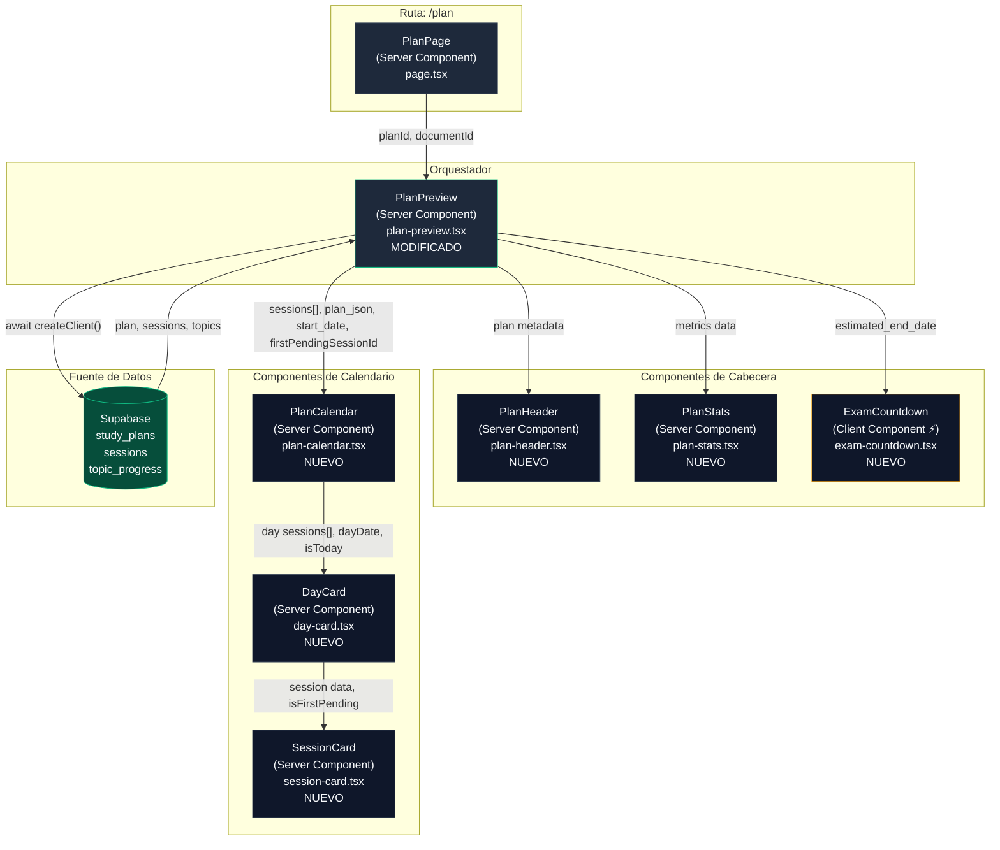
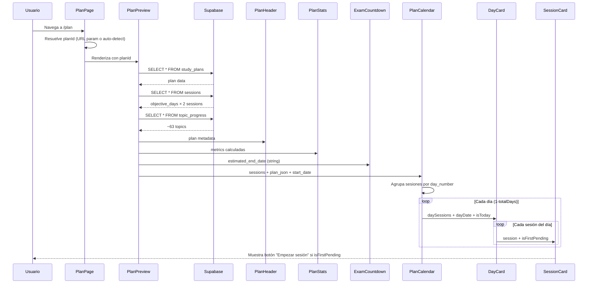

# UP-06 — UI: Visualización del Plan Generado (Calendario)

> **Bloque:** 📤 Upload y Plan
> **Guía anterior:** [UP-05 — Guardar Plan en Supabase](file:///c:/Users/jsife/OneDrive/Desktop/Repositorios/practica-testing/docs/guides/fe/UP-05.md)
> **Guía siguiente:** SE-01 — Sesión de Estudio: Carga de Contenido Teórico
> **Fecha:** Junio 2026

---

## Sección 1: 🎓 Introducción y Fundamentos Conceptuales

### ¿Dónde estamos?

En **UP-05** logramos un hito fundamental: el plan de estudio generado por la IA ya no vive únicamente en la memoria del navegador. Ahora se persiste de forma consistente en **tres tablas de Supabase**:

| Tabla | Registros | Propósito |
|---|---|---|
| `study_plans` | 1 | Plan maestro con `plan_json`, fechas, estado |
| `sessions` | `objective_days × 2` | Una fila por sesión: tópicos, tipo, método, estado |
| `topic_progress` | ~63 | Una fila por tópico ISTQB con estado `'pending'` |

Además, refactorizamos `plan-preview.tsx` como un **Server Component** que lee directamente de Supabase, y actualizamos `plan/page.tsx` para aceptar `plan_id` como URL param y auto-detectar el plan activo del usuario.

Sin embargo, la interfaz actual tiene una limitación importante: **muestra las sesiones como una lista plana**, sin agruparlas por día, sin mostrar la fecha real de cada jornada, sin un conteo regresivo hacia el examen, y sin un botón claro para que el usuario inicie su primera sesión de estudio.

### ¿Qué construiremos en UP-06?

**UP-06 transforma la vista plana de sesiones en un calendario visual dinámico.** El calendario usa `objective_days`, así que funciona igual para un plan de 7 días (14 sesiones), 14 días (28 sesiones), o cualquier valor válido entre 1 y 30 días. El usuario verá su plan estructurado como una línea temporal, donde cada día muestra sus sesiones de mañana y noche, con fechas reales, badges de dificultad, y un prominente botón "Empezar primera sesión" que lo lleva directamente a estudiar.

Lo que el usuario verá al abrir `/plan`:

```
┌─────────────────────────────────────────────────┐
│  🎯 Plan de estudio ISTQB                       │
│  Plan activo · Generado el lun 30 jun           │
│  [Generar otro plan]                            │
├─────────────────────────────────────────────────┤
│  📊 28 sesiones │ 📅 lun 30 - dom 13 │         │
│  📚 63/63 tópicos │ ⏱️ 5 días restantes        │
├─────────────────────────────────────────────────┤
│  ╔═══════════════════════════════╗               │
│  ║  CUENTA REGRESIVA: 5 DÍAS    ║               │
│  ║  "¡Tiempo suficiente! Mantén ║               │
│  ║   el ritmo constante."       ║               │
│  ╚═══════════════════════════════╝               │
├─────────────────────────────────────────────────┤
│  📅 Día 1 — Lunes 30 de junio         [HOY]    │
│  ┌─────────────┐  ┌─────────────┐               │
│  │ 🌅 Mañana   │  │ 🌙 Noche    │               │
│  │ Fundamentos │  │ Técnicas    │               │
│  │ ■ Fácil     │  │ ■ Medio     │               │
│  │ 90 min      │  │ 60 min      │               │
│  │ FL-1.1.1... │  │ FL-2.1.1... │               │
│  │ [Empezar ▶] │  │ ⏳ Pendiente│               │
│  └─────────────┘  └─────────────┘               │
│                                                 │
│  📅 Día 2 — Martes 1 de julio                   │
│  ┌─────────────┐  ┌─────────────┐               │
│  │ 🌅 Mañana   │  │ 🌙 Noche    │               │
│  │ ...         │  │ ...         │               │
│  └─────────────┘  └─────────────┘               │
│  ... (días 3-7)                                 │
└─────────────────────────────────────────────────┘
```

### Conceptos Clave de React/Next.js en esta Guía

#### 1. Descomposición de Componentes (Component Decomposition)

El `plan-preview.tsx` actual es un componente **monolítico** de 377 líneas que hace demasiado: fetch de datos, cálculos, header, métricas, y renderizado de sesiones. Esto viola el principio de **Single Responsibility**.

En UP-06, lo descompondremos en **6 componentes especializados**:

```
PlanPreview (orquestador)
├── PlanHeader (título, estado, acciones)
├── PlanStats (métricas: sesiones, fechas, cobertura)
├── ExamCountdown (cuenta regresiva visual)
└── PlanCalendar (calendario dinámico por objective_days)
    └── DayCard[] (cada día del plan)
        └── SessionCard[] (cada sesión del día)
```

¿Por qué descomponer? Tres razones profesionales:

| Beneficio | Explicación |
|---|---|
| **Reusabilidad** | `SessionCard` podría reutilizarse en el dashboard o en reportes |
| **Testabilidad** | Cada componente se puede testear unitariamente con props conocidas |
| **Mantenimiento** | Cambiar el diseño del header no requiere tocar el calendario |

#### 2. Server Components vs Client Components

En Next.js App Router, **todos los componentes son Server Components por defecto**. Solo necesitas `'use client'` cuando el componente requiere:

- Hooks de React (`useState`, `useEffect`, `useRef`)
- Event handlers (`onClick`, `onChange`)
- APIs del navegador (`window`, `document`, `Date.now()`)

En esta guía, **solo `ExamCountdown` será un Client Component**, porque necesita calcular los días restantes usando `new Date()` del navegador. Importante: ser Client Component no basta por sí solo para evitar hydration mismatch, porque Next.js puede pre-renderizar el primer HTML del componente. Por eso el cálculo dinámico se hará en `useEffect()` después de hidratar, con un estado inicial estático y seguro.

> **¿Qué es un hydration mismatch?** Cuando el HTML generado en el servidor difiere del HTML que React genera en el cliente. Si el servidor renderiza "faltan 5 días" a las 11:59 PM y el cliente renderiza "faltan 4 días" a las 12:01 AM, React detecta la diferencia y lanza un warning. Al hacer la fecha un Client Component, el cálculo siempre ocurre en el navegador, eliminando este riesgo.

#### 3. Formato de Fechas con `Intl.DateTimeFormat`

En lugar de usar librerías externas como `date-fns` o `moment`, usaremos la **API nativa `Intl.DateTimeFormat`** del navegador:

```typescript
// Convertir "2026-06-30" → "Lunes 30 de junio"
new Intl.DateTimeFormat("es-MX", {
  weekday: "long",
  day: "numeric",
  month: "long",
}).format(new Date("2026-06-30T12:00:00"));
```

¿Por qué `T12:00:00`? Para evitar que las zonas horarias desplacen la fecha un día. Si el usuario está en UTC-6 y usamos `new Date("2026-06-30")`, JavaScript interpreta la fecha como UTC medianoche, que en México es **29 de junio a las 6 PM**. Al usar `T12:00:00`, aseguramos que incluso con offset máximo de ±12 horas, la fecha siga siendo la correcta.

#### 4. CSS Grid para Layouts de Calendario

Usaremos **CSS Grid** (via Tailwind) para crear un layout responsivo:

- **Mobile** (`< md`): Las tarjetas se apilan verticalmente en una columna
- **Desktop** (`≥ md`): Las sesiones de mañana/noche se muestran lado a lado en 2 columnas

```html
<!-- Tailwind Grid responsivo -->
<div className="grid gap-4 md:grid-cols-2">
  <!-- En mobile: 1 columna, las cards se apilan -->
  <!-- En desktop (≥768px): 2 columnas, mañana | noche -->
</div>
```

### Analogía: El Tablero de Vuelos del Aeropuerto

Piensa en el calendario de estudio como el **tablero de vuelos de un aeropuerto**. Cada "día" es como una puerta de embarque, y cada "sesión" es un vuelo programado. El viajero (estudiante) necesita ver:

- ✈️ **Hora de salida** → hora programada de la sesión
- 🏷️ **Destino** → tópicos que se cubrirán
- 🟢 **Estado** → On time (pendiente), Boarding (en progreso), Departed (completada)
- 📊 **Nivel** → Economy/Business/First → Fácil/Medio/Difícil

El botón "Empezar primera sesión" es como la señal **"BOARDING NOW"** que parpadea sobre el próximo vuelo disponible. Sin esa señal clara, el viajero no sabe a qué puerta ir.

---

## Sección 2: 📋 Prerequisitos y Verificación del Entorno

Antes de comenzar, verifica que todos los requisitos están cumplidos.

### Herramientas del entorno

Abre **PowerShell** y ejecuta cada comando:

```powershell
node --version
```

```
v22.x.x    # ✅ Node.js 18+ requerido
```

```powershell
npm --version
```

```
10.x.x     # ✅ npm incluido con Node.js
```

```powershell
cd c:\Users\jsife\OneDrive\Desktop\Repositorios\practica-testing\frontend
npx next --version
```

```
16.2.x     # ✅ Next.js 16+ (App Router)
```

### Guías anteriores completadas

| Guía | Entregable clave | Verificación |
|---|---|---|
| **FE-01** | Proyecto Next.js inicializado | `frontend/package.json` existe |
| **FE-02** | shadcn/ui configurado | `frontend/components/ui/button.tsx` existe |
| **FE-03** | Middleware de auth | `frontend/middleware.ts` existe |
| **FE-04** | Dashboard layout + navegación | `frontend/app/(dashboard)/layout.tsx` existe |
| **UP-05** | Plan guardado en Supabase | `frontend/app/api/plan/save/route.ts` existe |
| **UP-05** | `plan-preview.tsx` como Server Component | `frontend/app/(dashboard)/plan/_components/plan-preview.tsx` existe |
| **UP-05** | `plan/page.tsx` con auto-detección | `frontend/app/(dashboard)/plan/page.tsx` existe |

### Verificación de datos en base de datos

Para que el calendario muestre algo, necesitas al menos un plan guardado. Verifica en tu **dashboard de Supabase** (SQL Editor):

```sql
-- Verificar que existe al menos un plan activo
SELECT id, status, objective_days, start_date, estimated_end_date
FROM study_plans
WHERE status = 'active'
LIMIT 1;

-- Verificar que el plan tiene sesiones
SELECT COUNT(*) AS total_sessions
FROM sessions
WHERE study_plan_id = '<tu_plan_id>';
-- Esperado: 14

-- Verificar topic_progress
SELECT COUNT(*) AS total_topics
FROM topic_progress
WHERE study_plan_id = '<tu_plan_id>';
-- Esperado: ~63
```

> [!IMPORTANT]
> Si no tienes datos, completa el flujo UP-01 → UP-05 primero: sube un PDF, genera un plan, y guárdalo.

### Componente shadcn/ui faltante: Badge

El componente `Badge` de shadcn/ui no está instalado aún (solo tenemos `button`, `card`, `avatar`, `dropdown-menu`, `input`, `label`, `separator`, `sheet`). Lo instalaremos en el Paso A.

---

## Sección 3: 📂 Estructura de Directorios del Proyecto

A continuación se muestra la estructura **COMPLETA** de `frontend/` **DESPUÉS** de completar UP-06. Los archivos nuevos están marcados con `← NUEVO UP-06` y los modificados con `← MODIFICADO UP-06`:

```
frontend/
├── .env.local                           # Variables de entorno (DB-01)
├── .gitignore
├── package.json
├── tsconfig.json
├── next.config.ts
├── middleware.ts                         # Auth middleware (FE-03)
├── postcss.config.mjs
├── eslint.config.mjs
├── components.json                      # Config shadcn/ui (FE-02)
│
├── types/
│   ├── index.ts                         # Re-exports
│   └── database.ts                      # Tipos TypeScript del schema (DB-02)
│
├── lib/
│   ├── utils.ts                         # cn() helper (FE-02)
│   ├── format.ts                        # formatFileSize, constantes (UP-01)
│   ├── openai.ts                        # Cliente OpenAI/Gemini (UP-04)
│   └── supabase/
│       ├── server.ts                    # createClient() servidor (FE-01)
│       ├── client.ts                    # createClient() browser (FE-01)
│       └── admin.ts                     # createAdminClient() (UP-02)
│
├── components/
│   ├── shared/
│   │   └── .gitkeep
│   └── ui/
│       ├── avatar.tsx                   # (FE-04)
│       ├── badge.tsx                    # ← NUEVO UP-06 (instalado via shadcn)
│       ├── button.tsx                   # (FE-02)
│       ├── card.tsx                     # (FE-02)
│       ├── dropdown-menu.tsx            # (FE-04)
│       ├── input.tsx                    # (FE-02)
│       ├── label.tsx                    # (FE-02)
│       ├── separator.tsx                # (FE-02)
│       └── sheet.tsx                    # (FE-04)
│
├── app/
│   ├── globals.css                      # Estilos globales + theme tokens
│   ├── layout.tsx                       # Root layout
│   ├── page.tsx                         # Landing page
│   ├── favicon.ico
│   │
│   ├── (auth)/
│   │   ├── login/page.tsx               # (FE-03)
│   │   └── register/page.tsx            # (FE-03)
│   │
│   ├── auth/
│   │   └── callback/route.ts            # OAuth callback (FE-03)
│   │
│   ├── api/
│   │   ├── upload/route.ts              # Upload PDF (UP-01)
│   │   ├── extract/route.ts             # Extraer tópicos (UP-03)
│   │   └── plan/
│   │       ├── generate/route.ts        # Generar plan con IA (UP-04)
│   │       └── save/route.ts            # Persistir en DB (UP-05)
│   │
│   └── (dashboard)/
│       ├── layout.tsx                   # Shell con header + nav (FE-04)
│       ├── loading.tsx                  # Loading skeleton (FE-04)
│       ├── error.tsx                    # Error boundary (FE-04)
│       ├── _components/
│       │   ├── main-nav.tsx             # Nav desktop (FE-04)
│       │   ├── mobile-nav.tsx           # Nav mobile (FE-04)
│       │   └── user-menu.tsx            # Avatar + dropdown (FE-04)
│       │
│       ├── dashboard/
│       │   └── page.tsx                 # Página principal (FE-04)
│       │
│       ├── setup/
│       │   ├── page.tsx                 # Upload + extracción (UP-01)
│       │   └── _components/
│       │       ├── pdf-dropzone.tsx      # (UP-01)
│       │       └── ...
│       │
│       ├── plan/
│       │   ├── page.tsx                 # ← VERIFICADO UP-06 (sin cambios)
│       │   └── _components/
│       │       ├── plan-preview.tsx      # ← MODIFICADO UP-06 (refactorizado)
│       │       ├── plan-header.tsx       # ← NUEVO UP-06
│       │       ├── plan-stats.tsx        # ← NUEVO UP-06
│       │       ├── exam-countdown.tsx    # ← NUEVO UP-06 (Client Component)
│       │       ├── plan-calendar.tsx     # ← NUEVO UP-06
│       │       ├── day-card.tsx          # ← NUEVO UP-06
│       │       └── session-card.tsx      # ← NUEVO UP-06
│       │
│       └── session/
│           └── page.tsx                 # ← NUEVO UP-06 (placeholder hasta SE-01)
│
└── public/
    └── ...
```

> [!NOTE]
> Observa cómo todos los componentes nuevos viven dentro de `plan/_components/`. El prefijo `_` indica que estos archivos son privados de la ruta `/plan` y no son accesibles como URLs. Esta es una convención de Next.js App Router para **co-localizar componentes con sus páginas**.

---

## Sección 4: 🎨 Diagrama de Arquitectura de Componentes

### Jerarquía de Componentes



### Flujo de Datos



> [!TIP]
> Observa que el componente `ExamCountdown` (marcado con ⚡) es el **único Client Component**. Recibe `estimated_end_date` como **string** (no como objeto `Date`, porque las props que cruzan la frontera Server→Client deben ser serializables). El cálculo de `new Date()` ocurre exclusivamente en el navegador.

---

## Sección 5: 🛠️ Implementación Paso a Paso

---

### Paso A: Instalar el componente Badge de shadcn/ui

El componente `Badge` nos permitirá mostrar etiquetas visuales (Fácil/Medio/Difícil, K1/K2/K3, estado de sesión) con estilos consistentes. Actualmente no está instalado.

**Archivo:** Se instalará en `frontend/components/ui/badge.tsx`

Abre PowerShell en la raíz de `frontend/`:

```powershell
cd c:\Users\jsife\OneDrive\Desktop\Repositorios\practica-testing\frontend
npx shadcn@latest add badge
```

Salida esperada:

```
✔ Done.

Installed components:
  - badge (components/ui/badge.tsx)
```

Verifica que el archivo se creó:

```powershell
Get-ChildItem .\components\ui\badge.tsx
```

```
Mode                 LastWriteTime         Length Name
----                 -------------         ------ ----
-a----         6/28/2026  8:50 PM           1200 badge.tsx
```

> [!NOTE]
> shadcn/ui genera componentes con variantes usando `class-variance-authority` (CVA). El Badge tiene variantes como `default`, `secondary`, `destructive`, y `outline`. Nosotros crearemos variantes custom para dificultad y nivel K usando clases de Tailwind directamente (sin modificar el badge base).

**📦 Entregable del Paso A:**
- `frontend/components/ui/badge.tsx` — Componente Badge de shadcn/ui instalado

---

### Paso B: `plan-header.tsx` — Cabecera del Plan

Este componente extrae la sección de header del monolítico `plan-preview.tsx` actual. Muestra el título del plan, su estado (badge), un resumen textual del plan, y un botón para generar otro plan.

**Archivo:** `frontend/app/(dashboard)/plan/_components/plan-header.tsx`

```tsx
// ============================================================
// plan-header.tsx — Cabecera del plan de estudio
// ============================================================
// TIPO: Server Component (NO tiene 'use client')
//
// RESPONSABILIDAD ÚNICA:
//   Mostrar la identidad visual del plan: título, estado, resumen,
//   y la acción de "Generar otro plan".
//
// ¿POR QUÉ SERVER COMPONENT?
//   No hay interactividad — solo renderiza datos estáticos que
//   vienen del servidor. El <Link> de Next.js funciona en Server
//   Components porque es un componente que el framework resuelve
//   durante el build/render del servidor.
//
// PROPS:
//   - status: el estado actual del plan (active, completed, abandoned)
//   - planId: UUID del plan (para mostrar al usuario avanzado)
//   - summary: resumen textual generado por la IA (puede ser null)
// ============================================================

import Link from "next/link";
import {
  BookOpen,
  RefreshCw,
} from "lucide-react";
import { Badge } from "@/components/ui/badge";

// ─── Tipos ────────────────────────────────────────────────────
// Definimos las props como un type dedicado para claridad.
// Esto es más limpio que inline props en la firma de la función.

type PlanHeaderProps = {
  /** Estado del plan: "active" | "completed" | "abandoned" */
  status: string;
  /** UUID del plan para referencia */
  planId: string;
  /** Resumen generado por la IA (puede no existir) */
  summary: string | null;
};

// ─── Helpers ──────────────────────────────────────────────────

/**
 * Traduce el estado del plan a español con su color correspondiente.
 *
 * Patrón: función pura que recibe un valor y retorna datos de display.
 * Esto separa la lógica de presentación del componente, facilitando
 * pruebas unitarias y reutilización.
 */
function getStatusDisplay(status: string) {
  switch (status) {
    case "active":
      return {
        label: "Activo",
        // bg con opacidad baja + texto brillante + borde sutil
        // Este patrón de 3 capas crea profundidad visual en tema oscuro
        className:
          "bg-emerald-500/20 text-emerald-300 border-emerald-500/30 hover:bg-emerald-500/30",
      };
    case "completed":
      return {
        label: "Completado",
        className:
          "bg-blue-500/20 text-blue-300 border-blue-500/30 hover:bg-blue-500/30",
      };
    case "abandoned":
      return {
        label: "Abandonado",
        className:
          "bg-red-500/20 text-red-300 border-red-500/30 hover:bg-red-500/30",
      };
    default:
      return {
        label: status,
        className:
          "bg-slate-500/20 text-slate-300 border-slate-500/30",
      };
  }
}

// ─── Componente ───────────────────────────────────────────────

export function PlanHeader({ status, planId, summary }: PlanHeaderProps) {
  // Obtener los datos de display para el estado actual.
  // Llamar al helper FUERA del JSX mantiene el template limpio.
  const statusDisplay = getStatusDisplay(status);

  return (
    <section className="flex flex-col gap-4">
      {/* ── Fila superior: Título + Acción ──────────────────── */}
      {/*
        flex-col en mobile: el título y el botón se apilan verticalmente.
        md:flex-row en desktop: se ponen lado a lado.
        md:items-start: alinea al tope (no al centro) porque el título
        puede ser más alto que el botón si el resumen es largo.
        md:justify-between: empuja el botón al extremo derecho.
      */}
      <div
        className="flex flex-col gap-4 rounded-xl border border-emerald-900/60
                    bg-emerald-950/20 p-6 md:flex-row md:items-start
                    md:justify-between"
      >
        <div className="flex flex-col gap-2">
          {/* ── Label + Status Badge ────────────────────── */}
          <div className="flex items-center gap-3">
            {/* Ícono decorativo — BookOpen de lucide-react */}
            <BookOpen className="h-5 w-5 text-emerald-400" />
            <p className="text-sm font-medium uppercase tracking-wide text-emerald-400">
              Plan de estudio
            </p>
            {/*
              Badge de shadcn/ui con variante "outline" + clases custom.
              Usamos "outline" como base y sobreescribimos los colores
              con las clases del helper getStatusDisplay().
            */}
            <Badge variant="outline" className={statusDisplay.className}>
              {statusDisplay.label}
            </Badge>
          </div>

          {/* ── Título principal ────────────────────────── */}
          <h1 className="text-3xl font-bold tracking-tight text-white">
            Tu plan ISTQB está listo
          </h1>

          {/* ── Plan ID (para debugging/soporte) ────────── */}
          {/*
            Mostramos el ID con fuente monoespaciada y color muy tenue.
            Solo es útil para soporte técnico o debugging.
            En producción podrías ocultarlo detrás de un toggle.
          */}
          <p className="text-xs font-mono text-slate-500">
            Plan ID: {planId}
          </p>
        </div>

        {/* ── Botón "Generar otro plan" ───────────────────── */}
        {/*
          Link de Next.js que navega a /setup sin reload completo.
          Estilizado como botón secundario (borde, sin fondo sólido)
          para no competir visualmente con el botón primario "Empezar".
        */}
        <Link
          href="/setup"
          className="inline-flex h-10 items-center justify-center gap-2
                     rounded-lg border border-slate-700 px-4 text-sm
                     font-medium text-slate-200 transition-colors
                     hover:bg-slate-800 hover:text-white"
        >
          <RefreshCw className="h-4 w-4" />
          Generar otro plan
        </Link>
      </div>

      {/* ── Resumen del plan (condicional) ─────────────────── */}
      {/*
        Renderizado condicional: solo se muestra si la IA generó un summary.
        El operador && es un short-circuit: si summary es null/undefined/"",
        React no renderiza nada.
      */}
      {summary ? (
        <div className="rounded-xl border border-slate-800 bg-slate-900/50 p-6">
          <h2 className="text-lg font-semibold text-white">Resumen</h2>
          <p className="mt-2 text-sm leading-6 text-slate-400">
            {summary}
          </p>
        </div>
      ) : null}
    </section>
  );
}
```

**📦 Entregable del Paso B:**
- `frontend/app/(dashboard)/plan/_components/plan-header.tsx`

---

### Paso C: `plan-stats.tsx` — Métricas del Plan

Este componente muestra las métricas clave del plan en una grilla de 4 tarjetas. Extrae y mejora la sección de "Métricas" del `plan-preview.tsx` original.

**Archivo:** `frontend/app/(dashboard)/plan/_components/plan-stats.tsx`

```tsx
// ============================================================
// plan-stats.tsx — Métricas del plan en tarjetas
// ============================================================
// TIPO: Server Component
//
// RESPONSABILIDAD ÚNICA:
//   Mostrar métricas del plan en un grid de 4 tarjetas:
//   1. Total de sesiones y días
//   2. Fecha de inicio y fin
//   3. Cobertura de tópicos (cubiertos/total)
//   4. Distribución por nivel K (K1/K2/K3)
//
// ¿POR QUÉ NO ES CLIENT COMPONENT?
//   No hay interactividad. Todas las métricas se calculan en el
//   servidor y se renderizan como HTML estático. Resultado: 0 KB
//   de JavaScript adicional enviado al navegador.
//
// PATRÓN DE DISEÑO:
//   Composición > Herencia. En lugar de un componente genérico
//   "MetricCard" con 20 props, creamos tarjetas especializadas
//   dentro de un grid, cada una con su propia lógica de display.
// ============================================================

import type { ComponentType } from "react";
import {
  Calendar,
  GraduationCap,
  BookOpen,
  Layers,
} from "lucide-react";

// ─── Tipos ────────────────────────────────────────────────────

type PlanStatsProps = {
  /** Número total de sesiones (típicamente 14) */
  totalSessions: number;
  /** Número de días del plan (típicamente 7) */
  totalDays: number;
  /** Fecha de inicio del plan (ISO string: "2026-06-30") */
  startDate: string;
  /** Fecha estimada de fin (ISO string: "2026-07-06") */
  estimatedEndDate: string;
  /** Tópicos cubiertos por el plan */
  coveredTopics: number;
  /** Total de tópicos del syllabus */
  totalTopics: number;
  /** Distribución por nivel K */
  topicsPerLevel: {
    K1: number;
    K2: number;
    K3: number;
  };
};

// ─── Helper ───────────────────────────────────────────────────

/**
 * Formatea una fecha ISO (YYYY-MM-DD) a formato legible en español.
 *
 * ¿Por qué agregar T12:00:00?
 *   new Date("2026-06-30") se interpreta como UTC medianoche.
 *   En zonas horarias negativas (ej. UTC-6 México), esto resulta
 *   en "29 de junio" en lugar de "30 de junio".
 *   Al usar T12:00:00, el mediodía UTC cae en el mismo día calendario
 *   para todas las zonas horarias del mundo (±12h max).
 */
function formatDate(dateStr: string): string {
  try {
    return new Intl.DateTimeFormat("es-MX", {
      weekday: "short",
      day: "numeric",
      month: "short",
    }).format(new Date(dateStr + "T12:00:00"));
  } catch {
    // Si la fecha es inválida, retornar el string original.
    // Esto evita que un dato corrupto crashee toda la página.
    return dateStr;
  }
}

// ─── Componente auxiliar: MetricCard ──────────────────────────

/**
 * Tarjeta individual de métrica. Componente interno (no exportado).
 *
 * ¿Por qué no exportarla?
 *   Porque MetricCard solo tiene sentido dentro del contexto de PlanStats.
 *   Si la exportáramos, cualquier archivo podría usarla y crearíamos
 *   acoplamiento innecesario. Mejor mantenerla privada.
 */
function MetricCard({
  icon: Icon,
  label,
  value,
  detail,
}: {
  /** Componente de ícono de lucide-react */
  icon: ComponentType<{ className?: string }>;
  /** Etiqueta de la métrica (ej. "Sesiones") */
  label: string;
  /** Valor principal (ej. "14") */
  value: string;
  /** Detalle secundario (ej. "14 días") */
  detail: string;
}) {
  return (
    <div className="rounded-xl border border-slate-800 bg-slate-900/50 p-5">
      {/* Fila superior: ícono + etiqueta */}
      <div className="flex items-center gap-2">
        <Icon className="h-4 w-4 text-emerald-400" />
        <p className="text-sm font-medium text-slate-400">{label}</p>
      </div>
      {/* Valor principal grande */}
      <p className="mt-2 text-2xl font-bold text-white">{value}</p>
      {/* Detalle secundario */}
      <p className="mt-1 text-xs text-slate-500">{detail}</p>
    </div>
  );
}

// ─── Componente principal ─────────────────────────────────────

export function PlanStats({
  totalSessions,
  totalDays,
  startDate,
  estimatedEndDate,
  coveredTopics,
  totalTopics,
  topicsPerLevel,
}: PlanStatsProps) {
  // Calcular el porcentaje de cobertura para el detalle.
  // Math.round evita decimales largos (ej. 98.41269... → 98).
  const coveragePercent =
    totalTopics > 0 ? Math.round((coveredTopics / totalTopics) * 100) : 0;

  return (
    // Grid responsivo:
    // - Mobile: 1 columna (las tarjetas se apilan)
    // - Tablet (md): 2 columnas
    // - Desktop (lg): 4 columnas (todas en una fila)
    <div className="grid gap-4 md:grid-cols-2 lg:grid-cols-4">
      <MetricCard
        icon={GraduationCap}
        label="Sesiones"
        value={String(totalSessions)}
        detail={`${totalDays} días de estudio`}
      />

      <MetricCard
        icon={Calendar}
        label="Periodo"
        value={formatDate(startDate)}
        detail={`Fin: ${formatDate(estimatedEndDate)}`}
      />

      <MetricCard
        icon={BookOpen}
        label="Cobertura"
        value={`${coveredTopics}/${totalTopics}`}
        detail={`${coveragePercent}% del syllabus`}
      />

      <MetricCard
        icon={Layers}
        label="Niveles K"
        value={`K1:${topicsPerLevel.K1} K2:${topicsPerLevel.K2} K3:${topicsPerLevel.K3}`}
        detail="Distribución del plan"
      />
    </div>
  );
}
```

**📦 Entregable del Paso C:**
- `frontend/app/(dashboard)/plan/_components/plan-stats.tsx`

---

### Paso D: `exam-countdown.tsx` — Cuenta Regresiva al Examen

Este es el **único Client Component** de UP-06. Necesita `'use client'` porque calcula los días restantes usando `new Date()` del navegador. Para evitar hydration mismatches, el primer render será estático y el cálculo real ocurrirá en `useEffect()` después de hidratar.

**Archivo:** `frontend/app/(dashboard)/plan/_components/exam-countdown.tsx`

```tsx
"use client";

// ============================================================
// exam-countdown.tsx — Cuenta regresiva visual al examen
// ============================================================
// TIPO: Client Component ('use client')
//
// ¿POR QUÉ CLIENT COMPONENT?
//   Este componente calcula los días restantes comparando
//   `estimated_end_date` con `new Date()` (la fecha actual).
//
//   Aunque este componente usa 'use client', Next.js puede generar
//   HTML inicial en el servidor. Por eso NO calculamos fechas durante
//   el primer render. Renderizamos un estado estático y luego usamos
//   useEffect() para calcular los días restantes en el navegador.
//
// PROP SERIALIZABLE:
//   Recibe `estimatedEndDate` como STRING, no como Date.
//   Las props que cruzan la frontera Server→Client deben ser
//   serializables (string, number, boolean, array, plain object).
//   Date, Map, Set, Function NO son serializables.
// ============================================================

import type { ComponentType } from "react";
import { useEffect, useState } from "react";
import { Target, Flame, Clock, Trophy } from "lucide-react";

type ExamCountdownProps = {
  /** Fecha estimada del examen como ISO string (ej. "2026-07-06") */
  estimatedEndDate: string;
};

type CountdownState = {
  daysLeft: number;
  motivational: {
    message: string;
    icon: ComponentType<{ className?: string }>;
    accentColor: string;
  };
};

/**
 * Retorna un mensaje motivacional basado en los días restantes.
 *
 * ¿Por qué una función separada y no inline?
 *   1. Facilita agregar más rangos de mensajes sin ensuciar el JSX
 *   2. Se puede testear unitariamente
 *   3. Sigue el principio de Single Responsibility
 */
function getMotivationalMessage(daysLeft: number): {
  message: string;
  icon: ComponentType<{ className?: string }>;
  accentColor: string;
} {
  if (daysLeft <= 0) {
    return {
      message: "¡Hoy es el día! Confía en tu preparación. 💪",
      icon: Trophy,
      accentColor: "text-amber-400",
    };
  }
  if (daysLeft === 1) {
    return {
      message: "¡Último día! Repasa los conceptos clave y descansa bien.",
      icon: Flame,
      accentColor: "text-orange-400",
    };
  }
  if (daysLeft <= 3) {
    return {
      message: "¡La meta está cerca! Enfócate en las áreas más débiles.",
      icon: Flame,
      accentColor: "text-orange-400",
    };
  }
  if (daysLeft <= 5) {
    return {
      message: "¡Buen ritmo! Mantén la constancia día a día.",
      icon: Target,
      accentColor: "text-emerald-400",
    };
  }
  return {
    message: "Tiempo suficiente para una preparación sólida. ¡Vamos! 🚀",
    icon: Clock,
    accentColor: "text-blue-400",
  };
}

function calculateCountdown(estimatedEndDate: string): CountdownState {
  // ¿Por qué T12:00:00?
  //   Evita que la zona horaria desplace la fecha un día en UTC negativo.
  const endDate = new Date(estimatedEndDate + "T12:00:00");
  const today = new Date();

  // 1 día = 24 * 60 * 60 * 1000 = 86_400_000 milisegundos.
  // Math.ceil: si faltan 4.3 días, mostramos 5 días.
  const diffMs = endDate.getTime() - today.getTime();
  const days = Math.ceil(diffMs / 86_400_000);
  const daysLeft = Math.max(0, days);

  return {
    daysLeft,
    motivational: getMotivationalMessage(daysLeft),
  };
}

export function ExamCountdown({ estimatedEndDate }: ExamCountdownProps) {
  const [countdown, setCountdown] = useState<CountdownState | null>(null);

  useEffect(() => {
    setCountdown(calculateCountdown(estimatedEndDate));
  }, [estimatedEndDate]);

  // Primer render estable: evita HTML dinámico antes de hidratar.
  if (!countdown) {
    return (
      <div className="rounded-xl border border-slate-800 bg-slate-900/50 p-6">
        <p className="text-sm font-medium text-slate-300">
          Calculando cuenta regresiva...
        </p>
      </div>
    );
  }

  const { daysLeft, motivational } = countdown;
  const MotivationalIcon = motivational.icon;

  return (
    <div
      className="relative overflow-hidden rounded-xl border border-slate-800
                  bg-gradient-to-r from-slate-900 via-slate-900/95 to-emerald-950/30
                  p-6"
    >
      {/* ── Decoración de fondo ──────────────────────────────── */}
      {/*
        Un círculo difuminado como decoración visual.
        absolute + posición negativa lo coloca parcialmente fuera del contenedor.
        opacity-10 lo hace muy sutil (10% de opacidad).
        pointer-events-none evita que bloquee clicks en elementos debajo.
      */}
      <div
        className="pointer-events-none absolute -right-8 -top-8 h-32 w-32
                    rounded-full bg-emerald-500 opacity-10 blur-2xl"
      />

      <div className="relative flex flex-col items-center gap-4 md:flex-row md:gap-8">
        {/* ── Número grande: días restantes ─────────────────── */}
        <div className="flex flex-col items-center">
          {/*
            text-6xl + font-black: el número más prominente de toda la página.
            tabular-nums: variante tipográfica que alinea números en tablas.
            Cada dígito ocupa el mismo ancho, evitando "saltos" visuales
            cuando el número cambia (ej. de "10" a "9").
          */}
          <span
            className={`text-6xl font-black tabular-nums leading-none ${motivational.accentColor}`}
          >
            {daysLeft}
          </span>
          <span className="mt-1 text-sm font-medium text-slate-400">
            {daysLeft === 1 ? "día restante" : "días restantes"}
          </span>
        </div>

        {/* ── Separador vertical (solo desktop) ──────────────── */}
        <div className="hidden h-16 w-px bg-slate-700 md:block" />

        {/* ── Mensaje motivacional ─────────────────────────── */}
        <div className="flex items-start gap-3 text-center md:text-left">
          <MotivationalIcon
            className={`mt-0.5 h-5 w-5 shrink-0 ${motivational.accentColor}`}
          />
          <div>
            <p className="text-sm font-semibold text-white">
              Cuenta regresiva al examen
            </p>
            <p className="mt-1 text-sm text-slate-400">
              {motivational.message}
            </p>
          </div>
        </div>
      </div>
    </div>
  );
}
```

**📦 Entregable del Paso D:**
- `frontend/app/(dashboard)/plan/_components/exam-countdown.tsx`

---

### Paso E: `session-card.tsx` — Tarjeta de Sesión Individual

Este es el componente de **más bajo nivel** en la jerarquía — una tarjeta individual que representa una sesión de estudio (mañana, noche, refuerzo, etc.).

**Archivo:** `frontend/app/(dashboard)/plan/_components/session-card.tsx`

```tsx
// ============================================================
// session-card.tsx — Tarjeta visual de una sesión de estudio
// ============================================================
// TIPO: Server Component
//
// RESPONSABILIDAD ÚNICA:
//   Renderizar UNA sesión de estudio con toda su información:
//   - Tipo (mañana/noche) con ícono contextual
//   - Título del plan_json
//   - Badge de dificultad (Fácil/Medio/Difícil)
//   - Duración en minutos
//   - Tópicos como pills/badges
//   - Método de enseñanza
//   - Estado (pendiente/en progreso/completada/saltada)
//   - Hora programada (si existe)
//   - Botón "Empezar sesión" (si es la primera pendiente)
//     con query param session_id para que SE-01 pueda cargar la sesión.
//
// DECISIÓN DE DISEÑO:
//   ¿Por qué NO es Client Component?
//   Aunque tiene un botón "Empezar", ese botón es un <Link> de
//   Next.js (navegación), no un onClick con estado. Los Links
//   funcionan perfectamente en Server Components.
//
// DATOS:
//   Combina datos de la tabla `sessions` (persisted) con datos
//   del `plan_json` (metadata adicional como difficulty y title).
//   Esta combinación se hace en el componente padre (PlanPreview).
// ============================================================

import Link from "next/link";
import {
  Sun,
  Moon,
  RefreshCw,
  FileCheck,
  Clock,
  BookOpen,
  ChevronRight,
} from "lucide-react";
import { Badge } from "@/components/ui/badge";

// ─── Tipos ────────────────────────────────────────────────────

type SessionCardProps = {
  /** ID de la sesión (UUID) */
  sessionId: string;
  /** Tipo de sesión: "morning" | "night" | "reinforcement" | "mock_exam" */
  sessionType: string;
  /** Título de la sesión (del plan_json) */
  title: string;
  /** Dificultad: "easy" | "medium" | "hard" (del plan_json) */
  difficulty: string | undefined;
  /** Duración en minutos */
  durationMinutes: number;
  /** Códigos de tópicos (ej. ["FL-1.1.1", "FL-1.1.2"]) */
  topicCodes: string[];
  /** Método de enseñanza: "theory" | "examples" | "analogies" */
  methodUsed: string;
  /** Estado: "pending" | "active" | "completed" | "skipped" */
  status: string;
  /** Hora programada (ISO timestamp o null) */
  scheduledAt: string | null;
  /** Puntuación obtenida (0-100 o null si no completada) */
  scorePercent: number | null;
  /** Si esta es la primera sesión pendiente del plan */
  isFirstPending: boolean;
};

// ─── Helpers ──────────────────────────────────────────────────

/**
 * Retorna el ícono y la etiqueta para cada tipo de sesión.
 *
 * Los íconos de lucide-react son componentes React. Al retornarlos
 * como parte de un objeto, podemos usarlos dinámicamente:
 *   const { icon: Icon } = getSessionTypeInfo("morning");
 *   <Icon className="h-4 w-4" />
 */
function getSessionTypeInfo(sessionType: string) {
  switch (sessionType) {
    case "morning":
      return {
        label: "Mañana",
        icon: Sun,
        color: "text-amber-400",
      };
    case "night":
      return {
        label: "Noche",
        icon: Moon,
        color: "text-indigo-400",
      };
    case "reinforcement":
      return {
        label: "Refuerzo",
        icon: RefreshCw,
        color: "text-orange-400",
      };
    case "mock_exam":
      return {
        label: "Simulacro",
        icon: FileCheck,
        color: "text-purple-400",
      };
    default:
      return {
        label: sessionType,
        icon: BookOpen,
        color: "text-slate-400",
      };
  }
}

/**
 * Retorna los estilos del badge de dificultad.
 * Cada dificultad tiene su paleta de colores única.
 */
function getDifficultyDisplay(difficulty?: string) {
  switch (difficulty) {
    case "easy":
      return {
        label: "Fácil",
        className: "bg-emerald-500/20 text-emerald-300 border-emerald-500/30",
      };
    case "medium":
      return {
        label: "Medio",
        className: "bg-amber-500/20 text-amber-300 border-amber-500/30",
      };
    case "hard":
      return {
        label: "Difícil",
        className: "bg-red-500/20 text-red-300 border-red-500/30",
      };
    default:
      return null;
  }
}

/**
 * Retorna el ícono y texto para el estado de la sesión.
 */
function getStatusDisplay(status: string, scorePercent: number | null) {
  switch (status) {
    case "pending":
      return {
        text: "Pendiente",
        emoji: "⏳",
        className: "text-slate-500",
      };
    case "active":
      return {
        text: "En progreso",
        emoji: "▶️",
        className: "text-amber-400",
      };
    case "completed":
      return {
        text:
          scorePercent !== null
            ? `Completada (${scorePercent}%)`
            : "Completada",
        emoji: "✅",
        className: "text-emerald-400",
      };
    case "skipped":
      return {
        text: "Saltada",
        emoji: "⏭️",
        className: "text-slate-500",
      };
    default:
      return {
        text: status,
        emoji: "❓",
        className: "text-slate-500",
      };
  }
}

/**
 * Formatea el método de enseñanza a español.
 */
function getMethodLabel(method: string): string {
  switch (method) {
    case "theory":
      return "Teoría";
    case "examples":
      return "Ejemplos";
    case "analogies":
      return "Analogías";
    default:
      return method;
  }
}

/**
 * Formatea una hora ISO a formato legible (ej. "6:00 AM", "10:00 PM").
 *
 * Usa Intl.DateTimeFormat con hour12: true para formato AM/PM.
 * Si scheduledAt es null, retorna null (sin hora programada).
 */
function formatTime(scheduledAt: string | null): string | null {
  if (!scheduledAt) return null;
  try {
    return new Intl.DateTimeFormat("es-MX", {
      hour: "numeric",
      minute: "2-digit",
      hour12: true,
    }).format(new Date(scheduledAt));
  } catch {
    return null;
  }
}

// ─── Componente ───────────────────────────────────────────────

export function SessionCard({
  sessionId,
  sessionType,
  title,
  difficulty,
  durationMinutes,
  topicCodes,
  methodUsed,
  status,
  scheduledAt,
  scorePercent,
  isFirstPending,
}: SessionCardProps) {
  // Pre-calcular datos de display antes del JSX.
  // Esto mantiene el template limpio y legible.
  const typeInfo = getSessionTypeInfo(sessionType);
  const difficultyDisplay = getDifficultyDisplay(difficulty);
  const statusDisplay = getStatusDisplay(status, scorePercent);
  const formattedTime = formatTime(scheduledAt);
  const TypeIcon = typeInfo.icon;

  return (
    <article
      className={`
        rounded-xl border p-5 transition-all duration-200
        ${
          isFirstPending
            ? // La primera sesión pendiente tiene un borde brillante y
              // un brillo sutil para atraer la atención del usuario.
              // ring-1 agrega un anillo exterior (como un segundo borde).
              "border-emerald-500/50 bg-emerald-950/20 ring-1 ring-emerald-500/20 hover:border-emerald-400/70"
            : status === "completed"
              ? // Las sesiones completadas tienen un estilo más tenue
                // para indicar que ya no requieren atención.
                "border-slate-800/60 bg-slate-900/30 opacity-75"
              : // Sesiones normales (pendientes que no son la primera).
                "border-slate-800 bg-slate-900/50 hover:border-slate-700"
        }
      `}
    >
      {/* ── Fila 1: Tipo + Título + Badges ─────────────────── */}
      <div className="flex items-start justify-between gap-4">
        <div className="flex-1">
          {/* Tipo de sesión con ícono y hora */}
          <div className="flex items-center gap-2">
            <TypeIcon className={`h-4 w-4 ${typeInfo.color}`} />
            <span className={`text-xs font-medium uppercase tracking-wide ${typeInfo.color}`}>
              {typeInfo.label}
            </span>
            {/* Hora programada (si existe) */}
            {formattedTime && (
              <>
                <span className="text-xs text-slate-600">·</span>
                <span className="flex items-center gap-1 text-xs text-slate-400">
                  <Clock className="h-3 w-3" />
                  {formattedTime}
                </span>
              </>
            )}
          </div>

          {/* Título de la sesión */}
          <h3 className="mt-1.5 text-base font-semibold text-white">
            {title}
          </h3>
        </div>

        {/* Badges de dificultad y duración */}
        <div className="flex shrink-0 items-center gap-2">
          {difficultyDisplay && (
            <Badge variant="outline" className={difficultyDisplay.className}>
              {difficultyDisplay.label}
            </Badge>
          )}
          <Badge
            variant="outline"
            className="border-slate-700 bg-slate-800/50 text-slate-300"
          >
            {durationMinutes} min
          </Badge>
        </div>
      </div>

      {/* ── Fila 2: Tópicos como pills ─────────────────────── */}
      {/*
        flex-wrap: si los tópicos no caben en una línea,
        saltan a la siguiente línea automáticamente.
        gap-1.5: espacio reducido entre pills para que sean compactas.
      */}
      {topicCodes.length > 0 && (
        <div className="mt-3 flex flex-wrap gap-1.5">
          {topicCodes.map((code) => (
            <span
              key={code}
              className="rounded-full border border-emerald-900/60
                         bg-emerald-950/40 px-2 py-0.5 text-xs
                         font-medium text-emerald-300"
            >
              {code}
            </span>
          ))}
        </div>
      )}

      {/* ── Fila 3: Método + Estado ────────────────────────── */}
      <div className="mt-4 flex items-center justify-between text-xs">
        <span className="text-slate-400">
          Método: {getMethodLabel(methodUsed)}
        </span>
        <span className={statusDisplay.className}>
          {statusDisplay.emoji} {statusDisplay.text}
        </span>
      </div>

      {/* ── Fila 4: Botón "Empezar sesión" (condicional) ───── */}
      {/*
        Solo se muestra si esta es la PRIMERA sesión pendiente del plan.
        Esto guía al usuario hacia su próxima acción sin confundirlo
        con múltiples botones de "empezar".
      */}
      {isFirstPending && (
        <Link
          href={`/session?session_id=${sessionId}`}
          className="mt-4 flex w-full items-center justify-center gap-2
                     rounded-lg bg-emerald-500 px-4 py-2.5 text-sm
                     font-semibold text-slate-950 transition-colors
                     hover:bg-emerald-400"
        >
          Empezar sesión
          <ChevronRight className="h-4 w-4" />
        </Link>
      )}
    </article>
  );
}
```

**📦 Entregable del Paso E:**
- `frontend/app/(dashboard)/plan/_components/session-card.tsx`

---

### Paso F: `day-card.tsx` — Tarjeta de Día con Sesiones Agrupadas

Este componente agrupa las sesiones por día. Muestra un header con la fecha real del día, un indicador de "HOY" si corresponde, y renderiza las `SessionCard` del día.

**Archivo:** `frontend/app/(dashboard)/plan/_components/day-card.tsx`

```tsx
// ============================================================
// day-card.tsx — Tarjeta de un día del plan (agrupa sesiones)
// ============================================================
// TIPO: Server Component
//
// RESPONSABILIDAD ÚNICA:
//   Agrupar y mostrar las sesiones de UN día del plan:
//   - Header con número de día y fecha real
//   - Indicador "HOY" si el día coincide con la fecha actual
//   - Dificultad general del día (derivada de las sesiones)
//   - Sesiones de mañana y noche como SessionCards
//
// CÁLCULO DE FECHA REAL:
//   El plan guarda start_date y cada sesión tiene day_number (1-totalDays).
//   La fecha del día N se calcula como:
//     dayDate = start_date + (day_number - 1) días
//
//   Ejemplo: si start_date = "2026-06-30" y day_number = 3,
//   entonces dayDate = "2026-07-02" (30 jun + 2 días)
//
// INDICADOR "HOY":
//   Comparamos dayDate con la fecha actual del servidor.
//   Esto funciona en Server Components porque la comparación
//   se hace durante el render del servidor (cada request genera
//   HTML fresco). No hay riesgo de hydration mismatch porque
//   el HTML no cambia entre server render y client hydration
//   (el componente es Server-only, no se hidrata).
// ============================================================

import { Calendar } from "lucide-react";
import { Badge } from "@/components/ui/badge";
import { SessionCard } from "./session-card";

// ─── Tipos ────────────────────────────────────────────────────

/**
 * Datos de una sesión que DayCard necesita para renderizar SessionCards.
 * Este tipo unifica datos de la tabla `sessions` con metadata del `plan_json`.
 */
export type DaySession = {
  id: string;
  sessionType: string;
  title: string;
  difficulty: string | undefined;
  durationMinutes: number;
  topicCodes: string[];
  methodUsed: string;
  status: string;
  scheduledAt: string | null;
  scorePercent: number | null;
  isFirstPending: boolean;
};

type DayCardProps = {
  /** Número del día (1-totalDays) */
  dayNumber: number;
  /** Fecha real del día como ISO string (calculada por el padre) */
  dayDate: string;
  /** Si este día es "hoy" */
  isToday: boolean;
  /** Sesiones de este día (ya ordenadas: mañana primero) */
  sessions: DaySession[];
};

// ─── Helpers ──────────────────────────────────────────────────

/**
 * Formatea la fecha del día a formato largo en español.
 * Ej: "2026-06-30" → "Lunes 30 de junio"
 */
function formatDayDate(dateStr: string): string {
  try {
    // Crear Date con T12:00:00 para evitar desfase de zona horaria.
    const date = new Date(dateStr + "T12:00:00");
    return new Intl.DateTimeFormat("es-MX", {
      weekday: "long",
      day: "numeric",
      month: "long",
    }).format(date);
  } catch {
    return dateStr;
  }
}

/**
 * Deriva la dificultad general del día a partir de sus sesiones.
 *
 * Lógica: si cualquier sesión del día es "hard", el día es "Difícil".
 * Si alguna es "medium" (y ninguna "hard"), el día es "Medio".
 * Si todas son "easy" o no tienen dificultad, el día es "Fácil".
 *
 * Este enfoque de "dificultad máxima" es conservador: prepara
 * al estudiante para el nivel más exigente que encontrará ese día.
 */
function getDayDifficulty(sessions: DaySession[]) {
  const difficulties = sessions
    .map((s) => s.difficulty)
    .filter(Boolean) as string[];

  if (difficulties.includes("hard")) {
    return {
      label: "Difícil",
      className: "bg-red-500/20 text-red-300 border-red-500/30",
    };
  }
  if (difficulties.includes("medium")) {
    return {
      label: "Medio",
      className: "bg-amber-500/20 text-amber-300 border-amber-500/30",
    };
  }
  return {
    label: "Fácil",
    className: "bg-emerald-500/20 text-emerald-300 border-emerald-500/30",
  };
}

// ─── Componente ───────────────────────────────────────────────

export function DayCard({
  dayNumber,
  dayDate,
  isToday,
  sessions,
}: DayCardProps) {
  const dayDifficulty = getDayDifficulty(sessions);
  const formattedDate = formatDayDate(dayDate);

  // Calcular la duración total del día sumando todas las sesiones.
  const totalDayMinutes = sessions.reduce(
    (sum, s) => sum + s.durationMinutes,
    0,
  );

  return (
    <div
      className={`
        rounded-2xl border p-5 transition-colors
        ${
          isToday
            ? // El día actual tiene un borde más brillante y un fondo
              // con un sutil tinte esmeralda para destacar.
              "border-emerald-500/40 bg-slate-900/80 ring-1 ring-emerald-500/10"
            : "border-slate-800 bg-slate-900/40"
        }
      `}
    >
      {/* ── Header del día ─────────────────────────────────── */}
      <div className="flex flex-col gap-2 sm:flex-row sm:items-center sm:justify-between">
        <div className="flex items-center gap-3">
          {/* Número de día en un círculo */}
          <div
            className={`
              flex h-10 w-10 shrink-0 items-center justify-center
              rounded-full text-sm font-bold
              ${
                isToday
                  ? "bg-emerald-500 text-slate-950"
                  : "bg-slate-800 text-slate-300"
              }
            `}
          >
            {dayNumber}
          </div>

          <div>
            {/* Fecha formateada + Badge "HOY" */}
            <div className="flex items-center gap-2">
              <h3 className="text-lg font-semibold capitalize text-white">
                {/*
                  capitalize: convierte la primera letra a mayúscula.
                  Intl.DateTimeFormat retorna "lunes 30 de junio" en
                  minúsculas. Con capitalize se convierte en
                  "Lunes 30 de junio".
                */}
                {formattedDate}
              </h3>
              {isToday && (
                <Badge
                  variant="outline"
                  className="bg-emerald-500/20 text-emerald-300
                             border-emerald-500/30 text-xs"
                >
                  HOY
                </Badge>
              )}
            </div>

            {/* Info secundaria: dificultad + duración total */}
            <div className="flex items-center gap-3 mt-0.5">
              <Calendar className="h-3.5 w-3.5 text-slate-500" />
              <span className="text-xs text-slate-500">
                Día {dayNumber} · {sessions.length}{" "}
                {sessions.length === 1 ? "sesión" : "sesiones"} ·{" "}
                {totalDayMinutes} min total
              </span>
            </div>
          </div>
        </div>

        {/* Badge de dificultad del día */}
        <Badge variant="outline" className={dayDifficulty.className}>
          {dayDifficulty.label}
        </Badge>
      </div>

      {/* ── Separador visual ─────────────────────────────────── */}
      <div className="my-4 h-px bg-slate-800" />

      {/* ── Sesiones del día ─────────────────────────────────── */}
      {/*
        Grid responsivo:
        - Mobile: 1 columna (sesiones apiladas verticalmente)
        - Desktop (md): 2 columnas (mañana | noche lado a lado)
      */}
      <div className="grid gap-4 md:grid-cols-2">
        {sessions.map((session) => (
          <SessionCard
            key={session.id}
            sessionId={session.id}
            sessionType={session.sessionType}
            title={session.title}
            difficulty={session.difficulty}
            durationMinutes={session.durationMinutes}
            topicCodes={session.topicCodes}
            methodUsed={session.methodUsed}
            status={session.status}
            scheduledAt={session.scheduledAt}
            scorePercent={session.scorePercent}
            isFirstPending={session.isFirstPending}
          />
        ))}
      </div>
    </div>
  );
}
```

**📦 Entregable del Paso F:**
- `frontend/app/(dashboard)/plan/_components/day-card.tsx`

---

### Paso G: `plan-calendar.tsx` — Layout de Calendario de 7 Días

Este componente es el orquestador del calendario. Recibe todas las sesiones, las agrupa por `day_number`, calcula las fechas reales de cada día, y renderiza los `DayCard`.

**Archivo:** `frontend/app/(dashboard)/plan/_components/plan-calendar.tsx`

```tsx
// ============================================================
// plan-calendar.tsx — Calendario visual dinámico del plan
// ============================================================
// TIPO: Server Component
//
// RESPONSABILIDAD:
//   1. Agrupar las sesiones por day_number
//   2. Calcular la fecha real de cada día
//   3. Determinar cuál es "hoy"
//   4. Identificar la primera sesión pendiente del plan
//   5. Renderizar los DayCards con toda esta información
//
// PATRÓN DE DATOS:
//   Las sesiones llegan como un array plano (flat) ordenado.
//   Este componente las transforma en una estructura jerárquica:
//
//   Input:  [session1, session2, ..., session14]
//   Output: Map { 1: [mañana, noche], 2: [mañana, noche], ... }
//
//   Esta transformación se llama "groupBy" y es un patrón funcional
//   muy común en programación. JavaScript no tiene un Array.groupBy
//   nativo en todos los entornos, así que lo implementamos manualmente.
// ============================================================

import { CalendarDays } from "lucide-react";
import { DayCard } from "./day-card";
import type { DaySession } from "./day-card";

// ─── Tipos ────────────────────────────────────────────────────

/** Datos de sesión de la tabla `sessions` de Supabase */
type PersistedSession = {
  id: string;
  day_number: number;
  session_type: string;
  topic_codes: string[];
  method_used: string;
  duration_minutes: number;
  status: string;
  scheduled_at: string | null;
  score_percent: number | null;
};

/** Metadata adicional del plan_json (no persiste en sessions) */
type PlanJsonSession = {
  day_number?: number;
  session_type?: string;
  difficulty?: string;
  title?: string;
};

type PlanCalendarProps = {
  /** Sesiones del plan (de la tabla sessions) */
  sessions: PersistedSession[];
  /** Sesiones del plan_json (metadata: difficulty, title) */
  planJsonSessions: PlanJsonSession[];
  /** Fecha de inicio del plan (ISO: "2026-06-30") */
  startDate: string;
  /** Número total de días del plan */
  totalDays: number;
  /** ID de la primera sesión pendiente (para el botón "Empezar") */
  firstPendingSessionId: string | null;
};

// ─── Helpers ──────────────────────────────────────────────────

/**
 * Ordena los tipos de sesión en orden lógico.
 * Mañana (1) siempre va antes que Noche (2), etc.
 */
function getSessionOrder(sessionType: string): number {
  switch (sessionType) {
    case "morning":
      return 1;
    case "night":
      return 2;
    case "reinforcement":
      return 3;
    case "mock_exam":
      return 4;
    default:
      return 5;
  }
}

/**
 * Busca la metadata del plan_json que corresponde a una sesión persistida.
 *
 * La relación se hace por (day_number + session_type), NO por índice.
 * Esto es más robusto porque el orden del array plan_json puede
 * diferir del orden en la tabla sessions.
 */
function findPlanJsonSession(
  planJsonSessions: PlanJsonSession[],
  persistedSession: PersistedSession,
): PlanJsonSession | undefined {
  return planJsonSessions.find(
    (jsonSession) =>
      jsonSession.day_number === persistedSession.day_number &&
      jsonSession.session_type === persistedSession.session_type,
  );
}

/**
 * Calcula la fecha real de un día del plan.
 *
 * @param startDate - Fecha de inicio del plan (ISO: "2026-06-30")
 * @param dayNumber - Número del día (1-totalDays)
 * @returns Fecha ISO del día (ej. "2026-07-02" para day 3)
 *
 * ALGORITMO:
 *   1. Parsear startDate como Date (con T12:00:00 para timezone safety)
 *   2. Sumar (dayNumber - 1) días al Date
 *   3. Formatear de vuelta a ISO string (YYYY-MM-DD)
 *
 * ¿Por qué dayNumber - 1?
 *   Porque day_number = 1 es el PRIMER día = start_date.
 *   day_number = 2 es start_date + 1 día, etc.
 */
function calculateDayDate(startDate: string, dayNumber: number): string {
  const date = new Date(startDate + "T12:00:00");
  date.setDate(date.getDate() + (dayNumber - 1));

  // Formatear a YYYY-MM-DD usando métodos de Date.
  // padStart(2, "0") asegura que los meses/días de un dígito
  // tengan un cero al inicio (ej. "7" → "07").
  const year = date.getFullYear();
  const month = String(date.getMonth() + 1).padStart(2, "0");
  const day = String(date.getDate()).padStart(2, "0");

  return `${year}-${month}-${day}`;
}

/**
 * Verifica si una fecha ISO es "hoy" en el servidor.
 *
 * Compara solo la parte de fecha (YYYY-MM-DD) para evitar
 * problemas con horas y zonas horarias.
 */
function isDateToday(dateStr: string): boolean {
  const today = new Date();
  const todayStr = [
    today.getFullYear(),
    String(today.getMonth() + 1).padStart(2, "0"),
    String(today.getDate()).padStart(2, "0"),
  ].join("-");
  return dateStr === todayStr;
}

// ─── Componente ───────────────────────────────────────────────

export function PlanCalendar({
  sessions,
  planJsonSessions,
  startDate,
  totalDays,
  firstPendingSessionId,
}: PlanCalendarProps) {
  // ═══════════════════════════════════════════════════════════
  // PASO 1: Agrupar sesiones por day_number
  // ═══════════════════════════════════════════════════════════
  // Map<number, PersistedSession[]> donde key = day_number.
  //
  // Usamos Map en lugar de Object porque:
  // 1. Las claves numéricas mantienen su tipo (no se convierten a string)
  // 2. Map preserva el orden de inserción
  // 3. Map tiene .size para obtener el conteo sin Object.keys()

  const sessionsByDay = new Map<number, PersistedSession[]>();

  // Ordenar sesiones antes de agrupar para garantizar
  // que mañana siempre aparezca antes que noche.
  const sortedSessions = [...sessions].sort((a, b) => {
    const dayDiff = a.day_number - b.day_number;
    if (dayDiff !== 0) return dayDiff;
    return getSessionOrder(a.session_type) - getSessionOrder(b.session_type);
  });

  for (const session of sortedSessions) {
    const existing = sessionsByDay.get(session.day_number) || [];
    existing.push(session);
    sessionsByDay.set(session.day_number, existing);
  }

  // ═══════════════════════════════════════════════════════════
  // PASO 2: Generar los datos de cada día
  // ═══════════════════════════════════════════════════════════
  // Iteramos del día 1 al totalDays (típicamente 7).
  // Incluso si un día no tiene sesiones (improbable pero posible),
  // lo mostramos con un estado vacío.

  const days = Array.from({ length: totalDays }, (_, i) => {
    const dayNumber = i + 1;
    const dayDate = calculateDayDate(startDate, dayNumber);
    const daySessions = sessionsByDay.get(dayNumber) || [];

    // Transformar PersistedSession → DaySession (agregar metadata del plan_json)
    const enrichedSessions: DaySession[] = daySessions.map(
      (session, index) => {
        const jsonSession = findPlanJsonSession(planJsonSessions, session);

        return {
          id: session.id,
          sessionType: session.session_type,
          title:
            jsonSession?.title ||
            `Sesión ${dayNumber}.${index + 1}`,
          difficulty: jsonSession?.difficulty,
          durationMinutes: session.duration_minutes,
          topicCodes: session.topic_codes,
          methodUsed: session.method_used,
          status: session.status,
          scheduledAt: session.scheduled_at,
          scorePercent: session.score_percent,
          // Solo la primera sesión pendiente del plan completo
          // recibe isFirstPending = true.
          isFirstPending: session.id === firstPendingSessionId,
        };
      },
    );

    return {
      dayNumber,
      dayDate,
      isToday: isDateToday(dayDate),
      sessions: enrichedSessions,
    };
  });

  // ═══════════════════════════════════════════════════════════
  // PASO 3: Renderizar
  // ═══════════════════════════════════════════════════════════

  // Estado vacío: si no hay sesiones en absoluto
  if (sessions.length === 0) {
    return (
      <div className="rounded-xl border border-slate-800 bg-slate-900/50 p-8 text-center">
        <CalendarDays className="mx-auto h-12 w-12 text-slate-600" />
        <h3 className="mt-4 text-lg font-semibold text-white">
          No hay sesiones programadas
        </h3>
        <p className="mt-2 text-sm text-slate-400">
          Este plan no tiene sesiones. Intenta generar un nuevo plan desde la
          página de configuración.
        </p>
      </div>
    );
  }

  return (
    <section className="flex flex-col gap-4">
      {/* ── Header de sección ──────────────────────────────── */}
      <div className="flex items-center justify-between gap-4">
        <div className="flex items-center gap-3">
          <CalendarDays className="h-5 w-5 text-emerald-400" />
          <h2 className="text-xl font-semibold text-white">
            Calendario de Estudio
          </h2>
        </div>
        <p className="text-sm text-slate-500">
          {sessions.length} sesiones · {totalDays} días
        </p>
      </div>

      {/* ── Barra de progreso visual ───────────────────────── */}
      {/*
        Muestra una barra horizontal que indica cuántas sesiones
        se han completado vs el total. Útil como vista rápida
        del avance del plan.
      */}
      {(() => {
        const completed = sessions.filter(
          (s) => s.status === "completed",
        ).length;
        const progressPercent =
          sessions.length > 0
            ? Math.round((completed / sessions.length) * 100)
            : 0;

        return (
          <div className="flex items-center gap-3">
            <div className="h-2 flex-1 rounded-full bg-slate-800">
              <div
                className="h-2 rounded-full bg-emerald-500 transition-all duration-500"
                style={{ width: `${progressPercent}%` }}
              />
            </div>
            <span className="text-xs font-medium text-slate-400">
              {completed}/{sessions.length} completadas
            </span>
          </div>
        );
      })()}

      {/* ── DayCards ────────────────────────────────────────── */}
      {/*
        Cada DayCard ocupa el ancho completo.
        Los días se apilan verticalmente como una timeline.
        El gap-6 (24px) crea separación visual entre días.
      */}
      <div className="flex flex-col gap-6">
        {days.map((day) => (
          <DayCard
            key={day.dayNumber}
            dayNumber={day.dayNumber}
            dayDate={day.dayDate}
            isToday={day.isToday}
            sessions={day.sessions}
          />
        ))}
      </div>
    </section>
  );
}
```

**📦 Entregable del Paso G:**
- `frontend/app/(dashboard)/plan/_components/plan-calendar.tsx`

---

### Paso H: Refactorizar `plan-preview.tsx` — El Orquestador

Ahora que tenemos todos los componentes hijos, refactorizamos el monolítico `plan-preview.tsx` para que **delegue la renderización** a los componentes especializados. Sigue siendo un Server Component que:

1. Hace las queries a Supabase (plan, sessions, topic_progress)
2. Calcula datos derivados
3. Pasa los datos como props a cada componente hijo

**Archivo:** `frontend/app/(dashboard)/plan/_components/plan-preview.tsx` (REEMPLAZAR COMPLETAMENTE)

```tsx
// ============================================================
// plan-preview.tsx — Orquestador del plan de estudio (REFACTORIZADO)
// ============================================================
// TIPO: Server Component (NO tiene 'use client')
//
// VERSIÓN: UP-06 (refactorizado desde UP-05)
//
// RESPONSABILIDADES:
//   1. Recibir planId/documentId del componente padre (page.tsx)
//   2. Hacer las queries a Supabase (study_plans, sessions, topic_progress)
//   3. Manejar estados de error y vacío
//   4. Calcular datos derivados (métricas, primera sesión pendiente)
//   5. DELEGAR la renderización a componentes especializados
//
// EVOLUCIÓN DESDE UP-05:
//   Antes (UP-05): Componente monolítico de 377 líneas que hacía
//     fetch, cálculos, y renderizaba header + métricas + sesiones.
//   Ahora (UP-06): Componente orquestador que delega a:
//     - PlanHeader: título, estado, resumen
//     - PlanStats: métricas en tarjetas
//     - ExamCountdown: cuenta regresiva al examen
//     - PlanCalendar: calendario dinámico por objective_days
//
// PRINCIPIO APLICADO:
//   "Smart Container / Dumb Components" (Contenedor inteligente /
//   Componentes presentacionales). PlanPreview es el "smart container"
//   que sabe cómo obtener datos. Los componentes hijos son "dumb"
//   (presentacionales) — solo saben renderizar las props que reciben.
// ============================================================

import Link from "next/link";
import { createClient } from "@/lib/supabase/server";

// Importar componentes hijos (todos co-localizados en _components/)
import { PlanHeader } from "./plan-header";
import { PlanStats } from "./plan-stats";
import { ExamCountdown } from "./exam-countdown";
import { PlanCalendar } from "./plan-calendar";

// ─── Tipos ────────────────────────────────────────────────────
// Definimos tipos locales para los datos que recibimos de Supabase.
// Estos tipos son específicos de este componente — no los reutilizamos
// fuera de aquí, así que no necesitan ir a types/database.ts.

type PlanSession = {
  id: string;
  day_number: number;
  session_type: string;
  topic_codes: string[];
  method_used: string;
  duration_minutes: number;
  status: string;
  scheduled_at: string | null;
  score_percent: number | null;
};

type StudyPlan = {
  id: string;
  document_id: string;
  objective_days: number;
  start_date: string;
  estimated_end_date: string;
  status: string;
  plan_json: {
    plan_summary?: string;
    coverage?: {
      total_topics?: number;
      covered_topic_codes?: string[];
      omitted_topic_codes?: string[];
    };
    sessions?: Array<{
      day_number?: number;
      session_type?: string;
      difficulty?: string;
      title?: string;
    }>;
    topics_per_level?: {
      K1?: number;
      K2?: number;
      K3?: number;
    };
  };
  created_at: string;
};

/** Resultado de la query a topic_progress (agregado por level_k) */
type TopicLevelCount = {
  level_k: string | null;
};

type PlanPreviewProps = {
  planId: string | null;
  documentId: string | null; // backward compat con UP-04
};

// ─── Helpers ──────────────────────────────────────────────────

/**
 * Ordena las sesiones por day_number y luego por session_type.
 * Mañana (1) siempre va antes que Noche (2).
 */
function getSessionOrder(sessionType: string): number {
  switch (sessionType) {
    case "morning":
      return 1;
    case "night":
      return 2;
    case "reinforcement":
      return 3;
    case "mock_exam":
      return 4;
    default:
      return 5;
  }
}

// ─── Componente principal ─────────────────────────────────────

export async function PlanPreview({ planId, documentId }: PlanPreviewProps) {
  // ═══════════════════════════════════════════════════════════
  // GUARD CLAUSE: Sin identificador, no podemos buscar el plan.
  // ═══════════════════════════════════════════════════════════
  if (!planId && !documentId) {
    return (
      <EmptyState
        title="Plan no encontrado"
        message="La URL no incluye plan_id ni document_id. Vuelve a generar el plan desde Mi Plan."
      />
    );
  }

  // ═══════════════════════════════════════════════════════════
  // QUERY 1: Obtener el plan de estudio
  // ═══════════════════════════════════════════════════════════
  const supabase = await createClient();

  // Construir la query dinámicamente según el identificador disponible.
  // Priorizar plan_id (UP-05+) sobre document_id (UP-04 legacy).
  let planQuery = supabase.from("study_plans").select("*");

  if (planId) {
    planQuery = planQuery.eq("id", planId);
  } else if (documentId) {
    planQuery = planQuery
      .eq("document_id", documentId)
      .eq("status", "active")
      .order("created_at", { ascending: false })
      .limit(1);
  }

  const { data: planData, error: planError } = await planQuery.maybeSingle();

  if (planError) {
    console.error("[PlanPreview] Error al cargar plan:", planError);
    return (
      <EmptyState
        title="Error al cargar el plan"
        message={`Error al cargar el plan desde Supabase: ${planError.message}`}
      />
    );
  }

  if (!planData) {
    return (
      <EmptyState
        title="Plan no encontrado"
        message="No se encontró un plan con ese identificador. Puede haber sido eliminado o no haberse guardado."
      />
    );
  }

  // ═══════════════════════════════════════════════════════════
  // QUERY 2: Obtener las sesiones del plan
  // ═══════════════════════════════════════════════════════════
  const { data: sessionsData, error: sessionsError } = await supabase
    .from("sessions")
    .select(
      "id, day_number, session_type, topic_codes, method_used, duration_minutes, status, scheduled_at, score_percent",
    )
    .eq("study_plan_id", planData.id)
    .order("day_number", { ascending: true });

  if (sessionsError) {
    console.error("[PlanPreview] Error al cargar sesiones:", sessionsError);
    return (
      <EmptyState
        title="Error al cargar sesiones"
        message={`Error al cargar las sesiones del plan: ${sessionsError.message}`}
      />
    );
  }

  // ═══════════════════════════════════════════════════════════
  // QUERY 3: Obtener topic_progress para distribución por nivel K
  // ═══════════════════════════════════════════════════════════
  // Solo necesitamos el campo level_k para contar K1/K2/K3.
  // Esto es más eficiente que traer todas las columnas.
  const { data: topicData } = await supabase
    .from("topic_progress")
    .select("level_k")
    .eq("study_plan_id", planData.id);

  // ═══════════════════════════════════════════════════════════
  // PROCESAMIENTO DE DATOS
  // ═══════════════════════════════════════════════════════════

  // Cast seguro: Supabase retorna tipos genéricos, los casteamos
  // a nuestros tipos locales que sabemos son correctos.
  const plan = planData as unknown as StudyPlan;

  // Ordenar sesiones por día y luego por tipo.
  const sessions = ((sessionsData || []) as PlanSession[]).sort((a, b) => {
    const dayDiff = a.day_number - b.day_number;
    if (dayDiff !== 0) return dayDiff;
    return getSessionOrder(a.session_type) - getSessionOrder(b.session_type);
  });

  // ── Métricas derivadas ──────────────────────────────────
  const totalSessions = sessions.length;
  const totalDays = plan.objective_days;
  const totalTopics = plan.plan_json?.coverage?.total_topics ?? 0;
  const coveredTopics =
    plan.plan_json?.coverage?.covered_topic_codes?.length ?? 0;

  // Calcular distribución K a partir de topic_progress (DB real)
  // con fallback al plan_json si no hay datos de topic_progress.
  const topicLevels = (topicData || []) as TopicLevelCount[];
  const topicsPerLevel = {
    K1: topicLevels.filter((t) => t.level_k === "K1").length,
    K2: topicLevels.filter((t) => t.level_k === "K2").length,
    K3: topicLevels.filter((t) => t.level_k === "K3").length,
  };

  // Si topic_progress no tiene datos con level_k, usar plan_json como fallback
  const hasKData =
    topicsPerLevel.K1 + topicsPerLevel.K2 + topicsPerLevel.K3 > 0;
  const finalTopicsPerLevel = hasKData
    ? topicsPerLevel
    : {
        K1: plan.plan_json?.topics_per_level?.K1 ?? 0,
        K2: plan.plan_json?.topics_per_level?.K2 ?? 0,
        K3: plan.plan_json?.topics_per_level?.K3 ?? 0,
      };

  // ── Primera sesión pendiente ────────────────────────────
  // Buscar la primera sesión con status "pending" para el botón "Empezar".
  // Las sesiones ya están ordenadas por day_number + session_type,
  // así que .find() retorna la primera en orden cronológico.
  const firstPendingSession = sessions.find((s) => s.status === "pending");
  const firstPendingSessionId = firstPendingSession?.id ?? null;

  // Metadata del plan_json (difficulty, title por sesión)
  const planJsonSessions = plan.plan_json?.sessions || [];

  // ═══════════════════════════════════════════════════════════
  // RENDER: Delegar a componentes especializados
  // ═══════════════════════════════════════════════════════════
  return (
    <div className="flex flex-col gap-6">
      {/* ── 1. Cabecera: título, estado, resumen ────────────── */}
      <PlanHeader
        status={plan.status}
        planId={plan.id}
        summary={plan.plan_json?.plan_summary ?? null}
      />

      {/* ── 2. Métricas: sesiones, fechas, cobertura, K-levels */}
      <PlanStats
        totalSessions={totalSessions}
        totalDays={totalDays}
        startDate={plan.start_date}
        estimatedEndDate={plan.estimated_end_date}
        coveredTopics={coveredTopics}
        totalTopics={totalTopics}
        topicsPerLevel={finalTopicsPerLevel}
      />

      {/* ── 3. Cuenta regresiva al examen ──────────────────── */}
      {/*
        ExamCountdown es un Client Component. Recibe la fecha como
        STRING (serializable) y calcula los días restantes en el browser.
        Esto evita hydration mismatch con cálculos de Date.
      */}
      <ExamCountdown estimatedEndDate={plan.estimated_end_date} />

      {/* ── 4. Calendario de sesiones por día ──────────────── */}
      <PlanCalendar
        sessions={sessions}
        planJsonSessions={planJsonSessions}
        startDate={plan.start_date}
        totalDays={totalDays}
        firstPendingSessionId={firstPendingSessionId}
      />
    </div>
  );
}

// ─── Componente auxiliar: EmptyState ──────────────────────────
// Mantenemos EmptyState en este archivo porque es específico
// de los estados de error de PlanPreview. No lo extraemos porque
// no se reutiliza en otros contextos.

function EmptyState({ title, message }: { title: string; message: string }) {
  return (
    <div className="rounded-xl border border-slate-800 bg-slate-900/50 p-6">
      <h1 className="text-2xl font-bold tracking-tight text-white">{title}</h1>
      <p className="mt-3 max-w-3xl text-sm leading-6 text-slate-400">
        {message}
      </p>
      <Link
        href="/setup"
        className="mt-6 inline-flex h-10 items-center justify-center rounded-lg
                   bg-emerald-500 px-4 text-sm font-medium text-slate-950
                   transition-colors hover:bg-emerald-400"
      >
        Volver a configuración
      </Link>
    </div>
  );
}
```

**📦 Entregable del Paso H:**
- `frontend/app/(dashboard)/plan/_components/plan-preview.tsx` (reemplazado completamente)

---

### Paso I: Verificar `plan/page.tsx` — Sin Cambios Necesarios

El `page.tsx` actual de UP-05 ya funciona correctamente con el nuevo `PlanPreview` refactorizado, porque:

1. **La interfaz de props no cambió**: `PlanPreview` sigue recibiendo `{ planId, documentId }`.
2. **La lógica de auto-detección sigue intacta**: busca plan activo si no hay query params.
3. **El import sigue siendo el mismo**: `import { PlanPreview } from "./_components/plan-preview"`.

**Archivo:** `frontend/app/(dashboard)/plan/page.tsx` — **SIN CAMBIOS**

Verifica que el archivo actual coincide con esto:

```tsx
import { PlanPreview } from "./_components/plan-preview";
import { createClient } from "@/lib/supabase/server";

type PlanPageProps = {
  searchParams: Promise<{
    plan_id?: string | string[];
    document_id?: string | string[];
  }>;
};

export default async function PlanPage({ searchParams }: PlanPageProps) {
  const params = await searchParams;

  // 🆕 UP-05: Priorizar plan_id sobre document_id
  const rawPlanId = params.plan_id;
  let planId: string | null = Array.isArray(rawPlanId)
    ? rawPlanId[0]
    : rawPlanId || null;

  // Backward compat: si solo llega document_id (planes viejos de UP-04)
  const rawDocumentId = params.document_id;
  const documentId = Array.isArray(rawDocumentId)
    ? rawDocumentId[0]
    : rawDocumentId || null;

  // ── Auto-detección de plan activo ──────────────────────
  if (!planId && !documentId) {
    const supabase = await createClient();

    const {
      data: { user },
    } = await supabase.auth.getUser();

    if (user) {
      const { data: activePlan } = await supabase
        .from("study_plans")
        .select("id")
        .eq("user_id", user.id)
        .eq("status", "active")
        .order("created_at", { ascending: false })
        .limit(1)
        .maybeSingle();

      if (activePlan) {
        planId = activePlan.id;
      }
    }
  }

  return <PlanPreview planId={planId} documentId={documentId} />;
}
```

**📦 Entregable del Paso I:**
- `frontend/app/(dashboard)/plan/page.tsx` — verificado, sin cambios necesarios

---

### Paso J: `session/page.tsx` — Placeholder seguro hasta SE-01

**Archivo:** `frontend/app/(dashboard)/session/page.tsx`  
**Motivo:** El nav ya tiene "Sesión Actual" y `SessionCard` ahora navega a `/session?session_id=...`. Sin esta página, el usuario ve un 404 antes de empezar SE-01. En UP-06 creamos una pantalla placeholder simple, protegida por el layout de `(dashboard)`, que confirma el `session_id` recibido y explica que la implementación completa llegará en SE-01.

```tsx
import Link from "next/link";
import { BookOpen, Construction, ArrowLeft } from "lucide-react";

type SessionPageProps = {
  searchParams: Promise<{
    session_id?: string | string[];
  }>;
};

export default async function SessionPage({ searchParams }: SessionPageProps) {
  const params = await searchParams;
  const rawSessionId = params.session_id;
  const sessionId = Array.isArray(rawSessionId)
    ? rawSessionId[0]
    : rawSessionId || null;

  return (
    <div className="mx-auto flex max-w-2xl flex-col gap-6">
      <section className="rounded-2xl border border-amber-500/30 bg-amber-950/20 p-6">
        <div className="flex items-center gap-3">
          <div className="flex h-12 w-12 items-center justify-center rounded-full bg-amber-500/20">
            <Construction className="h-6 w-6 text-amber-300" />
          </div>
          <div>
            <p className="text-sm font-medium uppercase tracking-wide text-amber-300">
              Próximamente en SE-01
            </p>
            <h1 className="text-2xl font-bold tracking-tight text-white">
              Sesión de estudio en construcción
            </h1>
          </div>
        </div>

        <p className="mt-4 text-sm leading-6 text-slate-300">
          UP-06 ya conecta el botón "Empezar sesión" con esta ruta. En SE-01
          construiremos la carga real de contenido teórico para la próxima sesión.
        </p>

        {sessionId ? (
          <div className="mt-4 rounded-lg border border-slate-800 bg-slate-950/60 p-4">
            <p className="text-xs font-medium uppercase tracking-wide text-slate-500">
              Session ID recibido
            </p>
            <p className="mt-1 break-all font-mono text-sm text-slate-300">
              {sessionId}
            </p>
          </div>
        ) : (
          <div className="mt-4 rounded-lg border border-slate-800 bg-slate-950/60 p-4">
            <p className="text-sm text-slate-400">
              No llegó `session_id`. Vuelve a `/plan` y usa el botón
              "Empezar sesión" de la primera sesión pendiente.
            </p>
          </div>
        )}

        <div className="mt-6 flex flex-col gap-3 sm:flex-row">
          <Link
            href="/plan"
            className="inline-flex h-10 items-center justify-center gap-2 rounded-lg border border-slate-700 px-4 text-sm font-medium text-slate-200 transition-colors hover:bg-slate-800"
          >
            <ArrowLeft className="h-4 w-4" />
            Volver al plan
          </Link>
          <Link
            href="/setup"
            className="inline-flex h-10 items-center justify-center gap-2 rounded-lg bg-emerald-500 px-4 text-sm font-semibold text-slate-950 transition-colors hover:bg-emerald-400"
          >
            <BookOpen className="h-4 w-4" />
            Generar otro plan
          </Link>
        </div>
      </section>
    </div>
  );
}
```

**📦 Entregable del Paso J:**
- `frontend/app/(dashboard)/session/page.tsx` — placeholder temporal para evitar 404 hasta SE-01

---

## Sección 6: ✅ Checkpoints de Verificación

### Verificación Local

1. **Inicia el servidor de desarrollo:**

```powershell
cd c:\Users\jsife\OneDrive\Desktop\Repositorios\practica-testing\frontend
npm run dev
```

Salida esperada:

```
  ▲ Next.js 16.2.x
  - Local:        http://localhost:3000
  - Environments: .env.local

 ✓ Starting...
 ✓ Ready in 2.8s
```

2. **Navega a la página del plan:**

Abre tu navegador en `http://localhost:3000/plan`

Si estás autenticado y tienes un plan activo, la auto-detección lo encontrará. Si no, navega directamente con el plan_id:

```
http://localhost:3000/plan?plan_id=<tu_plan_id_de_supabase>
```

### Verificación Visual — ¿Qué Deberías Ver?

#### Vista Desktop (≥ 1024px)

Al abrir `/plan` deberías ver **de arriba a abajo**:

1. **PlanHeader (sección verde oscuro)**:
   - Ícono de libro abierto + texto "Plan de estudio" en verde esmeralda
   - Badge "Activo" verde al lado
   - Título "Tu plan ISTQB está listo" en blanco grande
   - ID del plan en fuente monoespaciada gris tenue
   - Botón "Generar otro plan" con ícono de refresh alineado a la derecha
   - (Si hay resumen) Un bloque de texto con el resumen de la IA debajo

2. **PlanStats (grilla de 4 tarjetas)**:
   - Tarjeta "Sesiones": muestra `sessions.length` con detalle `objective_days` días de estudio (ej. **28** con "14 días de estudio")
   - Tarjeta "Periodo": **lun 30 jun** con detalle "Fin: dom 6 jul"
   - Tarjeta "Cobertura": **63/63** con detalle "100% del syllabus"
   - Tarjeta "Niveles K": **K1:20 K2:30 K3:13** con detalle "Distribución del plan"

3. **ExamCountdown (barra con gradiente)**:
   - Un número grande (ej. **5**) en color esmeralda o naranja según los días restantes
   - Texto "días restantes" debajo del número
   - Separador vertical
   - Mensaje motivacional contextual (ej. "¡Buen ritmo! Mantén la constancia día a día.")

4. **PlanCalendar (calendario)**:
   - Header "Calendario de Estudio" con ícono de calendario
   - Barra de progreso horizontal (0/`sessions.length` completadas al inicio)
   - **`objective_days` DayCards** apiladas verticalmente, cada una con:
      - Círculo con el número de día (1-`objective_days`)
     - Fecha real formateada (ej. "Lunes 30 de junio")
     - Badge "HOY" verde si coincide con la fecha actual
     - Badge de dificultad del día (Fácil/Medio/Difícil)
     - **2 SessionCards** lado a lado:
       - Sesión Mañana (ícono sol 🌅, amarillo)
       - Sesión Noche (ícono luna 🌙, índigo)
     - Cada SessionCard muestra:
       - Tipo + hora programada
       - Título
       - Badge dificultad + badge duración
       - Tópicos como pills verdes (FL-1.1.1, FL-1.1.2, ...)
       - Método + estado
     - La **primera sesión pendiente** tiene:
       - Borde esmeralda brillante con ring
       - Botón verde "Empezar sesión" con flecha

#### Vista Mobile (< 768px)

- Las 4 tarjetas de métricas se apilan en 1 columna
- Las sesiones de cada día también se apilan (mañana arriba, noche abajo)
- El header del plan apila el título y el botón verticalmente
- La cuenta regresiva centra el número y el mensaje

### Checklist de Entregables

| # | Archivo | Tipo | Estado |
|---|---|---|---|
| 1 | `frontend/components/ui/badge.tsx` | shadcn/ui Badge | NUEVO (instalado) |
| 2 | `frontend/app/(dashboard)/plan/_components/plan-header.tsx` | Server Component | NUEVO |
| 3 | `frontend/app/(dashboard)/plan/_components/plan-stats.tsx` | Server Component | NUEVO |
| 4 | `frontend/app/(dashboard)/plan/_components/exam-countdown.tsx` | Client Component | NUEVO |
| 5 | `frontend/app/(dashboard)/plan/_components/session-card.tsx` | Server Component | NUEVO |
| 6 | `frontend/app/(dashboard)/plan/_components/day-card.tsx` | Server Component | NUEVO |
| 7 | `frontend/app/(dashboard)/plan/_components/plan-calendar.tsx` | Server Component | NUEVO |
| 8 | `frontend/app/(dashboard)/plan/_components/plan-preview.tsx` | Server Component | MODIFICADO |
| 9 | `frontend/app/(dashboard)/plan/page.tsx` | Server Component | VERIFICADO (sin cambios) |
| 10 | `frontend/app/(dashboard)/session/page.tsx` | Server Component | NUEVO (placeholder hasta SE-01) |

### Checkpoint Funcional

Verifica estos puntos específicos:

- [x] El calendario muestra **`objective_days × 2` sesiones** distribuidas en **`objective_days` días**
- [x] Cada día tiene **2 sesiones** (mañana y noche)
- [x] Los tópicos de cada sesión **coinciden** con los guardados en la tabla `sessions`
- [x] El badge de dificultad aparece correctamente (Fácil verde, Medio amarillo, Difícil rojo)
- [x] Las **fechas reales** se calculan correctamente desde `start_date`
- [x] El día actual muestra el badge **"HOY"** (si aplica)
- [x] La **cuenta regresiva** muestra el número correcto de días restantes
- [x] El botón **"Empezar sesión"** solo aparece en la **primera** sesión pendiente
- [x] El botón **"Empezar sesión"** navega a `/session?session_id=<id>`
- [x] El botón **"Generar otro plan"** navega a `/setup`
- [x] La página es **responsiva**: las tarjetas se adaptan en mobile y desktop
- [x] No hay **errores de consola** (especialmente hydration mismatch warnings)
- [x] La barra de progreso muestra **0/`sessions.length` completadas** al inicio

---

## Sección 7: 🚨 Troubleshooting — Problemas Comunes

| # | Problema | Causa Probable | Solución |
|---|---|---|---|
| 1 | `Error: Hydration failed because the server rendered HTML didn't match the client` | Calculaste `new Date()` durante el render inicial (incluso dentro de un Client Component). Next.js puede pre-renderizar ese HTML antes de hidratar. | Usar un estado inicial estático (`null`/"Calculando...") y calcular la fecha en `useEffect()`. `ExamCountdown` debe usar `useState + useEffect`, no `useMemo(new Date())` durante render. |
| 2 | La fecha muestra un día incorrecto (ej. "29 de junio" en lugar de "30 de junio") | Zona horaria: `new Date("2026-06-30")` se interpreta como UTC medianoche. En UTC-6, eso es "29 de junio a las 6 PM". | Siempre usar `new Date(dateStr + "T12:00:00")` al parsear fechas ISO. El mediodía UTC cae en el mismo día calendario para todas las zonas horarias (±12h max). |
| 3 | `Module not found: Can't resolve '@/components/ui/badge'` | El componente Badge de shadcn/ui no está instalado. | Ejecutar `npx shadcn@latest add badge` desde la carpeta `frontend/`. Verificar que `components/ui/badge.tsx` existe. |
| 4 | Las sesiones no aparecen o el calendario está vacío | El plan no tiene sesiones en la tabla `sessions` de Supabase. Puede que el guardado de UP-05 haya fallado parcialmente. | Verificar en Supabase SQL Editor: `SELECT COUNT(*) FROM sessions WHERE study_plan_id = '<id>'`. Si es 0, regenerar y guardar el plan. |
| 5 | Los tópicos de una sesión aparecen como array vacío `[]` | El campo `topic_codes` en la tabla `sessions` está vacío. Esto puede ocurrir si la IA generó sesiones sin tópicos o si hubo un error en el mapping durante UP-05. | Verificar: `SELECT topic_codes FROM sessions WHERE study_plan_id = '<id>'`. Si están vacíos, regenerar el plan. El código maneja este caso (no renderiza la sección de pills si el array está vacío). |
| 6 | El layout de las tarjetas se rompe en mobile (se sobreponen o desbordan) | CSS Grid sin configuración responsive. Las clases `md:grid-cols-2` o `lg:grid-cols-4` no se aplican correctamente. | Verificar que `tailwindcss` v4 está configurado correctamente. En Tailwind v4, las clases responsive funcionan con `@media (width >= 768px)` (no `min-width`). Asegurar que `postcss.config.mjs` incluya `@tailwindcss/postcss`. |
| 7 | El botón "Empezar sesión" no aparece en ninguna sesión | Todas las sesiones tienen `status !== 'pending'`, o hay un error en el cálculo de `firstPendingSessionId`. | Verificar: `SELECT id, status FROM sessions WHERE study_plan_id = '<id>' ORDER BY day_number, session_type`. Al menos la primera sesión debería tener `status = 'pending'`. Si todas son `completed` o `skipped`, el botón no aparecerá (comportamiento correcto). |
| 8 | `Error: Objects are not valid as a React child` al pasar props del Server al Client Component | Pasando un objeto `Date`, `Map`, o función como prop a un Client Component. Solo valores serializables (string, number, boolean, arrays, objetos planos) pueden cruzar la frontera Server→Client. | Convertir el valor a string antes de pasarlo. Ej: pasar `estimatedEndDate` como string ISO, no como `new Date()`. |
| 9 | La hora programada muestra `null` o no aparece | El campo `scheduled_at` en la tabla `sessions` es `NULL`. Esto es normal si el plan no asigna horas específicas. | El código maneja este caso: si `scheduledAt` es null, no renderiza la hora. No es un error — simplemente la sesión no tiene hora programada. |
| 10 | Los niveles K muestran todos como 0 (K1:0 K2:0 K3:0) | La tabla `topic_progress` no tiene el campo `level_k` poblado, y el `plan_json` tampoco tiene `topics_per_level`. | Verificar: `SELECT level_k, COUNT(*) FROM topic_progress WHERE study_plan_id = '<id>' GROUP BY level_k`. Si todos son NULL, el fallback al `plan_json` también fallará si la IA no generó `topics_per_level`. En ese caso, el display mostrará 0 (comportamiento degradado graceful). |
| 11 | Clic en "Empezar sesión" lleva a 404 | Falta crear `frontend/app/(dashboard)/session/page.tsx` o el link no incluye `session_id`. | En UP-06 se crea un placeholder temporal en `/session` y `SessionCard` navega a `/session?session_id=${sessionId}`. SE-01 reemplazará ese placeholder por la sesión real. |
| 12 | El calendario muestra 14 sesiones aunque generaste 14 días | La guía o el código quedó hardcodeado a 7 días / 14 sesiones. | Usar siempre `objective_days`, `totalDays` y `sessions.length`. Para 14 días se esperan 28 sesiones y 14 `DayCard`. |

---

## Sección 8: 📝 Resumen y Próximo Paso

### Lo que lograste en UP-06

1. **Instalaste el componente Badge** de shadcn/ui para etiquetas visuales consistentes (`badge.tsx`)

2. **Creaste `PlanHeader`**: un Server Component que muestra el título del plan, su estado como badge, el ID para referencia, el resumen de la IA, y un botón para regenerar el plan

3. **Creaste `PlanStats`**: un Server Component con una grilla responsiva de 4 tarjetas de métricas (sesiones, periodo, cobertura, niveles K) con íconos de lucide-react

4. **Creaste `ExamCountdown`**: el único Client Component de UP-06, con estado inicial estable y cálculo en `useEffect()` para mostrar los días restantes sin hydration mismatch

5. **Creaste `SessionCard`**: un Server Component detallado que renderiza cada sesión individual con tipo + ícono, título, badges de dificultad/duración, tópicos como pills, método de enseñanza, estado, hora programada, y el botón "Empezar sesión" para la primera sesión pendiente

6. **Creaste `DayCard`**: un Server Component que agrupa sesiones por día, calcula la dificultad general del día, muestra la fecha real formateada con `Intl.DateTimeFormat`, y marca el día actual con un badge "HOY"

7. **Creaste `PlanCalendar`**: un Server Component orquestador que agrupa sesiones por `day_number` usando un `Map`, calcula fechas reales con aritmética de Date, identifica la primera sesión pendiente, y renderiza la barra de progreso + los DayCards

8. **Refactorizaste `PlanPreview`**: de un componente monolítico de 377 líneas a un orquestador limpio que delega a 4 componentes especializados, agregando además la query a `topic_progress` para distribución K-level real

9. **Verificaste `plan/page.tsx`**: sin cambios necesarios gracias a que la interfaz de props se mantuvo estable (principio Open-Closed)

10. **Creaste un placeholder seguro para `/session`**: evita el 404 mientras SE-01 implementa la experiencia real de estudio y conserva el `session_id` recibido desde el botón "Empezar sesión".

### Vista previa: SE-01 — Sesión de Estudio: Carga de Contenido Teórico

En la siguiente guía cruzaremos al bloque **📖 Sesiones de Estudio**. El botón "Empezar sesión" que creamos en UP-06 navegará a `/session?session_id=<id>`, donde SE-01 reemplazará el placeholder por la experiencia real:

- Carga del contenido teórico de la sesión actual desde la base de datos
- Renderizado del contenido con React Markdown
- Navegación entre tópicos de la sesión
- Marcador de progreso dentro de la sesión
- Transición al quiz después de completar la lectura

### Validación

Para validar tu progreso en UP-06, verifica estos tres checkpoints críticos:

1. ✅ El calendario muestra **`objective_days × 2` sesiones** correctamente distribuidas en `objective_days` días
2. ✅ Los **tópicos** de cada sesión coinciden con lo guardado en la tabla `sessions` de Supabase
3. ✅ El botón **"Empezar sesión"** aparece solo en la primera sesión pendiente y navega a `/session?session_id=<id>`

> [!TIP]
> Abre las DevTools del navegador (F12 → Console) y verifica que **no hay warnings de hydration mismatch**. Si los hay, revisa la sección de Troubleshooting #1 y #2.

¡Felicidades! 🎉 Con UP-06 completado, el bloque de **Upload y Plan** está terminado. El usuario puede subir un PDF, extraer tópicos, generar un plan con IA, guardarlo en la base de datos, y ahora **visualizarlo como un calendario profesional**. El siguiente paso es empezar a estudiar.

---

### ✅ Verificación post-implementación (28 junio 2026)

Validación completa con `istqb-step-validator`:

| Verificación | Resultado |
|---|---|
| `tsc --noEmit` | ✅ 0 errores |
| 10/10 archivos entregables existen | ✅ |
| `ExamCountdown` con `useState + useEffect` (sin hydration mismatch) | ✅ |
| `PlanPreview` refactorizado delegando a 4 sub-componentes | ✅ |
| Q3 `topic_progress` con fallback a `plan_json.topics_per_level` | ✅ |
| `SessionCard` navega a `/session?session_id=...` | ✅ |
| Placeholder `/session/page.tsx` evita 404 | ✅ |
| Calendario dinámico por `objective_days` (probado con 7 y 14 días) | ✅ |
| Plan previamente generado visible al recargar `/plan` | ✅ |
